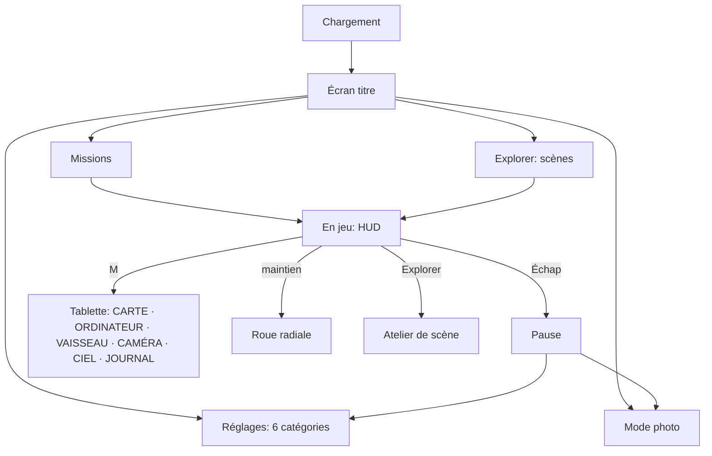
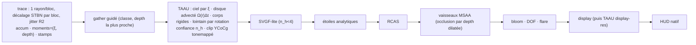

# Audit complet « qualité AAA » — black-hole-gpu / Gargantua

> **Date :** 3 octobre 2026 — **commit audité :** `0cf3414` (main)
> **Objectif :** un simulateur de vol / jeu de qualité AAA.
> **Méthode :** 5 audits spécialisés en parallèle (physique, code, tests/e2e/CI, technologie/rendu, produit/gameplay/UX), en lecture seule. Ils s'appuient sur des mesures : `bun test` et la couverture lcov, `tsc --noEmit`, une analyse AST (longueur et complexité des fonctions, graphe d'imports), un `bun build` dans une copie, `gh run list`, des scripts de vérification numérique (US76, conservation d'énergie, ISCO, accélération du repère), et la lecture des planches `docs/progress`. Les constats les plus graves ont été re-vérifiés à la main dans le code.
> **Point de comparaison :** l'audit précédent du 29/09/2026 (`AUDIT-black-hole-gpu-2026-09-29.md`), note globale v2 de 58/100.
> Pendant l'audit, le développement continuait (`src/controls.ts` modifié, `tests/landing-profile.test.ts` non suivi). Les mesures portent sur le commit `0cf3414`.
>
> **v2 (même jour, commit `761e7ac`) :** ajout de la **[Partie II — UI, UX, HUD et aides visuelles](#partie-ii--ui-ux-hud-et-aides-visuelles)**, suite au retour du propriétaire : « l'UI n'est pas terrible, ça ressemble encore trop à un site internet, il y a trop de menus différents, le HUD peut être amélioré, il faut des tests e2e pour chaque élément ». Six audits supplémentaires ont été menés :
> - un inventaire des menus et de l'architecture de l'information ;
> - le design visuel et le design system ;
> - le HUD et les aides visuelles ;
> - les parcours UX et l'interaction ;
> - un plan e2e couvrant chaque élément d'UI et du HUD ;
> - une campagne de captures réelles en Chrome headless WebGPU sur une copie figée.
>
> La note globale passe de **57 à ≈ 54**, parce que l'UI devient un pilier à part entière, noté 44.
>
> **v3 (même jour) :** ajout de la **[Partie III — Optimisation : plus de qualité graphique à performances égales](#partie-iii--optimisation--plus-de-qualité-graphique-à-performances-égales)**. Trois audits de code ont été menés : coût du noyau de tracé, reconstruction temps réel, environnements et vaisseaux. **Les mesures GPU sont reportées**, car le GPU était occupé par une autre session : le protocole est prêt au §28, et les gains sont des **estimations** à valider.
>
> **v4 (même jour) :** ajout du **benchmark intégré « Kerr Bench »** (§29). Il se lance depuis un simple lien, on peut l'envoyer à des amis qui ont d'autre matériel, et il exporte un rapport JSON détaillé. Il est placé en tête de la feuille de route : **vague G0** de la Partie III, et ligne en phase 0 de la Partie I.

---

## 0. Synthèse

### Verdict en une phrase

Le cœur scientifique est **au-delà de l'état de l'art, toutes plateformes confondues** : géodésiques de Kerr en temps réel, DE440, temps TDB, rendu convergé de niveau DNGR/GYOTO. On n'en trouve d'équivalent dans aucun titre AAA. Mais le **simulateur de vol** (corps rigide, propulsion, contact sol, aéro hors Terre), l'**ossature logicielle** (god-objects, pas variable, état global), l'**industrialisation des tests** (pas d'e2e versionné, CI minimale) et la **boucle de jeu** (pas d'objectifs, d'enjeu ni d'onboarding) restent au niveau d'un prototype avancé.

### Tableau de bord

Échelle : **A** ≥ 85 · **B** 70–84 · **C** 55–69 · **D** 40–54 · **E** < 40. Le seuil « AAA » visé est d'environ 80 dans chaque dimension.

| Axe demandé | Dimension | Note | Grade | Cible AAA |
|---|---|---:|:---:|---:|
| **Qualité physique** | Physique globale | **64** | C | 80 |
| | ↳ relativité générale et rendu physique | 92 | A | ✔ |
| | ↳ temps et référentiels | 82 | B | ✔ |
| | ↳ mécanique orbitale | 70 | B− | 85 |
| | ↳ rentrée atmosphérique | 70 | B− | 80 |
| | ↳ atmosphère et aérodynamique | 55 | C | 80 |
| | ↳ propulsion et masse | 35 | E | 80 |
| | ↳ attitude et corps rigide | 30 | E | 85 |
| | ↳ contact sol et atterrissage | 30 | E | 80 |
| **Code, tests, e2e** | Qualité de code et architecture | **46** | D | 75 |
| | Tests, e2e et CI | **42** | D | 75 |
| | ↳ dont qualité et pertinence des tests unitaires | 84 | B | ✔ |
| | ↳ dont e2e | 15 | E | 75 |
| **Qualité technologique** | Technologie (rendu, GPU, assets, audio, entrées, build) | **67** | C | 80 |
| | ↳ qualité d'image convergée | 93 | A | ✔ |
| | ↳ qualité d'image temps réel | 58 | C | 80 |
| | ↳ efficacité du noyau de tracé (v3) | 62 | C | 80 |
| | ↳ reconstruction temps réel (v3) | 50 | D | 80 |
| | ↳ environnements et vaisseaux (v3) | 62 | C | 80 |
| **UI, UX et HUD** (v2) | UI / UX / HUD / aides visuelles | **44** | D | 80 |
| | ↳ architecture des menus | 33 | E | 80 |
| | ↳ design visuel (« site web ») | 45 | D | 80 |
| | ↳ HUD et aides visuelles | 62 | C | 85 |
| | ↳ parcours UX et interaction | 36 | E | 80 |
| *(hors demande, mais décisif)* | Produit et gameplay (boucle, contenu, son, polish) | **50** | D | 80 |
| | **Note globale AAA v2** (5 piliers à 20 %) | **≈ 54** | **D+** | |
| | *Pour mémoire, la v1 (4 piliers, UX incluse dans le produit) donnait* | *≈ 57* | *C* | |

**Lecture.** Jugé comme *simulateur scientifique / expérience contemplative*, le projet vaut environ **85/100**. Jugé comme *simulateur de vol / jeu AAA*, il vaut environ **54/100**. L'écart tient à cinq manques :
1. la physique du vol à 6 degrés de liberté ;
2. la consolidation de l'architecture ;
3. l'automatisation des tests ;
4. **une couche d'interface de jeu** à la place d'une interface d'outil web ;
5. une raison de jouer.

### Évolution depuis le 29/09 (4 jours, 114 commits, environ +36 000 lignes)

| Dimension | 29/09 | 03/10 | Tendance |
|---|---:|---:|---|
| Performance temps réel | 62 | 68 | ▲ gains noyau −54 % près de Gargantua, VRAM morte corrigée, gouverneur unifié |
| Qualité d'image temps réel | 52 | 58 | ▲ TAAU, KTX2, sRGB, nuages volumétriques |
| Physique et tests | 76 | 64 / 72 | ▼ apparent : le périmètre jugé s'est élargi à la physique du vol, qui est faible ; le cœur RG est resté à ~92 |
| Architecture et code | 52 | 46 | ▼ la dette croît plus vite que le code (controls.ts : +79 %) |
| UX / UI | 61 | 56 | ▼ le HUD est meilleur, la charge cognitive pire (environ 100 raccourcis) |
| Produit / gameplay | 50 | 52 | ≈ le simulateur a gagné un cran, le jeu n'a presque pas bougé |

### Chiffres clés

| Mesure | 29/09 | 03/10 |
|---|---:|---:|
| TS dans `src/` | 33 089 l. / 85 fichiers | **50 212 l. / 123 fichiers** |
| WGSL | 6 245 l. | **8 923 l.** (`trace.wgsl` 5 608, dont `traceLook` 649 l.) |
| `CameraController` (controls.ts) | 4 397 l. | **7 586 l., 228 méthodes, 146 champs** |
| Fonction `main()` | 1 499 l. | **2 042 l.** |
| Complexité cyclomatique max | — | **195** (`Renderer.writeParams`) |
| Tests | 25 fichiers, 139 tests | **41 fichiers, 219 tests, 17 222 expect, 0 échec** (31–42 s) |
| Couverture réelle de `src/` (fichiers non chargés compris) | — | **28,9 %** (ui 10 %, audio 0 %, WGSL 0 %) |
| `tsc --noEmit` | — | **0 erreur**, mais **pas en CI** |
| Lint / format | aucun | **aucun** |
| e2e versionnés | 0 | **0** (27 scripts CDP perdus dans les scratchpads) |
| Site déployé | ≈ 170 Mo | **≈ 323 Mo** |
| Bundle JS | — | 1,62 Mo (569 Ko gzip), pas de code splitting |
| Commits | 155 | **304** en 9 jours ; ratio ajouts/suppressions 9,9:1 ; 1 seul `refactor` |

---

## 1. Qualité physique — **64/100 (C)**

### 1.1 Notes par sous-domaine

| Domaine | Note | Justification | Preuves |
|---|---:|---|---|
| Relativité générale / rendu physique | **92** | Hamiltonien de Kerr en Boyer–Lindquist avec dérivées vérifiées à la main ; Dormand–Prince 5(4) FSAL sur CPU et GPU ; Kahan en f32 ; disque Novikov–Thorne / Page–Thorne exact ; g = 1/(uᵗ(1−ΩL)) ; assombrissement de Chandrasekhar dans le référentiel du fluide ; rayonnement de retour (Cunningham) ; polarisation par la constante de Walker–Penrose ; trou de ver Dneg (James et al. 2015) | `physics.ts:115-145, 368-447` ; `trace.wgsl:356, 382, 1398, 1420-1435, 2012` ; `wormhole.ts:41-47` |
| Dynamique du vaisseau près du trou noir | (incluse) | **Vraiment relativiste** : géodésiques temporelles en temps propre, DP5(4) float64, tol. 1e-8. Mesuré : 50 orbites à a = 0,999, erreur sur r de 9e-9 et sur H de 1e-16 ; τ/t exact à 1e-9 | `geodesic.ts:112-160, 216, 377` |
| Temps et référentiels | **82** | UTC → TAI → TT → TDB, DE440 Chebyshev, précession IAU 1976, nutation, GAST, temps-lumière ; éclipse du 12/08/2026 validée contre la NASA. Mais UT1 = UTC et **Terre sphérique** (6 371 km) | `timescale.ts:20-25` ; `orientation.ts` ; `solar.ts:92` |
| Mécanique orbitale | **70** | N-corps restreint sur éphémérides ; Yoshida 4 ; rails képlériens ; Lambert universel ; tir de Newton en N-corps. Mesuré : ISS 92,82 min, ΔE/E ≤ 2,6e-13 sur 1 000 orbites. **Mais pas de J2**, une **erreur de repère** (bug P1), et un Yoshida à pas variable non symplectique en orbite excentrique (5,6e-5 sur 200 orbites GTO) | `controls.ts:1873-1905` ; `fc/kepler.ts:202` ; `our-plan.ts` |
| Rentrée | **70** | Sutton–Graves (k = 1,7415e-4) et Tauber–Sutton corrects ; correction paroi chaude ; 2 nœuds thermiques implicites ; guidage prédicteur-correcteur type navette. Manquent : ablation, flux hors point d'arrêt, blackout radio | `aero.ts:228-243, 356-385` ; `entry.ts` |
| Atmosphère / aéro | **55** | US76 **exacte** (0,000 % d'écart de 0 à 400 km). Mais Vénus, Mars et Titan sont des **exponentielles isothermes fausses de plusieurs ordres de grandeur** (Vénus à 130 km : 1,8e-2 au lieu de ~1e-7 kg/m³). Une seule aile, pas de gouvernes, ni Reynolds, ni vent, ni turbulence, ni effet de sol | `aero.ts:72-115, 248-312` ; `solar.ts:91-125` |
| Propulsion / masse | **35** | Poussée = **accélération propre constante**, **masse figée** ; jauge relativiste exacte mais **désactivée par défaut** et sans effet sur a = F/m ; pas d'Isp(p), de débit, ni de déplacement du centre de masse | `engine.ts:21-27` ; `controls.ts:5766-5773` ; `settings.ts:312` |
| Attitude / corps rigide | **30** | **Inertie scalaire**, pas de tenseur, pas de ω × Iω ; état en angles d'Euler avec cas spécial à ±90° ; moment aéro échantillonné une fois par frame ; virages longs instantanés. Pas de transport de Fermi–Walker (précession géodétique absente) | `fleet.ts:265-271` ; `pilot.ts:322-337` ; `controls.ts:1654, 2561-2575, 2716` |
| Contact sol | **30** | Projection rigide plus frottement de Coulomb ; normale radiale (et non celle du terrain) ; ni ressort ni amortisseur, pas de géométrie de train ; crash à 12 m/s vertical (≈ 4× un vrai train) | `controls.ts:1912-1940` ; `landing.ts:282-311` ; `tuning.ts:13` |
| Validation physique | **72** | Excellentes références analytiques (3√3, ISCO, pic NT à 9,55 M, SGP4/Vallado, US76, DE440). Mais l'intégrateur de vol réel `flyHome` est **privé et non testé**, les bornes sont souvent larges, il y a un test tautologique (`aero.test.ts:73`) et aucune trajectoire de référence (STS-1, Apollo) | |

### 1.2 Bugs physiques concrets

| # | Sévérité | Bug | Où | Correction |
|---|---|---|---|---|
| P1 | **Moyenne** (vérifié dans le code) | **Accélération du repère « home » incohérente.** `mouthAccel` ne prend que −GM☉·p/r³, alors que l'origine `mouthHelio` est le *centre de Saturne tourné* (avec l'oscillation due à Titan) en héliocentrique (le Soleil n'est pas inertiel). Écart mesuré de **5–7e-6 m/s²** entre le mouvement réel des corps et le modèle de forces : ≈ 1 km d'erreur en GEO, ≈ 100 km sur un transfert lunaire, un biais de l'ordre du m/s en interplanétaire | `system/solar.ts:347-356, 414-420` | `mouthAccel = d²/dt² mouthHelio` (analytique ou différences centrées) + termes de marée des planètes. **Ajouter un test** : accélération par différences finies de l'éphéméride = modèle de forces (le résidu tombe à 2e-7) |
| P2 | Moyenne (bloquant AAA) | **Pas de J2 / J3 / J4** pour la gravité du vaisseau : pas de régression nodale de l'ISS (−5°/j), pas d'orbite héliosynchrone, pas de dérive GEO | `system/our-side.ts:49-67` | Quelques lignes ; l'axe polaire de date est déjà dans `orientation.ts` |
| P3 | Moyenne | **Atmosphères planétaires isothermes** (Vénus, Mars, Titan), et vitesse du son de Vénus constante (Mach faux d'un facteur 1,8) | `solar.ts:91-125` | Tables VIRA, Mars (MCD simplifiée) et Yelle-Titan en log ρ(h) avec T(h), sur le modèle de `HIGH` (`aero.ts:90`) |
| P4 | Basse | **Δv gratuit** : la poussée de toute la frame est appliquée d'un coup alors que l'intégration peut s'arrêter avant (`span < simDt`, plafond `subCap`) ; le propergol est compté sur le temps réellement écoulé | `controls.ts:1730-1752, 1888, 2748` | Intégrer la poussée dans `accAt`, ou mettre l'impulsion à l'échelle span/simDt |
| P5 | Basse | Masse constante : a = F/m ignoré | `controls.ts:5772` ; `flightair.ts:85` | m = m₀·e^(−w/vₑ) |
| P6 | Basse | Yoshida à pas variable non symplectique | `controls.ts:1890-1905` | Leapfrog à transformation de temps (dt ∝ r^{3/2}) ou DOP853 à 1e-12 |
| P7 | Basse | Lambert limité à une révolution, singulier à Δν = π ; pas de traînée au-dessus de 233 km (`AIR_FLOOR`) | `fc/kepler.ts` ; `aero.ts:68` | Lambert d'Izzo multi-révolutions ; densité thermosphérique (NRLMSISE simplifié) |

### 1.3 Simplifications acceptables ou bloquantes

- **Acceptables** (souvent mieux que la concurrence) : N-corps sur éphémérides plutôt qu'intégré, rails pour le time warp, atmosphère co-rotative sans vent en mode jeu, thermique à 2 nœuds, trou de ver plaqué sur Kerr, Miller à r = 10 (facteur 1,18 au lieu des ~61 000 du film, choix documenté), UT1 ≈ UTC, warp ×4 dans l'air.
- **Bloquantes pour un niveau AAA** : pas de J2 et Terre sphérique ; inertie scalaire sans équations d'Euler ; masse et Isp figés ; contact sans suspension ; aéro à une aile sans gouvernes, vent ni effet de sol ; atmosphères planétaires fausses.

### 1.4 Positionnement face aux simulateurs AAA

| Référence | Comparaison |
|---|---|
| **DNGR / GYOTO / ipole** (codes de recherche RG) | **Au niveau**, en temps réel dans un navigateur |
| **SpaceEngine, Elite** | Très au-dessus en RG (eux utilisent des shaders de lentille approchés) |
| **Orbiter** | Au-dessus en temps, éphémérides et RG ; en dessous en géopotentiel, Isp(p), déplétion de masse et inertie principale |
| **KSP + RO + Principia** | Comparable en N-corps ; derrière en harmoniques et en propulsion |
| **X-Plane 12** (blade element, Re, effet de sol, météo) / **MSFS 2024** (pressions « CFD-lite », vent, turbulence) | Un ordre de grandeur en dessous en aérodynamique |
| **DCS PFM** (6 DDL, tenseur, tables CL/CD/Cm(α, β, M, δ), jambes de train) | Très loin en attitude et au sol |

---

## 2. Qualité de code et architecture — **46/100 (D)**

### 2.1 Notes

| Sous-critère | Note | Justification |
|---|---:|---|
| Modularité | 35 | Une classe porte 15 % du code ; 9 fichiers dépassent 1 000 l. La longue traîne (`system/`, `fc/`, `physics.ts`) est saine |
| Complexité | 30 | `main()` fait 2 042 l. ; cc 195 (`writeParams`), 154 (`FlightHud.drawText`), 131 (`Map3D.draw2d`) ; 57 fonctions > 100 l. |
| Couplage | 45 | **0 cycle d'imports runtime** (+). Mais `Settings` (209 champs) mélange préférences, rendu et **état de simulation**, et il est muté à 266 endroits ; temps global caché (`sceneTime`) ; contrats inférés (`ReturnType<…>` ×81) |
| Typage | 62 | `strict`, 1 `any`, 0 `@ts-ignore`. Mais 1 668 `]!` sans effet (`noUncheckedIndexedAccess` absent : seulement 42 erreurs à corriger) ; 876 `as` ; unités en commentaires ; nombres magiques divergents (`492.5490947` ×27, `492.55` ×4, `299792458` ×68) |
| Robustesse / lifecycle | 55 | `device.lost`, destroy différé, 195 gardes NaN (+). Mais exceptions avalées à chaque frame (`main.ts:1674`, `cockpitscreens.ts:104`), 26 catch vides, 0 assert, sauvegardes relues sans validation (`save.ts:44`) |
| Lisibilité / doc | 66 | `docs/systemes/` est **exceptionnel** (~70 000 mots). Mais 2 330 lignes > 120 colonnes, maximum de 775 colonnes (`schema.ts:547`), one-liners denses |
| Hygiène outillage | 30 | Ni lint ni format, typecheck absent de la CI, pas de couverture |
| Historique git | 45 | Commits fréquents et clairs ; mais 32 méga-commits (> 1 000 l.), 1 seul refactor sur 304, push direct sur main = production |

### 2.2 Les 10 problèmes majeurs

1. **CRITIQUE : god-object `CameraController`** (`controls.ts:168-7754`). Il porte les entrées, la caméra, les intégrateurs, le pilotage, l'ordinateur de vol, l'amarrage, le plan, la poussée faible, le rig et les cinématiques.
2. **CRITIQUE : `main()` de 2 042 lignes** (`main.ts:136`). La boucle, le keymap (30 `else if`), le câblage UI et `__bh` vivent dans une seule closure, avec 32 `let` capturés.
3. **ÉLEVÉ : pas de boucle à pas fixe.** `dt = min(0.1, Δt rAF)` (`main.ts:1564`) et les sous-pas dépendent du dt (`controls.ts:1745`). La simulation n'est pas déterministe : pas de replay, pas de réseau fiable.
4. **ÉLEVÉ : `Settings` sert d'état de simulation** (`settings.ts:57`). Les sauvegardes sérialisent les préférences avec l'état de jeu (`save.ts:17`).
5. **ÉLEVÉ : globaux cachés** : `sceneTime` (`wormhole.ts:242`), `mountVessel` (`mounts.ts:43`), état ISS (`iss.ts:30`). Ils sont rédhibitoires pour la 2ᵉ vue et le multijoueur (PLAN-RESEAU).
6. **ÉLEVÉ : exceptions avalées à chaque frame**, symptôme de transitions d'état non atomiques.
7. **MOYEN : layout des uniformes en miroir manuel** (69 slots vec4, `renderer.ts:1332` face à `trace.wgsl:13`), sans source unique ni test.
8. **MOYEN : maths vectorielles dupliquées** : 29 `cross`, 38 `dot`, 34 `norm`, 57 `add`/`sub`/`scale`, 3 types `Vec3`. Il n'y a pas de bibliothèque commune.
9. **MOYEN : modes de vol éparpillés** : `Hold` (10 valeurs), `Auto` (12), `Motion` (7), plus une dizaine de booléens, sans machine à états.
10. **MOYEN : outillage absent** : Biome, `tsc` en CI, `noUncheckedIndexedAccess`, `noUnusedLocals` (15 imports morts).

---

## 3. Tests, e2e et CI — **42/100 (D)**

### 3.1 Notes

| Domaine | Note | Justification |
|---|---:|---|
| Tests unitaires | 72 | 219 tests verts et déterministes. Mais 39 s, dont 18 s pour `our-plan` (Artemis II seule : 13,7 s, avec un **timeout observé sous charge**), et 3 assertions de durée murale fragiles (`flight-system.test.ts:94, 109`, `fc.test.ts:85`) |
| Qualité et pertinence | **84** | De vrais tests de propriétés physiques et de références publiées ; aucun snapshot ; tolérances justifiées. Manquent la parité CPU↔WGSL, le property-based et les tests de régression UI |
| Couverture | 30 | **28,9 % réelle** (Bun annonce 76 % parce qu'il ignore les 52 fichiers jamais chargés) ; controls, flighthud, main, map3d, panel et computer à **0 %** ; WGSL à 0 % ; aucun seuil |
| E2E | **15** | Une API de pilotage excellente (`__bh.freeze/step`, `game.snapshot/importSave/glideTo`, `game.audit()`), mais **aucun harnais versionné** |
| Régression visuelle | 45 | `scripts/gallery.ts` est bien conçu (SSIM, surface, teinte, diff, exit 1), mais manuel, sur une seule machine Apple, hors CI ; les références se confondent avec les vignettes produit |
| Tests de perf | 40 | `scripts/bench.ts` est riche (p50/p95/p99, A/B alterné, VRAM), mais il sort toujours en `exit(0)` et n'a ni baseline automatique ni CI |
| CI/CD | 30 | Les tests bloquent le déploiement (+). Pas de typecheck, lint, couverture, validation WGSL, e2e, artefacts, preview, ni protection de branche |

### 3.2 Scénarios critiques non couverts automatiquement

1. Orbite → désorbitation → rentrée → plané → **atterrissage** (« Touchdown » et non « Crashed »).
2. Chargement des **79 scènes** sans erreur console ni `device.lost`.
3. **Vrais inputs** : souris, molette, clavier AZERTY par `code`, hit-testing (`elementsFromPoint`). C'est exactement le bug `.fc-root` du 03/10, passé inaperçu pendant plusieurs phases.
4. Perte du device GPU, sauvegarde puis reprise (`device.destroy()` suffit à la déclencher).
5. Sauvegarde, chargement et lien `#save` : `game/save.ts` est pur mais testé à 0 %.
6. Le **build de prod** `_site` (worker du planificateur, transcodeur KTX2 et WASM).
7. Amarrage ISS, missions, carte 3D et son repli 2D, tactile.

### 3.3 Comparaison aux pratiques AAA

| Pratique AAA | État |
|---|---|
| Bots qui jouent les missions en nightly | Absent, alors que les autopilotes (ENTRY, LAND, dock) sont des bots tout faits |
| Golden replays déterministes | Absent ; la primitive `freeze`/`step` existe déjà |
| Soak tests (fuites VRAM et heap, dérive) | Absent |
| Télémétrie et crash reporting | Local seulement (`__bh.game.errors()`) |
| Matrice de compatibilité GPU et navigateurs | Une seule machine (Apple) ; rien pour D3D12, Android, Safari ou Firefox |
| Tests physiques de référence | **Au niveau, voire au-dessus** |

---

## 4. Qualité technologique — **67/100 (C)**

### 4.1 Notes

| Domaine | Note | Justification |
|---|---:|---|
| Architecture de rendu | 80 | Traceur compute spécialisé (`override HAS_*` compilés en async), post-process complet (à-trous, TAAU, bloom en mips, DOF, flare), canvas HDR `rgba16float` extended, AgX/ACES, vrai sRGB. **Dette** : 10 storage buffers et 16 textures échantillonnées, tous occupés |
| Qualité d'image | 72 | **Convergée 93** (EXR, PNG 16 bits, MP4 WebCodecs avec muxer maison) ; **temps réel 58** (très peu de rayons/px, TAAU non relativiste) |
| Performance et scalabilité | 68 | Vue proche de Gargantua 36,4 → 16,8 ms ; VRAM 1 151 → 376 Mio. Mais un p95 de 25–33 ms dans 5 scènes sur 8 ; variantes compilées en ~10 s ; tiering par chaîne vendor (tout Apple en palier 2, palier 4 jamais attribué) |
| WebGPU / compatibilité / robustesse | 63 | Pipelines async (watchdog D3D12 corrigé), scope OOM, `device.lost` avec sauvegarde. Mais **10 storage buffers exigés** (le défaut de la spec est 8 : exclut une partie d'Android et peut-être Safari) ; pas de recréation à chaud ; mesuré sur Mac uniquement |
| Monde, terrain, atmosphère | 62 | **Clipmap toroïdal SRTM jusqu'à ~19 m/texel** avec la même fonction de hauteur sur CPU et GPU, ancre double-float au centimètre : remarquable. Mais l'**imagerie est à 2,4 km/texel**, l'atmosphère en single scattering, l'océan sans FFT, et **aucune piste ni aéroport en 3D** (pistes seulement dans le HUD), pas de ville ni de météo |
| Assets, streaming, chargement | 55 | KTX2 UASTC + Zstd transcodé en worker, streaming par empreinte. Mais **aucun Service Worker** (ni hors ligne ni cache des tuiles S3), maillages non compressés (11,4 Mo pour l'Endurance), planètes HD en JPEG décodées en rgba8, 262 Mo sur Pages |
| Audio | 58 | Synthèse WebAudio propre (4 bus, convolution, limiteur). Mais `StereoPanner` seulement : pas de HRTF, pas de Doppler, pas de musique, et le cockpit est entendu « de l'extérieur » (`SOUND.md`) |
| Entrées et périphériques | 56 | AZERTY par code physique, manette avec zone morte radiale, **repli WebHID Xbox 360** (astucieux), tactile. Mais pas de HOTAS (axes 4+ ignorés, `gamepad.ts:198`), pas de remappage, pas de WebXR |
| Build et déploiement | 62 | Simple et rapide (1,3 s). Mais **`bun run build` omet `ktx-worker.js` et le WASM** (seul `build:pages` les copie, vérifié) ; un seul bundle de 1,62 Mo ; Google Fonts externe ; pas de PWA |

### 4.2 Recommandations du 29/09 : état

| Recommandation | État |
|---|---|
| Coût de la vue proche de Gargantua | ✅ Corrigé (−54 %) |
| Deux contrôleurs de charge contradictoires | ✅ Corrigé (gouverneur unifié, `main.ts:1640`) |
| ~1 Gio de VRAM morte | ✅ Corrigé |
| TAA / reprojection | ✅ Fait (non relativiste) |
| KTX2, robustesse D3D12, nuages volumétriques | ✅ Fait |
| Hitchs | 🟡 Partiel (p95 encore à 25–33 ms) |
| Tiering matériel | 🟡 Partiel (heuristique) |
| Reprise sur perte GPU | 🟡 Partiel (rechargement, pas de recréation) |
| Simulation à pas fixe | 🟡 Partiel |
| Texturing virtuel de la Terre | ⏸ Différé (hébergement) |
| f16, subgroups, wavefront, traçage creux | ✖ Non adopté, **mesuré et justifié** |

### 4.3 Points forts au-delà de l'état de l'art web

1. Géodésiques de Kerr en temps réel : RK4 / DP5(4), Kahan, beaming, polarisation de Stokes, transfert spectral.
2. Spécialisation du noyau par constantes `override` compilées en async, et LUT du champ lointain.
3. Pipeline de précision : float64 côté CPU, ancre double-float côté GPU, DE440 refitté, SGP4.
4. Clipmap de tuiles SRTM dans un traceur compute, avec une parité CPU qui évite le vaisseau qui flotte.
5. Transcodeur KTX2 en worker, muxer fMP4 et encodeur EXR, tous sans dépendance.
6. Outillage de mesure de niveau studio : banc A/B alterné, PSNR face au convergé, profileurs GPU et CPU.

---

## 5. Produit, gameplay et UX — **52/100 (D)** (v1)

> **v2 :** l'UX, l'UI et le HUD sont désormais traités en détail dans la **Partie II**. Sans sa ligne UX, la note produit devient **50**.

| Axe | Note | En une ligne |
|---|---:|---|
| Boucle de jeu et objectifs | 38 | Bac à sable profond, mais **aucun objectif suivi**, ni score ni fin ; une mission = une scène et un toast (`main.ts:369-374`) |
| Onboarding | 35 | Pas de tutoriel ; le jeu **démarre sur le preset scientifique** « Kerr a=0.94 » ; l'aide est une page HTML externe |
| UX/UI et accessibilité | 56 | HUD et carte de niveau pro. Mais **environ 100 raccourcis, dont environ 17 à double sens**, polices de 8,5 à 11 px, ni remappage, ni mode daltonien, ni i18n (UI 100 % anglaise) |
| Sensation de vol et cockpit | 72 | Rentrée, tremblement, plasma, arrondi, roulage, 30 écrans de cockpit : excellent. Ni procédures, ni pannes, ni météo, ni effets de g, et le cockpit n'est pas cliquable |
| Contenu | 70 | 79 scènes, 27 corps plus Gargantua, 3 vaisseaux, l'ISS, 16 sites ; **seulement 2 missions jouables** |
| Audio et musique | 45 | Son synthétisé soigné, mais **ni musique ni voix**, un contresens pour Interstellar |
| Polish | 55 | Bons : splash, reprise automatique, écran CRAFT LOST. Manquent : écran titre, menu pause, écran de fin ; aides périmées |
| Social / rejouabilité | 35 | Liens `#save`, exports PNG/EXR/MP4 ; pas de défis, pas de classement |

**Problèmes UX vérifiés dans le code :**
- **Échap en vol** arrête la mission, libère le maintien et coupe l'autopilote (`main.ts:1029-1032`). Or les panneaux Caméra et Ciel ferment eux aussi sur Échap, via un listener `window` séparé, sans `stopPropagation` (`camerapanel.ts:128-130`, `skypanel.ts:50-52`). **Fermer un panneau pendant une rentrée guidée coupe très probablement le guidage.**
- **Carburant désactivé par défaut** (`settings.ts:312`, `fuel: false`) : rien n'est rare, rien n'est risqué dans l'espace.
- **Aide périmée** (`panel.ts:937-1013`, `splash.ts:8-17`) : « / = réglages », alors que / sert désormais au temps réel ; « T: the journey », alors que T active le SAS en vol ; « P pour enregistrer », alors que P règle les volets.

---

## 6. Liste consolidée : à corriger maintenant

Bugs et risques concrets, classés par rapport coût/bénéfice.

| # | Type | Problème | Où | Effort |
|---|---|---|---|---|
| 1 | Gameplay | Échap ferme un panneau **et** coupe l'autopilote | `main.ts:1029` ; `camerapanel.ts:129` ; `skypanel.ts:51` | S |
| 2 | Physique | Accélération du repère home incomplète (5–7e-6 m/s²) | `solar.ts:414-420` | S |
| 3 | Physique | Δv gratuit quand les sous-pas sont plafonnés | `controls.ts:1730-1752` | S |
| 4 | Build | `bun run build` omet `ktx-worker.js` et `basis_transcoder.wasm` | `package.json` (script `build`) | S |
| 5 | CI | Test Artemis II sensible à la charge, qui peut bloquer un déploiement | `tests/our-plan.test.ts` | S |
| 6 | CI | Assertions de durée murale dans les tests unitaires | `flight-system.test.ts:94, 109` ; `fc.test.ts:85` | S |
| 7 | CI | Typecheck absent de la CI (il passe aujourd'hui, autant le verrouiller) | `.github/workflows/pages.yml` | S |
| 8 | UX | Aides, astuces et doc périmées sur les touches | `panel.ts:937-1013` ; `splash.ts:8-17` | S |
| 9 | Robustesse | Exceptions avalées à chaque frame (états non atomiques) | `main.ts:1674` ; `cockpitscreens.ts:104` | S–M |
| 10 | Robustesse | Sauvegardes relues sans validation ni migration | `game/save.ts:44` | S–M |
| 11 | Qualité | Constantes divergentes (`492.55` contre `492.5490947`) | `controls.ts:5251, 5407, 6634` | S |
| 12 | Audio | Cockpit et cabine entendus comme une vue extérieure | `audio/engine.ts` | S |
| 13 | Test | Test tautologique `heatFlux(x)/heatFlux(x) == 1` | `tests/aero.test.ts:73` | S |
| 14 | UX (v2) | **`isTyping` traite tout `<input>` comme une saisie, curseurs et cases compris** : après un clic sur un curseur ou une case à cocher, les touches de vol, Espace et les maintiens restent muets jusqu'à un clic sur le canevas, et les flèches pilotent le curseur | `controls.ts:7901-7904` | S |
| 15 | UX (v2) | **Toast unique, écrasé à chaque message** : la consigne de départ « U: take off… » est remplacée aussitôt par « Scene: … », donc le joueur ne la voit jamais | `panel.ts:191-199, 225` ; `main.ts:370-373` | S |
| 16 | UX (v2) | **Sur un clavier QWERTY, « ? » (⇧ + Slash) passe en temps réel au lieu d'ouvrir l'aide** : observé en capture réelle | `main.ts` (gestionnaire de Slash) | S |
| 17 | HUD (v2) | **Le chevron d'énergie et la tendance de la bande de vitesse suivent l'horloge murale** (`performance.now()`) : faux en accéléré (×4), ils retombent à 0 en pause, et ils montrent le passé au lieu de +10 s | `symbology.ts:390, 450-457` ; `flighthud.ts:2089-2101` | S |
| 18 | HUD (v2) | **Unités de la barre mission** : « T−12 M » (temps géométrique) et « Δv 0.000 » (Δv en fraction de c) affichés même autour de la Terre | `flighthud.ts:1651-1655` | S |
| 19 | HUD (v2) | **Les encadrés de 192 px débordent** : la ligne relativité (environ 276 px) sort de 90 px | `symbology.ts:945-953` | S |
| 20 | Perf (v2) | **`shadowBlur` encore utilisé** dans le verrouillage de cible et les marqueurs, contre la règle du projet, et redessiné à chaque frame quand on tourne | `targethud.ts:79` ; `main.ts:1930, 1990` | S |
| 21 | UX (v2) | **Actions destructives sans confirmation** : changer de scène écrase le vol et l'unique auto-save ; Load ; suppression d'une sauvegarde ; Suppr ou clic droit sur un nœud | `save.ts:58` ; `gametools.ts:475` ; `map3d.ts:789` | S |
| 22 | UI (v2) | **`hide-ui` ne masque pas** les panneaux Caméra et Ciel, F2 ni la galerie ; **z-index incohérents** (Caméra et Ciel à z40 passent au-dessus de la galerie modale à z20) ; `.fl-plan` est du code mort, inaccessible | `style.css:968-972` ; `flighthud.ts:917` ; `main.ts:941` | S |
| 24 | HUD (v2, **vu en capture**) | **Posé sur le pas de tir, le HUD affiche « IMPACT 3 s » en rouge**, une vitesse de 408 m/s « rel. Earth » (la vitesse inertielle due à la rotation terrestre) et un périgée à −6 363 km ; la carte affiche « IMPACT Earth ». Fausses alarmes au sol, faute de mode Surface et d'état LANDED pris en compte | `symbology.ts:544-623` ; `flighthud.ts:2024` ; capture 17 | S |
| 25 | HUD (v2, vu en capture) | Distances de cible et « CLOSEST » en **M géométriques** (« SATURN 8.9 M », « CLOSEST 2.0 M ») dans le système solaire ; champ « Inclination 0,0 » à virgule alors que tout le reste est à point | panneau TARGET de `flighthud.ts` ; `fc/computer.ts` ; captures 17 et 19 | S |
| 26 | HUD (v2, vu en capture) | **Unité de la boîte de vitesse fausse** : le ruban est en « SPEED · km/s », mais la boîte affiche « 7.68 m/s » en orbite (7 678 m/s), et ses chiffres chevauchent l'unité | bande de vitesse, `flighthud.ts:2024+` ; capture 28 | S |
| 27 | HUD (v2, vu en capture) | **Chevauchements** : la roue d'autopilote recouvre le bandeau aéro et **cache les écrans du cockpit en vue cabine** ; le toast se pose sur le ruban de cap ; le menu caméra est coupé en bas ; la barre mission touche la pastille Live. Sur **mobile en portrait, ni altitude ni vitesse ne sont visibles** | captures 25-10, 29, 41 | S-M |
| 28 | UX (v2, vu en capture) | Le bouton « The app's toolbar » de la barre mission masque les panneaux latéraux **sans faire apparaître de barre d'outils** ; les infobulles restent collées après un clic ; dans l'ordinateur de vol ouvert par O, le focus sur ORBIT et l'onglet actif MISSION donnent l'impression de **deux onglets sélectionnés** ; passer de `/` à `/#scene=…` ne charge pas la scène sans recharger | captures 23, 33 | S |
| 29 | Robustesse (v2) | **Chrome headless tué 3 fois sans trace** pendant les changements de vue et l'approche près du sol (chargement des tuiles), avec ~560 Mo de mémoire libre : **probable pression mémoire**, à instrumenter (budget VRAM et heap, libération des tuiles) | campagne de captures | M |
| 23 | UX (v2) | U bascule l'autopilote (U deux fois = coupé) alors que le bouton de l'ordinateur de vol l'engage : même action, deux sémantiques | `main.ts:800-803` ; `computer.ts:208-220` | S |

---

## 7. Feuille de route vers l'AAA

### Phase 0 : filets de sécurité (≈ 1 semaine)

| Action | Effort | Gain |
|---|---|---|
| Corriger les bugs 1 à 8 de la §6 | S | Fiabilité immédiate |
| CI : `tsc`, Biome (lint et format en un commit ignoré par `git blame`), naga pour valider le WGSL, junit et lcov en artefacts, cache bun ; tests lents en job séparé | S | Plus de régression silencieuse |
| `noUncheckedIndexedAccess` (42 erreurs) et `noUnusedLocals` (15) | S | Les 1 668 `]!` prennent enfin un sens |
| `src/math/vec3.ts` (+ `quat`, `mat3`) et `src/units.ts` (`M_SECONDS`, `C_MPS`, `DAY_S`, `AU_M`) | S–M | Supprime environ 200 duplications et les constantes divergentes |
| `safeStorage`, `assert()` actif en dev, fin des catch par frame | S | Bugs latents révélés |
| Tests purs : aller-retour de `save.ts` et `#save`, `iss-plan.ts`, `flightair.ts`, sorties numériques de `hud/symbology` | S | Couverture +5 points sur du code critique |
| **Kerr Bench**, le benchmark intégré (§29) : lien `#bench`, 3 modes, rapport JSON détaillé à faire tourner chez des amis | M | Données sur du matériel varié (D3D12, Android, Safari, NVIDIA/AMD/Intel), base du tiering, des budgets et de la matrice de compatibilité |
| Test de cohérence « éphéméride par différences finies = modèle de forces » | S | Verrouille le bug P1 |

*Projection :* Tests/CI 42 → 55, Code 46 → 52.

### Phase 1 : consolidation de l'architecture (≈ 3 semaines, **en gelant les features**)

1. **Tests de caractérisation headless de `CameraController`** : trajectoires dorées via `sim.step` sans GPU. C'est le préalable indispensable à tout le reste.
2. **Découpage de `controls.ts`** en façade de moins de 400 lignes plus des modules. Les bandeaux de section existants dessinent déjà le découpage :
   - `input/` : `InputState`, `ActionMap` ;
   - `camera/` : `OrbitCamera`, `Lens`, `CameraRig`, `Journey` ;
   - `flight/Integrators.ts` (`flyHome`, `flyDneg`, Verlet), **pur et testable** ;
   - `flight/ShipControl.ts` ;
   - `autopilot/{Holds, Hover, Circularize, Dock, LowThrust, Transfer, NodeBurn, Entry, Land}.ts`, chacun derrière l'interface `Autopilot { enter, step(ctx, dt): Command, exit }` ;
   - `plan/` ; `frames/PlanetFrame.ts` ;
   - `telemetry/flightInfo.ts`, qui retourne une **`interface FlightInfo` explicite**.
3. **`main.ts`** : `app/bootstrap.ts`, `app/AppContext.ts`, `app/GameLoop.ts` **à pas fixe** (accumulateur de 1/120 s, rendu interpolé, entrées sous forme de `Command` horodatées), `input/keymap.ts` déclaratif (une table qui sert aussi de source à l'aide et aux tooltips), `debug/bh.ts` chargé derrière un drapeau.
4. **Séparer `Settings`** en `UserPrefs`, `RenderParams` et `SimState` ; sauvegarde v2 avec schéma, validation et chaîne de migrations.
5. **Machine à états explicite des modes de vol** (Free, Orbit, Piloting{Manual, Hold, Auto}, Cinematic, Scripted, Docked, Landed), avec transitions journalisées et un bus d'événements typé (`craftLost`, `airEntry`, `docked`…).
6. **Harnais e2e versionné** `tests/e2e/`, en CDP natif (factoriser `bench.ts`, `gallery.ts` et `quality.ts` dans `lib/cdp.ts`) ou en Playwright, lancé sur le build `_site` :
   - `boot` ;
   - `scenes` (79 presets) ;
   - `input` (vrais événements CDP et `elementsFromPoint`) ;
   - `save-load` ;
   - `device-lost` ;
   - `landing` (`glideTo("Edwards")` puis `freeze` et `step` accélérés jusqu'à « Touchdown ») ;
   - `deorbit-entry` (fixture de snapshot « glide » versionnée).
7. **Job CI e2e** : Chrome headless avec WebGPU sur SwiftShader/Vulkan (smoke uniquement). La galerie et le bench tournent en nightly sur le Mac de dev, avec des seuils et des références par machine.

*Projection :* Code 52 → 68, Tests/CI 55 → 70.

### Phase 2 : physique de vol AAA (≈ 4–6 semaines)

| # | Action | Effort |
|---|---|---|
| 1 | **J2/J3/J4** pour la Terre, puis pour Mars, Jupiter et Saturne ; rails propagés avec J2 séculaire | S |
| 2 | **Propulsion** : masse variable, a = F/m, Isp(p_amb) = Isp_vac − p·Aₑ/(ṁg₀), propergol **actif par défaut** hors mode Cinéma, dynamique de réponse moteur, RCS à poussée propre | S–M |
| 3 | **Atmosphères planétaires tabulées** (VIRA, MCD, Yelle) ; densité thermosphérique pour la décroissance orbitale | S |
| 4 | **Corps rigide 6 DDL** : quaternion, tenseur d'inertie, équations d'Euler ω̇ = I⁻¹(M − ω × Iω), moments aéro et RCS au sous-pas, centre de masse mobile | M |
| 5 | **Train d'atterrissage** : ressort-amortisseur par jambe, normale du terrain, pneu Pacejka simplifié, freins et anti-patinage, crash vers 3–4 m/s, basculement | M |
| 6 | **Aéro par surfaces** : tables Cx(α, β, M, δ) par surface, gouvernes réelles, effet de sol, régime moléculaire libre | L |
| 7 | **Vent et turbulence** : profil de vent et cisaillement, turbulence de Dryden, rafales | M |
| 8 | **Ellipsoïde WGS84** : latitude géodésique, altitude ellipsoïdale, géoïde EGM96 grossier | M |
| 9 | Intégrateur régularisé (dt ∝ r^{3/2}) ou DOP853 pour les orbites excentriques ; Lambert d'Izzo multi-révolutions | M |
| 10 | Tests de référence : rentrée **STS-1** et **Apollo 4**, ISS face à SGP4 sur 24 h, dérive d'énergie longue durée, montée d'un lanceur réel | M |
| 11 | Optionnel, « pureté relativiste » : transport de Fermi–Walker de l'attitude près de Gargantua (précession géodétique visible sur le gyroscope) | S |

*Projection :* Physique 64 → 80.

### Phase 3 : monde et rendu (en parallèle, ≈ 1–2 mois)

| # | Action | Effort | Gain |
|---|---|---|---|
| 1 | **Service Worker** cache-first, cache des tuiles S3 (Cache API ou OPFS), manifest PWA, préchargement en idle | S | Rechargement instantané, hors ligne |
| 2 | **Aéroports dans le monde** : pistes OurAirports (domaine public) en SDF dans la marche proche, marquages procéduraux, **PAPI**, balisage de nuit, ILS | M | Atterrissages crédibles |
| 3 | **Upscaler** : port WGSL de FSR1 (EASU + RCAS) après le temporel, jitter de Halton | S–M | Netteté perçue |
| 4 | **Reprojection relativiste** : historique par direction céleste pour le ciel, advection en Ω_Kepler(r) pour le disque, rejet par ID de surface | M | +3 à 6 dB près du trou |
| 5 | **Atmosphère Hillaire 2020** : LUT de transmittance, multi-diffusion, sky-view, perspective aérienne en froxels | M | Crépuscules niveau X-Plane 12 |
| 6 | **Réduire la pression sur les bindings** : storage buffers fusionnés à offsets, arrays de textures, 2 bind groups ; viser ≤ 8 | M | Android et Safari ; libère des slots pour 2, 5 et 7 |
| 7 | **Imagerie streamée** : Blue Marble NG 500 m ou Sentinel-2 cloudless en KTX2 sur CDN (R2), via le même clipmap ; splatting procédural guidé par ESA WorldCover ; VIIRS Black Marble pour les lumières de nuit | L | Le plus gros gain visuel au sol |
| 8 | **Océan FFT** (Tessendorf, 3 cascades) | M | Mer au niveau Outerra |
| 9 | **Météo** : 2–3 couches nuageuses animées (option GFS/GOES quotidien pré-tuilé), pluie, visibilité, METAR pour les aéroports | L | Rapproche de MSFS |
| 10 | Maillages quantifiés (16 bits, normales octaédriques) + meshopt ; planètes HD en KTX2 | M | −60 à −70 % de téléchargement |
| 11 | Recréation à chaud du device ; tiering par micro-bench de 200 ms ; code splitting (`import()` pour la carte 3D, l'offline, la vidéo et les exports) | S–M | Robustesse, −30 à 40 % de JS initial |
| 12 | Audio : `PannerNode` HRTF, Doppler, AudioWorklet pour un moteur granulaire | M | Immersion |
| 13 | Entrées : écran de mapping des axes et boutons (HOTAS, palonnier, courbes par axe) | M | Public simulateur |
| 14 | Cockpit interactif : picking par pré-passe d'IDs vers des actions | M | Cockpit vivant |

*Projection :* Technologie 67 → 80.

### Phase 4 : faire un jeu (en parallèle dès la phase 1, ≈ 1–3 mois)

Voir le catalogue d'idées en §8. Les priorités : écran titre, suivi d'objectifs, préréglages de difficulté, Échap sain, école de pilotage, carrière, musique et voix.

*Projection :* Produit 52 → 75.

### Piste UI (v2) : en parallèle des phases 0 à 4

Le détail est en Partie II, §17. Résumé de l'enchaînement :
- **U0, quick wins, ≈ 1 semaine**, avec la phase 0 : pile d'interface et Échap sain, tokens, file de toasts, focus clavier, HUD au temps simulé, Craft Lost.
- **U1, kit et design system, ≈ 2 semaines**, avec la phase 1 : refonte du panneau Réglages, harnais e2e d'UI.
- **U2, couche jeu, ≈ 2 semaines** : écran titre, menu pause, sauvegardes joueur, outils dev derrière un drapeau.
- **U3, tablette MFD, roue radiale et indices de touches contextuels, ≈ 3 semaines.**
- **U4, HUD par phase de vol** : déclutter, master caution, aides de rentrée et d'approche (≈ 3 semaines).
- **U5, accessibilité, remappage et FR, ≈ 2 semaines.**

### Projection globale (v2, 5 piliers)

| Étape | Physique | Code + tests | Techno | UI / UX / HUD | Produit | **Global** |
|---|---:|---:|---:|---:|---:|---:|
| Aujourd'hui | 64 | 44 | 67 | 44 | 50 | **≈ 54** |
| Après la phase 0 et U0 | 66 | 54 | 68 | 54 | 54 | ≈ 59 |
| Après la phase 1, U1 et U2 | 66 | 69 | 69 | 66 | 58 | ≈ 66 |
| Après les phases 2 et 3, U3 et U4 | 80 | 72 | 80 | 76 | 62 | ≈ 74 |
| Après la phase 4 et U5 | 80 | 74 | 80 | 80 | 75 | **≈ 78 (B+, seuil AAA « indé premium »)** |

> **Ordre conseillé : phase 0, puis phase 1 avant le réseau.** Le multijoueur de PLAN-RESEAU se heurterait directement au temps global caché, au pas variable et à `Settings` utilisé comme état de simulation.

---

## 8. Catalogue d'idées et de fonctionnalités

Effort **S/M/L**, impact ★ à ★★★. **[QW]** marque les quick wins, **[PARI]** les paris structurants.

### Missions et carrière
1. **[QW] Suivi d'objectifs dans la barre mission.** Étapes cochées automatiquement à partir des événements déjà journalisés : orbite, changement de sphère d'influence, wormhole, atterrissage, docking. — S · ★★★
2. **Écran de bilan.** Temps vaisseau et temps Terre, Δv consommé, g maximal, température maximale du bouclier, vitesse verticale et écart à l'axe au toucher, note de S à C. — M · ★★★
3. **[PARI] Carrière « Programme Lazarus ».** LEO → ISS → retour libre lunaire → Mars → Saturne → wormhole → Miller → Mann → Edmunds. **Le temps est la ressource** : l'horloge « Earth + » devient « l'âge de Murph » (1 h sur Miller = 7 ans), et la fin dépend de qui vous attend encore. — L · ★★★
4. **Défis courts avec score.** « 400 km → Le Bourget », « ISS avec 30 m/s de Δv », « Miller et retour en moins de 2 h de temps vaisseau », « Edmunds de nuit ». — M · ★★★
5. **[QW] Préréglages de difficulté Cinéma / Pilote / Réaliste.** Ils regroupent des réglages existants : `fuel`, `damage`, `antigrav`, `crashSpeed`, warp autorisé, autopilotes permis. — S · ★★★
6. **Fenêtres de lancement.** Compte à rebours T−10 avec suspensions, décollage à l'heure pour un plan orbital donné. — S · ★★

### Onboarding et UX
7. **[QW] Écran titre** (Continuer / Missions / Carrière / Bac à sable / Atlas scientifique / Options), à la place de l'arrivée sur le preset Kerr. — S · ★★★
8. **[PARI] École de pilotage interactive.** Six leçons (attitude et SAS, ascension, carte, nœud de manœuvre, amarrage, rentrée et piste) sur un **moteur data-driven commun** aux objectifs, aux défis et aux mods. — L · ★★★
9. **[QW] Bulle « prochaine action » contextuelle**, par exemple « Orbite atteinte — O : planifier Saturne ». — S · ★★★
10. **Légende des touches du mode courant** quand on maintient ?, comme une planchette de genou. — S · ★★
11. **[QW] Échap sert uniquement à fermer** le panneau du dessus, sinon il ouvre un **menu pause**. Désengager l'autopilote passe sur une touche dédiée. — S · ★★★
12. **[QW] Éliminer les raccourcis à double sens** : PNG sur F12 ou ⌘S, plein écran sur F11, qualité dans les réglages ; indicateur de contexte « VOL / CAMÉRA » permanent. — S · ★★
13. **[QW] Une table de raccourcis unique comme source de vérité**, qui génère l'aide « ? », les astuces, le doc HTML et les tooltips, et qu'un test vérifie. — S · ★★
14. **Remappage clavier et manette avec profils** (AZERTY, QWERTY, KSP, Elite) et détection de conflits. — M · ★★★
15. **Localisation FR/EN** : infrastructure i18n, en commençant par le HUD, les toasts et l'aide. — M/L · ★★★
16. **[QW] Échelle de l'UI** (80 à 150 %) et police minimale à 11–12 px. — S · ★★
17. **HUD haut contraste et palette daltonienne** (bleu/orange au lieu de vert/rouge) ; option pour couper le tremblement de caméra ; sous-titres des alarmes. — M · ★★
18. **Menu pause** (Reprendre, Sauver, Charger, Réglages, Aide, Menu) ; F2 redevient un outil de développement. — S/M · ★★

### Sensation de vol et cockpit
19. **[QW] Acoustique intérieure** : moteur étouffé, craquements de structure, pressurisation. — S · ★★
20. **[QW] Retours haptiques** : moteur, plasma, toucher, crash (`rumble()` existe déjà). — S · ★★
21. **Effets de g** : voile gris puis noir, mouvement de tête, vignettage. — S/M · ★★
22. **Profil manette complet** : menu radial pour autopilotes, warp et carte ; RCS sur le stick droit. — M · ★★
23. **Cockpit interactif** : écrans cliquables, interrupteurs (train, volets, SAS), éclairage réglable. — L · ★★
24. **Checklists sur planchette auto-cochées** : pré-lancement, désorbitation, approche, amarrage. — M · ★★
25. **Support HOTAS et palonnier** : axes 4+, courbes par axe, manette des gaz. — M · ★★

### Réalisme et procédures
26. **Voix du contrôle de mission** (Web Speech API avec sous-titres) : « Go for TLI », autorisation de piste. — M · ★★
27. **Annonces en finale** (« 100… 50… 30… 10 », « Minimums », « Sink rate », « Pull up ») et **PAPI**. — S/M · ★★
28. **ILS et approches aux instruments**, avec des procédures d'approche réelles pour les 16 sites. — M · ★★
29. **Blackout radio pendant le plasma** (la physique le permet déjà) : coupure des communications et des annonces. — S · ★★

### Météo et environnement
30. **Vents en altitude, cisaillement, vent de travers**, manche à air, piste choisie selon le vent. — M · ★★
31. **Météo réelle** (METAR, GFS) en option ; tempêtes de poussière sur Mars ; **vagues géantes de Miller** comme danger dynamique. — M/L · ★★★
32. **Aéroports vivants** : balisage de nuit, trafic ambiant, véhicules au sol. — L · ★★

### Pannes et défis
33. **Système de pannes** : moteur, RCS bloqué, SAS hors service, capteur faux, bouclier entamé ; fréquence réglable ou scénarisée. — M/L · ★★★
34. **Dégâts progressifs** : ablation visible du bouclier, intégrité de la coque, perte partielle de portance. — M · ★★
35. **Ressources de bord** (O₂, énergie) en mode Réaliste. — L · ★

### Caméras et cinématique
36. **Cinématiques aux jalons** : découverte de Gargantua, passage du wormhole, vague de Miller ; elles réutilisent le réalisateur de `mission.ts`. — M · ★★★
37. **Replay instantané** des 60 dernières secondes avec caméra libre et export MP4. Il devient gratuit une fois la boucle à pas fixe en place. — M · ★★
38. **Mode photo** : profondeur de champ, cadrage, carte postale avec date et statistiques. — S/M · ★★

### Audio et musique
39. **[PARI] Identité sonore** : partition adaptative synthétisée (orgue additif, nappes) qui suit la phase de vol ; **tic-tac de Miller** où chaque battement compte un jour sur Terre ; assistant vocal façon TARS/CASE (« honnêteté 90 % », humour réglable). — M/L · ★★★

### Multijoueur et social
40. **[QW] Carte de partage en un clic** : image, statistiques et lien `#save`. — S · ★★
41. **Fantômes asynchrones et classements** sur les défis. Ils deviennent possibles avec les golden replays. — M · ★★
42. **[PARI] Réseau (PLAN-RESEAU), dans l'ordre** : d'abord un 2ᵉ écran en lecture seule (instruments, carte), puis la coopération à 4 avec des **bulles de temps relativistes**. Le décalage de temps façon Miller entre joueurs est une **mécanique unique au monde**. — L · ★★★

### Contenu Interstellar
43. **Scénarios du film** : amarrage sur l'Endurance en rotation (la scène culte), explosion de la station de Mann, assistance gravitationnelle de Cooper autour de Gargantua (sacrifice de TARS), tesseract en épilogue. — M chacun · ★★★
44. **Nouveaux engins et lieux** : capsules Lazarus, module de Mann, sondes ; bases sur la Lune et Mars ; nouvelles pistes. — M/L · ★★

### Modding, outils et plateforme
45. **Éditeur de missions JSON** (objectifs, conditions, sites, vaisseaux) au-dessus de `__bh.game`, de `vessels.ts` et de `sites.ts`. — M · ★★★
46. **Mode « labo relativiste » pédagogique** : afficher les géodésiques, les cônes de lumière, le décalage temporel en direct, des expériences guidées (horloges jumelles, Shapiro, précession). C'est la force unique du projet transformée en contenu. — M · ★★★
47. **WebXR** pour la cabine (assis, 1:1), quand le couplage WebGPU/WebXR sera mûr. — L · ★★
48. **Télémétrie d'erreurs opt-in** (`window.onerror` et `device.lost` vers un endpoint) et matrice de compatibilité (Windows/D3D12, Android, Safari). Le **Kerr Bench** (§29) en est la première brique : ses rapports JSON alimentent la matrice. — M · ★★
49. **Bots de mission en nightly** : Artemis → Paris, rendez-vous ISS, Miller, plus un soak test de 30 min. Ils servent à la fois de tests et de démonstrations. — M/L · ★★★
50. **Golden replays déterministes** (save + inputs → hash d'état), base commune du replay, des fantômes, du réseau et des tests. — M · ★★★

**Les 10 quick wins (≈ 2 semaines) :** 1, 5, 7, 9, 11, 12, 13, 16, 19, 20, plus la carte de partage (40).
**Les 5 paris structurants :**
1. Carrière Lazarus avec le temps comme score (3).
2. Moteur data-driven commun pour objectifs, tutoriel, défis et mods (8 + 45).
3. Identité sonore (39).
4. Couche systèmes et procédures : pannes, météo, checklists, ATC (24 + 26 + 30 + 33).
5. Réseau avec bulles de temps (42), **après** la boucle à pas fixe.

---

## 9. Ce qu'il ne faut pas perdre

Le projet a des atouts qu'aucun concurrent n'a. La consolidation doit les **protéger** :

- **Le moteur relativiste**, de niveau recherche et en temps réel : c'est l'identité du projet. Toute refonte du renderer doit passer la galerie à l'identique (SSIM).
- **La culture de la mesure** : bench A/B, PSNR, profileurs, `docs/perf/`. Les décisions « non adopté, mesuré » (f16, wavefront) sont exemplaires.
- **Les tests de physique sur références publiées** : à étendre au vol, pas à remplacer par des snapshots.
- **La documentation système** (`docs/systemes/`), au-dessus de la moyenne des studios.
- **Zéro dépendance runtime**, un build en 1,3 s et 0 cycle d'imports runtime.

## 10. Le mot de la fin

La technologie est déjà là ; ce qui manque, c'est l'ossature et la raison de jouer. Il faut **une semaine de filets de sécurité**, puis **trois semaines de consolidation sans nouvelle feature** (pas fixe, découpage de `CameraController`, e2e versionnés). Ensuite, la physique de vol 6 DDL et la boucle de jeu peuvent se construire sur des fondations qui ne s'effondrent pas à chaque ajout. À ce prix, un **≈ 78–80/100** est atteignable en 2 à 3 mois. Ce serait un « AAA indé » sans équivalent, parce qu'aucun autre simulateur ne fait voler un joueur dans une métrique de Kerr.

---
---

# Partie II — UI, UX, HUD et aides visuelles

> Ajoutée le 03/10/2026 (commit `761e7ac`) à la demande du propriétaire : « l'UI n'est pas terrible, ça ressemble encore trop à un site internet ; il y a trop de menus différents ; le HUD peut être amélioré ; il faut des tests e2e pour chaque élément de l'UI et du HUD ».
> Méthode : six audits spécialisés. Ils couvrent l'inventaire et l'architecture de l'information, le design visuel, le HUD, les parcours UX et le plan e2e, et ajoutent une campagne de captures réelles en Chrome headless WebGPU (copie figée, vrais événements CDP). Ils s'appuient sur des scripts d'analyse CSS (tokens, contraste WCAG) et sur la lecture de plus de 30 planches `docs/progress`.

## 11. Synthèse UI

### Verdict

Le propriétaire a raison. **Le HUD de vol dessiné en canvas** (symbologie conforme, bandes, bille, écrans du cockpit) a une vraie identité avionique, à environ 70/100. En revanche, **toute la couche menus en DOM** (Réglages, galerie de scènes, rendu offline, aide, splash, Craft Lost, barre d'outils) est construite comme une **application web** : police Inter en casse normale, verre arrondi de 14 à 18 px, interrupteurs façon iOS, pastilles, cartes qui se soulèvent au survol, modales centrées sur un voile, liens ↗ vers des pages externes. Elle plafonne autour de 35/100. Il manque aussi une couche « jeu » : pas d'écran titre, pas de menu pause, pas d'objectif courant, pas de pile d'interface.

### Notes

| Dimension | Note | En une ligne |
|---|---:|---|
| Architecture des menus et de l'information | **33** | 45 surfaces, 13 conteneurs à plat, aucune racine (ni écran titre ni pause), la fonction « cible » accessible par 7 entrées et la sauvegarde par 4 |
| Design visuel (« site web » ou jeu) | **45** | 367 couleurs littérales, 19 rayons d'angle, environ 40 variantes de bouton, 4 langages visuels juxtaposés, 72 % des polices ≤ 12 px |
| HUD et aides visuelles | **62** | complet (80) et juste (76), mais pas de phase de vol explicite ni de déclutter, des redondances (l'amarrage affiché 3 fois), un chevron d'énergie au temps mural, pas d'aide à la rentrée |
| Parcours UX et interaction | **36** | 22 touches à double sens, 6 gestionnaires d'Échap, focus volé par les curseurs, toasts écrasés, manette limitée au vol manuel |
| Tests e2e d'UI | **≈ 0** | aucun test versionné ; 0 % de couverture sur flighthud, map3d, panel et l'ordinateur de vol ; un plan de 73 scénarios est proposé au §16 |
| **UI / UX / HUD (pilier)** | **44 (D)** | moyenne des 4 dimensions notées |

### Les trois causes racines

1. **Pas de modèle d'interface.** Il n'existe ni pile de surfaces, ni contexte d'entrée, ni distinction entre l'écran titre, le jeu et la pause. Chaque panneau vit sa vie, avec sa propre manière de s'ouvrir et de se fermer et son propre z-index.
2. **Pas de design system.** Deux jeux de variables concurrents (`--accent/--glass` web contre `--hud-*`), un helper `h()` recopié 12 fois, et chaque composant reconstruit son bouton à partir de rien (`all: unset` ×45).
3. **Des outils de développement exposés comme fonctions joueur.** Les sauvegardes sont dans F2, entre « Perf » et « Audit ». La pastille « Live · 31 fps » est le premier élément visible. Le panneau Réglages ressemble à un inspecteur d'éditeur, avec environ 204 curseurs, ⌘K, l'export JSON et « Copy share link ».

---

## 12. Architecture des menus et de l'information — **33/100**

### 12.1 Inventaire (résumé)

| Mesure | Valeur |
|---|---|
| Surfaces d'UI recensées | **45** : 13 conteneurs (menus et fenêtres), 7 popovers, 4 systèmes d'infobulles (`#tip`, `.sp-tooltip`, `.fl-tip`, `#sky-card`), 4 overlays plein écran, 2 pages HTML externes, le reste en HUD |
| Familles visuelles | **9** : glass/Inter, `sp-*`, `sg-*`, `fl-*` Rajdhani, `fc-*`, `m3-*`, `tp-*`, `cl-*`, `ld-*`, plus le canvas et le cockpit |
| Façons d'ouvrir | 8 : touche, barre d'outils, barre de mission, lien interne, manette, automatique, survol, ⌘K |
| Façons de fermer | 7 : ✕, Échap, même touche, clic sur le fond, clic extérieur, délai, aucune. **Échap ne ferme que 5 des 13 conteneurs** |
| Fenêtres ouvrables simultanément | **6** : Réglages, F2, Caméra, Rendu, Ciel et détails, qui se chevauchent (Caméra sur la barre de transport, Rendu sur Caméra, Ciel sur le bas des Réglages) |

**Points d'entrée multiples pour une même fonction :**

| Fonction | Nombre d'entrées |
|---|---|
| Cible | 7 |
| Réglages | 5 |
| Sauvegarde | 4, dont un « share link » et un export JSON aux formats différents |
| Temps | 4 |
| Autopilotes | 4 |
| Qualité | 4 |
| Aide | 3, plus une page externe |
| Son | 3 |
| Outils F2 | 3 |

Le panneau Caméra reprend l'onglet Camera des Réglages avec **des bornes différentes** : vitesse limitée à 40 contre 60 dans le schéma.

### 12.2 Conflits et incohérences

- **Échap : 6 gestionnaires sans priorité.**
  - `main.ts:1029` : en vol, il arrête la mission, libère le maintien et coupe l'autopilote.
  - `main.ts:1201` : hors vol, il coupe la cinématique.
  - `camerapanel.ts:129` et `skypanel.ts:51` : écouteurs sur `window` sans `stopPropagation`, donc **ils agissent en même temps** que les deux précédents.
  - `scenes.ts:170` et `panel.ts:1027` : ceux-là arrêtent la propagation, correctement.
  - `map3d.ts:599` : la recherche de la carte.

  **Scénario d'échec** : rentrée sous autopilote, plein écran, popover Caméra ouvert, puis Échap. Le popover se ferme, le navigateur quitte le plein écran **et l'autopilote est coupé**.
- **z-index sans échelle** (16 valeurs de 0 à 70) :
  - les panneaux Caméra et Ciel (z40) passent **au-dessus de la galerie modale** (z20) ;
  - Craft Lost (z50) est au même niveau que l'erreur GPU ;
  - les toasts passent sous la modale (z60 < z70).
- **Deux chromes concurrents en vol** : le bouton « … » rappelle la barre d'outils glass/Inter par-dessus la barre de mission Rajdhani (`style.css:1118`).
- **`body.hide-ui` ne masque pas** les panneaux Caméra et Ciel, F2 ni la galerie (`style.css:968-972`).
- **Code mort** : l'ancien planificateur `.fl-plan` (`flighthud.ts:917`) est inaccessible, car `onPlanner` est toujours défini (`main.ts:941`).

### 12.3 Pourquoi la structure « fait site internet »

- Une barre d'outils de 15 boutons d'application, avec séparateurs, défilement horizontal à la molette et masque de fondu : le motif d'un éditeur web.
- Un panneau Réglages de type **inspecteur SaaS** : recherche ⌘K, annuler et rétablir, bascule « Advanced », menu « … », environ 204 curseurs en accordéons, export et import JSON.
- **Des formulaires HTML bruts** (`<select>`, `<input type=number>`, `<details>`) dans le rendu offline et les outils.
- **Des liens ↗ vers des pages web** : l'Atlas depuis le HUD, et l'aide `comment-jouer.html`, qui n'est pas liée depuis l'app alors que c'est le seul endroit où le parcours Interstellar est écrit.
- **Des modales génériques et des popovers « clic extérieur »** : conventions web, pas conventions jeu (focus, pile, retour).
- **Environ 110 toasts** comme principal canal de retour.

### 12.4 Architecture cible : de 13 conteneurs à 6

Benchmarks :
- **MSFS 2024** : menu principal plein écran, réglages par catégories, Échap = pause.
- **Elite Dangerous** : 4 panneaux diégétiques plus Galaxie et Système en plein écran.
- **Starfield** : un hub unique, le « Data Menu ».
- **KSP** : les bâtiments servent de menus, M = carte, Échap = pause.
- **Star Citizen** : mobiGlas.
- **No Man's Sky** : menu rapide radial.

Les six conteneurs cibles :

| # | Conteneur cible | Contenu |
|---|---|---|
| a | **Écran titre** (sur le rendu vivant) | Continuer · Missions · Explorer (scènes) · Studio photo · Réglages · Aide · Crédits. Le chargement enchaîne dessus |
| b | **Menu pause unique (Échap)**, qui met le temps en pause | Reprendre · Carte et plan · Missions · Journal · Sauver/Charger (F5/F9) · Réglages · Commandes · Retour au titre |
| c | **Tablette MFD unique** (HUD + une tablette) | Onglets CARTE (3D, globe, planisphère) · ORDINATEUR (ORBIT, TARGET, LAND, MISSION) · VAISSEAU (état, flotte, amarrage) · CAMÉRA · CIEL · JOURNAL. Version réduite hors vol |
| d | **Réglages plein écran** | Graphismes · Simulation et vol (prise en main, carburant, dégâts, antigravité) · Contrôles (remappage) · Audio · Interface/HUD · Accessibilité |
| e | **Atelier de scène** (mode Explorer) | Le panneau scientifique actuel (Scene, Matter, Physics, Sky) restylé, réservé à l'exploration |
| f | **Mode photo** | Fusion de Rendu, PNG, enregistrement, cinématiques et masquer l'interface |
| + | Roue radiale (maintien) | Vue, cible, télescope, densité du HUD, photo ; en vol, SAS, maintiens et sous-roue des autopilotes |
| + | Outils dev | F2 (Perf, Audit, journal brut, Place) seulement avec `?dev` ou un réglage « Développeur » |

**Correspondance des surfaces actuelles avec la cible :**
- la barre d'outils est **supprimée** au profit du titre, de la pause, de la roue et de la tablette ;
- les panneaux Caméra et Ciel deviennent des onglets de la tablette ;
- la carte et l'ordinateur de vol forment le **noyau de la tablette** ;
- F2 › Saves va dans la pause, Time dans le transport, Ranger et SOI dans la tablette, Perf, Audit et Journal dans les outils dev ;
- la galerie va dans le titre, avec les missions séparées des scènes ;
- les raccourcis vont dans Réglages › Contrôles et dans la pause ;
- le transport devient un widget HUD fixe, au même endroit dans tous les modes ;
- les pages externes laissent place à une aide in-game (Codex, à la manière d'Elite).



**Une seule règle d'entrée** : un `UIStack` (registre des surfaces ouvertes, avec leur z) et **un seul écouteur clavier en phase capture**. Échap ferme la surface du dessus ; quand rien n'est ouvert, il ouvre la pause. Couper l'autopilote passe sur une action dédiée.

---

## 13. Design visuel — **45/100**

### 13.1 Les chiffres (scripts d'analyse du CSS)

| Mesure | Valeur | Constat |
|---|---|---|
| Couleurs littérales distinctes | **367** (719 usages) | aucune palette |
| Systèmes de variables | 2 concurrents | `--text/--accent/--radius` (web) contre `--hud-*` |
| `--hud-c`, « le chanfrein » | défini, **jamais utilisé** | la forme signature n'est pas tokenisée |
| Ambre `rgba(255,179,92,x)` | **28 opacités** | aucune échelle d'opacité |
| Cyans / verts / ambres distincts | ≥ 7 / 5 / 3 | HUD, cockpit et carte ont chacun le leur |
| Tailles de police | **21 valeurs**, de 8,5 à 34 px, dont 37 % en demi-pixels | 72 % des déclarations ≤ 12 px, 38 % ≤ 11 px |
| Familles de polices | 4 en pratique : Inter, Rajdhani, JetBrains Mono, plus `-apple-system` (Craft Lost) | via Google Fonts (dépendance réseau, pas de hors-ligne, FOUT) |
| border-radius | **19 valeurs** | 0 à 18 px, 50 %, 999 px |
| box-shadow | **52 distinctes pour 56 usages** | tout est fait à la main |
| Variantes de bouton | **≈ 40**, dont 7 « primaires » en 2 teintes et 6 boutons « fermer » | pas de kit |
| `cursor: pointer` / `:active` | 54 / **4** | interaction de page web, pas de sensation « pressée » |

### 13.2 Ce qui fait « site web » (relevé)

1. **Le panneau Réglages en style « Réglages macOS »** : verre arrondi de 14 à 16 px, Inter en casse normale, interrupteurs iOS, pastilles, ⌘K (`panel.css` entier ; capture 03). **Cause n° 1.**
2. **La galerie de scènes « Netflix »** : grille `auto-fill minmax(210px)`, cartes arrondies qui se soulèvent au survol avec un zoom de 1.05, pastilles de filtre avec compteurs, modale centrée sur un voile (`style.css:1630-1790` ; capture 07).
3. **Le rendu offline** est un formulaire HTML de labels empilés (`index.html:52-121`).
4. **La feuille d'aide** : deux colonnes de texte, liens soulignés, liens externes Sketchfab, « Atlas de Kerr ↗ » en `target=_blank` dans le HUD.
5. Le bandeau « Drag to orbit · Wheel to zoom » : l'onboarding d'une visionneuse 3D web.
6. **Le splash** : « K E R R » en Inter 500, une checklist à pastilles vertes, un bouton pastille « Enter now ». C'est l'écran de chargement d'une web-app, sans logo ni musique.
7. **Craft Lost** en Helvetica/`-apple-system`, rayon de 10 px, boutons gris (`style.css:2265-2273`) : **le moment le plus dramatique du jeu ressemble à une boîte de dialogue système.**
8. La pastille « Live · 31 fps » en premier plan : un outil de développement.
9. Un dock de 15 icônes au trait arrondi « façon Lucide » : la barre de Figma.
10. Des glyphes Unicode servant d'icônes (✕ ▲ ★ ✦ ♃ ⛢ ♆ ❄ ☼), rendus par la police système.
11. Pas d'apparition ni de disparition orchestrée : `[hidden]{display:none}`, les panneaux claquent.
12. **Le cadre de jeu a été retiré.** Les anciennes captures (39, 50, 56) montraient des crochets d'angle sur chaque panneau, une vraie signature. Le commit `372408f` (« light glass panels ») les a remplacés par un arrondi de 8 px. **L'identité a régressé.**

### 13.3 Quatre langages visuels dans la même image

- **A. Verre web** (Inter, arrondi, ambre `--accent`) : Réglages, galerie, rendu, aide, splash, Craft Lost.
- **B. HUD DOM** (Rajdhani en capitales, liseré cyan, rayon de 8 px ou chanfrein, **7 géométries de chanfrein différentes**) : panneaux de vol, Caméra, Ciel, F2, ordinateur de vol, transport.
- **C. Symbologie canvas** (couleurs aviation) : **le meilleur du projet**.
- **D. Écrans du cockpit** (palette film `#04212c` / `#62e6ff`) : très réussis, mais leur ambre `#ffb347` n'est pas celui du HUD.

Le problème vient presque entièrement de **A**, et de **B** qui reste « web arrondi ». La capture 03 montre les deux côte à côte : le dock chanfreiné en Rajdhani en bas, un panneau « Réglages macOS » à droite.

### 13.4 Lisibilité : contraste WCAG calculé sur le cas le plus défavorable

Les panneaux sont opaques à 64–74 % et sans flou (le flou est désactivé à juste titre : il coûte environ 17 % de fps).

| Fond derrière le panneau | Texte | Dim (0,62) | Libellé (0,5) | 0,42 | Ambre | Cyan |
|---|---:|---:|---:|---:|---:|---:|
| Espace noir | 17,0 | 4,8 | 3,4 | 2,7 | 11,2 | 11,7 |
| Planète de jour | 8,7 | 3,2 | 2,6 | 2,3 | 5,7 | 5,9 |
| Disque brillant | 5,7 | **2,4** | **2,1** | **1,8** | 3,7 | 3,9 |

Tous les libellés secondaires échouent au niveau AA (4,5:1) dès que le fond s'éclaircit, et ce sont aussi les plus petits (9–10 px).

### 13.5 Direction artistique recommandée : « ENDURANCE / NASA 2067 »

Le style est fonctionnel, sobre et crédible, à la manière des écrans de Dragon et d'Orion, de TARS et de l'Endurance. Le projet est déjà dans cet univers, et les écrans du cockpit (capture 165) en sont le prototype. On y ajoute la **piste « diégétique »** (style Dead Space ou Alien Isolation) pour les écrans de crise (Craft Lost, alertes) et le mode cockpit. La piste « holo minimal » à la Elite est déconseillée : elle s'effondre sur le disque brillant, et l'ambre de l'accrétion se confond avec celui de l'UI.

**Palette :**

| Rôle | Couleur |
|---|---|
| Fonds | `#05080D` · `#0A1018` · `#0F1722` (panneaux à 92 %) |
| Traits | `#2A3A4C` · `#5A7A96` |
| Texte | `#E8EEF4` · `#9AABBD` · `#6B7D90` |
| Ambre « action / engagé » | `#FFB347` |
| Cyan « info / sélection » | `#62D8FF` |
| Vert « OK » | `#7DFFA0` |
| Jaune « caution » | `#FFD24A` |
| Rouge « warning » | `#FF4A3D` |
| Magenta « plan / guidage » | `#E07BFF` |

**Typographie libre de droits, auto-hébergée en woff2 :**
- **Barlow Semi Condensed** 500/600 pour les libellés en capitales (plus lisible que Rajdhani à 11 px) ;
- **Barlow** pour le texte courant (remplace Inter) ;
- **JetBrains Mono** ou **B612 Mono** (conçue pour les cockpits Airbus) avec `tnum` pour les valeurs ;
- **minimum de 11 px**, échelle entière 11/12/14/18/24/36 ;
- à proscrire : Orbitron, Audiowide (cliché « SF de 2005 »).

**Formes :** rayon 0 ; **un seul chanfrein** (6 px pour un contrôle, 12 px pour un panneau), toujours sur les mêmes coins ; traits de 1 px ; **crochets d'angle de 8 px** sur les panneaux (le retour de la signature perdue) ; en-têtes en bandeau avec un code (« NAV-02 ») ; réglettes et graduations comme décor fonctionnel.

**Motion :** un panneau s'ouvre en trois temps (le cadre se trace en 120 ms, puis le fond monte en 80 ms, puis le contenu arrive en cascade de 20 ms par ligne) ; la fermeture est deux fois plus rapide ; pas de rebond.

**Son d'UI :** relais secs, « tick » de curseur, double bip montant pour « engagé » et descendant pour « désengagé », bourdonnement court à l'ouverture d'un panneau. Une base existe déjà (`audio/engine.ts:575-579`).

### 13.6 Design system cible (zéro dépendance)

**Tokens `:root` uniques** (ils remplacent les deux systèmes actuels) :
- **couleurs** : `--bg-0/1/2`, `--panel`, `--line`, `--line-hi`, `--fg-1/2/3`, `--amber`, `--cyan`, `--ok`, `--caution`, `--warn`, `--plan` ; opacités dérivées seulement via `color-mix()`, à 8, 16 ou 32 % ;
- **espacements** : `--s-1…6` (2 à 24 px) ;
- **formes** : `--cut-s:6px`, `--cut-m:12px` ;
- **typographie** : `--ff-label`, `--ff-text`, `--ff-num`, `--fs-xs…xxl` ;
- **motion** : `--t-1/2/3`, `--ease` ;
- **calques** : `--z-hud`, `--z-panel`, `--z-dock`, `--z-overlay`, `--z-modal`, `--z-toast`, `--z-tip`.

Les constantes des canvas (`hudkit.ts`, `cockpitscreens.ts:31`, `map3d.ts:64`) s'alignent sur les mêmes valeurs.

**Kit `src/ui/kit/`** : des fonctions TS en light DOM avec un `kit.css`, sans Web Components, car le Shadow DOM empêcherait de thémer l'existant. Il comprend :
- `h()`, qui remplace les 12 copies ;
- `frame()` : panneau avec en-tête, code, repli et crochets ;
- `button({variant: primary | secondary | ghost | danger, icon, key})` ;
- `toggle()` : un **verrou OFF/ON rectangulaire avec voyant**, à la place de l'interrupteur iOS ;
- `slider()` : piste graduée, pouce rectangulaire, valeur mono éditable ;
- `segmented()`, `tabs()`, `list()`, `row()`, `tooltip()` (un seul composant pour 4 systèmes) ;
- `toast(kind)` (file, voir §15) ;
- `modal()` : panneau ancré qui se déplie, pas une carte centrée sur un voile ;
- `keyHint("M")` et `icon(name)` (sprite SVG à angles vifs, symboles orbitaux réutilisés).

Les variantes passent par `data-variant` et `data-state`. La migration se fait par alias : `.sp-btn`, `.gt-btn`, `.fc-go` et `.fl-go` deviennent `.k-btn`, puis disparaissent.

```css
/* chanfrein sans backdrop-filter : 2 couches, le trait dessous, le fond dessus */
.k-frame{--cut:var(--cut-m);position:relative;padding:var(--s-4);background:var(--line);
  clip-path:polygon(var(--cut) 0,100% 0,100% calc(100% - var(--cut)),calc(100% - var(--cut)) 100%,0 100%,0 var(--cut))}
.k-frame::before{content:"";position:absolute;inset:1px;background:var(--panel);clip-path:inherit}
.k-frame>*{position:relative}
.k-btn{all:unset;display:inline-flex;align-items:center;gap:var(--s-2);min-height:28px;padding:0 var(--s-4);
  font:600 var(--fs-s)/1 var(--ff-label);letter-spacing:.1em;text-transform:uppercase;color:var(--fg-1);
  background:color-mix(in srgb,var(--cyan) 8%,transparent);box-shadow:inset 0 0 0 1px var(--line);
  clip-path:polygon(var(--cut-s) 0,100% 0,100% calc(100% - var(--cut-s)),calc(100% - var(--cut-s)) 100%,0 100%,0 var(--cut-s))}
.k-btn:active{transform:translateY(1px);background:color-mix(in srgb,var(--cyan) 16%,transparent)}
.k-btn[data-variant=primary]{color:var(--bg-0);background:var(--amber);box-shadow:none}
.k-btn[data-state=engaged]{box-shadow:inset 0 -2px 0 var(--amber),inset 0 0 0 1px var(--amber)}
```

**Règles d'usage :**
1. Ambre = action ou engagé ; cyan = sélection ou info. Jamais l'inverse.
2. Capitales seulement pour les libellés de 3 mots ou moins ; les phrases restent en casse normale.
3. Toute valeur numérique en mono `tnum`.
4. Un seul bouton primaire par panneau.
5. Panneaux permanents opaques à 88 % ou plus, avec un **scrim** : un dégradé radial sombre fixe derrière les zones HUD, sans flou, donc gratuit.

### 13.7 Notes

| Critère | Note |
|---|---:|
| Identité visuelle | 52 |
| Cohérence | 35 |
| Typographie | 45 |
| Composants | 40 |
| Lisibilité / contraste | 50 |
| Motion / feedback | 48 |
| « Game feel » (et non site web) | 42 |
| **Design visuel UI** | **45** |

---

## 14. HUD et aides visuelles — **62/100**

### 14.1 Notes

| Critère | Note | Constat |
|---|---:|---|
| Complétude | 80 | horizon, échelle de tangage, cap, roulis, trajectoire prédite, piste, point visé, flare, atterrissage vertical, allumage, amarrage, relativité, AoA, énergie, bille, directeur de vol |
| Hiérarchie / déclutter | **50** | pas d'état « phase de vol » ; les densités (²) ne touchent pas la couche conforme ; redondances |
| Lisibilité / contraste | 57 | 11 tailles de police, environ 60 % ≤ 11 px, graduations à 8 px sur mobile ; ni échelle ni mode daltonien |
| Justesse / conformité | 76 | projection exacte et partagée, barreaux courbés, conventions F/A-18 et Navette ; quelques défauts (§14.3) |
| Cohérence inter-surfaces | 54 | bleu d'allumage en 3 teintes (HUD, carte, légende), 4 algorithmes de flèche au bord, environ 6 formateurs de durée, logique AoA et énergie recopiée dans le cockpit |
| Esthétique / game feel | 68 | la symbologie est le point fort visuel du projet |
| Adaptation mobile | 48 | le bandeau air data recouvre l'échelle et l'AIM ; puces de 10,5 px ; seuil « compact » différent de `isMobile` |
| **HUD et aides visuelles** | **62** | |

### 14.2 Hiérarchie : le problème central

- **Il n'y a pas de phase de vol explicite.** Les phases sont implicites, dispersées dans des seuils :
  - q > 20 Pa, ou q > 1000 Pa en mode avion ;
  - piste à moins de 80 km ;
  - atterrissage vertical sous 3 km ;
  - portes d'amarrage sous 400 m, viseur sous 2 km ;
  - `region === "hole"`.

  Il est donc impossible de désencombrer de façon cohérente selon la phase (pas de tir, ascension, orbite, transfert, rentrée, finale, toucher).
- **Redondances :**
  - l'amarrage est affiché 3 fois : panneau DOCKING, viseur et anneau de verrouillage (planche 162) ;
  - α, β et g apparaissent à la fois dans le bandeau et dans la symbologie ;
  - STALL est affiché 2 fois ;
  - la vitesse de rapprochement apparaît à 4 endroits.
- **Rien n'est retiré selon la phase** : le verrouillage « MOON 407 157 km » reste **au centre de l'écran jusqu'en finale** (planches 158 à 164).
- **Pas de hiérarchie d'alarmes** : « PLASMA » a le même poids que « COLLISION COURSE », sans master warning ni caution, sans acquittement, et avec 4 rythmes de clignotement différents.

### 14.3 Défauts de justesse

1. Le chevron d'énergie et la tendance de vitesse suivent l'**horloge murale** : faux en ×4, nuls en pause, ils montrent le passé (`symbology.ts:450`, `flighthud.ts:2090`). La convention Airbus est une tendance à +10 s en temps simulé.
2. Les unités de la barre mission : « T−12 M » et « Δv 0.000 » (en c) autour de la Terre (`flighthud.ts:1651-1655`).
3. Le prograde inertiel (lime) et le FPV air (vert) **coexistent dans l'air avec des teintes presque identiques**. Il n'y a pas de bascule automatique en mode **Surface** sous 30 km, comme dans KSP.
4. Le cap boxé est celui de la vue, alors que le roulis est celui du vaisseau : en cabine, quand on regarde autour, les repères mélangent tête et cellule.
5. En orbite, l'« horizon » est une ligne dans le vide, environ 20° au-dessus du limbe : c'est juste, mais trompeur sans repère du limbe.
6. Les encadrés de 192 px débordent de 90 px (ligne relativité).
7. **Il n'y a pas de flèche au bord pour le rétrograde**, alors que c'est le marqueur clé du désorbitage.
8. Radial, normal et relatif-cible partagent 2 glyphes : **seule la couleur les distingue**, ce qui pose problème aux daltoniens. L'ambre (nez) et l'orange (cible) sont presque indiscernables.

### 14.4 Aides manquantes par rapport aux références AAA

| Manque | Référence |
|---|---|
| **Rentrée** : corridor décélération/vitesse, distance restante et écart latéral, gîte commandée et inversions, flux thermique prédit. Le guidage existe, le HUD n'en montre rien | Navette (ENTRY TRAJ) |
| **Ascension** : programme de tangage, temps jusqu'à l'apoapside, max-Q, cible d'orbite, compte à rebours | Dragon, KSP |
| **Navball graduée et chiffrée**, avec son mode visible (ORB / SRF / TGT) | KSP, Elite |
| **Approche** : hauteur radar près du FPV, Vref et tendance +10 s, **PAPI conforme**, piste restante, vent | A320 HUD, MSFS |
| **Δv restant** et chrono de l'allumage en cours | KSP, Elite |
| **g permanent avec mémoire du maximum** | DCS |
| **Nœud de manœuvre dans le monde 3D** et approche au plus près dans la vue (prévue par le plan H5, pas faite) | KSP, Star Citizen |
| **Chemin dans le ciel** (portes de rentrée et de finale ; `landingProfile` existe déjà) | MSFS, Ace Combat |
| **Master caution** sonore et visuelle, à acquitter | tous les cockpits réels |
| **Horloges relativistes illustrées** (deux cadrans, temps perdu cumulé) | spécifique Interstellar |

### 14.5 Maquettes cibles (1080p)

**ORBITE** (sans air ; l'échelle se réduit au limbe et à l'horizon local)
```
[SAS][HOLD PRO][AUTO]        ◁ 05 06 [066°] 07 08 ▷       T+00:12:40
 VIT 7.67 km/s                                         ALT 400.0 km
 ┃ ORB ▲+0.0                  - - - - - - - (horizon local)   ┃ Ap 401 T−46m
 ┃                  ⊕  ←+10 s  +30 s  ¼ ORB               ┃ Pe 399 T−01m
 ┃                         W                              ┃ V/S ▲ 0.2
 ────── limbe ─── ◆1 Δv 102 m/s · 0:19 · T−12:04 ─────────
                       [ NAVBALL  ORB ]   Δv rest. 1.84 km/s  PROP 62%
```
**RENTRÉE** (Mach 25 → 3 : corridor à gauche, guidage en magenta)
```
 ⚠ MASTER CAUTION · HEAT 88 %                    RANGE 1 240 km · XR 12 km
 VIT 7.2 km/s     ┌ CORRIDOR D/V ┐        ROLL CMD 62°R ▸ inversion 40 s
 ┃                │   ·  ╱ ●     │            ◇ (directeur de vol)
 ┃ M 24.1         │  ╱ (vous)    │      ○FPV        α 40° [▮▮▮▮▯]
 ┃ q 8.2 kPa      └──────────────┘      ╲ ╱  W                   ALT 72 km
 ┃ g 1.4 (max 1.9)   FLUX 57 W/cm² ▁▃▅▇▅                     ┃ V/S ▼ 85
```
**FINALE** (sous 3 km : tout l'orbital est retiré, le verrouillage aussi)
```
                       [151°]  ˅route
 IAS 160 Vref▶165 ▲+10s          ║ piste conforme ║        RA 420 m
 ┃                         ◆AIM  ○FPV  ●●○○ PAPI        ┃ V/S ▼ 18
 ┃ ⊸ énergie                ║ ┆ ║  α [ ]  ⊙β              ┃
 ┃                     portes ▭ ▭ ▭ (chemin)               ┃ FLARE 60 m
 RWY 15 · 4.2 km · ON AXIS · GLIDE ▲0.3°           BRAKE GEAR▼ FLAPS FULL
```

### 14.6 Recommandations HUD

| # | Action | Effort | Impact |
|---|---|---|---|
| 1 | Chevron d'énergie et tendance en **temps simulé**, tendance à +10 s | S | fort |
| 2 | Unités de la barre mission (km/s, s) dans notre univers | S | fort |
| 3 | Encadrés à largeur mesurée (`measureText`) ; **verrouillage de cible masqué sous 20 km en finale** | S | fort |
| 4 | `shadowBlur` remplacé par le liseré de `text()` ; rectangles mis en cache (ResizeObserver) | S | moyen |
| 5 | Flèche au bord pour le rétrograde ; un seul rythme de clignotement (2 Hz) | S | moyen |
| 6 | **État explicite de phase** (`pad / ascent / orbit / transfer / entry / approach / flare / rollout / hover / dock / hole`) et une matrice phase × élément. Le déclutter est automatique, la touche ² ne fait que l'atténuer | M | **très fort** |
| 7 | **Mode Surface automatique** dans l'air (prograde = FPV, bande en vitesse air) ; glyphes distincts | M | fort |
| 8 | **Couleurs par rôle** : cyan = instruments ; vert = commande atteinte ou FPV ; ambre = attention ; rouge = limite ; magenta = guidage ; blanc = données. Option daltonienne (Okabe-Ito + doublage par la forme), échelle du HUD de 0,8 à 1,5, réglage d'opacité | M | fort |
| 9 | **3 tailles seulement** (12, 15, 20 px en 1080p, proportionnelles à la hauteur) ; chiffres en mono `tnum` (B612 Mono) ; libellés jamais sous 12 px ; liseré à 0,55 | M | fort |
| 10 | **Master caution** : WARNING rouge avec son, CAUTION ambre, ADVISORY blanc ; acquittement ; 3 lignes au plus | M | fort |
| 11 | Service `safeRects()` partagé (barre mission, panneaux, bille, tactile) à la place des marges 120/250/236/255 px codées en dur | M | moyen |
| 12 | **Aides de rentrée** : corridor, distance et écart, gîte commandée, inversions | L | **très fort** |
| 13 | **Chemin dans le ciel** (portes tous les 1 à 2 km le long de `landingProfile`) et PAPI conforme | L | fort |
| 14 | **Nœud de manœuvre dans le monde 3D** avec Δv et temps ; approche au plus près dans la vue | L | fort |
| 15 | Navball graduée et chiffrée, avec mode visible et Δv restant | M | moyen |
| 16 | **View-model pur** `hudModel(info, settings, layout, simTime) → {phase, items[]}`. Le dessin n'est plus qu'un moteur de rendu, le cockpit consomme le même modèle (fin de la duplication), et tout devient testable (§16) | M | **très fort** |

---

## 15. Parcours UX et interaction — **36/100**

### 15.1 Notes

| Axe | Note | Justification |
|---|---:|---|
| Efficacité des parcours | 55 | les autopilotes rendent l'orbite, la rentrée et l'amarrage très courts *pour un initié* ; mais lancer le jeu est introuvable, et sauvegarder ou régler les contrôles est enfoui |
| Modèle de modes et raccourcis | **30** | 22 touches à double sens (Z/X en a 3), Échap sans hiérarchie, focus volé, touche ≠ bouton |
| Feedback | 55 | **le son est de niveau AAA** ; toasts cassés, aucun objectif, actions destructives silencieuses |
| Découvrabilité | **28** | touches masquées **par choix** dans les infobulles (`main.ts:2117`), icônes sans libellé, aides périmées, guide externe |
| Accessibilité | **20** | ni remappage, ni échelle, ni mode daltonien, ni focus visible dans l'ordinateur de vol |
| Manette | **20** | 11 actions ; ni carte, ni autopilotes, ni warp, ni navigation dans les menus |
| Mobile / tactile | 35 | manche et gaz corrects ; **carte inutilisable** (ni pincement ni défilement à deux doigts) ; cibles de 10 à 22 px |
| **UX et interaction** | **36** | |

### 15.2 Parcours : aujourd'hui et cible

| Parcours | Aujourd'hui | Friction principale | Cible |
|---|---|---|---|
| a. Premier lancement → Interstellar | 2 clics **trouvables par hasard** (icône ⊞ sans libellé → galerie) | arrivée sur la démo scientifique ; la consigne de départ est écrasée par un toast | **1 clic** (titre › Jouer), objectif affiché |
| b. KSC → orbite | 1 touche (U), sans indice | U pressé deux fois coupe l'autopilote ; hors vol, U = grilles | 1 touche, **indiquée en bas d'écran** |
| c. Transfert Lune / Saturne | 7 à 10 actions + warp à gérer | carte + ordinateur de vol 4 onglets ; nœuds cliquables sur 10 px | 4 actions, auto-warp par défaut |
| d. Rentrée et piste | 6 à 8 actions + 2 attentes | 3 « land » différents (G, ⇧G, onglet LAND) ; **Échap fatal** | 3 actions (« Aligner et rentrer » enchaînés), Échap sans danger |
| e. Amarrage ISS | 8 à 10 actions, B à deviner | impossible à la manette ; manuel impossible au tactile | 4 actions, indice [B] à moins de 3 km |
| f. Photo en vol | 2 clics, car P = volets | l'infobulle PNG affiche « P », faux en vol | 1 touche dédiée, identique dans tous les modes |
| g. Sauvegarde | F2 → 6e onglet → nom → Save (4+) | changer de scène écrase le vol **et** l'unique auto-save, sans confirmation | **F5** (1) ou Pause › Sauver (2) |
| h. Contrôles | **impossible** | aucun réglage de contrôles | Pause › Réglages › Contrôles (3) |
| i. Manette (b à e) | **impossible** | — | roue radiale + menu pause navigable |

### 15.3 Modèle d'entrées

- **22 touches à double sens** entre hors vol et vol :
  - 1-6 = qualité graphique **sans retour visuel**, ou maintiens ;
  - G = guide d'ombre ou atterrissage ;
  - T = cinématique avec téléportation, ou SAS ;
  - P = PNG ou volets ;
  - F = plein écran ou loi de vol ;
  - M = réglages ou carte ;
  - ⇧K = monture ou **quitter le vaisseau** ;
  - H/J/L/N/I = options de scène ou RCS ; dès que `flying()` devient faux (cinématique, ⇧K), le RCS bascule des options de scène.
- **La souris a 9 sens selon le contexte** : glisser = orbite, trépied, tour, regard, décalage… ; molette = zoom télescope, vitesse, altitude, travelling… ; clic droit = décaler, rouler ou **supprimer un nœud**. C'est cohérent dans chaque contexte, mais **aucun repère à l'écran ne dit lequel s'applique**.
- **Focus** : `isTyping` traite tout `<input>`, curseurs et cases compris, comme une saisie (`controls.ts:7901`). Après un réglage, les commandes de vol sont **muettes** sans explication. Personne ne rend le focus au canevas.
- **Toasts** : une seule case, 2,2 s fixes quelle que soit la longueur, chaque message écrase le précédent ; les consignes de 130 caractères sont illisibles ou perdues. L'historique n'existe que dans F2 › Journal.

### 15.4 Recommandations UX

| # | Action | Effort | Impact |
|---|---|---|---|
| 1 | **Correctifs immédiats** : file de toasts (durée proportionnelle à la longueur, 3 empilés, historique) ; supprimer l'écrasement de `panel.ts:225` ; Échap ne coupe plus l'autopilote ; `isTyping` limité au texte et aux nombres ; `blur()` après un curseur ou une case ; confirmations pour Load, suppression et changement de scène en vol | S | très fort |
| 2 | **Actions abstraites et bindings** : `Action` (THROTTLE_UP, HOLD_PROGRADE, OPEN_MAP, BACK…) → table par appareil (clavier `code`, manette, tactile), sérialisée ; **écran Contrôles** (remappage, sensibilité, inversion, zones mortes). Les 4 tables câblées en dur (`FLIGHT_KEYS`, `pilotKey`, `BUTTONS`, `onPadAction`) deviennent des données | M-L | fort |
| 3 | **Pile de contextes d'entrée** : Modal > Pause > Tablette > Vol > Caméra libre. Chaque contexte déclare ses actions ; l'événement descend jusqu'au premier qui le consomme ; **Échap = pop**. Les 6 gestionnaires disparaissent | L | très fort |
| 4 | **Indices de touches dynamiques** en bas d'écran, façon console : « [U] Décoller · [M] Carte · [Échap] Pause ». Ils sont générés par le contexte et l'état, avec les glyphes manette quand une manette est active. Réactiver les touches dans les infobulles | M | fort |
| 5 | **Écran titre et menu pause** ; la barre d'outils se réduit à Photo, Caméra et Temps ; quicksave F5/F9 | M | très fort |
| 6 | **Roue radiale** (maintien de Tab ou de Y à la manette) : maintiens, autopilotes, vue, photo. Elle débloque la manette et le tactile | M | fort |
| 7 | **Objectifs de mission persistants** : « Étape 2/6 : atteindre l'orbite (U) », vérifiés par `game/status.ts` | M | fort |
| 8 | **Un seul sens par touche** : 1-6 et les lettres de scène (G, J, L, N, U, T, P) sortent du clavier global vers le menu ou la roue ; mode « Caméra libre » explicite, avec une bannière | S-M | fort |
| 9 | **Carte tactile** : pincement, défilement à deux doigts, zones de 44 px, appui long pour supprimer | S-M | fort (mobile) |
| 10 | **Accessibilité** : échelle d'UI de 80 à 150 %, palette daltonienne + formes, réduction de mouvement côté caméra, `:focus-visible` partout, `aria-live` pour les alarmes, **localisation FR** | M | moyen-fort |

---

## 16. Tests e2e de chaque élément d'UI et du HUD

> Aujourd'hui : **0 test e2e versionné**, et 0 % de couverture sur `flighthud.ts`, `map3d`, `panel` et `fc/computer`. Le bug de l'overlay `.fc-root` qui avalait la souris est passé inaperçu pendant plusieurs phases, parce que les scripts faisaient `element.click()`.

### 16.1 Constats de la lecture du code (les premiers tests à écrire)

| # | Constat | Réf. | Test |
|---|---|---|---|
| B1 | Échap sans pile de fermeture (voir §12.2) | camerapanel.ts:129, skypanel.ts:51, main.ts:1029 | E2E-71 à 73, **rouges aujourd'hui** |
| B2 | La feuille d'aide contredit les vraies touches (« / : Settings » alors que / = temps réel ; F2 absent) | panel.ts:937-1030 | E2E-24 (aide ↔ code), rouge |
| B3 | Le HUD n'est pas déterministe : clignotements et étalement des redessins sur `performance.now()` | symbology.ts:450-848 ; flighthud.ts:1525-1557 | prérequis des goldens |
| B4 | Les écrans du cockpit avalent leurs exceptions (`try/catch` vide sur 8 slots) | cockpitscreens.ts:104 | compteur `slotErrors` |
| B5 | `(pointer: coarse)` n'est lu qu'au démarrage | main.ts:821 | émulation tactile avant la navigation |
| B6 | Toast unique et écrasé | panel.ts:191-199 | journal `__bh.e2e.toasts` |
| B7 | Le piège `.fl-root > * { pointer-events: auto }` existe toujours, seul `.fc-root` en est protégé | style.css:1072 | balayage T2 |
| B8 | Boutons nommés seulement « × » (cp-x, skp-x, gt-x, fl-x), sans `aria-label` | camerapanel.ts:162, … | T8, rouge |
| B9 | Astuce du splash tirée par `Math.random` | splash.ts:65 | graine en mode e2e |
| B10 | 10 storage buffers exigés : SwiftShader risque de refuser en CI Linux | renderer.ts:785 | spike S0, sinon `NullRenderer` |
| B11 | `__bh` n'expose aucun objet d'UI | main.ts:1457-1545 | `__bh.e2e.ui` |
| B12 | `/__snapshot` est désactivé en production, et le serveur de dev recharge (HMR) | server.ts:11-18 | serveur e2e en production, captures par CDP |

### 16.2 Convention et inventaire

**`data-testid` = `surface.élément[.clé]`**, généré depuis les clés qui existent déjà :
- `settings.row.<SchemaDef.key>` : les 204 réglages (125 nombres, 58 bascules, 22 choix, 3 couleurs) ;
- `scenes.card.<slug>` ;
- `map.btn.<id>` ;
- `hud.btn.<id>` ;
- `fc.tab.<Tab>`, `tools.tab.<Tab>`.

Les fabriques `h()` prennent un paramètre `testid` optionnel. Cela fait environ 150 attributs, sans coût à l'exécution.

Surfaces couvertes : barre d'outils (14 boutons) · statut HUD · Réglages (ouvreur, fermeture, annuler/rétablir, menu, recherche, 7 onglets, 204 lignes, préréglages) · aide · toasts · galerie (cartes, filtres, recherche, piège de focus) · Caméra · Ciel et fiche étoile · F2 (8 onglets) · ordinateur de vol (4 onglets, EXECUTE, DISCARD, sites, destinations, replis) · carte 3D (barre, menu de focus, temps, canvas) · trace au sol · transport · HUD DOM (puces, outils, vue, vaisseau, ring, onglets carte, amarrage) · HUD canvas · overlay (cible, verrouillage, télescope, étiquettes) · écrans du cockpit · rendu offline · splash · Craft Lost · tactile · infobulle, indice, erreur et GPU perdu.

### 16.3 Comment tester les canvas : stratégie retenue

1. **Recorder de contexte 2D dans `bun test`** : le meilleur rapport coût/valeur. `drawSymbology`, `drawLock`, `drawTelescope`, `marker` et `CockpitScreens` sont presque purs. Le faux contexte enregistre les `fillText`, les chemins, et l'équilibre `save`/`restore`. On vérifie la présence et la position des textes, les marqueurs projetés, l'absence de NaN et la règle « vue extérieure ⇒ marqueurs seulement ». Les entrées sont des **fixtures `Info` réelles**, capturées par l'e2e à chaque phase dans `tests/fixtures/info/*.json` : l'e2e enregistre, le test unitaire rejoue.
2. **`__bh.e2e.hud.state()`** (avec `?e2e=1`) : le même recorder en Proxy sur le vrai contexte de `canvas.fl-hud`, plus un hook `trace.mark()`. On y ajoute `hud.flush()` (toutes les tâches de redessin d'un coup) et **`e2e.clock.set(ms)`**, une horloge d'UI injectée à la place de `performance.now()`.
3. **Goldens du canvas HUD seul** (`toDataURL` de `.fl-hud`, `#overlay` et des instruments) : ils ne dépendent pas du ray tracer et restent stables. Environ 12 états figés, au plus 0,2 % de pixels avec un écart > 24/255.
4. **View-model pur** (`Info → HudViewModel`), extrait au fil de l'eau en commençant par `drawText` et `drawAirData`.
5. **Cockpit** : recorder par slot, `slotErrors`, golden découpé en 8. **Carte 3D** : la caméra est déjà testée en unitaire ; recorder sur le repli 2D (`Paint`) ; e2e avec de vrais drag, molette et clic ; golden GPU en nightly et golden `?map=2d`.

### 16.4 Harnais (CDP natif, zéro dépendance)

```
tests/e2e/
  lib/cdp.ts        lancement de Chrome, send/on, erreurs console (factorisé depuis gallery.ts et bench.ts)
  lib/app.ts        boot, js, waitFor, press(code), click(testid) AVEC hit-test, drag, wheel, touch, pad, shot, canvasPng
  lib/compare.ts    SSIM, zone, teinte, diff (mutualisé avec gallery.ts) ; diff.png en artefact
  lib/golden.ts     goldens/<os>-<gpu>/<nom>.png ; UPDATE=1 pour réécrire
  fixtures/saves/*.json   pad-ksc, leo-400, entry-plasma, glide-edwards, approach-final, flare,
                          iss-60m, docking-auto, gargantua-approach, miller-surface, transfer-planned, craft-lost
  fixtures/make.ts  régénère les fixtures via __bh.game.orbit/land/glideTo + step
  smoke/  full/  visual/  cross/
```

- **CDP natif plutôt que Playwright** : zéro dépendance comme le reste du dépôt, gallery et bench parlent déjà CDP, environ 250 lignes de bibliothèque. Playwright ne serait utile que pour WebKit (Safari 26).
- **`click()` vérifie le hit-test** : `elementFromPoint` au centre doit être l'élément ou l'un de ses descendants, sinon le test échoue avec la pile des éléments au point. C'est la leçon du bug `.fc-root`.
- **Déterminisme** :
  - `__bh.freeze(true)` puis `step(dt)` ;
  - `?e2e=1` désactive les animations CSS et l'astuce aléatoire, coupe l'audio, initialise le localStorage et fixe l'horloge d'UI ;
  - `prefers-reduced-motion` émulé ;
  - `#quality=low&pixelRatio=0.5` ;
  - `--force-color-profile=srgb` ;
  - `bg=flat` pour les goldens DOM.
- **Runner** : `bun test` avec les fichiers `*.e2e.test.ts` gardés par `describe.skipIf(E2E !== "1")`, pour ne pas toucher le `bun test` du déploiement. Script `"e2e": "E2E=1 bun test tests/e2e --timeout 180000"`. Serveur `PORT=3100 NODE_ENV=production`, sans HMR. Un boot par fichier, puis `__bh.e2e.reset()` entre les tests. Sharding : n = nombre de cœurs / 2 sur Linux, au plus 2 sur Mac (le GPU est partagé).
- **Durées cibles** : smoke P0 < 8 min · complet < 25 min · visuel nightly < 40 min.

### 16.5 CI

- **`e2e-smoke`** sur ubuntu, à chaque push : Chrome headless avec WebGPU SwiftShader/Vulkan (spike S0 obligatoire à cause de B10 ; à défaut, un `NullRenderer` qui monte toute l'UI et le simulateur sans pixels). Il couvre le DOM, la logique, le recorder, Échap, le focus, les fuites et le balayage, en 1440×900 et en 390×844 tactile. Non bloquant pendant 2 semaines, puis bloquant si le taux de faux échecs reste < 1 %.
- **`e2e-visual`** en nightly sur un runner GPU, de préférence le Mac en self-hosted, avec des goldens par machine. Seuils : DOM ≤ 0,1 % ; canvas HUD ≤ 0,2 % ; scènes SSIM ≥ 0,85 ; carte SSIM ≥ 0,9.
- **Artefacts en cas d'échec** : capture, `diff.png`, `__bh.e2e.state()`, `hud.state()`, console, `game.errors()`, **`snapshot()` de l'instant pour rejouer en local**, trace CDP.

### 16.6 Scénarios (73, par surface)

Priorités : ● P0 · ○ P1 · · P2.

- **Démarrage et barre d'outils** : ● boot sans erreur · ● chaque bouton est hit-testable et un vrai clic produit son effet (14) · ● chaque `data-key` équivaut au clic · ○ H masque tout, sans élément cliquable invisible · ○ défilement de la barre à 390 px · · infobulle.
- **Réglages** :
  - ● M et AZERTY `Semicolon`, vrai clic sur l'ouvreur et la croix ;
  - ● ⌘K et recherche, Échap vide puis floute ;
  - ● 7 onglets, mémorisés ;
  - ● **balayage des 204 réglages** : l'UI change `__bh.settings[key]` dans ses bornes, puis reset et ⌘Z le restaurent ;
  - ○ un drag de curseur = une seule entrée d'annulation ;
  - ○ saisie hors bornes ou NaN ;
  - ○ préréglages ;
  - ○ menu « … » (lien, JSON, reset) ;
  - · mode avancé.
- **Galerie** : ● filtre, recherche, application d'une scène · ● clavier (`/`, flèches 2D, **Tab piégé**, Échap en deux temps) · ○ clic sur le fond · ○ vignettes.
- **Caméra** : ● ouvrir et fermer, vues · ● objectifs et télescope · ○ recherche de corps (Échap dans le champ ne ferme pas le panneau) · ○ cinématiques.
- **Aide** : ● **cohérence aide ↔ code**, chaque touche gérée apparaît dans la feuille et inversement (rouge aujourd'hui) · ● ? et Échap sans propagation au pilote.
- **Ciel** : ○ bascules N, ⇧N, U · ○ « Orion » et fiche étoile.
- **F2** : ● 8 onglets sans exception · ○ aller-retour sauver/charger/importer sans perte · ○ audit `fail === 0` · ○ Place.
- **Ordinateur de vol** :
  - ● ORBIT (EXECUTE crée des nœuds, DISCARD les vide) ;
  - ● TARGET (rendez-vous ISS) ;
  - ● LAND (Paris) ;
  - ○ MISSION (retour libre lunaire) ;
  - ● **les replis libèrent la carte, qui reçoit encore de vrais drag et molette** (régression `.fc-root`) ;
  - ○ la saisie dans les champs ne déclenche aucune touche de vol.
- **Carte 3D** :
  - ● plein écran et `.m3-stage.gpu` ;
  - ● **vrai drag (yaw, pitch), clic droit (pan), molette, double-clic** ;
  - ● clic sur un corps = cible ;
  - ○ chaque `map.btn.*` ;
  - ○ menu de focus ;
  - ○ barre de temps ;
  - ○ globe et planisphère ;
  - · goldens GPU et 2D.
- **Planificateur, télescope, rendu, transport, toasts, splash** :
  - ○ planificateur : Suppr efface le nœud, pas quand le focus est dans un champ ;
  - ○ télescope : zoom jusqu'à 0,02° ;
  - ○ rendu offline en 64×36 à 1 spp ;
  - · exports PNG et EXR ;
  - ● transport : chaque contrôle en clic et à la touche ;
  - ○ enregistrement d'une prise ;
  - ○ **aucun toast perdu dans une rafale** ;
  - ○ « Enter now ».
- **Craft Lost** : ● la modale bloque la carte ; Resume, Go on et Restart font chacun ce qu'ils annoncent.
- **HUD par phase de vol** (`state()` + golden) :
  - ● pas de tir ;
  - ● LEO (prograde et rétrograde, Pe/Ap, densités 0/1/2) ;
  - ● rentrée ;
  - ● **approche finale** (RWY, GLIDE, FPV) ;
  - ● **FLARE sous 60 m, clignotement piloté par l'horloge** ;
  - ○ BURN NOW et TURN ;
  - ○ amarrage ;
  - ○ Gargantua ;
  - ○ vues extérieures = marqueurs seulement.
- **Cockpit** : ○ les 8 slots, `slotErrors === 0` · · golden par slot.
- **Mobile et manette** : ● 390×844 tactile (`body.mobile`, `.tf`) · ● stick et gaz tactiles · ○ rotation sans recouvrement · ○ pas de zoom de page au pincement · ○ manette simulée.
- **Échap** : ● en vol avec autopilote, Échap ferme Caméra **et l'autopilote reste engagé** (rouge) · ● orbite cinématique et Ciel : Échap ne coupe pas la cinématique (rouge) · ● Caméra et Ciel ouverts : un Échap ne ferme que le dernier (rouge).

### 16.7 Tests transverses

| # | Test | Attendu |
|---|---|---|
| T1 | **Pile Échap** : ouvrir les surfaces dans tous les ordres possibles, puis Échap N fois | un niveau fermé par appui, dans l'ordre inverse ; l'action de jeu seulement quand plus rien n'est ouvert |
| T2 | **Aucun overlay invisible** : grille de 24×16 points avec `elementsFromPoint`, dans chaque état | le premier élément est `#view` ou un élément visible d'une liste blanche ; un vrai drag au centre bouge la caméra |
| T3 | **Zéro erreur** | ni exception, ni `console.error`, ni erreur de validation WebGPU, ni `game.errors()`, ni `slotErrors` (allowlist avec ticket) |
| T4 | **Fuites** : 30 cycles d'ouverture et fermeture, avec GC | `Memory.getDOMCounters` dérive de 2 % au plus ; le nombre de listeners de `window` reste stable |
| T5 | **Focus clavier** : taper « zqsdaewx m 1 9 g » + Espace dans chaque champ | `camera.codes` vide ; pilote, temps et panneaux inchangés ; texte intact |
| T6 | **Redimensionnement et DPI** : 1280×720 à 2560×1440, 390×844, 844×390 ; DPR 1, 2 et 3 | canvas à la bonne taille, pas de défilement horizontal, barre hit-testable |
| T7 | **Contraste** : chaque texte visible, et derrière chaque `fillText` du HUD | ratio ≥ 4,5 (≥ 3 pour le gras de 14 px ou plus) |
| T8 | **Accessibilité** | nom accessible ≠ « × », « ‹ », « › » ; dialogues `role=dialog` avec `aria-modal` et focus rendu à la fermeture |
| T9 | **Couverture testid** | le nombre de `button`, `input` et `select` sans `data-testid` ne peut que baisser (ratchet) |

### 16.8 Exemple : le test qui doit échouer aujourd'hui

```ts
// tests/e2e/smoke/escape.e2e.test.ts — DOIT ÉCHOUER tant que B1 n'est pas corrigé (main.ts:1029-1032)
import { afterAll, beforeAll, describe, expect, test } from "bun:test";
import { App } from "../lib/app";

describe.skipIf(process.env.E2E !== "1")("Échap : pile de fermeture", () => {
  let app: App;
  beforeAll(async () => (app = await App.boot({ scene: "game:artemis" })), 180_000);
  afterAll(() => app?.close());

  test("Échap ferme le panneau Caméra sans couper l'autopilote", async () => {
    await app.waitFor(`__bh.camera.piloting && !__bh.camera.cinematic`);
    await app.press("Digit9"); // autopilote : circulariser
    await app.waitFor(`__bh.camera.pilot.auto === "circularize"`);
    await app.click(`.fl-root button.fl-tools[title="The app's toolbar"]`); // vrai clic, hit-test vérifié
    await app.click("#btn-camera");
    await app.waitFor(`!document.getElementById("cam-pop").hidden`);

    await app.press("Escape");
    expect(await app.js(`document.getElementById("cam-pop").hidden`)).toBe(true);
    expect(await app.js(`__bh.camera.pilot.auto`)).toBe("circularize"); // ✗ aujourd'hui : "none"

    await app.press("Escape"); // plus rien d'ouvert : la pause (ou rendre les commandes)
  });
});
```

`App.click()` calcule le centre de l'élément, vérifie que `document.elementFromPoint` renvoie bien cet élément, sinon échoue avec la pile au point, puis envoie `Input.dispatchMouseEvent` (pressed et released). `App.press(code)` envoie `Input.dispatchKeyEvent` avec le **code physique**, ce qui teste aussi l'AZERTY. Le code complet de `lib/cdp.ts` et `lib/app.ts`, environ 200 lignes, se trouve dans le rapport e2e de l'audit. Il est prêt à être versionné.

### 16.9 Phasage et changements de prod pour la testabilité

| Phase | Contenu | Effort |
|---|---|---|
| S0 | Spike WebGPU sur SwiftShader (B10), avec un `NullRenderer` si besoin ; `lib/cdp.ts`, `app.ts`, `compare.ts` ; serveur e2e | M (2-3 j) |
| S1 | Testabilité en prod : `data-testid` dans les `h()`, `__bh.e2e = { ui, state, reset, toasts, hud: {state, flush}, clock, slotErrors }`, **horloge d'UI `uiNow()`** à la place de `performance.now()`, recorder Proxy, drapeau `?e2e=1` | M (3 j) |
| S2 | Environ 35 scénarios P0 + T1, T2, T3, T5 ; CI smoke | L (6-8 j) |
| S3 | Recorder en `bun test` (symbologie, overlay, télescope, cockpit, repli 2D) et fixtures `Info` | M (3 j) |
| S4 | Fixtures de sauvegarde et `make.ts` ; goldens HUD, DOM et carte ; nightly sur Mac | M (4 j) |
| S5 | P1/P2, T4, T6-T9, manette, tactile, contraste ; view-models de `drawText` et `airData` | L (8-10 j) |
| Correctifs | B1 (`uiStack`), B2 (aide générée depuis **une seule table de raccourcis** qui alimente aussi les gestionnaires), B8 (aria) | S-M |

---

## 17. Feuille de route UI (piste U, en parallèle des phases 0 à 4)

| Lot | Contenu | Effort | Notes visées |
|---|---|---|---|
| **U0 Quick wins** (avec la phase 0) | • `UIStack` et un seul gestionnaire d'Échap ; autopilote coupé par une action dédiée ; `hide-ui` couvre tout ; échelle de z-index en variables<br>• File de toasts ; `isTyping` corrigé et `blur()` ; confirmations des actions destructives<br>• Aide et astuces corrigées ; ? QWERTY réparé ; `.fl-plan` supprimé<br>• HUD : temps simulé (énergie, tendance), unités, `measureText`, verrouillage masqué en finale, plus de `shadowBlur`, flèche rétrograde<br>• Tokens `:root` uniques ; échelle typographique entière, minimum 11 px ; opacité ≥ 88 % et scrim ; **crochets d'angle et chanfrein unique** (reprendre `--hud-c`)<br>• **Craft Lost** diégétique (« SIGNAL LOST », télémétrie figée, plus de Helvetica) ; pastille fps → debug ; retrait du lien « Atlas ↗ » du HUD et du bandeau « Drag to orbit » | ≈ 1 sem. | UI 44 → 54 |
| **U1 Kit et e2e** (avec la phase 1) | • Kit `src/ui/kit` (`h`, `button`, `toggle`, `slider`, `tabs`, `frame`, `toast`, `modal`, `keyHint`, `icon`) et migration par alias<br>• **Refonte du panneau Réglages** dans le langage HUD<br>• Polices auto-hébergées (Barlow, Barlow Semi Condensed, B612 Mono ou JetBrains Mono), `document.fonts.ready` avant le premier dessin canvas<br>• e2e S0 à S2 | ≈ 2 sem. | design 45 → 62 |
| **U2 Couche jeu** | • **Écran titre** (Continuer, Missions, Explorer, Photo, Réglages)<br>• **Menu pause** (Échap)<br>• Sauvegardes joueur (emplacements, F5/F9) hors de F2<br>• **F2 derrière `?dev`**<br>• Sélecteur de mission plein écran (briefing, LAUNCH) à la place de la grille Netflix<br>• Splash en « séquence de démarrage » | ≈ 2 sem. | menus 33 → 60 |
| **U3 Tablette et roue** | • **Tablette MFD** : `.fc-root` généralisé en coque à onglets, avec carte et groundtrack, puis Caméra et Ciel (déjà détachables via `el`), puis Ranger, SOI et Journal<br>• **Roue radiale** ; **indices de touches contextuels** ; navigation des menus à la manette<br>• Suppression de la barre d'outils et du « … »<br>• Mode photo unifié<br>• e2e S3 et S4 | ≈ 3 sem. | menus 60 → 75, UX 36 → 60 |
| **U4 HUD par phase** | • **État de phase** et matrice de déclutter ; **mode Surface** ; couleurs par rôle et glyphes distincts<br>• **Master caution**<br>• `safeRects()`<br>• **View-model pur `hudModel()`**, partagé avec le cockpit<br>• **Aides de rentrée** (corridor, distance et écart, gîte, inversions) ; **chemin dans le ciel et PAPI** ; nœud de manœuvre dans le monde ; navball graduée | ≈ 3-4 sem. | HUD 62 → 82 |
| **U5 Accessibilité et contrôles** | • **Actions et bindings, écran Contrôles** (remappage clavier, manette, HOTAS)<br>• Échelle d'UI, palette daltonienne, réduction de mouvement, `:focus-visible`, `aria`<br>• **Localisation FR**<br>• Carte tactile (pincement, défilement à deux doigts, zones de 44 px)<br>• e2e S5 (contraste, accessibilité, ratchet) | ≈ 2 sem. | UX 60 → 75 |

**Ordre conseillé** : U0 tout de suite (indépendant de `controls.ts`). U1 et U2 avant d'ajouter des fonctionnalités de gameplay, parce que chaque nouveau panneau construit dans l'ancien style alourdit la dette. U3 et U4 en même temps que la boucle de jeu (objectifs, carrière). La tablette et le HUD par phase **sont** l'interface de la carrière.

---

## 18. Ce que montrent les captures réelles

Les captures ont été faites en Chrome headless WebGPU, 1600×900, sur une copie figée du commit `761e7ac` pilotée par de vrais événements CDP. Les images sont dans le scratchpad de la session d'audit (`ui-shots/`, avec un `INDEX.md`).

- **Premier écran** (Gargantua, preset par défaut) : la scène est superbe, et le chrome minimal (dock chanfreiné, transport, pastille, SETTINGS) est assez élégant. Mais **rien ne dit qu'il y a un jeu** : 14 icônes sans libellé, pas de « Jouer ». La pastille « Live · 31 fps » est le premier texte lu.
- **Galerie de scènes ouverte depuis Réglages › Browse** : la modale « Netflix » (filtres en pastilles avec compteurs, cartes arrondies) **s'empile sur le panneau Réglages encore ouvert** : deux surfaces web superposées, dans deux styles.
- **Réglages** : panneau d'inspecteur en Inter, interrupteurs iOS, pastilles « Medium / High / Ultra / RT max / Game ». Les 7 onglets s'ouvrent bien au vrai clic.
- **F2 › Perf** : la fenêtre **déborde sous la barre d'outils et le transport** (pas de `safeRects`). Son contenu (passes GPU, ms par section) est un outil de développement présenté au joueur.
- **Aide « ? »** : modale quasi plein écran, la barre d'outils transparaît dessous. **Sur un clavier QWERTY, ⇧ + / ne l'ouvre pas : il passe en temps réel** (toast « Time warp ×1 real time »).
- **HUD de vol sur le pas de tir** (`game:interstellar`, capture 17) : l'esthétique est **de jeu** et cohérente. Rubans, échelle de tangage, cap, hub d'autopilotes en anneau autour de la bille, mini-carte : c'est la meilleure partie de l'UI. Mais :
  - **fausses alarmes au sol** : « IMPACT 3 s » en rouge, 408 m/s affichés alors que le vaisseau est posé ;
  - **unités géométriques** (« 8.9 M » pour Saturne) ;
  - **densité élevée dès le pas de tir** : panneau TARGET, panneau RANGER, panneau ORBIT vide (« — »), encadré RWY 15, barre mission à 20 éléments, anneau d'environ 20 icônes. C'est le cas d'école du **déclutter par phase** (§14.2) : au pas de tir, il ne faudrait que l'assiette, la poussée, le T/W, la cible d'orbite et le compte à rebours.
- **Réglages par-dessus le HUD** (⇧M, capture 18) : le panneau est translucide et laisse transparaître les lectures du HUD, ce qui illustre le manque d'opacité (§13.4).
- **Carte et ordinateur de vol** (captures 19 et 20) : c'est la surface la plus « pro ». Panneau FLIGHT COMPUTER à gauche, ANALYSIS à droite, barre d'autopilotes et frise en bas. Mais :
  - le panneau gauche est un **long formulaire à défilement** (LAUNCH, CIRCULARIZE, APOAPSIS, PERIAPSIS, HOHMANN, INCLINATION…), dont chaque bloc porte un paragraphe d'explication en anglais : un mode d'emploi plus qu'un MFD ;
  - **« Δv BUDGET: no gauge »** rappelle qu'il n'y a pas d'enjeu.
- **Globe** (capture 21) : **hémisphère gris uniforme sans texture**, avec seulement l'ombre jour/nuit, alors que le planisphère est texturé (capture 22). C'est un défaut probable du mode Globe en headless, ou une texture non chargée, à vérifier.
- **Orbite à 400 km** (capture 28) : le HUD conforme est propre et lisible sur fond noir, et le panneau ORBIT (Ap/Pe, potentiel) est réussi. Mais la boîte de vitesse affiche « 7.68 m/s » sous un ruban en km/s. **Le modèle du Ranger en vue chase paraît facetté et mat** (ombrage procédural, pas de textures PBR), ce qui alimente la Partie III.
- **Vue cockpit** (capture 25-10) : le HUD 2D (panneaux TARGET, RANGER, rubans, roue d'autopilote) **se superpose au cockpit 3D et cache ses écrans**. En vue cabine, il faudrait basculer sur les écrans diégétiques et une symbologie de verrière minimale.
- **Mobile 390×844** (capture 41) : la mise en page est propre (stick, gaz, roulis, barre compacte), mais **aucune altitude ni vitesse n'est visible**. Seule la bannière « ON THE WHEELS · EARTH · 0 M/S » informe.
- **Console** : aucune exception, un seul 404 (`favicon.ico`). **Aucun overlay invisible n'avale la souris** au centre des panneaux (`elementsFromPoint` vérifié) : la régression `.fc-root` est bien corrigée.
- **Stabilité** : Chrome headless a été tué 3 fois pendant la campagne (changement de vue, approche près du sol). Probable pression mémoire (voir le bug 29).
- **Non couverts** : amarrage ISS, Gargantua et Miller, trou de ver, télescope, Craft Lost, premier écran mobile « neuf ».


---
---

# Partie III — Optimisation : plus de qualité graphique à performances égales

> Ajoutée le 03/10/2026 (commit `761e7ac`). Trois audits de code en lecture seule :
> 1. le coût du noyau de tracé (`trace.wgsl`, `renderer.ts`) ;
> 2. la reconstruction temps réel (`post.wgsl` : gather, TAAU, débruiteur) ;
> 3. les environnements et les vaisseaux (atmosphère, nuages, sol, océan, ombres, Ranger, cockpit, planètes, post-traitement).
>
> Ils s'appuient sur les mesures historiques de `docs/perf/*.json`. **Aucune nouvelle mesure GPU n'a été faite** (GPU occupé par une autre session) : tous les gains en ms et en dB sont des **estimations [est.]**, à valider avec le protocole du §28. Les pistes déjà mesurées et rejetées (f16, wavefront, échantillonnage adaptatif clairsemé, B4) ne sont pas reproposées.

## 19. Synthèse

### Le principe qui guide tout

En temps réel, le traceur lance **1 rayon par bloc de b×b pixels** (b de 1 à 8), puis reconstruit l'image et la reprojette. Il y a donc une équivalence directe : **chaque milliseconde économisée devient des rayons par pixel, donc de la netteté**. En orbite terrestre, on mesure 0,043 rayon/px. Quatre scènes de référence sur huit tournent au bloc le plus grossier (8), avec une échelle de rendu inférieure à 1. « Moins cher » veut littéralement dire « plus beau ».

Il y a quatre leviers, par ordre de rentabilité :

| Levier | Idée | Gain [est.] | Effort |
|---|---|---|---|
| **1. Ne plus tracer ce qui ne se voit pas** | La LUT du champ lointain et les sondes consomment **50 à 113 % de rayons en plus des rayons de l'image** dans 5 scènes sur 8 | **4 à 10 ms** dans les scènes Gargantua, Saturne et Miller | S |
| **2. Rayon moins cher** | Évaluations redondantes, pas trop strict près de l'anneau, volume échantillonné à coups de pas RK4, relief marché avec l'évaluateur complet, atmosphère en force brute | **−20 à −60 %** de tracé selon les scènes | S-M |
| **3. Mieux reconstruire** | Accumulation par confiance, sol reprojeté, transitions sans « pop », motif bleu, netteté RCAS, étoiles analytiques, reprojection relativiste | **+5 à +9 dB** en mouvement, pour +1,2 à 2 ms | S à L |
| **4. Plus beau à coût égal** | Hillaire, nuages « cinéma », pistes en SDF, océan Cox-Munk, cockpit éclairé, PBR du Ranger, imagerie streamée | « look AAA », de 62 à ≈ 78 | S à L |

### Notes

| Dimension | Note | Résumé |
|---|---:|---|
| Efficacité du noyau de tracé | **62** | spécialisation `override`, bruit baké, empreintes filtrées (+) ; rayons hors image, évaluations redondantes, pas affine trop strict, volume au pas RK4, relief et atmosphère en force brute, pilotage pollué par l'attente du drawable (−) |
| Reconstruction temps réel | **50** | TAAU avec parallaxe (+2,4 à 4 dB) (+) ; poids fixes sans confiance, sol jamais reprojeté en mouvement, étoiles qui stroboscopent, profondeur périmée, historique perdu à chaque changement d'échelle, ni netteté ni upscaling (−) |
| Environnements et vaisseaux | **62** | post-traitement presque AAA (82), atmosphère juste mais chère (72), relief remarquable ; imagerie au sol (2,4 km/texel), océan (40), cockpit sombre et mat, Ranger sans textures PBR (−) |
| **Qualité graphique temps réel (synthèse)** | **≈ 58** | c'est la note « qualité d'image temps réel » de la Partie I, confirmée par cette analyse |

**Cible après les vagues G1 à G4 du §27 : ≈ 78.** L'écart entre le temps réel et l'image convergée passerait d'environ 18 dB à environ 10–12 dB près du trou [est.].

---

## 20. Où passe le budget aujourd'hui (modèle de coût)

### 20.1 Des rayons qui ne vont pas dans l'image

Source : `docs/perf/bench-now-vs-start.json`. Sur Apple, les timestamps de passe se chevauchent : ne retenir que les ordres de grandeur.

| Scène | Tracé de l'image | LUT champ lointain | Sonde Ranger | Sonde planète | Hors image / image |
|---|---:|---:|---:|---:|---:|
| Ranger → Gargantua (b4) | 4,9 ms | 2,3 | – | – | **47 %** |
| Le long du disque (b8, échelle 0,75) | 6,5 | 6,2 | 1,2 | – | **113 %** |
| Kerr de profil (b8) | 5,5 | (gros) | 0,6 | – | ≥ 100 % |
| Saturne (b8) | 10,0 | – | 5,3–6,0 | – | 55–60 % |
| Miller (b8, échelle 0,75) | 11,3–12,7 | – | 3,2 | 3,3–3,5 | 52–57 % |

- **La LUT du champ lointain** (`renderer.ts:1923`, cellule fixe de 8 px, `trace.wgsl:5200`) ajoute 25 % de rayons au bloc 4 et 100 % au bloc 8. Elle n'économise que les cellules « propres », c'est-à-dire les rayons les moins chers. Son gain de +5–7 % avait été mesuré **en pleine résolution**. **En mode Game, elle fait perdre.**
- **La sonde Ranger** trace 8 192 rayons par image dès que le vaisseau bouge (`renderer.ts:1583`), chacun environ 20× plus cher qu'un rayon d'image. La **sonde planète** fait 256×128 (`planet-probe.ts:21`), alors qu'elle n'est réduite qu'en harmoniques sphériques sur le CPU : 128×64 suffiraient.

### 20.2 Coût par classe de rayon (mode Game, ε = 0,08, 500 pas max)

Un pas RK4 temps réel coûte environ 420 opérations (4 évaluations de `geodesicRHS` à environ 85 opérations, plus Kahan). On arrive à environ 500 opérations par pas en Kerr seul, et environ 1 300 dans le système de Gargantua (3 `bodyCentre` par corps et par pas, `bodyForce` appelée 2 fois).

| Classe de rayon | Pas | ALU par rayon | Textures |
|---|---|---|---|
| Ciel, scène sans corps | 15–40 | 8–20 k | ~6 |
| Ciel, système | 30–60 | 40–80 k | ~6 |
| Ombre | 60–90 | 30–45 k / 80–120 k | 0 |
| Disque mince | 30–60 + croisement | 20–35 k | 10–14 |
| Disque épais rasant | 40–60, dont 20–40 dans la couche | 60–120 k | **300–800** (fumée : 14 bruits 3D par pas) |
| **Anneau de photons** | **jusqu'à 500** | **250 k / 650 k** | – |
| Terre en orbite basse | 32 échantillons d'air × ~150 + sol | 10–12 k | ~25 |
| **Terre à basse altitude** | `earthMarch` ≤ 256 itérations × `earthHeight` complet | **jusqu'à 0,4–0,8 M** | 16–32 par itération |

- **Divergence** : l'anneau ne touche qu'environ 10 % des groupes SIMD, mais ces groupes coûtent environ 8× la médiane. **Environ 40 % du temps de tracé est consommé par les groupes qui touchent l'anneau.**
- **Registres** : 110 à 130 valeurs vivantes au pic, juste sous la falaise des 128. Le chemin Terre paie l'allocation de la boucle Kerr, même pour un rayon qui touche le sol avant `traceLook`.
- **Le noyau est limité par la latence et l'occupation, pas par l'ALU** : 23 ns par rayon en orbite basse, soit environ 10–15 % du pic ALU, et environ 200 ns le long du disque.
- **Relief** : Everest 99 ms ×2, Cévennes 61 ms, Yosemite 35 ms, parce que la marche appelle `earthHeight` complet à chaque pas (B-spline à 8 niveaux de tuiles, puis ridged 7 octaves avec 6 gnoise de warp, `trace.wgsl:3993`). `earthHeightStep` (`:3918`) existe pourtant, avec un commentaire qui annonce exactement cet usage, mais il ne sert qu'aux ombres.
- **Nuages** : 16 échantillons, chacun avec 2 `tfbmF` de 6 octaves de bruit haché. **Le second fbm (`lit`) est calculé puis jeté** par `cloudVolume`, qui ne lit que `.x` (`:4285-4307`).

### 20.3 La chaîne de reconstruction actuelle et ses défauts

**Le pipeline :**
1. **Échantillonnage** : un rayon par bloc, au **même décalage dans le bloc pour toute l'image** (`renderer.ts:2727`), ce qui donne un réseau régulier. Le jitter vient d'un hash blanc (`trace.wgsl:5315`) ; le bruit ign est évalué sur la grille du bloc, ce qui lui fait perdre ses propriétés de bruit bleu.
2. **Gather** : convolution normalisée gaussienne, sans tenir compte des bords (ni identifiant de surface, ni profondeur) (`post.wgsl:28-51, 183-191`).
3. **TAAU** : reprojection par la rotation de la caméra, plus une parallaxe calculée sur une **profondeur périmée** sur (b²−1)/b² des pixels. Clamp YCoCg ±2σ calculé sur l'image déjà floutée. **α fixe** : 0,25 sur un pixel frais, 0,05 entre les rayons. Mélange en **HDR linéaire**.
4. **Sol du corps proche (profondeur < 30 R)** : α = 1, donc **aucune TAA** (`post.wgsl:518-530`). En orbite terrestre, toute la Terre est à moins de 30 R : **elle n'a jamais de TAA en mouvement**, même en rotation pure.
5. **Débruiteur à-trous** : seulement en accumulé.
6. **Netteté et upscaling** : aucun. Le navigateur agrandit en bilinéaire.
7. **Gouverneur d'échelle** : chaque changement recrée la cible, ce qui **perd l'historique de la TAAU** (`renderer.ts:1279-1288`).

**Les défauts visibles et leur cause :**
- **Flou en mouvement** : au bloc 4, au mieux 38 % de la valeur nette, et le clamp rabote encore l'historique.
- **Étoiles stroboscopiques** : un noyau de 1 px n'est touché qu'une image sur b², et le clamp efface l'étoile de l'historique entre deux passages.
- **Scintillement de l'anneau et des bords de l'ombre** : mélange en HDR linéaire (rapports supérieurs à 10³), gather insensible aux bords.
- **Traînées sur le disque qui tourne** : aucune advection ; jusqu'à environ 23° d'azimut d'étalement pour a = 0,94 près de l'ISCO.
- **Sol qui « grouille »** : α = 1 et préfiltrage au bloc.
- **Trois « pops »** : à l'arrêt de la caméra (le temporel s'éteint et la bande progressive n'a pas encore couvert l'image), au changement d'échelle (historique perdu) et au changement de bloc.
- **Contact Ranger/sol crénelé** : l'occlusion est testée contre une profondeur périmée (`ship.wgsl:526`).
- **Une mesure trompeuse** : `scripts/quality.ts` ne teste que la **rotation** (`animate: false`), le seul cas où la reprojection actuelle est exacte.

---

## 21. Levier 1 : arrêter de tracer ce qui ne se voit pas (S, ≈ 4 à 10 ms)

| # | Action | Où | Gain [est.] | Risque |
|---|---|---|---|---|
| O1 | **LUT du champ lointain seulement si bloc ≤ 2** ; ailleurs, le traceur fait le travail | `renderer.ts:1923` | 2–6 ms (Ranger→Gargantua, disque, Kerr) | faible |
| O2 | **Sondes au régime bas** : planète en 128×64 ; Ranger au pas 4 en mouvement ; ε×2 et 250 pas max pour les sondes (via le champ libre `P.camFwd.w`) | `planet-probe.ts:21`, `renderer.ts:1583` | 2–6 ms (Saturne, Miller, Lune) | faible (scintillement de l'éclairage du vaisseau) |
| O3 | **Arrêt anticipé dans l'ombre** : sous la coquille photonique, un rayon qui descend sans flot chaud ni jet est capturé (aucun point de retour n'existe) | boucle `traceLook` | −3 à −8 % de tracé (11 à 37 pas économisés par rayon d'ombre) | faible |
| O4 | **Point d'entrée `mainBodies` sans `farLut()`** (la LUT est inactive dès qu'il y a des corps, `LUT_BLOCKERS`) : **libère 2 slots de texture**. Fusionner `bbLut`, `syncLut`, `catalogue` et `pathPts` en un buffer à offsets : **libère 3 storage buffers sur 10** | `renderer.ts:95, 481-497` ; `trace.wgsl:5331` | 0 ms, mais **débloque O10 et Hillaire**, et la compatibilité Android (8 storage buffers) | faible |

---

## 22. Levier 2 : un rayon moins cher (S-M, −20 à −60 % de tracé)

| # | Action | Où | Gain [est.] | Effort / risque |
|---|---|---|---|---|
| O5 | **k1 reporté (FSAL du RK4)** : RHS(n) calculé en fin de pas et transmis à `rk4Delta`, `stepSizeAt` et `equatorCrossing`. **Image identique au bit près** | `trace.wgsl:473, 4670, 4917` | −5 à −12 % (disque épais, Miller) | S / +6 registres |
| O6 | **Pas fondé sur les dérivées** : `h = ε / max(\|ṙ\|/(r−r₊), \|θ̇\|, \|φ̇\| sinθ)` au lieu de la borne affine. Environ 78 pas par orbite près de l'anneau au lieu de 136 à 233 | `trace.wgsl:455` | **−10 à −25 %** en vue proche, ou anneaux n = 1, 2 plus nets à coût égal | M / à valider avec `precision-probe` (Gralla–Lupsasca) |
| O7 | **Volume découplé du pas géodésique** : garder le pas imposé par la gravité, et placer 2 à 4 échantillons de volume (disque épais, fumée, jet) par **interpolation de Hermite** (dérivées gratuites grâce à O5). Un échantillon coûte environ 20 opérations, contre environ 500 pour un pas RK4 | couche du disque, `diskSmoke` | **−20 à −40 %** (disque, Gargantua, Miller) | M / faible (erreur O(h⁴)) |
| O8 | **Marche du relief sur `earthHeightStep`**, avec une marge égale à l'amplitude des octaves omises ; évaluateur complet seulement en approche finale ; 3 itérations de regula falsi au lieu de 10 bissections ; **mips max par niveau de tuile** pour sauter l'espace vide. Idem pour `nearMarch` | `trace.wgsl:3918, 3993, 4002, 3096` | **−30 à −60 % en montagne** (Everest, Cévennes, Yosemite, Lune) | S-M / arêtes fines (marge à calibrer) |
| O9 | **Bruits pré-calculés** : `noiseTex` passe de r16f à rgba16f (gradient, fbm 4 octaves, Perlin-Worley dans les canaux g/b/a, **sans binding de plus**) ; variante `earthCover` sans le `lit` jeté (nuages et ombre des nuages) | `noise3d.ts`, `earthCloud`, `cloudVolume` | **−1 à −3 ms** dans les scènes basses nuageuses, et des bords plus nets (plus d'octaves pour moins cher) | S |
| O10 | **Atmosphère par LUT (Hillaire 2020)** : atlas rgba16f (transmittance 256×64, multi-diffusion 32×32, sky-view 192×108) dans 1 slot, perspective aérienne en froxels 32³ dans 1 slot (les 2 slots de O4). Éclipse et Lune intégrées aux passes LUT. Marche ramenée de 32 à 12–16 échantillons avec jitter bleu | `earthAir` `trace.wgsl:3573-3599`, `sunThrough` | **−0,8 à −2 ms**, et **plus juste** : diffusion multiple, crépuscules, Titan (τ ≈ 4), Mars, Vénus | M / teinte au limbe à vérifier |
| O11 | **Comptabilité des corps** : un seul `bodyCentre` par corps et par pas (c1 reporté en c0) ; `bodyForce` reporté ; élimination des corps par segment | `trace.wgsl:503, 4684, 4740` | −8 à −15 % sur Miller | S-M |
| O12 | **LOD du bruit de fumée** : octaves réglées sur `diskFootprint` ; couche sautée si son poids est inférieur à 0,02 | `diskSmoke` `trace.wgsl:1780` | −8 à −15 % le long du disque, **et moins d'aliasing** | S |
| O13 | **Variante « Terre seule »** (`override HAS_KERR = false` quand le trou et la bouche font moins d'1 px ou sont hors champ) : la boucle Kerr sort de l'allocation de registres | `renderer.ts` (variantes) | 0 à 40 % en orbite basse (incertain : expérience d'abord) | S puis M |

---

## 23. Levier 3 : mieux reconstruire (+5 à +9 dB en mouvement, +1,2 à 2 ms)

Toutes ces actions passent par les passes post (budget de bindings distinct), ou réutilisent `moments.x`, libre en temps réel.

| # | Action | Gain qualité [est.] | Coût | Effort / risque |
|---|---|---|---|---|
| R1 | **Transitions sans pop** : (a) en phase de convergence, continuer d'afficher l'historique TAAU là où la bande progressive n'est pas encore passée ; (b) sur `resize`, **rééchantillonner** l'historique au lieu de le perdre | supprime 3 pops visibles | ~0 | S / faible |
| R2 | **Accumulation par confiance** : poids accumulé n_h (plafonné à 16–24) dans l'alpha de l'historique ; α = w/(n_h + w) ; poids ≈ 0 entre les rayons (au lieu de 0,05) ; décroissance sur désocclusion ou écart au clamp ; **clamp et mélange en espace tonemappé réversible** (Karis), clip vers la moyenne (Salvi) ; moments calculés sur les **seuls échantillons frais** | +1,5 à +3 dB en mouvement | +0,05–0,1 ms | S-M / ghosting si mal réglé |
| R3 | **Motif d'échantillonnage** : décalage **par bloc** tiré d'une texture STBN (ou Halton brouillé), donc réseau irrégulier ; jitter R2 ou STBN au lieu du hash blanc ; ign indexé par bloc | +0,3 à 1 dB, moins d'escaliers et de moiré | 0 | S / faible |
| R4 | **Sol et corps proches reprojetés** : vecteur de mouvement rigide analytique (translation et rotation propre du corps, axes déjà dans `taPrev.near.axes`), **profondeur la plus proche** parmi les échantillons frais (façon UE4), profondeur reprojetée gardée dans l'historique pour rejeter les désocclusions de relief ; puis le mip bias du sol passe au pixel (`FOOT_NEAR = 1`) | **+2 à +4 dB sur la Terre et la Lune**, fin du grouillement au sol | +0,05–0,15 ms | M / arêtes de relief (rejetées par la profondeur) |
| R5 | **Netteté RCAS** (FidelityFX) après le temporel, en espace tonemappé, force ~0,2 | netteté perçue | 0,1 ms | S / faible |
| R6 | **Gather guidé** : poids × même classe de surface × similarité de profondeur ; guide = historique reprojeté (*joint bilateral upsampling*) ; σ ramené de b/2 à b/3 quand l'historique est valide | bords nets (ombre, anneau, limbe), +0,5 dB | +0,1 ms | M / faible |
| R7 | **SVGF-lite temps réel** : 2 itérations de l'à-trous existant, seulement là où n_h < 4 (désocclusions, bords) | +0,5 à 1 dB | +0,2–0,3 ms | M / faible |
| R8 | **Étoiles analytiques en post** : une passe pleine résolution projette les étoiles du catalogue à leur position sous-pixel (direction céleste reconstruite et jacobien de `skyFootprint`), avec une PSF ≥ 1 px | **fin du stroboscope des étoiles** | +0,3–0,6 ms | M-L / caustiques |
| R9 | **Reprojection relativiste ξ** : le traceur écrit dans `moments.x` une coordonnée lagrangienne packée (direction céleste asymptotique pour le ciel ; (ln r, φ − Ω(r)·t) **co-rotatif** pour le disque ; lat/lon pour les corps). Reprojection par 1 à 2 pas de Newton sur ξ_prev (*iterative warping*), rejet par classe ou par résidu. Débloque `diskFootprint` au pixel, là où l'erreur dominante a été mesurée | **+3 à +6 dB près du trou** en translation et quand le temps court | +0,3–0,5 ms | L / élevé (courbe critique, images multiples) |
| R10 | **TAAU à la résolution d'affichage** (façon FSR2) : canvas au DPR natif, échantillons déposés à leur position sous-pixel ; `renderScale` ne touche plus l'historique ; mip bias −log2(affichage/rendu) | +1 à 2 dB par rapport au bilinéaire du navigateur, net sur Retina | +0,5–1 ms | L / moyen |
| R11 | **Vaisseaux** : occlusion contre la profondeur dilatée de R4 ; **garder le MSAA 4×** (pas de TAA sur le vaisseau : gain faible, risque de fantôme) | contacts sol/coque stables | ~0 | S / faible |

**Ordre** : R1 → R2 → R3 → R4 → R5 → R6 → R7 → R8 → R9 → R10. Fusionner gather et temporel en une seule passe à tuiles (mémoire partagée) récupère environ 0,3–0,5 ms, ce qui finance R5 à R7.



---

## 24. Levier 4 : plus beau à coût égal (ou plus cher, pour les tiers hauts)

| Domaine | Qualité actuelle | Amélioration | Gain | Δ ms [est.] | Δ VRAM / téléchargement | Effort |
|---|---:|---|---|---|---|---|
| **Nuages** | 55 | Coque de **cirrus** à 9 km, Henyey–Greenstein double lobe (0,8 / −0,2), multi-diffusion multi-octaves (Wrenninge/Hillaire), base assombrie ; carte météo (stratus, cumulus, cumulonimbus selon latitude et densité) ; au-dessus de 30 km, relief des sommets en parallax mapping et ombres longues au terminateur ; **rayons crépusculaires** dans les froxels (après O10) | couchers de soleil façon *Horizon*, liseré argenté, variété | +0,2 à 0,4 | 0 | S-M |
| **Pistes et aéroports** | absents en 3D | **Pistes en SDF** (OurAirports, domaine public) : jusqu'à 8 pistes proches dans `Params` ; asphalte, marquages, numéros, **balisage de nuit** (`glowPoint`), **terrain aplani sous la piste**, PAPI | les atterrissages, cœur du jeu actuel, deviennent lisibles | ≈ 0 (proche seulement) | 0 | S-M |
| **Océan** | 40 | Rugosité **Cox-Munk** pilotée par un champ de vent, variance **LEAN** des pentes non résolues ajoutée au GGX (scintillement solaire juste vu d'orbite), **écume** de Monahan, reflet du ciel via la sky-view LUT ; au ras de l'eau, **pentes FFT pré-calculées en boucle** (128² × 64 images, 3 échelles) au lieu d'une FFT temps réel | une mer crédible de l'orbite basse jusqu'à 100 m | +0,2 (mer proche) | +8 Mo | M |
| **Ombres et éclairage** | 65 | Pénombre du vaisseau selon la hauteur ; **ombres de contact** en espace écran (8 taps sur la profondeur MSAA) ; cascade d'ombre autour de l'ISS à l'amarrage | ancrage au sol | +0,1 à 0,3 | ≈ 0 | S-M |
| **Cockpit** | 50 | **Écrans qui éclairent** (poids cuits par sommet × luminance vivante de l'écran), **reflets intérieurs sur la verrière** (cubemap de cabine cuite, corrigée en parallaxe), bloom des écrans | cockpit vivant la nuit | +0,1 | +1,5 Mo | S-M |
| **Ranger** | 68 | **Vraies textures PBR** : l'OBJ Sketchfab a ses UV et des cartes 4K (base, metallic, roughness, normale) **inutilisées** dans `assets/Interstellar Ranger One/textures/`. En 2K, KTX2 (BC7, BC5, ORM), dans l'array partagé avec le Lander (0 binding de plus). Les captures montrent un Ranger facetté et mat | **gros gain de crédibilité** | −0,2 (moins de relief procédural) | +16 Mo / +5 Mo | M |
| **Endurance** | 55 | Normal maps et usure en triplanaire | moins « gris » | +0,1 | +4 Mo | S |
| **Planètes** | 70 | Cartes HD 8K en **BC7/BC5** (encodage GPU à l'upload depuis le JPEG, sans téléchargement de plus) ; **anneaux de Saturne** : HG double (avant et arrière), surtension d'opposition, *ringshine* sur la nuit de Saturne ; relief réel **LOLA** (Lune) et **MOLA** (Mars) sous le procédural | Saturne à contre-jour spectaculaire, lever de Terre sur un vrai relief | ≈ 0 | **−270 Mo de VRAM** près d'une lune ; +15 Mo par corps pour LOLA/MOLA | S à M-L |
| **Maillages** | — | Positions quantifiées en 16 bits, normales octaédriques, codec **meshopt** (de 32 à 12–14 octets par sommet) | = | ≈ 0 | **−50 % de VRAM des vaisseaux, −20 Mo de téléchargement** | S |
| **Post et couleur** | 82 | RCAS (R5), **sortie `display-p3`** 16f (Voie lactée en P3), poussière d'objectif pondérée par le flare (`assets/tex/base/lensdirt` existe), décalage de Purkinje la nuit, **flou de mouvement caméra** par la profondeur (masque la reconstruction en vol), tone mapping local léger au cockpit et au coucher | « look AAA » quasi gratuit | +0,2 à 0,4 | 0 | S |
| **Sol : imagerie** | 50 | **Imagerie streamée à 19 m/texel** dans le clipmap des hauteurs (`r32float` → `rg32uint` : hauteur + RGBA8). Sources : NASA GIBS (BMNG 500 m, VIIRS Black Marble, domaine public, CORS à vérifier) ou Sentinel-2 cloudless (licence à vérifier) sur R2 ; AO et horizon pré-calculés ; villes de nuit procédurales | **le plus gros saut visuel au sol**, ×125 en résolution | +0,3 | +32 Mo de VRAM, +5 à 15 Mo par site | L |

**Ce qu'il ne faut pas faire ici :**
- **FFT Tessendorf temps réel** : 0,3 à 0,5 ms de compute et 1 ou 2 slots, alors que le pré-calcul en boucle donne 90 % du résultat.
- **Reprojection des nuages à 1/4 de résolution** : c'est déjà couvert par le bloc, la TAAU et le jitter.
- **TAA sur les vaisseaux** : on garde le MSAA 4×.
- **Triplanaire et filtrage anisotrope** : déjà suffisants.

**Ordre** : O9, O8, la quantification des maillages et O4 d'abord (gains purs). Ensuite O10, puis les nuages « cinéma » et l'océan (qui dépendent de la sky-view et des froxels). **R4 doit précéder l'imagerie streamée**, sinon une imagerie fine sans TAAU au sol scintillerait.

---

## 25. Pilotage : dépenser le budget là où il se voit

| # | Action | Gain [est.] | Effort |
|---|---|---|---|
| P1 | **Signal de pilotage propre** : piloter `adaptBlock` et le gouverneur d'échelle par les **timestamps du tracé et du post** (hors display). Aujourd'hui, `renderer.ts:2660` mesure du temps mural, **attente du drawable comprise** (8–14 ms de « display » qui ne sont que de l'attente) | des décisions justes | S |
| P2 | **Gouverneur orienté qualité perçue** : balayage hors ligne avec `quality.ts` sur {bloc 2/3/4/6/8} × {échelle 0,625 à 1} × {ε 0,06/0,08/0,11}, croisé avec `bench.ts`, pour obtenir une **table de Pareto (PSNR/ms) par classe de scène**. À l'exécution, la table sert selon le budget et la vitesse angulaire : en rotation rapide (historique rejeté), échelle plus basse, bloc plus fin, ε plus grand ; en mouvement lent, échelle pleine, bloc plus grossier, et la TAAU accumule | **+1 à +3 dB à ms constantes** (b3 contre b4 = 4 dB) | M |
| P3 | **Palier matériel mesuré** : au démarrage, 200 ms du pipeline `probe` (déjà compilé), en ns par rayon. Aujourd'hui **toutes les puces Apple tombent au palier 2** (`tier.ts:34`), du M1 de base au Max, alors qu'il y a un facteur 4 à 8 entre elles. Autoriser le palier 4 | scalabilité réelle | S |
| P4 | **Post-traitement en moins de passes** : bloom descendant en une seule passe (type SPD), chaîne montante en ¼ de résolution, DOF coupé quand la mise au point est à l'infini. Sur Apple, chaque passe a un plancher d'environ 0,9 ms | 0,5–1,5 ms | S-M |
| P5 | **ε calibré par bloc** : ε(b, ω_cam) issu de la table P2, au lieu d'un ε global | rayons moins chers quand le bloc est grossier | S (avec P2) |

---

## 26. À ne pas faire (déjà mesuré, ou mauvais rapport coût/bénéfice)

- **f16 pour les géodésiques**, **wavefront complet**, **raffinement des bords façon tracé adaptatif clairsemé**, **B4** : les mesures du 29/09 tiennent toujours. L'erreur vient de la texture, pas des bords.
- **Formes fermées Gralla–Lupsasca / Carter en WGSL** : elles ne couvrent que les rayons sans matière, la précision f32 lâche près de la courbe critique (là où se trouve le coût), et elles remplaceraient des rayons lointains qui ne coûtent que 15 à 40 pas. On les garde en JS pour la validation (`precision-probe`).
- **Découper `traceLook` en fonctions pour gagner des registres** : tout est inliné. Seuls les `override` et des pipelines séparés réduisent la pression (O13).
- **Subgroups, fovéation, damier** : pas d'usage convaincant. L'entrelacement généralise déjà le damier, et il n'y a pas d'oculométrie sur un écran de bureau.
- **Baisser `maxSteps` ou monter ε globalement** sans calibrage par bloc : on casse l'anneau.
- **Optimiser display ou shadow map d'après les timestamps Apple** : ils ne s'additionnent pas. Il faut un A/B sur la durée de frame.
- **Rendre le HUD ou les panneaux plus beaux avec `backdrop-filter` ou `shadowBlur`** : ils coûtent respectivement environ 17 % et jusqu'à 60 % de fps (mesures du projet). Utiliser un scrim et des liserés.

---

## 27. Plan d'exécution en vagues

Chaque étape fait l'objet d'un commit, mesuré en A/B (`bench.ts --compare`, plus `quality.ts`), avec les critères d'acceptation du §28.

| Vague | Contenu | Effort | Gain cumulé [est.] |
|---|---|---|---|
| **G0 : Kerr Bench** (≈ 3-5 j, **avant tout le reste**) | Le benchmark intégré du §29 : runner partagé avec `scripts/bench.ts`, page `#bench`, export JSON, script de fusion des rapports | M | **mesurer avant d'optimiser**, sur toutes les machines disponibles (les tiennes et celles des amis) ; il fournit la référence de chaque vague G1 à G4 et les données de P2 et P3 |
| **G1 : gains purs, en S** (≈ 1 sem.) | O1 LUT si bloc ≤ 2 · O2 sondes · O3 arrêt dans l'ombre · O5 k1 reporté · O12 LOD de la fumée · O9 bruits pré-calculés · O4 libération des bindings · R1 transitions · R3 motif STBN · R5 RCAS · P1 signal de pilotage · P3 palier mesuré · quantification des maillages | S | **4–10 ms libérées** dans les scènes Gargantua, Saturne et Miller, **converties en blocs plus fins** (b8 → b4/b3, soit environ +4 à +8 dB) ; plus de pops ; plus net |
| **G2 : le rayon moins cher et la reconstruction de base** (≈ 2 sem.) | O6 pas par dérivées · O7 volume découplé · O8 relief bon marché · O11 corps · R2 confiance · **R4 sol reprojeté** · R6 gather guidé · R11 vaisseaux · P4 passes post | M | tracé −20 à −40 % en plus ; **sol enfin stable en vol** (+2 à +4 dB) ; montagnes 2× moins chères |
| **G3 : le « look AAA »** (≈ 2–3 sem.) | O10 **Hillaire** · nuages « cinéma » et rayons crépusculaires · **pistes en SDF** et balisage · océan Cox-Munk/LEAN · cockpit éclairé · anneaux · cartes HD en BC7 · post P3, lens dirt, flou de mouvement · R7 SVGF-lite · R8 étoiles analytiques · P2 gouverneur Pareto | M | environnements de 62 à ≈ 75 ; étoiles stables ; +1 à +3 dB à ms constantes |
| **G4 : les gros chantiers** (≈ 1–2 mois, tiers hauts d'abord) | R9 reprojection relativiste ξ · R10 TAAU à la résolution d'affichage · **PBR du Ranger** · **imagerie streamée à 19 m/texel** + villes · LOLA/MOLA · O13 variante Terre seule | L | +3 à +6 dB près du trou ; le sol passe de 50 à ≈ 72 ; Ranger crédible ; **qualité temps réel ≈ 78** |

**Projection :**

| Indicateur | Aujourd'hui | Après G1 | Après G2 | Après G3 | Après G4 |
|---|---:|---:|---:|---:|---:|
| Qualité graphique temps réel (/100) | 58 | 64 | 69 | 74 | **≈ 78** |
| Écart temps réel / convergé près du trou | ≈ 18 dB | ≈ 15 | ≈ 13 | ≈ 12 | **≈ 10** |
| Bloc typique (scènes Gargantua, mode Game) | 8 | 4–6 | 3–4 | 3–4 | 3 |
| Budget Game | 16 ms | 16 ms | 16 ms | 16 ms | 16 ms |

---

## 28. Protocole de mesure (à lancer quand le GPU sera libre)

> Une fois le **Kerr Bench** (§29) en place, les points 1 et 3 ci-dessous passent par lui (`scripts/bench.ts` ne fera plus que le piloter en headless), et les mêmes mesures deviennent possibles sur la machine de n'importe qui.

> Les mesures n'ont pas pu être faites pendant cet audit : le GPU était utilisé par une autre session. Tout ce qui suit est prêt à lancer.

**Conditions :**
- copie figée (`git archive HEAD` + symlink vers `assets/`), servie sur un port dédié ;
- Chrome headless WebGPU ;
- **aucune autre instance de l'app ni Chrome headless** pendant la mesure (deux instances se partagent le GPU et divisent chacune leur fps par deux) ;
- renderer du volet de navigation stoppé ;
- `pkill -f remote-debugging-port` à la fin.

**1. État de référence :** `bun scripts/bench.ts`, toutes les scènes, JSON dans `docs/perf/bench-audit-2026-10-03.json`, comparé à `bench-baseline.json` et `bench-now-vs-start.json`. On relève p50/p95/p99, frames > 33 ms, rayons/px, VRAM et le b4 fixe.

**2. Qualité :** `scripts/quality.ts` (PSNR par rapport à une image convergée à ≥ 64 spp, HUD masqué), **étendu** :
- **trajectoires** : (R) rotation (existante) ; (T) translation (orbite, chute) ; (A) temps qui court (`animate: true`, référence au même temps simulé) ; (R+T+A) combinée ; (S) arrêt (30 images après l'arrêt, pour mesurer le pop) ;
- **scènes** :
  - Kerr a = 0,94 vu presque par la tranche ;
  - près de Gargantua ;
  - le long du disque ;
  - orbite terrestre (sol, nuages) ;
  - sol lunaire ;
  - Saturne à contre-jour ;
  - champ d'étoiles ;
  - trou de ver ;
  - Ranger en 3e personne ;
  - Everest ou Yosemite (relief) ;
- **métriques** :
  - PSNR et **SSIM/MS-SSIM** ;
  - **ꟻLIP** (LDR sur PNG, HDR sur EXR) ;
  - **scintillement** : écart-type temporel par pixel sur 60 images d'une caméra qui oscille de ±¼ px, avec un p99 réservé aux étoiles ;
  - **tPSNR** ;
  - **erreur par classe** de surface (ciel, disque, sol, anneau, bord) ;
- **comparaisons à temps GPU égal** (par exemple b3 + TAAU actuelle contre b4 + nouvelle TAAU).

**3. Courbe qualité/perf par palier :** Low, Medium, High, Ultra, Game et RT max, en fps et en PSNR. C'est la base de la table de Pareto (P2).

**4. Précision :** `scripts/precision-probe.ts` (croisements n = 1, 2 comparés aux formes fermées) pour valider O6 et O3.

**Critères d'acceptation par étape :**
- **≥ +1 dB** ou **≥ −20 % de ꟻLIP** sur la scène ciblée, **ou ≥ −10 % de ms** à image égale ;
- **aucune régression > 0,3 dB** ailleurs ;
- scintillement p99 en baisse ;
- coût ≤ l'annonce ;
- galerie (`scripts/gallery.ts`) au vert, avec SSIM dans les seuils.

---

## 29. Benchmark intégré « Kerr Bench » (à faire tourner chez des amis)

### 29.1 Pourquoi

Aujourd'hui, toutes les mesures viennent **d'une seule machine (un Mac)**, avec un script headless (`scripts/bench.ts`) qui exige Chrome macOS en dur et un serveur local. L'audit a pourtant montré que les décisions clés dépendent du matériel :
- le **palier matériel est deviné** : toutes les puces Apple sont classées au palier 2, et le palier 4 n'est jamais attribué (`tier.ts:34`) ;
- l'exigence de **10 storage buffers** exclut peut-être des appareils Android ou Safari ;
- rien n'est mesuré sous **Windows/D3D12**, sur Android, sur Safari ni sur Firefox ;
- la table de Pareto qualité/ms (P2) et les budgets doivent être calibrés **par classe de GPU**.

Un benchmark **dans l'app**, lancé par un simple lien et qui exporte un **rapport JSON détaillé**, permet de collecter ces données chez des amis sans rien installer.

### 29.2 Expérience utilisateur

- **Accès** :
  - le **lien `…/#bench`**, à partager tel quel (GitHub Pages, rien à installer) ;
  - à terme, une entrée **Réglages › Performance › Benchmark** et une entrée dans l'écran titre ;
  - l'appel `__bh.bench.run({ mode, scenes })` pour l'automatisation.
- **Écran dédié**, plein écran, dans le style « Endurance / NASA 2067 » de la Partie II :
  1. **Accueil** : ce que fait le test, sa durée, **ce qui est collecté** (la liste exacte, voir §29.5), un champ libre facultatif « Nom de la machine » (par exemple « PC de Max, RTX 3060 »), le choix du mode, un bouton **LANCER**. Conseils affichés : brancher le portable, fermer les autres onglets, ne pas toucher la souris.
  2. **Exécution** : les vraies scènes défilent en plein écran avec une barre de progression (scène i/N, phase, temps restant), le fps en direct et un bouton Annuler. Le HUD est masqué et les entrées ignorées.
  3. **Résultats** : le **Kerr Score** et la **qualité recommandée** pour cette machine, un tableau par scène (fps, p95, rayons/px, VRAM), les alertes (pilote, throttling, erreurs), puis les boutons **Télécharger le rapport JSON**, **Copier le JSON**, **Partager** (Web Share API avec fichier, sur mobile) et **Comparer avec un autre rapport** (glisser-déposer d'un JSON pour une comparaison côte à côte).
- **Modes** :

| Mode | Durée | Contenu |
|---|---|---|
| **Rapide** | ≈ 90 s | 4 scènes (orbite terrestre, près de Gargantua, le long du disque, Saturne), phases A et B |
| **Standard** (par défaut) | ≈ 4 min | les **8 scènes de référence** de `scripts/bench.ts`, phases A, B et C, contrôle thermique |
| **Complet** | ≈ 8-10 min | Standard + balayage qualité/perf (paliers Low à RT max, blocs 2 à 8) + phase D (qualité d'image) + chargement à froid |

### 29.3 Protocole : déterministe et comparable entre machines

- **Mêmes images partout** :
  - simulation figée (`__bh.freeze(true)`), puis avancée au **pas fixe** (`__bh.step(1/60)`) le long d'un **chemin de caméra scripté par scène** (rotation + translation + temps qui court) ;
  - graines fixes ;
  - **résolution interne imposée** (par exemple 1600×900, indépendante de l'écran et du DPR), pour que les chiffres se comparent d'une machine à l'autre. Une passe supplémentaire « résolution native » mesure l'expérience réelle de la machine.
- **Préchauffage** : attendre que la **variante spécialisée** du traceur de la scène soit compilée (`override HAS_*`, environ 10 s la première fois), en mesurant ce temps, puis 3 s de rendu.
- **Phases par scène** :

| Phase | Réglage | Mesure | Rôle |
|---|---|---|---|
| **A : Game (auto)** | qualité Game, bloc auto, résolution dynamique, comme un joueur | fps, intervalles de frame p50/p95/p99, frames > 33 ms, **rayons/px**, histogrammes de blocs et d'échelles | l'expérience réelle |
| **B : fixe** | bloc 4, échelle 1, résolution interne imposée | temps de frame p50/p95, **Mrays/s** | **le chiffre comparable entre machines** (sans contrôleur qui transforme un GPU rapide en image plus nette) |
| **C : débit brut** | tracé progressif plein (offline), N spp à résolution réduite | **Mrays/s soutenus**, ms par spp | la puissance de calcul pure du GPU sur ce noyau |
| **D : qualité** (mode Complet) | image temps réel comparée à une image convergée à 64 spp de la même pose | **PSNR, SSIM** | la courbe qualité/perf (P2) par machine |

- **Contrôle thermique** : la première scène est rejouée en fin de test. L'**écart en %** révèle le throttling (portables, téléphones).
- **Garde-fous** :
  - délai maximal par scène (une scène trop lente est marquée `timeout` et la suite continue) ;
  - erreur de scène → `status: "error"` avec le message ;
  - **`device.lost`** → rapport partiel exportable immédiatement ;
  - en dessous de 5 fps sur la phase A, les phases suivantes de la scène sont sautées (matériel trop faible).

### 29.4 Ce que le rapport mesure

- **Par scène** : les phases A à D ci-dessus, plus :
  - les **temps GPU par passe** quand `timestamp-query` est disponible (avec un avertissement sur Apple, où les passes se chevauchent) ;
  - les **sections CPU** (`cpuProf`) ;
  - le **pire loop** ;
  - les **long tasks** (`PerformanceObserver`) ;
  - le **temps de compilation de la variante** ;
  - la **VRAM** estimée : somme des `createTexture`/`createBuffer`, le même hook que `scripts/bench.ts`, installé seulement pendant le benchmark ;
  - le statut de la scène.
- **Global** :
  - temps de chargement à froid (mode Complet) : octets et secondes par étape du splash ;
  - **pic de VRAM** ;
  - heap JS (`performance.memory` quand il existe) ;
  - erreurs WebGPU (`uncapturederror`), exceptions et `device.lost` ;
  - dérive thermique ;
  - **Kerr Score** ;
  - **palier mesuré** comparé au **palier deviné** par `tier.ts` (c'est la donnée qui permet de corriger P3).
- **Système** (sans identifiant personnel) :
  - `adapter.info` : vendor, architecture, device, description, `isFallbackAdapter` ;
  - fonctionnalités WebGPU ;
  - **limites clés** (`maxStorageBuffersPerShaderStage`, `maxSampledTexturesPerShaderStage`, `maxBufferSize`, `maxTextureDimension2D`, `maxComputeInvocationsPerWorkgroup`…) ;
  - navigateur (`userAgentData` : marques, plateforme, mobile ; sinon UA) ;
  - écran (taille CSS, DPR, `color-gamut`, `dynamic-range`) ;
  - `hardwareConcurrency`, `deviceMemory` ;
  - version de l'app (**sha git injecté au build**), date ;
  - réglages effectifs.

### 29.5 Vie privée

- **Aucun envoi automatique.** Le rapport reste local : c'est l'ami qui le télécharge et l'envoie (fichier, messagerie). Pas d'IP, pas de cookie, pas d'identifiant persistant : seulement un `runId` aléatoire par exécution.
- **Tout ce qui est collecté est listé sur l'écran d'accueil**, et le JSON peut être relu avant de l'envoyer. Le nom de machine est facultatif et en texte libre.
- **Plus tard, en option** : un bouton « Envoyer anonymement » vers un endpoint (worker serverless), opt-in explicite, pour une matrice de compatibilité publique (idée 48 du §8).

### 29.6 Format du rapport (`kerr-bench/1`)

```json
{
  "schema": "kerr-bench/1",
  "runId": "b7e1c0d2-…",
  "app": { "version": "761e7ac", "date": "2026-10-04T18:22:05Z", "mode": "standard" },
  "machineLabel": "PC de Max, RTX 3060",
  "system": {
    "gpu": { "vendor": "nvidia", "architecture": "ampere", "device": "", "description": "NVIDIA GeForce RTX 3060", "fallback": false },
    "features": ["timestamp-query", "texture-compression-bc"],
    "limits": { "maxStorageBuffersPerShaderStage": 10, "maxSampledTexturesPerShaderStage": 16, "maxBufferSize": 4294967296 },
    "browser": { "brands": ["Chrome 141"], "platform": "Windows", "mobile": false, "backend": "d3d12?" },
    "screen": { "css": [1920, 1080], "dpr": 1, "gamut": "srgb", "hdr": false },
    "cpuThreads": 16, "deviceMemoryGB": 8,
    "tier": { "guessed": 3, "measured": 4 }
  },
  "settings": { "internalResolution": [1600, 900], "quality": "game" },
  "load": { "coldMs": 7420, "bytes": 61234567, "stages": [{ "name": "ephemeris", "ms": 820 }] },
  "scenes": [
    {
      "scene": "Ranger: approaching Gargantua",
      "status": "ok",
      "compileMs": 9800,
      "auto":  { "fps": 58.9, "p50": 16.7, "p95": 19.8, "p99": 24.1, "over33": 2, "raysPerPx": 0.11, "blocks": { "3": 410, "4": 120 }, "scales": { "1": 530 } },
      "fixed": { "fps": 47.2, "p50": 21.2, "p95": 23.0, "mraysPerS": 17.1 },
      "throughput": { "mraysPerS": 64.3, "msPerSpp": 22.4 },
      "quality": { "psnr": 31.2, "ssim": 0.91 },
      "gpuPasses": [{ "pass": "trace", "ms": 9.1 }, { "pass": "temporal", "ms": 0.4 }],
      "cpu": [{ "label": "flight (camera.update)", "ms": 0.2, "max": 1.1 }],
      "worstLoopMs": 12.4, "longTasks": 0,
      "vramMiB": 412,
      "errors": []
    }
  ],
  "thermal": { "scene": "game:artemis", "firstFps": 61.0, "lastFps": 55.2, "driftPct": -9.5 },
  "peakVramMiB": 734,
  "errors": { "webgpu": [], "exceptions": [], "deviceLost": null },
  "score": { "kerrScore": 1340, "reference": "M-series Mac (2026-10) = 1000", "recommendedQuality": "high" }
}
```

**Kerr Score** = moyenne géométrique, sur les scènes, du Mrays/s de la phase B, normalisée sur la machine de référence (1000). C'est un indicateur simple à comparer entre amis, robuste aux scènes manquantes. La **qualité recommandée** sort du palier mesuré.

### 29.7 Exploitation des rapports

- **`scripts/bench-merge.ts`** : il lit un dossier de JSON (`docs/perf/field/*.json`), valide le schéma et produit un tableau markdown/CSV. Une ligne par machine : GPU, navigateur et backend, score, fps Game par scène, p95, VRAM, dérive thermique, palier deviné/mesuré, erreurs.
- Ces données servent à :
  - **calibrer `tier.ts`** : une table GPU → palier remplace la devinette par vendeur, et le micro-bench de démarrage (P3) se cale sur les scores ;
  - construire la **table de Pareto par classe de GPU** (P2) ;
  - décider de l'exigence des 10 storage buffers (O4) ;
  - tenir la **matrice de compatibilité** ;
  - détecter les **régressions de perf** entre versions sur plusieurs machines (même `version` contre version précédente).
- **Une seule source de vérité** : la logique de mesure de `scripts/bench.ts` (fenêtres de frames, rayons/px, hook de VRAM, réglage fixe) **déménage dans `src/bench/`**. `scripts/bench.ts` ne fait plus que piloter `__bh.bench.run()` en headless (nightly, comparaisons `--compare`). Le banc local, le nightly et les amis mesurent donc exactement la même chose.

### 29.8 Implémentation et tests

| Brique | Contenu | Effort |
|---|---|---|
| `src/bench/runner.ts` | scènes, chemins de caméra au pas fixe, phases A à D, garde-fous, collecte (logique reprise de `scripts/bench.ts`) | 1,5 j |
| `src/bench/sysinfo.ts` + hook VRAM | `adapter.info`, limites, fonctionnalités, navigateur, écran ; hook de VRAM installé seulement pendant le benchmark | 0,5 j |
| `src/bench/report.ts` | schéma `kerr-bench/1` (types TS + validateur), score, export (Blob → téléchargement, presse-papiers, Web Share) | 0,5 j |
| `src/ui/bench.ts` | écran accueil, exécution, résultats et comparaison, avec les composants du kit UI (Partie II §13.6) quand il existera | 1 j |
| `scripts/bench-merge.ts` + `scripts/bench.ts` allégé | fusion des rapports ; pilotage headless du runner in-app | 0,5 j |
| Build | sha git injecté (`define`) pour `app.version` | 0,1 j |
| Tests | unitaires : validateur de schéma, calcul du score et des percentiles, fusion ; **e2e smoke** : `#bench` en mode Rapide sur 1 scène produit un JSON valide sans erreur console (§16) | 0,5 j |

**Total ≈ 3 à 5 jours. Place dans la feuille de route : vague G0, avant G1.** Il faut mesurer avant d'optimiser. Le Kerr Bench fournit la référence de chaque étape G1 à G4, et les données de P2 et P3, sur le matériel des amis comme sur le tien.
