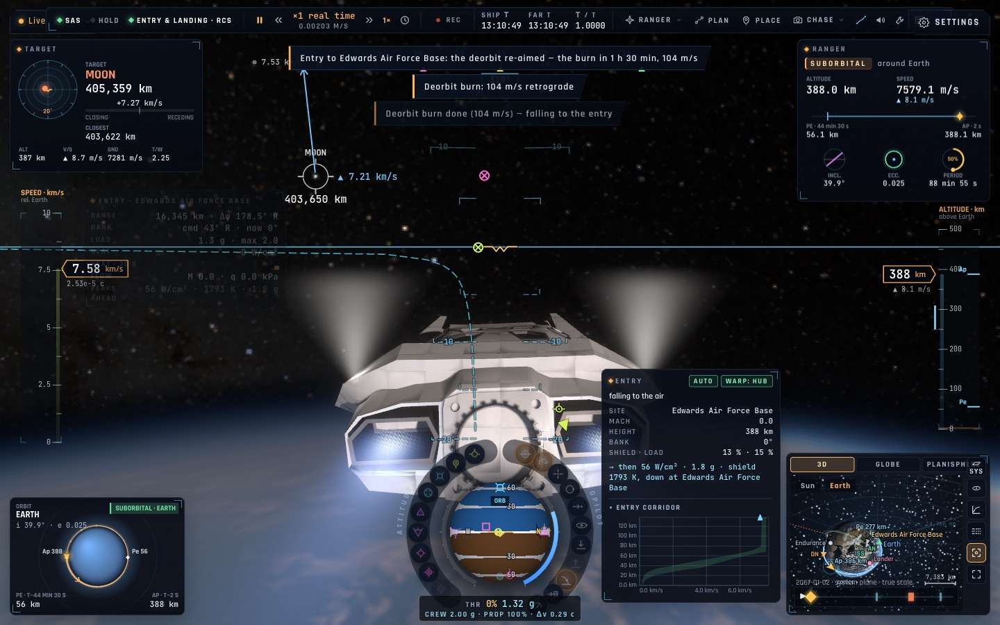
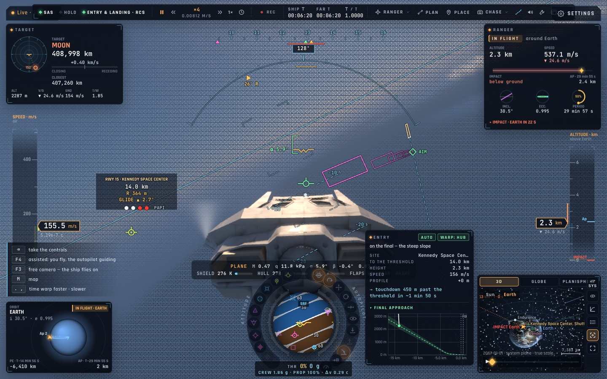
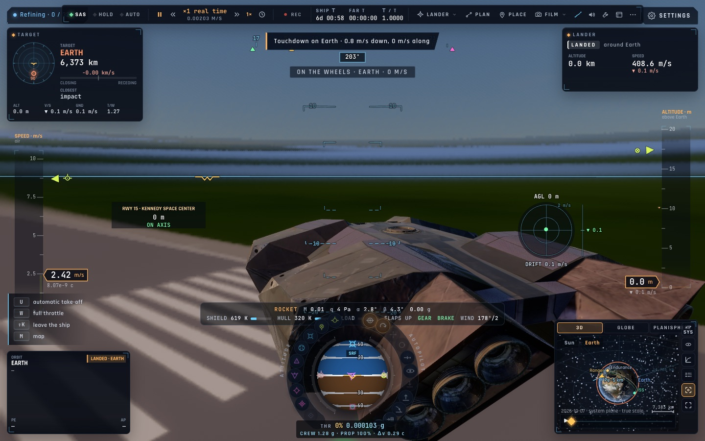
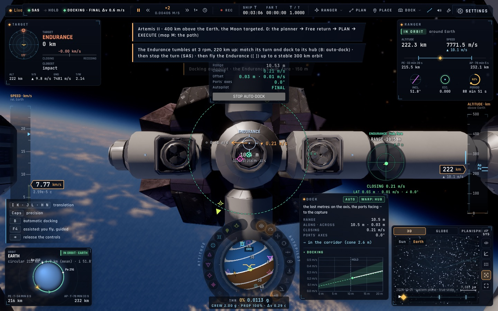

# Campagne autopilotes — 7 octobre 2026 (branche test-kimi)

Suite de la campagne du 6 octobre (vérification de la branche de Kimi, puis tests des pilotes automatiques,
de l'ordinateur de vol et du hub). Travail en une seule voie : vols ici, vérifications sur kerr-mini.
Chaque défaut trouvé est corrigé avec un test de régression, puis le scénario est revolé.

## Résultats

| Domaine | Au début | Maintenant |
|---|---|---|
| Rentrées Ranger depuis l'orbite (Edwards, Kourou, Le Bourget 51,6° et 45°) | 0/4 | **4/4** — couloir de rentrée 100 % (62 % avant), 4 inversions d'inclinaison (11–24 avant), toucher 0,3–0,7 m/s à moins de 5 m de l'axe |
| Planés jusqu'à la piste (7 scénarios, dont haute énergie, vent modéré, circuit, final court en temps réel) | 2/7 | **7/7** — toucher 0,3–0,7 m/s, 0,1–1,1 m de l'axe |
| Lander (Kennedy, Jezero, Gale, Titan) | 0/4 | **4/4** — 0 m, 1 m, 1 m, 620 m du site |
| Lander en stationnaire au-dessus de Kennedy (nouveaux scénarios) | — | **2/2** |
| Atterrissages lunaires (stationnaire, depuis l'orbite, Tranquility et Shackleton) | — | **5/5** |
| Montées depuis Kennedy (28,5° et 51,6°) | 0/2, Δv +47 %, 987 s | **2/2**, Δv +27–30 %, 560 s, couloir de montée du HUD 99–100 % (21–25 % avant) |
| Mission rendez-vous + amarrage ISS | échec (précision latérale) | **réussie** — 0,07 m/s, Δv 69 pour 65 prévus |
| E2E complet (mini) | — | **110/0** |

## Ce qui a été corrigé

### Rentrée (`entry.ts`, `lowthrust.ts`, `piloting.ts`)
- **Rebond phugoïde** : à 55° d'inclinaison, la ressource remontait de 3 km au-dessus du couloir pendant dix minutes. La montée est maintenant amortie plus fort (0,05 rad par m/s au-dessus de 5 km/s, 0,01 en dessous : plus fort à basse vitesse, le vol devenait sensible à la fréquence d'image). Le rebond tombe à 0,6 km.
- **Couloir du HUD** : sa limite haute (vol plané d'équilibre) ignorait la rotation de la Terre. Vers l'est, la vitesse inertielle est 330 m/s plus grande, donc l'équilibre est 1–2 km plus haut : toutes les rentrées vers l'est semblaient « hors couloir ».
- **Désorbitation de la capsule** : le planificateur propage maintenant avec la propagation même du vol (rails, traînée, Lune, Soleil). Il replanifie au plus tard 1,3 orbite avant la poussée. Si aucun passage n'est à portée, une poussée de correction hors plan a lieu un quart d'orbite avant l'arrivée (0,9 km par m/s, contre 0,34 à la poussée de désorbitation), puis l'heure de poussée est recalculée. Le Lander passe de 86 km à 434 m de Kennedy.

### Approche et atterrissage sur piste (`computer.ts`)
- **Spirale** : le nombre de tours est compté sur l'énergie totale (vitesse plafonnée à 200 m/s, le reste étant dissipé par le frein aérodynamique), et le cercle rétrécit à mesure que l'avion ralentit. Avant, la finale commençait à 135 m/s trop bas et le train cassait.
- **Variation de pente limitée hors finale** (+0,7 g) : 3,8 g à l'entrée de spirale avant.
- **Pas de « finale » au-delà du seuil en altitude** : un vol a suivi l'axe sur 50 km après le bout de piste.
- **Intégrale sur l'erreur de route** dans les 600 derniers mètres : le cisaillement du vent laissait 9 m d'écart.
- **Taux de chute minimal** une fois le point de toucher dépassé : l'avion flottait 12 s puis s'enfonçait à 1,7 m/s.

### Lander et descente propulsée (`descent.ts`, `pilot.ts`)
- Plus de **battement entre les modes** « à plat vectorisé » et « fusée » à 25 m/s, ni de translation basse sous la porte de 40 m : il tombait à 13 m/s.
- **Poussée proportionnelle à l'alignement** (de 60° à 25° d'écart) à l'atterrissage : la poussée coupée pendant le pivotement créait une oscillation d'assiette de 6 s et il tombait.
- Dans une atmosphère dense, **remise plus en amont** du pad (selon la distance de freinage du Lander, ~21 km sur Terre).
- **Titan a un sol** (il était déclaré « gaz » : l'autopilote n'avait rien où se poser).

### Montée (`lowthrust.ts`)
- **Guidage explicite hors de l'air** : temps restant jusqu'à la vitesse orbitale, et accélération verticale linéaire qui amène l'altitude visée avec une vitesse verticale nulle (résolue par dichotomie). Avant, la montée rampait 450 s sous l'orbite (11,3 km/s dépensés).
- **Fin de montée** sur la vitesse horizontale (0,5 %), et non sur sa seule composante est.
- Le profil « optimum » du HUD est maintenant une simulation point-masse de la même loi.

### Harnais du labo de vol
- Télémétrie : écart prédit par le guidage, pente visée et volée, aérofrein, cercle de spirale, piste et roulette au roulage.
- `__bh.sys.nav()` (état de navigation des autopilotes) et `__bh.sys.geodetic()`.
- Distance au pad mesurée même quand l'engin glisse encore.
- Un dossier de campagne réutilisé est vidé scénario par scénario : le juge lisait la télémétrie d'un vol précédent.

## Nouvelle scène : l'Endurance en rotation

« Earth: the Endurance tumbling, 220 km up » (galerie : *Docking to the tumbling Endurance*). L'Endurance tourne à 3 tr/min (18°/s) autour de l'axe de son moyeu, à 220 km, avec le Lander amarré au port arrière. Le Ranger, piloté, est à 150 m sur l'axe du port avant.
Il faut d'abord s'amarrer en accordant la rotation (B : amarrage automatique). La capture exige moins de 3°/s de rotation relative. Il faut ensuite arrêter la rotation de l'ensemble avec le SAS (environ 7 min avec les seuls propulseurs du Ranger), puis prendre les commandes de l'Endurance (`[ ]`) et monter à 300 km.
Le scénario `endurance-tumbling-dock` réussit : amarrage à 0,09 m/s, rotation arrêtée en 443 s, transfert de Hohmann de 51 m/s, orbite à 300 × 302 km. Les 12 scénarios d'amarrage réussissent tous (12/12).

Ce qu'elle a révélé et qui est corrigé :
- **Page figée 5 minutes** au chargement et pendant l'approche. Pour tracer la trajectoire de l'Endurance, la carte l'intégrait pas à pas depuis maintenant pour chaque point du tracé. Sous ~300 km il n'y a pas de rails, car l'engin est dans l'air. La carte utilise maintenant la propagation analytique pour un engin dans l'air. L'intégration exacte reste sur rails, et elle est limitée à 10 min d'avance dans l'air : une date de scène 40 ans plus tard faisait un million de pas par pose.
- **Coque à 890 K à 220 km** (commit `6808fc1`) : la peau rayonnait vers la température du gaz de la thermosphère au lieu de l'espace.
- **Pilote d'amarrage contre une cible qui tourne** :
  - la rotation de la cible est anticipée (sans cela, l'écart de roulis passait 180° et le pilote repartait en arrière) ;
  - le point suivi est celui de l'axe du port en face de l'anneau, et non le point qui tourne (le Ranger restait à 5 m, toute sa poussée prise par la force centripète) ;
  - la vitesse de l'anneau inclut la rotation propre du vaisseau (l'anneau du Ranger est à 1,1 m de son axe de roulis).
- **Capture** : l'ensemble garde la rotation, moyennée par les inerties. Le pilote ne la coupe plus instantanément et le SAS la freine selon l'inertie de l'assemblage.

## Reste à traiter

- **Mission vers l'orbite lunaire** : réussie ici (orbite 102,7 km), ratée sur le mini (25 km). La différence vient de l'instant du départ : la page du mini finit de charger 273 s plus tard, et le plan prend une autre famille de trajectoires (arrivée à 4,4 j au lieu de 3,3). Le scénario `mission-moon-orbit-late` reproduit le cas ici (orbite à 23 km). La correction à mi-parcours (41 m/s, 2,4 jours avant la Lune) vise le périlune à 10 km près selon le propagateur du planificateur (`predictOurs`), mais le vol réel arrive 77 km plus bas, et la capture circularise à cette altitude. Le remède est de faire viser les corrections avec la propagation même du vol (comme pour l'ISS). Une seconde correction à 80 % du trajet, essayée, aggrave tout (la visée n'est pas faite pour corriger si près de la Lune) : elle a été retirée.
- **Repères de pôle** : le HUD et le décollage mesurent l'inclinaison par rapport au pôle J2000, mais les sites sont posés dans le repère de date. Pour la Lune (pôle à ~2° du J2000), le Lander ne peut pas viser 1° depuis Tranquility (il obtient 2,66°). Il faut unifier sur le pôle de date.
- **Décollage du Lander depuis Mars** : orbite à 255,5 km pour 250 (limite 5 km) ; la circularisation laisse 250 × 261 km.
- **Mission martienne** : orbite à 292,6–294,8 km pour 300.
- **Le Bourget** : toucher à 75 m/s (l'avion flotte encore un peu avant le point de toucher).
- Points 9 et 10 du plan : retour par le trou de ver (compromis réservoir), Gargantua (chauffe à Edmunds, décollage de Miller, orbites à faible poussée).
- Le test e2e de manette (« Start pauses and B resumes ») a échoué une fois dans la suite complète et passe seul : instabilité à surveiller.

Commits : `c1745b7` (rentrée et désorbitation), `c5e6901` (approche), `e0c69ba` (harnais), `ad3d173` (descente : battement de modes), `ecd9106` (montée et Lander). Rien n'est poussé.
