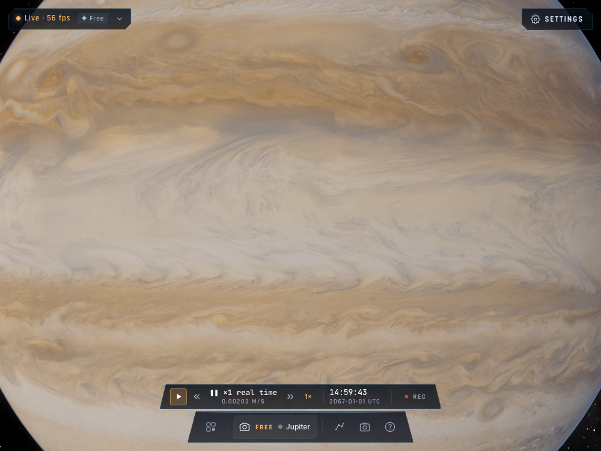

# Jupiter : rendu de proximité

La carte HD était sous-utilisée : le shader bornait à zéro le niveau de mip de la carte 2K,
puis ajoutait le rapport de résolution HD. La carte 6K ne pouvait donc jamais descendre sous
le niveau 1,55, même en gros plan. Le calcul conserve maintenant l'empreinte angulaire brute
jusqu'au choix de la résolution réelle, pour la couleur et les normales HD ; le filtrage des
cartes distantes et des anneaux reste identique.

Jupiter utilise maintenant une mosaïque Cassini/Juno 8K, comprenant les observations polaires,
en KTX2/UASTC avec 14 niveaux de mip. Elle est transcodée hors du thread de rendu en BC7 ou ASTC,
puis transférée directement au GPU (environ 42,7 Mio), sans image RGBA 8K intermédiaire.
Le JPEG 4K sert de secours en l'absence de compression native ou en cas d'échec du chargement
compressé. Les erreurs de ce dernier sont enregistrées sous `jupiter-hd-fallback`.
La carte distante 2K est reconstruite depuis la même source pour garder les nuages alignés.

Source, crédits, licence et procédure de reconstruction :
[README des cartes HD](../../assets/planets-hd/README.md#jupiter-cassini--juno).
La résolution reste finie : environ 55 km par texel à l'équateur. La mosaïque représente des
observations historiques, pas la météo actuelle de Jupiter.

## Validation

- Chrome / WebGPU : chargement effectif en BC7 sRGB, 8192 × 4096, 14 niveaux ; aucune erreur GPU.
- Worker KTX indisponible : secours 4096 × 2048 chargé, aucune erreur GPU.
- Test GPU exécutant les helpers WGSL réels : accès au mip 0 HD et filtrage distant conservé.
- `bun run check` : réussi ; neuf shaders compilés sur Apple.
- `bun run build` : réussi.
- Suite générale : 373 réussites, 149 tests ignorés, un dépassement de délai dans le test orbital
  existant de conservation d'énergie (`tests/reference.test.ts`), reproduit à la relance isolée.
  La suite générale n'est donc pas entièrement verte dans cette session.
- Le chemin ASTC et les appareils mobiles physiques ne sont pas validés sur ce poste.

