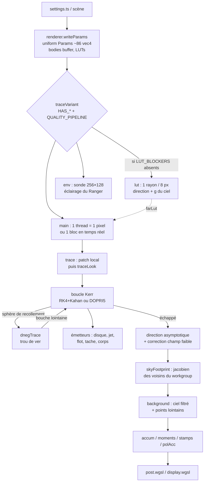

# Le traceur géodésique (cœur relativiste)

Le traceur est le noyau de calcul WebGPU qui fabrique chaque image : pour chaque pixel, il lance un photon
depuis la caméra et intègre **à rebours** sa géodésique nulle dans la métrique de Kerr (coordonnées de
Boyer–Lindquist, G = c = M = 1), en ramassant au passage la lumière du disque d'accrétion (mince ou
volumétrique), du jet, du flot chaud, de la tache chaude, des corps (étoile compagne, planètes, Soleil,
Terre), puis celle du ciel lointain — éventuellement à travers le trou de ver d'*Interstellar* (métrique
Dneg). Tout tient dans un « uber-kernel » WGSL (`src/shaders/trace.wgsl`, ~5 600 lignes) piloté par
`src/renderer.ts` ; quelques modules TypeScript en sont les miroirs CPU (tests, caméra, guide d'ombre).

Voir aussi : `README.md` (§ Physics, § Rendering, § Validation) pour le résumé physique,
`docs/PERFORMANCE.md` et `docs/perf/audit-plan.md` pour les coûts mesurés.

---

## Fichiers

| Fichier | Lignes | Rôle |
|---|---:|---|
| `src/shaders/trace.wgsl` | 5 608 | Le traceur : génération des rayons, intégration de Kerr, émetteurs, corps, trou de ver, ciel, patch local (sol, air, Terre), sonde de lumière, LUT du champ lointain, sonde de précision. Quatre points d'entrée : `main`, `lut`, `env`, `probe`. |
| `src/physics.ts` | 485 | Miroir CPU float64 : horizon, ISCO, orbites de photons, flux de Novikov–Thorne, repère ZAMO, équations de Hamilton des photons, RK4, DOPRI5, LUT corps noir et synchrotron (colorimétrie CIE 1931). |
| `src/geodesic.ts` | 448 | Géodésiques **de genre temps** de la caméra (chute libre, poussée, atterrissage sur un corps, champ faible des lentilles). Ce n'est pas le traceur de photons mais il partage la métrique. |
| `src/lenses.ts` | 34 | Construit la liste des `Lens` (étoile compagne + planètes de Gargantua) à partir des réglages — partagée par la page et le worker du planificateur. |
| `src/analytic.ts` | 160 | Solution semi-analytique (Carlson, Gralla & Lupsasca 2020) des croisements équatoriaux : référence de validation de l'intégrateur. |
| `src/wormhole.ts` | 331 | Métrique Dneg, tracé planaire CPU, repères « rep », géométrie de la bouche lointaine (`mouth()`), composition des vitesses. |
| `src/noise3d.ts` | 80 | Cuisson une fois pour toutes d'une texture 3D 128³ `r16float` de bruit de gradient périodique (période 32) lue par la turbulence du disque. |
| `src/shadow.ts` | 92 | Courbe critique exacte (bord de l'ombre) vue par l'observateur réel, `cameraRay` (miroir CPU de la génération de rayon), boost ZAMO → caméra. |

Côté hôte (hors périmètre mais indispensable à la lecture) : `src/renderer.ts` (`writeParams`,
`traceVariant`, `dispatchTrace`, `featuresOf`, `escapeRadius`), `src/camera.ts` (`cameraFrame`,
`gpuTheta`), `src/system/scene-bodies.ts` (`packBodies`, `MAX_BODIES = 40`, `BODY_VEC4 = 6`),
`src/system/local-patch.ts`.

---

## Fonctionnement

### Vue d'ensemble



Par image temps réel, `renderer.ts` écrit les uniformes, lance éventuellement la passe `lut`, puis la
passe `main` (un rayon par bloc `block × block`, `FLAG_INTERLEAVED`), puis `env`. Quand la vue est
immobile, la phase « converging » relance `main` en pleine résolution par bandes de lignes
(`region.x/y`), un échantillon filtré par pixel et par passe, avec le pipeline **qualité** si
`adaptiveIntegrator` est vrai (`dispatchTrace(..., s.adaptiveIntegrator)`).

### Unités, repères, conventions

- **Unités géométrisées** : G = c = M = 1. Les longueurs et les temps sont en M ; `massSolar` ne sert
  qu'aux conversions physiques (mètres par rayon du corps proche, horloge des vagues de Miller :
  `4.925490947e-6 * massSolar` s par M).
- **Coordonnées de Boyer–Lindquist** (r, θ, φ, t). L'état d'un photon est `GState { x: (r, θ, φ, t),
  p: (p_r, p_θ) }` ; E = 1 (normalisation) et L = p_φ sont des constantes séparées.
- **Carte plate** : partout où il faut une position cartésienne (corps, bouche, chemin de la caméra),
  le shader utilise `blCart(x) = r·(sinθ cosφ, sinθ sinφ, cosθ)`. Exception : la tache chaude utilise des
  coordonnées « Kerr–Schild-like » (`R = √(r² + a²) sinθ`, `spotDist2`).
- **Repère ZAMO** (observateur à moment angulaire nul) : base orthonormée (r̂, θ̂, φ̂) ; lapse
  α = √(ΣΔ/A), entraînement ω = 2ar/A, rayon cylindrique ϖ = √(A/Σ) sinθ. Les directions de visée et
  la vitesse β de la caméra sont exprimées dans ce repère.
- **Temps rétrograde** : `x.w` part de 0 à la caméra et décroît le long du rayon (intégration à rebours) ;
  le temps d'émission est `tEm = P.time.x + x.w`. Tous les motifs mobiles (disque, jet, tache, corps,
  bouche orbitale) sont évalués à ce temps retardé : chaque image d'un objet le montre où il était.
- **Temps GPU en float32** : `writeParams` replie le temps absolu modulo `1024 × flowPeriod` ; les
  positions des corps et de la bouche sont calculées en float64 côté CPU au temps de l'image et le GPU ne
  fait que les tourner de Ω·Δt (`bodyCentre`, `whCentre`).
- **θ de la caméra** : `gpuTheta` décale θ = π/2 exact de 2·10⁻⁷ pour que les croisements du disque mince
  restent détectables en float32.

### Les points d'entrée

| Entrée | Workgroup | Rôle |
|---|---|---|
| `main` | 8×8 | Le rendu : choisit le pixel (ou le bloc), décide de l'échantillonnage adaptatif, appelle `trace` (ou `farLut`), filtre le ciel avec les rayons voisins, accumule. |
| `lut` | 8×8 | Trace un rayon tous les `LUT_CELL = 8` pixels et stocke direction du ciel + g + « propre » dans deux textures (groupe 1). |
| `env` | 8×8 | Sonde de lumière équirectangulaire 256×128 autour de la caméra (éclairage du vaisseau), plus la « key light » analytique. |
| `probe` | 64 | Validation : intègre des rayons donnés avec l'intégrateur qualité, avec ou sans Kahan, et rend l'état final et les rayons des trois premiers croisements équatoriaux (`Renderer.precisionProbe`, `scripts/precision-probe.ts`). |

### Génération du rayon (`traceLook`)

1. `trace(ndc, rnd, tNow)` calcule la direction `look` dans le repère de repos de la caméra :
   `normalize(camFwd + ndc.x·tanH·aspect·camRight + ndc.y·tanH·camUp)`.
2. Si un corps est proche (patch local, `P.near0.w`), il est testé **d'abord** en ligne droite (voir
   § Patch local) ; s'il est touché, le rayon s'arrête là. Sinon on garde ce qu'il ajoute devant (`pre`,
   l'air) et ce qu'il laisse passer (`T`), puis on appelle `traceLook`.
3. `traceLook` : le photon reçu a une énergie 1 et une impulsion `-look`. On applique le **boost de
   Lorentz** caméra → ZAMO (aberration et Doppler du mouvement de l'observateur, `P.boost`) :
   `Ez = γ(1 + β·p)`, `p_z = p + [(γ−1)(β̂·p) + γ|β|] β̂`.
4. Passage au moment covariant BL : `p_t = −(α Ez + ω ϖ p_z,φ)`, donc `E0 = −p_t` (énergie à l'infini
   d'un photon que la caméra mesure à 1), `L = ϖ p_z,φ / E0`, `p_r = √(Σ/Δ) p_z,r / E0`,
   `p_θ = √Σ p_z,θ / E0`. Si `E0 ≤ 1e-6` (photon d'énergie négative, possible dans l'ergosphère), le
   pixel est noir.
5. Si la caméra est dans la région du trou de ver (`P.wh2.x`), on démarre au contraire dans la métrique
   Dneg (segment 1) avec des vecteurs « rep ».

`src/shadow.ts: cameraRay` reproduit exactement cette séquence côté CPU (utilisé par `targeting.ts`).

### Équations du mouvement

Hamiltonien des photons, E = 1 :

```
H = N / (2Σ),   N = Δ p_r² + p_θ² − W²/Δ + (L − a sin²θ)² / sin²θ,   W = r² + a² − aL
Σ = r² + a² cos²θ,   Δ = r² − 2r + a²
```

`geodesicRHS` renvoie dx/dλ = (Δp_r/Σ, p_θ/Σ, (aW/Δ + L/sin²θ − a)/Σ, ((r²+a²)W/Δ + a(L − a sin²θ))/Σ)
et dp/dλ = −∂H/∂(r, θ) en dérivées analytiques. `sin θ` est borné à 1e-6 (pôles). L'intégration se fait
avec un pas **négatif** (à rebours). `physics.ts: rhs` est le même code en float64 (tests).

`wrapPole` garde θ dans (0, π) : un rayon qui traverse l'axe repart de l'autre côté (θ → −θ ou 2π − θ,
p_θ → −p_θ, φ → φ + π).

### Intégrateurs

**Pas heuristique** (`stepSizeAt`) — il borne toujours le pas, et sert de pas fixe en temps réel :

- `h = ε (r − r₊)(1 + 0,01 r)` : résout l'approche de l'horizon ;
- `h ≤ ε Σ sin²θ / |L|` : Δφ ≤ ε, donc résolution de la sphère de photons ;
- `h ≤ ε Σ max(sinθ, 0,02) / |p_θ|` : passages près des pôles ;
- disque épais : ne jamais sauter la couche |z| < 4H (8H avec la brume, + la fumée), ≲ 0,4 H à travers,
  ≲ 0,08 R le long, ≲ 0,1 M (0,25 M en temps réel) dans la fumée ;
- jet : ≤ 0,3 R_j dedans, ≤ 0,7 × distance à sa surface dehors ;
- corps tracés (`bodyWhere == 0`) : ne pas enjamber le corps (ni l'atmosphère d'une étoile, 3 R), pas
  fins près du limbe, et ≤ 0,3 d pour un corps massif (précision du « kick ») ;
- trou de ver : ≤ 0,3 × distance à la bouche ; tache chaude : ≤ 0,25 σ ;
- plancher 1e-5.

ε vient de `realtimeEps` (temps réel) ou `qualityEps` (convergence), multiplié par 4 quand il ne sert
que de borne au pas adaptatif. Le premier pas est multiplié par `mix(0.2, 1, rnd)` pour décorréler
l'échantillonnage volumique entre pixels et échantillons.

**Temps réel** (pipeline `QUALITY_PIPELINE = false`) : RK4 classique à pas heuristique, l'incrément
(`rk4Delta`) étant ajouté par **sommation compensée de Kahan** (`kahanAdd`). Sur des milliers de pas,
l'erreur d'arrondi float32 de φ, t et des rayons rasant la sphère de photons cesse de s'accumuler (≈ deux
fois plus de précision utile). Le facteur `one = P.ext2.w = 1.0` lu dans les uniformes est un **opaque**
qui empêche un compilateur « fast-math » de simplifier `(t − y) − Δ` en zéro. La compensation est remise
à zéro après chaque passage du pôle.

**Qualité** (`QUALITY_PIPELINE = true` et `FLAG_ADAPTIVE_RK`) : Dormand–Prince 5(4) à contrôle
d'erreur (`adaptiveDOPRI`) — six évaluations par pas, la septième (dérivée au nouveau point) réutilisée
comme première du pas suivant (FSAL, `kCur`/`kNext`), solution d'ordre 5 propagée. Norme d'erreur mixte
(`errorNorm`) : r relatif, angles absolus (φ pondéré par sin θ), impulsions relatives. Tolérance
`P.ext.x = integratorTolerance` ; croissance bornée à ×5, réduction ≥ ×0,1, 12 essais au plus, h ≥ 1e-5.
Kahan s'applique aussi. Seul ce pipeline compile ce code (pression de registres du noyau temps réel).

**Croisement équatorial** (`equatorCrossing`) : quand cos θ change de signe dans un pas, on prend la
racine de l'interpolant de Hermite cubique de θ(u) (dérivées aux deux bouts), un sous-pas RK4 jusque-là,
puis une correction de Newton vers θ = π/2 — ~11 évaluations au lieu de 56 pour une bissection RK4. En
temps réel les dérivées aux extrémités sont recalculées à ce moment-là (`kCur`, `kNext`).

**Fins de rayon** : horizon si `r < r₊ + capTol` (`captureTolerance(a) = min(0,05, max(2e-4,
0,4 (r_ph,pro − r₊)))`, sous la plus petite orbite de photon) ou NaN ; échappement si `r > rEsc` et r
croissant (`escapeRadius` : ≥ 60 M, 1,5 × rayon externe du disque, longueur du jet, orbite de l'étoile, corps
tracés, bouche orbitale) ; épuisement des pas (`realtimeSteps`/`qualitySteps`) ; matière opaque si la
transmittance tombe sous 2·10⁻³.

**Direction asymptotique** : à l'échappement, la direction cartésienne de dx/dλ est corrigée de la
déflexion restante de r à l'infini au premier ordre : `δ = (2/b)(1 − √(r² − b²)/r)` vers le trou. Si la
scène a un barycentre (`P.bary.x = q > 0`), le ciel est au repos dans le repère du centre de masse : la
direction subit en plus aberration + Doppler de la vitesse `q v★`.

### Décalages de fréquence

Le facteur `g = ν_obs/ν_em = (1/E0) / (−p·u_em)` est exact pour tout émetteur dont on connaît la
4-vitesse :

- émetteur en rotation circulaire Ω : `circularEmitterEnergy = u^t (1 − Ω L)` avec
  `u^t = 1/√(−(g_tt + 2g_tφ Ω + g_φφ Ω²))` ; si Ω n'est pas de genre temps, repli sur le ZAMO ;
- disque : Ω = 1/(r^{3/2} + a) (Kepler prograde) ; flot chaud et radio : 0,9 Ω_K (sous-képlérien) ;
- jet : boost du ZAMO de vitesse β **le long de r̂** (`k = γ(Ez − β p^r̂)`) ;
- corps : rotation rigide Ω de son repère, × (1 − m/d) pour la remontée hors de son propre potentiel
  (`bodyShift`).

Comme I_ν/ν³ est invariant, un corps noir à T est vu comme un corps noir à g·T. Les couleurs viennent de
deux LUT construites sur CPU (`physics.ts`) :

- `bbLut` : 1 024 entrées sur log₁₀ T ∈ [2, 9] ; rgb = chromaticité sRGB linéaire de luminance 1,
  a = log₁₀ Y absolu (intégrale Planck × CIE 1931 de 360 à 830 nm). `blackbody(T, logYref)` donne la
  radiance relative à la référence `P.disk.w = log₁₀ Y(T_max)` ;
- `syncLut` : 512 entrées, couleur du spectre `x^{1/3} e^{−x/s}` (jet).

Modes (`shiftMode` → `P.modes.y`) : `SHIFT_FULL` (Doppler + gravitationnel + beaming), `SHIFT_GRAV_ONLY`
(émetteur remplacé par un ZAMO), `SHIFT_NO_BEAMING` (couleur décalée, intensité non amplifiée),
`SHIFT_NONE` (g = 1, le rendu « Interstellar »).

### Le disque mince (`shadeDisk`)

Testé à chaque croisement équatorial entre `rIn = r_ISCO` et `DISK_REACH × rOut` (1,3).

- **Température** : `T = T_max (F_NT(r) / F_max)^{1/4}` avec le flux de Page–Thorne (`ntFlux`, condition
  de couple nul à l'ISCO). `F_max` est cherché sur CPU (`ntFluxMax`, 4 000 échantillons sur [r_in, 10 r_in]).
- **Profondeur optique** verticale `τ = diskTau × diskFade(r)` : au-delà de 0,6 rOut elle décroît
  exponentiellement (longueur `0,4 rOut / ln τ₀`, pour atteindre τ ≈ 1 vers rOut), coupée en douceur à 1,3 rOut.
  Pas de bord net.
- **Turbulence** (`turbulence > 0`) : module T (`× mix(1, 0.3 + 0.95 heat)`) et τ
  (`× mix(1, 0.002 + 2.8 dens²)`), et déchire le bord en filaments.
- **Assombrissement centre-bord** (Chandrasekhar, diffusion électronique) : `I ∝ 1 + 2,06 μ`,
  μ = |p_θ| / (r k_em).
- **Transfert** : dalle LTE grise traversée sous l'angle μ : `I = S (1 − e^{−τ/μ})`, transmise `e^{−τ/μ}`.
  La transmittance grise est invariante de Lorentz.
- **Mode bolométrique** (`diskEmission = "bolometric"`) : `I ∝ g⁴ (T/T_max)⁴` à la couleur de g·T
  (style Luminet 1979).

### Le disque épais (`diskVolume`)

Activé par `diskThickness = H/R > 0` (`HAS_THICK`). Profil vertical gaussien
`ρ = e^{−z²/2H²} / (√(2π) H)`, même T(R) que le disque mince, transfert front-to-back
`I += T·S·(1 − e^{−dτ})`, `T *= e^{−dτ}`, `dτ = τ₀ ρ (−p·u) dλ`. L'échantillon est pris à un point
aléatoire du pas (pour ne pas trancher la fumée à l'espacement des pas). Deux couches artistiques :

- **brume** (`diskHaze`, `P.ret.w`) : enveloppe diffusante `e^{−|z|/1,5H}` qui renvoie la lumière du
  cœur chaud (∝ (10/R)²) — bande brûlée à l'horizon du disque, comme dans le film ;
- **fumée** (`diskSmoke`, `P.radio2.z`) : nuages froids et denses au-dessus de 2,5 H, au-delà de ~10 M,
  au contour net (`smoothstep(0.14, 0.2, v)`), qui montent et bouillonnent ; cœur à ~0,4 T₀.

La réutilisation de champs d'uniformes (`P.ret.w`, `P.radio2.z`) est un recyclage : ces slots n'ont
rien à voir avec le rayonnement de retour ou la radio.

### La turbulence du gaz

But : l'aspect du disque de Gargantua (filaments chauds très fins étirés le long des orbites, nuages,
couloirs sombres) sans spirale ni « fondu » entre motifs.

- Le disque est découpé en **anneaux** : `DISK_BANDS = 45` par unité de ln r (~2 % du rayon) pour le fin,
  `DISK_BANDS_C = 7` (~15 %) pour le grossier. Chaque anneau tourne **rigidement** à la vitesse
  képlérienne de son milieu, à jamais, avec son propre motif (`ringPair`) ; deux anneaux voisins sont
  mélangés avec des poids qui préservent le contraste (normalisés par √(w₀² + w₁²)). L'angle est
  `φ − 2π fract(Ω tEm / 2π)` pour garder la précision float32 sur de longues durées.
- `diskStrands` : couloirs, nuages (fBm à 4 octaves étirées le long de l'orbite), crêtes à trois
  largeurs (36, 90, 220 par unité de ln r) en cascade. Chaque octave est atténuée quand elle devient plus
  fine que l'empreinte du pixel (`diskFootprint` : empreinte du pixel à la distance |t|, × moitié du bloc
  temps réel, étirée par l'angle rasant). Quand les anneaux sont plus fins que le pixel, on garde la
  moyenne qui conserve la lumière (le T⁴ moyen des filaments vaut celui de 0,9 T, d'où `heat = 0.63`).
- `diskCoarse` : grande échelle à moyenne nulle (bandes, stries à 12 et 28).
- Le bruit est lu dans une texture 3D cuite (`dnoise` → `noiseTex`, `src/noise3d.ts`) : un fetch
  trilinéaire au lieu de 8 gradients hachés ; c'était la moitié du coût du disque épais.

### Rayonnement de retour (`returningRadiation`)

Lumière du disque recourbée par le trou sur le disque (Cunningham 1976). À un impact sur le disque mince,
une direction entrante est tirée selon une loi en cosinus dans le repère du gaz, le photon est remonté
par une seconde marche RK4 simplifiée (`P.ret.z = 3 000` pas, ε × 3) jusqu'à l'élément de disque
émetteur ; sa lumière, corps noir à g₁₂T₂, est réémise avec l'albédo `diskAlbedo`. **Uniquement** dans le
pipeline qualité, en émission visible, `SHIFT_FULL`, disque mince.

### Flot chaud, jet, radio, tache chaude, polarisation

- **Flot chaud** (`volumeEmission`, `HAS_VOL`) : optiquement mince, `j ∝ ρ ν^{−α}`, ρ ∝ r⁻³ gaussien en
  z (H/R = `hotFlowHR`), tronqué à r_c = max(6, 0,4 rOut). `dI = g^{3+α} j (−p·u) dλ`, couleur = intégrale
  CIE de ν^{−α} précalculée (`P.volColor`).
- **Jet** (`jetSample`/`jetEmission`, `HAS_JET`) : plasma synchrotron le long de l'axe, frontière
  parabolique `R_j = 0,5 r₊ w (|z|/r₊)^{0,6}` (profil de M87), gaine brillante + épine, filaments
  hélicoïdaux et chocs advectés à la vitesse β (`u = |z| − β tEm`), d'où mouvement superluminique
  apparent. `I = g^{8/3} x^{1/3} e^{−x/(g ν_c)}`.
- **Bande radio** (`band`, `HAS_RADIO`) : synchrotron thermique auto-absorbé à 86/230/345 GHz, transfert
  en température de brillance `dT_b/ds = α_ν(ν/g)(g T_e − T_b)`, coefficient d'absorption de
  Mahadevan/Leung (`synchK`). Le disque à ~10⁴ K y devient un occulteur noir ; pas de ciel.
- **Tache chaude** (`spotSample`, `HAS_SPOT`) : blob gaussien sur orbite képlérienne, au temps retardé,
  absorbant/émettant.
- **Polarisation** (`HAS_POL`) : constante de Walker–Penrose `κ = (A − iB)(r − i a cos θ)` conservée le
  long de la géodésique ; on calcule κ des deux axes écran à la caméra (`kapX`, `kapY`) puis, pour chaque
  émission, on résout `κ_em = c_x κ(e_x) + c_y κ(e_y)` (`stokesDir`) — exact pour toute position et vitesse
  de l'observateur. Disque : diffusion électronique (Chandrasekhar, 11,7 % au rasant) ; flot/jet :
  E ⟂ B. Stokes Q, U accumulés dans `polAcc`. Désactivée par le CPU quand le trou de ver est actif.

### Les corps (`bodies`, `HAS_BODIES`)

Le buffer `bodies` (binding 15) contient jusqu'à 40 corps de 6 vec4 (`BV = 6`, `packBodies` dans
`src/system/scene-bodies.ts`), suivis de 10 vec4 d'harmoniques sphériques de la sonde (`SH_BASE = 240`) :

| vec4 | Contenu |
|---|---|
| 0 | centre maintenant (ou décalage par rapport au parent), rayon |
| 1 | Ω, indice du parent (−1), type (0 étoile, 1 planète), masse m [M] |
| 2 | étoile : T, luminosité ; planète : albédo, surface (0 océan, 1 glace, 2 roche, 3 gaz, 4+n carte n), graine ou rayon interne des anneaux |
| 3 | source de lumière (indice, −1 = disque), facteur d'irradiance E/(πB), **où** (`bodyWhere`), rayon externe des anneaux |
| 4 | direction de la lumière mesurée par la sonde de la planète, température de couleur |
| 5 | pôle, angle de rotation actuel |

`bodyWhere` : 0 = tracé dans Kerr ; 1 = lointain, dessiné avec le ciel (K2, Edmunds à ~2 000 UA) ; 2 =
notre univers (coordonnées « home », relatives à `P.ourCam`) ; 4 = idem dans la région Dneg ; 3 = dessiné
par le patch local. Les corps `[0, ourStart())` sont du côté de Gargantua, `[ourStart(), bodyCount())` du
nôtre.

Dans la boucle de Kerr, pour chaque pas (corde `pS → pN`) : le centre du corps est interpolé
linéairement entre le début et la fin du pas (Miller va à 0,3 c), l'intersection se fait dans le repère
du corps (`sphereHit`). Un corps plus petit que l'empreinte du pixel (`footprint(d) = 0,75 × beam × d`)
est **étalé** sur elle (`glowPoint`, `glowProfile`) en conservant le flux — son croissant de phase reste
visible —, et rehaussé à l'échelle photographique des étoiles du catalogue (`pointBoost`), avec
compression logarithmique au-dessus de la magnitude −2 (`compressPoint`). Les atmosphères stellaires
(chromosphère, protubérances, couronne : `starGlow`) sont intégrées devant la photosphère.

Ombrage : `shadeStar` (T(μ) = T (0,2 + 0,8 μ)^{1/4}, granulation, taches) ; `shadePlanet`/`planetShade`
(albédo procédural ou carte, Lambert ou Lommel–Seeliger pour les régolithes, reflet de l'eau, liseré
atmosphérique), lumière d'une source traitée comme corps noir décalé par g. Les anneaux (Saturne) sont
une dalle diffusante Henyey–Greenstein g = −0,3 (`ringLight`, `ringShadow`).

**Masse et champ faible** — l'étoile compagne massive (`P.bodyCfg.y`) ajoute à Kerr le champ linéarisé
d'une masse en mouvement, `h_μν = −2Φ(η_μν + 2u_μu_ν)`, Φ = −m/d (distance dans son repère de repos) :
pour un photon `δH = 2Φγ²(1 − v·p̂)²`, d'où une déflexion 4m/b × (1 − v∥) (Pyne & Birkinshaw 1993).
`bodyForce` renvoie ∂δH/∂(r, θ, φ) et le noyau applique un **kick trapézoïdal** à p_r, p_θ et L (qui
n'est donc plus conservé près de l'étoile). Le repère du trou chutant vers l'étoile (Gargantua orbite le
centre de masse) ajoute le champ « indirect » uniforme `a = m x★/D³`. Les planètes ne dévient pas la
lumière dans le shader (seulement la caméra côté CPU, `lenses.ts`).

### Le trou de ver d'*Interstellar* (`HAS_WH`)

Métrique Dneg (James, von Tunzelmann, Franklin & Thorne 2015) :

```
ds² = −dt² + dℓ² + r(ℓ)² dΩ²
r = ρ                                        si |ℓ| ≤ a
r = ρ + M [x atan x − ½ ln(1 + x²)],  x = 2(|ℓ| − a)/(πM)   sinon
```

ℓ > 0 : l'univers du trou noir ; ℓ < 0 : le nôtre. `g_tt = −1` : aucun décalage gravitationnel dans
la région Dneg. Paramètres : `whRho` (ρ), `whLength` (2a/ρ), `whLensing` (W/ρ, avec W = 1,42953 M —
`W_OVER_M`).

- **Collage** : autour de la bouche lointaine, une **sphère de recollement** de rayon `rGlue` (entre 2ρ
  et min(8ρ ou ρ + 12M, 0,3 D, 0,8 × distance au disque), `wormhole.ts: mouth`). Dedans, Dneg ; dehors,
  Kerr. Chaque métrique néglige la gravité de l'autre ; pour éviter un saut, `mouthForce` ajoute dans Kerr
  le champ faible de la masse M_w du trou de ver, et `dnegTrace` ajoute côté Gargantua (ℓ > a) le champ
  faible du trou (Φ = −1/|X|), ainsi que le temps de coordonnée de Schwarzschild.
- **Tracé planaire** (`dnegTrace`) : par symétrie sphérique, le rayon reste dans le plan (n̂, e₂) ;
  `dℓ/dt = p_ℓ`, `dp_ℓ/dt = b² r'/r³`, `dψ/dt = b/r²`, b conservé. RK4 avec pas qui atterrit exactement sur
  |ℓ| = a (r'' y saute), sur ℓ = 0 (surface liquide) et sur les sorties ; 3 000 pas au plus.
- **Vecteurs « rep »** : composante radiale = composante sur ê_ℓ ; de notre côté l'embedding retourne la
  composante radiale et inverse y (`repToHome`), ce qui garde les deux univers droitiers.
- **Bouche orbitale** (`whOrbit`) : orbite circulaire équatoriale prograde de Kerr à `whDist` ; les
  photons sont boostés entre le repère de la bouche et celui du trou (`boostPhoton`) ; le temps retardé
  traverse le trou de ver (`whInT`) pour que le disque reste cohérent derrière.
- **Segments** : `traceLook` alterne jusqu'à 6 segments Kerr ↔ Dneg. Sortie de notre côté : ciel « home »
  (`SKY_HOME`), avec les corps de notre système (`ourSegment` : intersection en ligne droite, anneaux,
  Terre et son air, couronne solaire visible seulement en éclipse, disques stellaires anticrénelés).
  Une bouche plus petite que le pixel est remplacée par sa radiance moyenne (`throatGlow`, dominée par
  notre Soleil, `P.bodyCfg.z`).
- **Mode cinéma** (`water*`) : surface liquide artistique à ℓ = 0 (réfraction par des ondulations,
  réflexion de Fresnel–Schlick tirée au hasard, caustiques, teinte). Les ondes disparaissent quand elles
  sont sous-résolues (`waterLod`) : de loin, le trou de ver redevient physique.

### Le patch local (corps proche de la caméra)

Un corps proche (`P.near0..5`, calculé par `src/system/local-patch.ts`) n'est pas tracé dans Kerr : il
est dessiné **en ligne droite dans le repère de repos de la caméra**, en unités de son rayon, devant tout
le reste (origine flottante). L'écart à Kerr est négligeable à ces échelles et c'est la seule manière
d'avoir le sol au centimètre en float32.

- Position caméra en float64 découpée en ancre float32 + reste (`nearCam0/1`, `fine0/1`) ; la hauteur
  au-dessus de la sphère se calcule par `(|A|² − 1 + 2A·v + v²)/(r + 1)` au millimètre.
- `nearMarch` : marche dans la coquille du relief (`reliefMax` : 1 300 m Miller, 4 600 m Mann, 1 800 m
  Edmunds, 500 m mondes sans air) puis bissection (10 itérations). Relief procédural (`relief`, mêmes
  fonctions que `src/terrain.ts`, sur lesquelles le vaisseau se pose), cratères (`craterRelief`, 7 tailles),
  ombres portées marchées (`nearShadow`), ombre du Ranger (`shipShadow`, shadow map de `ship.ts`).
- Éclairage : la source seule (`near3.w = 0`), la sonde du Ranger (1), ou la sonde de la planète (2) via
  harmoniques sphériques (`shIrradiance`, Ramamoorthi & Hanrahan).
- Air : diffusion simple Rayleigh + Mie (+ ozone pour la Terre), colonne de Chapman (`earthAir`,
  `airColumn`, `sunThrough`), avec `setAir` pour Mars, Vénus, Titan, les géantes, Pluton.
- La Terre (cartes jour/nuages/lumières, relief ETOPO + tuiles de terrain, nuages volumiques, océan GGX,
  éclipses) occupe les lignes ~3 347–4 445 du shader ; elle mériterait sa propre fiche.

### Le ciel (`background`)

Le ciel n'est pas échantillonné dans `traceLook` mais **après**, dans `main`, car son filtre dépend des
rayons voisins :

1. Tous les threads du workgroup 8×8 écrivent leur direction d'échappement et leur position
   (`wgDir`, `wgPos`), barrière.
2. `skyFootprint` résout le jacobien J = ∂(direction du ciel)/∂(position pixel) avec la paire de voisins
   la mieux conditionnée sur **le même ciel** (repli isotrope sinon) — l'équivalent de dFdx/dFdy, mais
   après lentille et à travers le jitter.
3. `skyFilter` : gaussienne dans le plan tangent de covariance `σ² I + J Jᵀ` ; les étoiles reçoivent leur
   amplification de lentille exacte sans scintiller, la Voie lactée et les images sont band-limitées
   (`textureSampleGrad`).

Modes (`background` → `P.modes.z`) : 0 procédural (Voie lactée + 3 couches d'étoiles corps noir), 1
damier lat/long, 2 image utilisateur, 3 vrai ciel (carte NASA Deep Star Maps + 119 614 étoiles HYG en
sources ponctuelles, grille de cellules sur cube, `realSky`), 4 galaxie extraterrestre (côté Gargantua
quand le trou de ver est actif, `alienSky`). Les corps lointains (`farPoints`) sont dessinés avec le même
filtre, avec parallaxe depuis le point de départ du rayon (`TraceOut.org`) et au temps retardé.

### La LUT du champ lointain (`lut`, `farLut`)

Pour les scènes « trou + disque » seuls (`LUT_BLOCKERS` = radio, polarisation, jet, tache, flot, trou de
ver, corps ; le disque épais est permis), une passe trace un rayon tous les 8 pixels. Un échantillon est
**propre** s'il a atteint le ciel sans rien ramasser ni être absorbé, n'est jamais passé sous r = 6 M
(`RMIN`) et n'a traversé l'équateur qu'au-delà de 1,5 × 1,3 rOut (`CROSSMIN`). Dans `main`, si les quatre
coins de la cellule sont propres, sur le même ciel, et que la torsion bilinéaire de la cellule est
inférieure à 0,4 pixel angulaire (erreur au centre < 0,1 px), la direction et g sont interpolés au lieu
de tracer. Le disque, ses images, l'anneau de photons et l'ombre sont toujours tracés. Réglage
`farFieldLut`, vue live seulement ; en convergence la LUT est calculée une fois par époque.

### Le noyau `main` : échantillonnage et accumulation

- **Temps réel** (`FLAG_INTERLEAVED`) : un rayon par bloc `P.res.z`, à un décalage tournant
  (`P.ext2.xy`, ordre `interleaveOrder`) ; jitter gaussien (σ = 0,42 px) si `FLAG_TEMPORAL` ; `rnd` =
  bruit IGN (Jimenez) + marche du nombre d'or dans le temps. Mélange exponentiel avec l'historique
  (`temporalBlend`, valide si `stamps[idx] ≥ epoch`). `FOOT_NEAR`/`FOOT_FAR` règlent l'empreinte
  supposée d'un rayon (un bloc, ou un pixel sous reprojection temporelle).
- **Convergence / hors ligne** : pleine résolution par bandes, séquences R2/Kronecker tournées par un
  hash, flou de mouvement (temps tiré dans `P.ext.z`), accumulation `accum += (rgb, 1)`, moments
  (Σ luminance², profondeur moyenne pour la profondeur de champ).
- **Échantillonnage adaptatif** (`FLAG_ADAPTIVE_SPP`) : une tuile 8×8 continue tant qu'un de ses pixels a
  une erreur-type relative > `noiseThreshold` (après `minSpp = 8`) — par tuile, pour garder les
  différentielles de rayon.
- NaN → noir. `TraceOut.depth` = |t| quand la transmittance passe sous ½.
- Modes de diagnostic (`renderMode`) : décalage g, température, ordre d'image (nombre de croisements),
  coût (évaluations de dérivées).

### La sonde de lumière (`env`)

Carte équirectangulaire 256×128 dans le repère de repos de la caméra (axes `P.envX..Z`), tracée comme
l'image mais avec un faisceau d'un texel (`probeBeam`), les points à leur flux physique
(`physicalPoints`) et sans le patch local (sauf Terre/monde solide proche, ajoutés explicitement). Un
texel de chaque bloc 2×2 (ou 4×4) est rafraîchi par image, moyenne glissante sur `envCfg.w` échantillons.
Quand un monde proche est éclairé par son étoile, la **key light** analytique (`keyLight`) est écrite après
les texels : direction, rayon angulaire, irradiance occultée par le limbe, atténuée par l'air et le relief.
Elle éclaire le Ranger (`ship.ts`) ; les planètes ont leurs propres sondes (`planet-probe.ts`).

### Spécialisation du noyau (`override`)

| Constante | Bit `featureKey` | Coupe… |
|---|---:|---|
| `HAS_RADIO` | 1 | bande radio |
| `HAS_POL` | 2 | polarisation |
| `HAS_JET` | 4 | jet |
| `HAS_SPOT` | 8 | tache chaude |
| `HAS_VOL` | 16 | flot chaud |
| `HAS_WH` | 32 | trou de ver |
| `HAS_THICK` | 64 | disque épais |
| `HAS_BODIES` | 128 | corps et patch local (ajouté par `writeParams` si la scène a des corps) |
| `QUALITY_PIPELINE` | — | DOPRI5 + rayonnement de retour |

`traceVariant` compile en arrière-plan (createComputePipelineAsync, ~10 s) les variantes `main` rt/q,
`env`, `lut`/`lutq` pour la combinaison courante ; le pipeline général (tout à `true`) dessine en
attendant. Raison : registres et occupation — le système Gargantua n'a ni radio, ni polarisation, ni jet,
ni tache, ni flot.

### Disposition des uniformes (`Params`)

Indices de vec4 tels qu'écrits par `renderer.ts: writeParams` (`set(i, …)`) :

| i | Champ | i | Champ | i | Champ |
|---:|---|---:|---|---:|---|
| 0 | res (W, H, bloc, échantillon) | 15 | jet | 31–37 | wh, wh2, whN, whC, whX/Y/Z |
| 1 | cam (r, θ, φ, tan fov/2) | 16 | jet2 | 38 | bodyCfg |
| 2–4 | camRight/Up/Fwd (ZAMO) | 17 | frame (u32 : stamp, epoch, flags, minSpp) | 39 | bodyCfg2 |
| 5–6 | zamo, zamo2 | 18 | ext (tol, bruit, obturateur, blend) | 40–41 | path, bary |
| 7 | boost (β, γ) | 19 | ext2 (offset, H/R, **1.0 opaque**) | 42–46 | water…water5 |
| 8 | bh (a, r₊, r_isco, r_out) | 20 | volColor | 47 | envCfg |
| 9 | disk (T_max, F_max, turb, log Y) | 21 | modes (u32) | 48–53 | near0…near5 |
| 10 | integ (ε, pas max, r_esc, capTol) | 22–24 | skyX/Y/Z | 54 | ourCam |
| 11 | time (t, période, fond, taille étoiles) | 25 | pol | 55–57 | envX/Y/Z |
| 12 | vol | 26 | ret (+ brume en w) | 58–62 | earth…earth4, hd |
| 13 | region (y0, y1, accum, seed) | 27–28 | radio, radio2 (+ fumée en z) | 63–68 | fine0/1, shipShadow, eclipse, nearCam0/1 |
| 14 | misc (limbe, bolo, éclat, τ₀) | 29–30 | spot, spot2 | 69–85 | tiles, tileL[16] |

Bindings du groupe 0 : 0 `P`, 1 `accum`, 2 `bbLut`, 3–4 `bgTex`/`bgSamp`, 5 `moments`, 6 `stamps`,
7 `syncLut`, 8 `mwTex`, 9 `starLodTex`, 10 `catalogue`, 11 `polAcc`, 12 `probeBuf`, 13 `pathPts`,
14 `envBuf`, 15 `bodies`, 16–18 cartes et anneaux, 19–21 et 28 Terre, 22–23 cartes HD, 24–25 bruit 3D,
26 shadow map du Ranger. Groupe 1 : textures de la LUT.

### Côté CPU

- **`geodesic.ts`** — la caméra quand la gravité est active : géodésique de genre temps,
  `H = ½ g^{μν} u_μ u_ν = −½`, dérivées de H par différences centrées en float64. Échange avec le reste en
  vitesses β relatives au ZAMO (`fromZamo`, `toZamo`). `advance` : DOPRI5 adaptatif en temps propre
  (`TOL = 1e-8`, resserrée près d'un corps par `localScale`), pas maximal `stepMax` (≈ 1/150 de période
  orbitale, et petit devant la distance à un corps massif dans 3 rayons de Hill), poussée appliquée en
  impulsion après chaque pas accepté (`thrust`), atterrissage inélastique (`land`), arrêt près de
  l'horizon. Les lentilles ajoutent `δH = Φ (2 U^t² (E − v·p)² − 1)` (E et L évoluent : effet de
  fronde) et, pour l'étoile, le champ indirect ; au-delà de 100 rayons de Hill une lentille est ignorée
  (`FAR_HILL`). `predict` échantillonne la trajectoire future (tube lumineux `pathGlow` du shader).
- **`lenses.ts`** — `lensesOf(settings)` : l'étoile compagne (avec `accel`/`accelRate`) et les planètes de
  Gargantua via les éphémérides `bodyTrack`.
- **`physics.ts`** — miroir float64 du shader pour les tests (`tests/physics.test.ts`,
  `tests/quality.test.ts`) et constantes (ISCO de Bardeen–Press–Teukolsky, `captureTolerance`, LUTs).
- **`analytic.ts`** — rayons de croisement équatorial en forme close (intégrales elliptiques de Carlson,
  racines radiales par Durand–Kerner), valables pour les rayons à quatre racines réelles qui s'échappent.
  Sert à `tests/analytic.test.ts` et `scripts/precision-probe.ts`, comparés à la sortie du kernel `probe`.
- **`shadow.ts`** — la courbe critique exacte pour l'observateur réel (orbites sphériques de photons
  instables, ξ et η de Bardeen/Teo), boostée dans le repère de la caméra ; dessinée en pointillés verts
  par `main.ts` quand `shadowGuide` est actif.

---

## Interfaces avec les autres systèmes

**Consomme**

- `Settings` (via `writeParams`) ; `cameraFrame(s)` (`src/camera.ts`) : position, base ZAMO, β, γ,
  région du trou de ver ;
- `sceneBodies` / `packBodies` (`src/system/scene-bodies.ts`), `localPatch` (`src/system/local-patch.ts`),
  sondes des planètes (`planetProbes`) ;
- `mouth(s, time)` (`src/wormhole.ts`), `throatLight`, `homePosition` ;
- textures : catalogue d'étoiles et Voie lactée (`assets/`, voir leurs `README.md`), cartes planétaires,
  cartes et tuiles de la Terre, shadow map du Ranger, `noise3d` ;
- trajectoire prédite de la caméra (`pathPts`, depuis `geodesic.predict`).

**Expose**

- buffers `accum` (rgb + compte), `moments` (Σ L², profondeur), `stamps`, `polAcc` → `post.wgsl`
  (résolution, débruitage, profondeur de champ, reprojection) et `display.wgsl` ;
- `envBuf` (sonde + key light) → `ship.wgsl` / `ship.ts`, `endurance`, `station` ;
- `Renderer.precisionProbe` (kernel `probe`) ;
- côté CPU : `physics.ts` (utilisé par ~40 modules : caméra, cible, carte, readouts…),
  `geodesic.ts: advance/predict/thrust/fromZamo/toZamo` (pilotage, manœuvres, worker du planificateur),
  `lensesOf`, `criticalCurveDirections`/`cameraRay`/`projectLook`.

Les hooks `__bh` (rendu automatisé) ne touchent pas le shader directement ; ils passent par `renderer.ts`.

---

## Réglages

Définis dans `src/settings.ts`, exposés dans `src/ui/schema.ts` (sections *matter*, *physics*, *render*).

| Clé | Effet dans le traceur |
|---|---|
| `spin` | a ; r₊, ISCO, F_max recalculés (`diskConstants`) |
| `disk`, `diskTemp`, `diskOuter`, `diskTau`, `diskBrightness`, `limbDarkening`, `diskEmission` | disque mince / source |
| `diskThickness` | H/R ; > 0 = disque volumétrique (`HAS_THICK`) |
| `turbulence`, `diskHaze`, `diskSmoke` | turbulence, brume, fumée (ces deux-là seulement si épais) |
| `returningRadiation` (`off`/`offline`/`always`), `diskAlbedo` | rayonnement de retour (pipeline qualité) |
| `jet`, `jetLorentz`, `jetWidth`, `jetLength`, `jetIntensity`, `jetCutoff`, `jetKnots` | jet |
| `hotFlow`, `hotFlowHR`, `hotFlowAlpha`, `hotFlowIntensity` | flot chaud |
| `hotSpot`, `spotRadius`, `spotSize`, `spotTau`, `spotTemp`, `spotBrightness`, `spotPhase`, `spotHeight` | tache chaude |
| `band`, `radioTau`, `radioTe`, `radioNuS`, `radioJet` | bande radio |
| `polarization`, `polFraction`, `polField`, `polJetPitch` | polarisation |
| `shiftMode`, `renderMode` | décalages, diagnostics |
| `background`, `bgIntensity`, `starSize`, `starBrightness` | ciel |
| `wormhole`, `whRho`, `whLength`, `whLensing`, `whDist`, `whIncl`, `whAzimuth`, `whOrbit`, `whPhase`, `water*` | trou de ver |
| `sun`, `sunMass`, `sunRadius`, `sunOrbit` | étoile compagne (corps massif) |
| `realtimeEps`, `realtimeSteps`, `qualityEps`, `qualitySteps` | ε et nombre de pas |
| `adaptiveIntegrator`, `integratorTolerance` | pipeline qualité DOPRI5 et sa tolérance |
| `targetSpp`, `noiseThreshold`, `temporalBlend`, `temporalReprojection`, `realtimeSubsampling`, `realtimeBudget` | échantillonnage |
| `farFieldLut` | LUT du champ lointain |
| `shadowGuide` | guide d'ombre CPU (`shadow.ts`) |

Les préréglages de qualité (`QUALITY` : low → game) fixent les budgets ; par exemple *ultra* :
`realtimeEps 0.05`, `realtimeSteps 1000`, `qualityEps 0.02`, `qualitySteps 8000`,
`integratorTolerance 2e-6`.

---

## Pièges et limites

- **float32 partout dans le shader.** D'où : Kahan + facteur opaque `P.ext2.w` (ne jamais le remplacer
  par une constante littérale), temps GPU replié modulo 1024 périodes (un saut rare du motif du disque),
  positions des corps calculées en float64 sur CPU puis seulement tournées sur GPU, `gpuTheta`, ancres
  float32 + reste pour la caméra au sol, normales du relief jamais plus fines que 10 m (les directions
  float32 sur la sphère unité sont espacées de ~0,4 m).
- **Compilateurs « fast-math »** : toute simplification
  algébrique de `kahanAdd` casse la compensation sans erreur visible immédiate.
- **Taille du noyau.** Chaque site d'appel d'une grosse fonction est une copie inlinée par le
  compilateur ; plusieurs commentaires (« every call is a copy the compiler builds ») expliquent pourquoi
  `traceLook`, `earthLook` ou `earthHeight` sont appelés à un seul endroit ou via une boucle. Ajouter un
  appel peut faire exploser le temps de compilation et la pression de registres.
- **Compilation des variantes** : ~10 s en arrière-plan à chaque nouvelle combinaison de `HAS_*` ; le
  pipeline général s'affiche entre-temps (plus lent).
- **Approximations assumées** :
  - le patch local et `ourSegment` tracent en ligne droite (pas de courbure de Kerr près du corps) ;
  - Kerr et Dneg se négligent mutuellement de part et d'autre de la sphère de recollement (champs
    faibles ajoutés pour la continuité) ;
  - le jet est boosté le long de r̂, pas de ẑ (valable pour un jet étroit loin du trou) ;
  - g d'un corps : rotation rigide Ω de son repère autour du trou (celle du parent pour une lune) ;
  - les planètes ne dévient pas la lumière (seule l'étoile massive le fait) ;
  - la correction de déflexion à l'échappement est au premier ordre en M/r ;
  - le disque épais, la brume et la fumée sont artistiques (voir les commentaires « as in the film ») ;
  - la surface liquide du trou de ver est purement cinématographique.
- **Coût** : le disque épais avec turbulence et fumée est le poste le plus lourd (pas ≤ 0,1 M dans la
  fumée) ; le rayonnement de retour ≈ ×6 le coût de la vue convergée, d'où le défaut `offline`.
- **Polarisation** non transportée à travers le trou de ver (forcée à 0 par le CPU).
- **LUT** : uniquement en vue live, sans corps ni trou de ver ; elle suppose que le ciel est lisse entre
  échantillons propres — un objet fin non tracé entre deux coins propres serait manqué (d'où les critères
  `RMIN > 6` et `CROSSMIN`).
- **Empreintes** : un rayon temps réel représente un bloc de pixels (`FOOT`) ; textures, relief et corps
  sous-pixel sont filtrés en conséquence, ce qui floute légèrement la vue en mouvement par conception.

---

## Pour aller plus loin

1. **Changer le profil de température du disque** : `shadeDisk` et `diskVolume` (`T = T_max (F/F_max)^{1/4}`),
   et le miroir `physics.ts: ntFlux` si les tests doivent suivre. `F_max` est recalculé dans
   `renderer.ts: diskConstants`.
2. **Ajouter un émetteur volumique** : écrire `xxxSample(s, L, E0, dl, tNow)` qui renvoie source et dτ
   avec `g = (1/E0)/circularEmitterEnergy(...)`, l'appeler dans la boucle de `traceLook` à côté de
   `spotSample`, borner le pas dans `stepSizeAt`, ajouter un `override HAS_XXX`, un bit dans
   `featuresOf`/`traceVariant` et, s'il doit bloquer la LUT, dans `LUT_BLOCKERS`.
3. **Ajouter un champ d'uniforme** : l'insérer dans `struct Params` **à la bonne position**, décaler tous
   les indices `set(i, …)` suivants de `writeParams` (le tableau ci-dessus), agrandir le buffer uniforme.
   Préférer recycler un `w` « unused » documenté.
4. **Vérifier la précision de l'intégrateur** : `bun scripts/precision-probe.ts` (références float64 et
   formes closes) puis `Renderer.precisionProbe` ; `bun test tests/quality.test.ts tests/analytic.test.ts
   tests/physics.test.ts`.
5. **Ajuster le compromis vitesse/qualité** : `QUALITY` dans `settings.ts` (ε, pas, tolérance), puis les
   bornes de `stepSizeAt` ; le mode de rendu `steps` visualise le nombre d'évaluations par pixel.

---

## Incohérences relevées dans le code

- `trace.wgsl:123` décrit `FLAG_ADAPTIVE_RK` comme « step-doubling error control + Richardson
  extrapolation », `settings.ts` commente `adaptiveIntegrator` « error-controlled RK4 » et l'UI affiche
  « RK4 tolerance » : le shader utilise en réalité Dormand–Prince 5(4) (`adaptiveDOPRI`). Le RK4 à
  doublement de pas ne subsiste que dans `physics.ts: adaptiveRK4` (comparaison des tests).
- Le rayonnement de retour n'existe que dans le pipeline qualité, lancé seulement si
  `adaptiveIntegrator` est vrai (vue live) ou `tolerance > 0` (rendu hors ligne). Avec le préréglage
  *low* (`adaptiveIntegrator: false`), `returningRadiation = "always"` n'a silencieusement aucun effet.
- `physics.ts` annonce « Everything here mirrors the WGSL tracer », mais `stepSize` n'y reprend que les
  trois bornes de base (pas celles du disque épais, du jet, des corps…) et le seuil `h ≤ 1e-9` de
  `adaptiveDOPRI` diffère de celui du shader (`1e-5`).
- Plusieurs slots d'uniformes sont recyclés sous des noms trompeurs : la brume dans `P.ret.w`, la fumée
  dans `P.radio2.z`.
- Dans la boucle adaptative, le kick de champ faible (étoile, bouche) modifie `n.p` et `L` après la
  sommation de Kahan sans mettre à jour la compensation `comp` — sans conséquence pratique (le kick est
  petit) mais la compensation n'est plus strictement celle de l'état.
