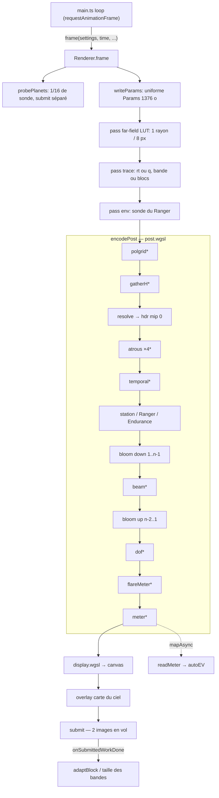

# Le pipeline de rendu et l’image

Ce système fait de la géodésique tracée une image à l’écran. `Renderer` (`src/renderer.ts`) possède le
`GPUDevice` : il crée les cibles (buffers d’accumulation, textures HDR), écrit chaque image les uniformes
du traceur (`trace.wgsl`, décrit dans sa propre fiche), lance les passes de calcul, puis enchaîne la
post-production (`post.wgsl`), l’affichage et le tone mapping (`display.wgsl`) et la surimpression de la
carte du ciel (`overlay.wgsl`). Le même objet produit aussi le rendu « offline » (haute résolution,
progressif), les exports PNG/PNG 16 bits/EXR, les images des vidéos (`video.ts`, `take.ts`,
`renderdialog.ts`), et mesure ce qu’il coûte (`gpuprof.ts`, `perf.ts`). La boucle principale
(`src/main.ts`) l’appelle une fois par `requestAnimationFrame`.

Les chiffres mesurés et l’historique des optimisations sont dans [docs/PERFORMANCE.md](../PERFORMANCE.md)
et [docs/perf/audit-plan.md](../perf/audit-plan.md) ; cette fiche explique le mécanisme.

## Fichiers

| Fichier | Lignes | Rôle |
|---|---:|---|
| `src/renderer.ts` | 3177 | Classe `Renderer` : device, pipelines, cibles, uniformes, image temps réel / progressive / offline, post-production, exposition auto, exports, sondes de lumière. |
| `src/shaders/post.wgsl` | 569 | Passes de calcul : `gatherH`, `resolve`, `atrous` (débruiteur), `temporal` (reprojection), `down`/`downShip`/`up` (bloom), `beamH`/`beamV` (faisceau d’instrument), `polgrid`, `dof`, `flareMeter`, `meter` (histogramme). |
| `src/shaders/display.wgsl` | 299 | Passe de rendu plein écran : composition du Ranger, profondeur de champ, bloom, lens flare, exposition, tone mapping (AgX, AgX punchy, ACES, linéaire, Film), sortie HDR étendue, ticks de polarisation, sRGB + dither. |
| `src/shaders/overlay.wgsl` | 97 | Lignes de la carte du ciel (quads antialiasés) puis composition sur l’image là où le rayon a touché le ciel. |
| `src/chartoverlay.ts` | 114 | Côté CPU de `overlay.wgsl` (instanciation des segments, texture des lignes). |
| `src/shaders/sky.wgsl` | 39 | Décodage d’un panorama 8 bits (log16 ou sRGB) en `rgba16float` linéaire + chaîne de mips 2×2. |
| `src/sky.ts` | 172 | Matrice trou noir → ICRS (`skyMatrix`), chargement des assets du ciel (`rgb9e5` mipmappé, catalogue d’étoiles), `SkyTextureBuilder`. |
| `src/gpuprof.ts` | 110 | Profileur GPU par passe (timestamp queries), une image sur 8. |
| `src/perf.ts` | 73 | Profileur CPU des sections de la boucle (`cpuProf`), fps de la boucle et fps rendus. |
| `src/tier.ts` | 40 | Palier matériel deviné au démarrage → plafond de pixels du temps réel (`capMpx`). |
| `src/renderdialog.ts` | 433 | Panneau « Render » : rendu offline, préréglages, exports, vidéo (live, prise, cinématiques). |
| `src/exporters.ts` | 152 | Encodeurs PNG 16 bits et OpenEXR (half, non compressé), sans dépendance. |
| `src/video.ts` | 166 | Encodage H.264 (WebCodecs) et écriture MP4 fragmenté maison. |
| `src/take.ts` | 108 | « Prise » : enregistrement image par image de la vue live (réglages en diff), rejouée en vidéo. |
| `src/loading.ts` | 148 | Suivi des étapes de chargement (poids, octets reçus) pour l’écran de démarrage et la pastille. |

Côté appelant : `src/main.ts` (boucle, redimensionnement, résolution dynamique, `__bh.render`,
`__bh.video`), `src/settings.ts` (préréglages de qualité `QUALITY`), `src/ui/schema.ts` (réglages).

## Fonctionnement

### Vue d’ensemble d’une image

(\* : passes conditionnelles.)

`frame()` (`renderer.ts:2685`) décide de la **phase** :

- **`realtime`** — la scène ou le temps a changé (`sceneChanged || timeChanged`). Un rayon par bloc de
  `block × block` pixels, à un décalage qui tourne (`FLAG_INTERLEAVED`). Paramètres d’intégration
  `realtimeEps`/`realtimeSteps`, pipeline « rt ».
- **`converging`** — la scène est immobile et `sampleIndex < targetSpp` : raffinement progressif à pleine
  résolution, par **bandes de lignes** (`bandRows`), un échantillon filtré par pixel et par passe ;
  intégrateur à contrôle d’erreur si `adaptiveIntegrator` (pipeline « q »), échantillonnage adaptatif si
  `noiseThreshold > 0`.
- **`converged`** — rien à tracer ; si rien d’affiché n’a changé (`displayChanged`, carte du ciel), aucune
  commande n’est même encodée.

Une image offline en cours remplace tout cela (`offlineFrame`, plus bas).

`frame()` renvoie `null` si le device est perdu, si deux images sont déjà « en vol » (`busy`), ou si la
taille du canvas ne correspond pas encore à la cible (course de redimensionnement) : la boucle réessaie
au tour suivant.

### Les cibles (`Target`) et la mémoire GPU

Une cible est créée par `createTarget(width, height, polarization, live)` (`renderer.ts:961`) : une pour la
vue live (`this.live`), une par rendu offline. Contenu par pixel :

| Ressource | Format / taille | Contenu |
|---|---|---|
| `accum` | `vec4f`, 16 o/px | Σ couleur (rgb) et nombre d’échantillons n (a). En temps réel : un seul échantillon (a = 1), éventuellement mélangé temporellement. |
| `moments` | `vec2f`, 8 o/px | x : Σ luminance² (variance) ; y : profondeur [M] où le rayon est devenu opaque (ciel/ombre : 1e9). Sert au débruiteur, à la DOF, à la reprojection, à la carte du ciel, aux vaisseaux (occlusion). |
| `stamps` | `u32`, 4 o/px | Numéro d’image (`frameStamp`) du dernier échantillon écrit : validité temporelle. |
| `gather` | `vec4f`, 16 o/px (live seulement) | Somme horizontale de la convolution normalisée (`gatherH`). |
| `polAcc` | `vec2f`, 8 o/px (si polarisation) | Σ Stokes Q, U. |
| `hdr` | `rgba16float`, `bloomLevels` mips | L’image résolue (radiance pré-exposée) ; mips 1…n-1 = descente du bloom. Attachement de rendu (Endurance, station). |
| `bloomTex` | `rgba16float`, ½ résolution, n-1 mips | Montée du bloom. |
| `resolveBuf` | uniforme 32 o | `u = (block | vue<<8 | W<<16, offset x, offset y, validFrom)`, `f.x = preExposure`. |
| `temporal`, `denoise`, `dof`, `beam`, `lut` | créés au premier usage | Historiques ping-pong, texture temporaire du débruiteur, image DOF ½ rés., niveau flouté du faisceau, LUT du champ lointain. |

`bloomLevels = clamp(floor(log2(min(W, H))) − 3, 2, 8)`. La limite d’un rendu offline (`maxRender`) vient
d’`accum` : `min(maxBufferSize, maxStorageBufferBindingSize) / 16` pixels, et `maxTextureDimension2D` par
côté. Le panneau affiche une estimation grossière (24 o/px × 1,5).

Les textures partagées (cartes des planètes, de la Terre, cartes fines, ciel, tuiles de terrain…) sont
chargées en arrière-plan ; à leur arrivée, `bindTarget()` refait les bind groups des cibles existantes,
puis l’ancienne texture est détruite après `queue.onSubmittedWorkDone()` (pas pendant qu’une image en
vol la lit). Le traceur a deux bind groups par cible : `traceBind` et `probeBind` (identique, mais le
binding 14 pointe sur le buffer de la sonde planétaire au lieu de celui du Ranger).

### L’uniforme `Params` du traceur

`writeParams()` (`renderer.ts:1322`) remplit un `ArrayBuffer` de `PARAM_VEC4S = 69 + TILE_PARAM_VEC4S`
`vec4` (17 pour les tuiles de terrain : 86 × 16 = 1376 octets), vues `Float32Array` et `Uint32Array`, puis
un seul `writeBuffer`. La signification de chaque `vec4` est commentée dans `struct Params`
(`src/shaders/trace.wgsl:13`). Les indices utiles au pipeline de rendu :

| Index | Champ WGSL | Contenu écrit ici |
|---:|---|---|
| 0 | `res` | W, H, taille de bloc, index d’échantillon |
| 1–7 | `cam`…`boost` | caméra (r, θ GPU, φ, tan(fov/2)), base, ZAMO, vitesse β, γ |
| 10 | `integ` | ε, pas max, rayon d’échappement (`escapeRadius`), tolérance de capture |
| 11 | `time` | temps GPU **replié**, période du flot, intensité du fond (× `skyScale`), taille des étoiles |
| 13 | `region` | y0, y1 de la bande, accumulate, graine aléatoire |
| 17 | `frame` (u32) | `frameStamp`, `validFrom` (live) ou 0, flags, minSpp |
| 18 | `ext` | tolérance, seuil de bruit, obturateur [M], `temporalBlend` |
| 19 | `ext2` | décalage d’entrelacement x, y |
| 47, 55–57 | `envCfg`, `envX/Y/Z` | rafraîchissement de la sonde de lumière et ses axes |
| 48–54, 63–68 | `near*`, `fine*`, `ourCam` | patch local du corps proche (voir les fiches du traceur et du système solaire) |
| 69… | tuiles | `earthTiles.params()` |

Flags (`frame.z`) : `FLAG_ADAPTIVE_RK = 1`, `FLAG_ADAPTIVE_SPP = 2`, `FLAG_TEMPORAL = 4`,
`FLAG_INTERLEAVED = 8`, `FLAG_REPROJECT = 16`, `FLAG_LUT = 32`.

Le temps envoyé au GPU est en float32 : `tGpu = time mod (1024 × flowPeriod)` dès que `time` dépasse cette
période (`renderer.ts:1373`). Il ne pilote que des motifs périodiques (flot du disque, point chaud, jet) ;
les positions des corps et de l’embouchure sont calculées en float64 sur le CPU (`sceneBodies`, `mouth`),
et les positions proches (caméra sur le sol) sont envoyées en deux parties « ancre float32 + reste »
(`near` 67–68, `fine0/1`) pour garder le centimètre.

`writeParams` fait aussi beaucoup de travail CPU « de scène » qui n’est pas du rendu à proprement parler
mais qui est déclenché par lui : choix du palier des cartes de la Terre (`requestEarthMaps`, hystérésis
12/24 px et 5 s), des cartes fines (`requestHd`), mise à jour des tuiles de terrain, éclipses, Lune,
éclairage des planètes par leurs sondes, préparation de l’exposition auto (`meterSky`, `meterIncident`,
`shadowKeep`). À garder en tête : toute modification de ce fichier a un effet sur le coût CPU par image.

### Spécialisation du traceur et compilation asynchrone

Le traceur est énorme (5 600 lignes de WGSL). Au démarrage, `Renderer.create()` (`renderer.ts:767`) :

1. `requestAdapter({ powerPreference: "high-performance" })` ; refuse un GPU qui lie moins de 10 storage
   buffers par étage (le traceur en a besoin) ; demande `timestamp-query`, `texture-compression-bc`,
   `texture-compression-astc` s’ils existent, et les limites maximales de taille de buffer/texture.
2. Configure le canvas au format préféré, `alphaMode: "opaque"`.
3. Construit le `Renderer`. Les **cinq pipelines généraux du traceur** (`lut`, `lut` qualité, `main`
   qualité, `main` temps réel, `env`) sont créés avec `createComputePipelineAsync` : sous D3D12, une
   compilation synchrone peut prendre plus d’une minute et faire tuer le processus GPU par le watchdog.
   Les pipelines de post-production, d’affichage et du ciel sont synchrones (petits).
4. Vérifie `getCompilationInfo()` de chaque module pour afficher les erreurs avec leur ligne, attend les
   pipelines du traceur, puis le scope de validation.

Ensuite, à chaque image, `featuresOf(settings)` calcule une clé de 8 bits (radio, polarisation, jet,
point chaud, flot chaud, trou de ver, disque épais, corps — ce dernier ajouté dans `writeParams` dès
qu’il y a des corps). `traceVariant(kind)` (`renderer.ts:1886`) renvoie une variante où les fonctions
inutiles sont éliminées par des constantes `override HAS_*` ; la première demande lance en arrière-plan
la chaîne de compilation rt → env → q → lut → lutq, et le pipeline général est utilisé tant que la
variante n’est pas prête (~10 s). Les variantes restent en cache (`variants`), jamais libérées.

Le helper `wgsl()` contourne une particularité du serveur de dev Bun : après un rechargement à chaud, un
import `with { type: "text" }` peut arriver sous forme d’URL ; on la télécharge alors.

### Perte du device et erreurs

- `device.lost` → `r.lost` (« released » si c’est `release()` qui a détruit le device à la fermeture de
  la page) et `onLost(why)`. `main.ts` sauvegarde le vol (`autosaveNow`), fige l’image et propose un
  bouton « Reload ». Après une perte, `frame()` renvoie toujours `null`.
- `uncapturederror` → `gpuErrors++` et `onGpuError(message)` pour les trois premières (toast dans
  `main.ts`) : sinon une erreur de validation donne une image noire silencieuse.
- Mémoire : le chargement des cartes de la Terre est entouré d’un scope `out-of-memory` ; en cas d’échec
  on redescend d’un palier (`earthCap`), ce n’est pas une perte de device.

### Temps réel : blocs entrelacés et reconstruction

Pendant le mouvement, le noyau `main` est dispatché sur `ceil(W/block) × ceil(H/block)` threads ; chaque
thread trace **un** pixel de son bloc, au décalage `offset` (`P.ext2.xy`). L’ordre des décalages vient
d’`interleaveOrder(b)` (`renderer.ts:116`) : on part de la cellule centrale puis on prend à chaque fois la
cellule la plus éloignée (distance torique) de celles déjà visitées — un ordre « farthest point » qui
remplit le bloc uniformément. Caméra immobile mais temps qui court, l’image se complète donc en
`block²` images.

Validité des échantillons :

- `invalidate()` (changement de scène) avance `epoch` et `validFrom` à l’image suivante : tous les anciens
  échantillons deviennent périmés.
- Quand seul le temps court, `updateValidFrom(time)` garde les échantillons des dernières
  `MAX_SAMPLE_AGE = 1.5 M` de temps simulé : au-delà, le disque montré aurait tourné (traînées).
- Dans le noyau, avec `FLAG_TEMPORAL` (`temporalBlend < 1`), un pixel dont le `stamp ≥ validFrom` est
  mélangé : `col = mix(ancien, nouveau, temporalBlend)`.

Reconstruction des pixels périmés (`post.wgsl`, `gatherH` + `resolve`) : **convolution normalisée**
(Knutsson & Westin 1993). Pour chaque pixel périmé, on somme les échantillons valides voisins pondérés
par une gaussienne `σ = max(block/2, 0.8)` sur ±block pixels, et on divise par la somme des poids
(séparable : passe horizontale dans `gather`, verticale dans `resolve`). Une reconstruction bilinéaire
depuis la grille de l’image courante est ajoutée avec un poids 0,02, pour qu’un pixel sans voisin valide
ait quand même une valeur.

`resolve` écrit ensuite `hdr` mip 0 : `c × preExposure`, plafonné à 60 000 (le max d’un half float est
65 504), et en alpha la **variance de l’estimateur** `Var = (Σl²/n − l̄²)/n` (× pre²) quand n ≥ 2, sinon −1.
Si `polView = "intensity"`, il écrit à la place l’intensité polarisée √(Q²+U²).

### Sous-échantillonnage automatique (`adaptBlock`)

Avec `realtimeSubsampling = "auto"`, la taille de bloc est choisie dans `BLOCKS = [1, 2, 3, 4, 6, 8]`
d’après le temps GPU mesuré de chaque image (callback de `submit`) :

- Cible : `frameBudget(s)` = `max(8, realtimeBudget)` arrondi à un nombre entier de rafraîchissements de
  l’écran (`refreshMs`, médiane des intervalles de la boucle mesurée par `main.ts`), × 0,9 ; jamais moins
  que l’intervalle de `fpsCap` × 0,9. Sur un écran 60 Hz, 16 ms devient 15 ms : une seule période, pas
  de saccade 30/60.
- Chaque taille garde son temps mesuré (EMA 0,85/0,15) pendant `BLOCK_MEMORY = 20 s`. Les trois images
  qui suivent une création de ressources ou un reset de sonde sont ignorées (`eventFrames`) ; un pic est
  borné à 2 × la médiane des 15 dernières images.
- Le coût d’une taille plus fine non mesurée est **prédit** : avec le profileur GPU,
  `est + trace × ((b/finer)² − 1)` (seul le tracé grandit comme le nombre de rayons) ; sinon la moitié de
  l’image est supposée proportionnelle.
- Décision **en temps, pas en images** : 150 ms cumulées au-dessus du budget pour grossir, 400 ms de
  marge pour affiner. Une taille plus grossière n’est prise que si elle a été mesurée 10 % plus rapide
  (ou jamais mesurée récemment) : si l’image est limitée ailleurs (la composition du navigateur), la
  dégrader n’apporterait rien.

### Résolution dynamique et paliers matériels

Deux étages au-dessus de la taille de bloc, côté `main.ts` :

1. **Palier** (`tier.ts`) : `guessTier(adapter)` classe le GPU de 0 (logiciel : SwiftShader, llvmpipe,
   adaptateur de secours) à 4 d’après `adapter.info` (vendor, architecture, description),
   `navigator.deviceMemory` et un écran tactile. Plafonds de pixels : `CAP = [0.5, 0.9, 2.2, 3.5, 6]` Mpx.
   Apple est classé 2 (les puces de base et Pro/Max sont indiscernables d’ici). NVIDIA/AMD : 3, ou 2 si
   « mobile/laptop/max-q ». En pratique le niveau 4 n’est jamais attribué par `guessTier`.
   `cappedRatio()` réduit le `pixelRatio` pour rester sous `capMpx`. Seulement quand
   `dynamicResolution` est actif (qualité « game ») : les qualités fines gardent le ratio demandé.
2. **Échelle de rendu** (`renderScale`, `main.ts`) : toutes les 1,5 s, par pas de 1/8 entre 0,5 et 1.
   On baisse si le temps GPU lissé dépasse 1,2 × budget **et** que le bloc est déjà ≥ 4 **et** que
   l’échelle inférieure n’est pas connue pour être aussi lente ; on remonte si l’échelle supérieure a été
   mesurée dans le budget (ou pas plus lente), ou si sa prédiction en (échelle)² tient sous 0,85 × budget.
   Mémoire des mesures : 30 s ; une échelle doit tenir 3 s avant d’être mesurée (les cibles recréées
   faussent les premières images). Chaque changement appelle `resize()` → `Renderer.resize()` qui recrée
   la cible live (l’ancienne détruite après le travail en vol) et vide la mémoire des blocs.

Deux images en vol : `submit()` incrémente `inFlight` et le décrémente dans `onSubmittedWorkDone`. `busy`
vaut `inFlight ≥ 2` en live (le CPU prépare l’image suivante pendant que le GPU dessine : +60 % de fps
mesurés) et `≥ 1` en offline. Le temps d’une image est mesuré depuis `max(t0, fin de la précédente)`.

### Raffinement progressif (phase `converging`)

- Une bande de `bandRows` lignes par image, à pleine résolution, avec `accumulate = sampleIndex > 0`.
  Quand la bande atteint le bas, `sampleIndex++`.
- Taille des bandes : `bandRows ← ½ bandRows + ½ (budget / temps par ligne)`, budget
  `min(28 ms, frameBudget)`, au moins 8 lignes.
- Jitter : séquence R2/Kronecker par pixel décalée par un hash, filtre gaussien (`gaussJitter`), offset du
  premier pas en bruit bleu (`ign`).
- Échantillonnage adaptatif (`FLAG_ADAPTIVE_SPP`, après `minSpp` = 8 en live, 16 dans le panneau
  offline) : une tuile 8×8 continue tant qu’un de ses pixels a une erreur relative
  `√(Var/n) ≥ seuil × (l̄ + 0,01)` (toute la tuile, pour garder les différentielles de rayon).
- La sonde de lumière du Ranger n’est retracée que pendant les 32 premiers échantillons.

### Reprojection temporelle (TAAU)

`encodeTemporal` (`renderer.ts:2018`) + `temporal` (`post.wgsl:491`), sur la vue live uniquement, juste
après `resolve`/débruiteur et avant la composition des vaisseaux :

- Historique ping-pong (`hist[0..1]`, `rgba16float`). Hors phase realtime, après un « saut » (changement
  de région, ou distance au trou qui varie de plus de 5 % en une image), ou au premier usage, on
  **recopie** simplement `hdr` dans l’historique.
- Sinon, pour chaque pixel : direction de vue courante, corrigée de la parallaxe si le pixel a une
  profondeur finie (`d = normalize(d0 × depth + drift)`, `drift` = déplacement de la caméra par rapport
  au corps proche), projetée dans la caméra précédente → UV dans l’historique. Exact pour le ciel et les
  images lentillées (la direction d’arrivée d’un photon ne dépend pas de l’orientation de la caméra).
- Lecture Catmull-Rom en 9 taps bilinéaires (`historyAt`) : un bilinéaire flouterait l’historique à
  chaque décalage sous-pixel.
- Clamp de voisinage en YCoCg : moyenne ± g·σ des 3×3 voisins pris **à l’échelle du bloc** (pas de
  `block/2`), `g = taParams[2] = 2`. Ratio d’exposition `pre / pre_précédent` appliqué à l’historique.
- Poids du nouveau : `taParams[0] = 0,25` si un rayon a touché ce pixel cette image (`stamp ≥ validFrom`),
  `taParams[1] = 0,05` s’il a été reconstruit entre les rayons.
- Le sol du corps proche (profondeur < 30 rayons) est redessiné, pas reprojeté — sauf si la caméra est
  « portée » par le corps (`carryGround`, déplacement < 1 cm, rotation < ¼ pixel, horloge < 5 s par
  image) : alors l’historique du **même pixel** est pris, sans clamp, avec α = 0,1, y compris pour les
  pixels voisins d’un pixel de sol (sinon damier sur la ligne d’horizon). `taStill` expose ce diagnostic.
- Le résultat est recopié dans `hdr` mip 0. `resetTemporal()` (appelé par `main.ts` à un changement de
  scène) oublie la caméra précédente.

Dans le traceur, `FLAG_REPROJECT` fait préfiltrer les rayons du ciel sur leur pixel (et non sur leur
bloc) : l’historique fournit la couverture.

### LUT du champ lointain

Quand la scène n’a rien qu’un rayon « entre deux rayons propres » pourrait croiser sans le voir (pas de
radio, polarisation, jet, point chaud, flot chaud, trou de ver, corps : `LUT_BLOCKERS`) et que
`farFieldLut` est actif, une passe `lut` trace un rayon tous les 8 pixels (`makeLut` : `ceil(W/8)+2` ×
`ceil(H/8)+2`, `rgba32float` direction + décalage spectral, `r32float` identifiant de ciel). Un rayon est
« propre » s’il part au ciel sans rien rencontrer, loin de la sphère des photons (r_min > 6) et ne
traverse l’équateur que loin du disque. Dans `main`, un pixel dont les 4 coins de sa cellule sont propres
et de même ciel, avec une torsion bilinéaire < 0,4 pixel, est interpolé au lieu d’être tracé
(`farLut`). En temps réel la LUT est recalculée à chaque image ; en raffinement, une fois par époque.
Jamais en offline (`lutOn` exige la cible live).

### Débruiteur (à-trous guidé par la variance)

`encodeDenoise` + `atrous` (`post.wgsl:62`), seulement sur une image **accumulée** (`accumulated()` :
progressive avec ≥ 2 spp, ou offline) et si `denoise` :

- 4 itérations aux pas 1, 2, 4, 8 px (empreinte ±30 px), ping-pong `hdr0 → tmp → hdr0 → tmp → hdr0`.
- Noyau B3-spline 5×5, poids d’arrêt aux bords statistique :
  `w = h_i h_j · exp(−(l_p − l_q)² / (2σ²(Var_p + Var_q)))`, `σ = 1,5 × denoiseStrength`.
- Un pixel dont l’erreur relative est déjà < 2 % n’est pas touché (étoiles, anneau de photons, détails
  convergés). La variance est propagée (`Σw² Var / (Σw)²`) : les itérations larges filtrent moins.
- Il s’éteint donc tout seul à mesure que l’image converge.

### Exposition, pré-exposition et exposition automatique

**Pré-exposition** — `preExposure(ev) = 2^clamp(ev − 4, 0, 40)` (`renderer.ts:3168`). La radiance est
multipliée par ce facteur avant d’être stockée en half float (`resolve`), puis divisée à l’affichage :
Saturne éclairé à 9,5 UA vaut ~10⁻⁷ de la radiance du disque, sous la plage normale des half floats.
Tous les composants qui écrivent dans `hdr` (Ranger, station, Endurance) reçoivent `pre`.

**Exposition affichée** — `D.size.z = 2^ev / pre` (÷ `radioPeak` en bande 230 GHz), avec
`ev(s) = exposure + (autoExposure ? autoEVDrawn : 0)`.

**Posemètre** (auto exposure) :

1. GPU (`meter`, `post.wgsl:417`) : grille 64 × 64 de cellules, chacune moyenne de 4 × 4 points de `hdr`
   mip 0 (un point unique faisait pomper l’exposition dès qu’une étoile tombait dessus), histogramme de
   `log2 L` sur 128 cases de 2/3 EV : case b ↔ `log2 L ∈ [b/1,5 − 48, (b+1)/1,5 − 48)`, case 0 = noir.
2. Copie vers un buffer `MAP_READ`, lecture asynchrone (`meterPending` : une seule lecture à la fois).
3. CPU (`readMeter`, `renderer.ts:2563`) :
   - cible de base `m = 0,4 / E_incident` : la lumière qui tombe sur la caméra (`incidentLight` : disque
     vu d’ici ou sonde de la planète proche, étoiles à leur distance, passage dans l’air de la Terre,
     éclipse ; albédo 0,3) — « une surface blanche bien exposée » ;
   - retenue si les 0,5 % les plus brillants de l’image (au-dessus de ce que le ciel peut atteindre,
     `skyRef`) brûleraient : `m ≤ 6 / L_0,995`, le quantile interpolé dans sa case (sinon sauts de 2/3 EV) ;
   - dans l’air de la Terre, en plus, au plus 2 % de l’image au-dessus du blanc après le gain du tone map
     (`meterGain` = 4 pour « Film ») ;
   - `target = clamp(log2 m, −6, 32)`, lissé (au plus un tiers de l’écart par lecture, constante ~1 s),
     saut immédiat au-delà de 6 EV ; scène immobile depuis 250 ms : on ne bouge que pour un écart > 1 EV
     (sinon le bruit qui disparaît en raffinant relançait le raffinement en boucle) ;
   - `autoEVDrawn` n’est mis à jour que par pas > 0,05 EV quand la scène est fixe ; cela déclenche un
     nouveau rendu via `onAssets` et `evRedraw`.
4. **Le ciel garde son aspect** : `skyScale = 2^−autoEVDrawn` multiplie l’intensité du fond dans les
   paramètres (le ciel est une toile de fond artistique, il ne doit pas s’éclaircir dans l’ombre).
5. `shadowKeep` (0…1) : paysage de jour dans l’air de la Terre (Soleil entre ~4 et 15°, pas éclipsé,
   caméra basse) — garde les ombres que « AgX punchy » assombrirait.

`autoExposureEV` (getter/setter) permet à une prise vidéo de rejouer la valeur enregistrée.

### Bloom, faisceau d’instrument, profondeur de champ, lens flare

**Bloom** (Jimenez 2014, « dual filter ») :

- Descente : `hdr[l] = down13(hdr[l−1])`, filtre 13 taps (boîte 4×4 par fetchs bilinéaires
  recouvrants). Le niveau 1 (`downShip`) inclut le Ranger et ses jets **comme l’affichage les compose**
  (sinon le disque flouté transparaîtrait à travers la coque), avec un écrêtage doux
  `o / (1 + lum/6)` (`BLOOM_CAP = 6`) pour que le disque du Soleil (10⁵ fois le sol) donne un halo
  d’appareil photo et non une tache aveuglante.
- Montée : `bloom[l] = hdr[l] + tente3×3(bloom[l+1])` de n−2 à 1.
- Affichage : `b = bloom[1] / (n − 1)` (moyenne des niveaux). Mélange **conservatif**
  `c = mix(c, b, bloom)` ; sauf « Film » : voile additif `c × (1 − 0,3 bloom) + 2,5 bloom × b`.
- Les passes de descente ne tournent que si quelqu’un les lit (bloom, flare, faisceau), la montée
  seulement pour le bloom.

**Faisceau d’instrument** (`beamSetup`/`encodeBeam`, bandes radio, `beamUas > 0`) : gaussienne de FWHM
`beamUas` µas, `σ_px = (beamUas/2,3548) / uasPerM / distance / pixelAngle` (1 M sous-tend ≈ 1/r rad).
Appliquée séparablement sur le mip le plus grossier où σ ≥ 2 px, dans `hdr` lui-même ; l’affichage
échantillonne ce mip (`D.lod.x`).

**Profondeur de champ** (`dof`, demi-résolution, `dof && dofAperture > 0`) : lentille mince, cercle de
confusion `c = A · min(|1 − F/d|, 2)`, `A = dofAperture × 3 % de la hauteur`, `d = moments.y` (et la
profondeur de l’Endurance dans sa boîte). Autofocus si `dofFocus = 0` : moyenne harmonique des
profondeurs finies autour du centre, en anneaux élargis si le centre n’est que ciel/ombre. 32 taps sur
une spirale dorée, en « scatter as gather » (un premier plan flou déborde sur un fond net, pas
l’inverse), lus dans les mips. L’affichage mélange l’image floue là où le cercle dépasse ~1 px. Le Ranger,
composé après, reste net.

**Lens flare** (`lensFlare > 0`) : `flareMeter` (un seul workgroup 16×16, sur un niveau ≤ 128 px de
large) mesure l’excès moyen au-dessus du blanc et son centroïde ; `display.wgsl:lensFlare` dessine des
fantômes miroir (4 échelles, teintés), un halo chromatique (anneau de rayon 0,42) et trois fantômes du
diaphragme (disques à bord irisé) alignés sur le centroïde.

### Affichage et tone mapping (`display.wgsl`)

Uniforme `Display` (128 octets, 8 `vec4f`) écrit par `writeDisplay()` (`renderer.ts:1729`) ; le dernier
`vec4` (boîte du Ranger) est écrit séparément à l’offset 112 par `encodePost`.

| vec4 | Contenu |
|---|---|
| `size` | largeur, hauteur de sortie, exposition linéaire, tone map (0 AgX, 1 AgX punchy, 2 ACES, 3 clamp, 4 Film) |
| `flags` | mode debug (≠ physique : pas d’exposition/tone map/bloom), force du bloom, niveaux − 1, dither |
| `view` | placement de l’image (letterbox du preview offline, tremblement de caméra `shake` : décalage + zoom) |
| `hdr` | sortie étendue (0/1), pic, force du lens flare, `shadowKeep` |
| `pol` | ticks (0/1), taille de cellule, grille W, H |
| `img` | W, H de l’image, fraction de polarisation pleine longueur (0,117 pour le disque thermique), carte radio |
| `lod` | mip affiché (faisceau), Ranger dessiné, DOF |
| `ship` | boîte du Ranger [px] |

Ordre dans `fs` : lecture `hdr` (au mip du faisceau) → mélange DOF → Ranger (prémultiplié, dans sa boîte)
+ jets → bloom → lens flare → × exposition → carte radio « afmhot » (230 GHz) **ou** tone map → clamp →
ticks de polarisation (angle χ = ½ atan2(U, Q), longueur ∝ fraction, couleur viridis) → encodage sRGB +
dither triangulaire (TPDF, deux tirages de bruit à gradient entrelacé, ±1 code).

Tone maps : AgX minimal (fit polynomial de Wrensch), « AgX punchy » (contraste ^1,35 et saturation × 1,4,
ombres préservées par `shadowKeep`), ACES (fit de Hill), « clamp » (linéaire), « Film » (look
Interstellar : +2 EV, virage teal/orange, chaque canal roule séparément vers une crème chaude, pied dur).

**HDR** : `configureOutput()` bascule le canvas en `rgba16float` + `toneMapping: { mode: "extended" }`
si `hdr = "on"` ou `"auto"` avec `(dynamic-range: high)`. Le pipeline d’affichage utilisé devient
`export16Pipeline` ; `hdrMap` garde le linéaire jusqu’à un genou `min(0,6, ½ pic)` puis une épaule
exponentielle vers `hdrPeak` appliquée au canal max (teinte préservée) ; `filmHdr` relève ce qui brûle
en SDR.

Trois pipelines d’affichage existent : `displayPipeline` (format préféré du canvas), `export8Pipeline`
(`rgba8unorm`), `export16Pipeline` (`rgba16float`) ; `bindDisplay` prépare un bind group par pipeline et
par cible.

### Composition des objets rastérisés

Dans `encodePost`, juste après `resolve` (et le débruiteur, la reprojection) :

1. **Station** (`encodeStation`) : dessinée **dans `hdr`** si on est de notre côté du trou de ver à moins
   de 3 000 km de la Terre ; son éclairage (part du disque solaire au-dessus du limbe, rougie ; disque
   terrestre éclairé projeté sur des harmoniques sphériques d’ordre 2, 96 directions en spirale de
   Fibonacci) est calculé ici sur le CPU.
2. **Ranger** (`ship.encodeShip`) : rendu dans **ses propres textures** (`resolved`, `plume`) et composé par
   l’affichage (et `downShip`) — pas dans `hdr`. Les autres vaisseaux de la flotte (`shipOthers`) dans un
   rayon de 60 km aussi.
3. **Endurance** : dessinée **dans `hdr`**.

Toutes utilisent `moments` (profondeur du rayon) pour l’occlusion par la scène tracée.

### Sonde de lumière du Ranger et sondes planétaires

`dispatchEnv` trace la carte équirectangulaire 256 × 128 (`ENV_W × ENV_H`) qui éclaire le vaisseau, avec
le point d’entrée `env` du traceur, puis le filtrage et les harmoniques (`ship.encodeEnv`), copiées après
les corps dans `bodyBuf` (plus de slot de storage buffer libre). Coût piloté par `probeDrift` (de combien
la vue de la sonde a bougé) : tout (reset), 1 texel par bloc 2×2, ou 1 par 4×4 une image sur 4 si la vue
bouge lentement ; reset complet étalé sur 4 images si la luminosité du ciel change de plus d’½ stop.

`probePlanets` éclaire les planètes du côté de Gargantua par une sonde tracée depuis leur centre,
un seizième par image (une planète toutes les 2 s), lue en retour et réduite sur le CPU
(`system/planet-probe.ts`). Elle a son propre `writeParams` et son propre `submit`, **avant** ceux de
l’image : `writeParams` de l’image réécrit ensuite le même `paramBuf` (l’ordre de la file garantit que
chaque passe lit les bonnes valeurs).

### Rendu offline

`startOffline(s, time, opts)` (`renderer.ts:2884`) clone les réglages (`structuredClone`), crée une cible
à la taille demandée (sans LUT, sans `gather`), et réinitialise la sonde du Ranger. Ensuite chaque appel
à `frame()` passe par `offlineFrame()` :

- la scène est figée (`job.settings`, `job.time`) mais l’**exposition, le tone map, le bloom, `hdr` et
  `hdrPeak`** viennent des réglages live : ils restent ajustables pendant et après le rendu ;
- une bande de lignes par image, taille adaptée à `opts.budgetMs` (≥ 2 lignes), une seule image en vol ;
- `FLAG_ADAPTIVE_RK` si `tolerance > 0`, `FLAG_ADAPTIVE_SPP` si `noiseThreshold > 0`, obturateur
  `shutter` [M] (flou de mouvement : temps d’échantillon uniforme dans l’intervalle) ;
- `done` quand `sampleIndex ≥ spp` **et** `earthSettled` (cartes et tuiles de la Terre arrivées) ; si de
  nouvelles tuiles arrivent en cours (`earthTiles.stamp`), le rendu recommence à zéro ;
- l’image est montrée en letterbox dans le canvas ; une fois finie, rien n’est ré-encodé tant que
  l’affichage ne change pas.

`OfflineStatus` (progression, spp, temps écoulé, ETA = écoulé × (1 − p)/p) alimente le panneau.

Le panneau (`renderdialog.ts`) propose résolutions (jusqu’à 8K, carrés, portrait, « Viewport »,
« Custom »), spp 16…4096, trois intégrateurs (Reference tol 1e-6 / High tol 1e-5 / Draft RK4 fixe),
seuil de bruit, budget par image (30/80/250 ms) et deux préréglages (« Video · Full HD », « Mega photo ·
8K » qui se rabat sur la plus grande résolution que le GPU tient).

**`__bh.render(name, preset, patch, opts)`** (`main.ts`) : annule un rendu en cours, applique le
préréglage puis `{ animate: false, exposure: 0, renderMode: "physical", ...patch }`, attend quelques
images puis que la Terre soit chargée (30 s max), lance un offline (1920×1080, 128 spp, tol 1e-6,
seuil 0,4 %, budget 250 ms par défaut) et envoie le PNG au serveur de dev (`POST /__snapshot` →
`snapshots/<name>.png`). `__bh.snapshot(name)` exporte l’image courante de la même façon.

### Exports

`exportTarget()` = la cible offline s’il y en a une, sinon la live.

- **PNG 8 bits** (`exportPNG`, `exportRGBA`) : encode `resolve` + post-production + affichage dans une
  texture `rgba8unorm` (dither actif, sans letterbox), relit avec `bytesPerRow` aligné sur 256, puis
  `OffscreenCanvas` → `convertToBlob`. `exportWords` (fourni par `main.ts`) y dessine les étiquettes de la
  carte du ciel.
- **PNG 16 bits** (`exportPNG16`) : même chose dans une texture `rgba16float` sans dither, half → float,
  puis `encodePNG16` (RGB 16 bits, filtre « none », chunk `sRGB`, `CompressionStream("deflate")`, CRC32
  maison). Référé à l’affichage (tone mappé).
- **EXR** (`exportEXR`) : relit `hdr` mip 0 après la post-production, × `2^ev/pre` : radiance linéaire de
  la scène, **sans bloom ni tone map**. `encodeEXR` : OpenEXR 2.0 scanline, non compressé, canaux HALF
  B, G, R (ordre alphabétique), table d’offsets 64 bits.

### Vidéo et prises

- `VideoWriter` (`video.ts`) : essaie les profils H.264 High `avc1.640034/33/28`, débit
  `0,25 bit/px/image` borné à [4, 80] Mb/s, une image clé toutes les 2 s, file d’encodage ≤ 4.
  `Mp4Writer` écrit `ftyp` + `moov` (tables vides + `mvex`) puis un fragment `moof`/`mdat` par image
  (timescale 90 000) : lisible par les navigateurs, QuickTime et VLC, sans dépendance.
- Chaque image vidéo est **un rendu offline complet** : `startOffline` → attente de `done` → `exportRGBA`
  → `addFrame`. Les largeurs/hauteurs sont arrondies au pair.
- Sources du panneau : « Live » (la simulation avance par pas ≤ 1/60 s, entrées utilisateur ignorées via
  `camera.scripted`, temps éventuellement figé = « bullet time » ou accéléré), « Recorded take », et des
  cinématiques (orbite, voyage par le trou de ver — sa durée s’ajuste à la vidéo —, plongée). Obturateur
  0/180°/360° converti en durée [M] : `shutter × rate / fps`, ou `shutter × Δtime` entre deux images de la
  prise. « Restore » remet la scène d’avant via `snapshot`/`restore`.
- **Prise** (`take.ts`) : `capture()` est appelée par la boucle à chaque image live (hors offline) avec le
  temps de la scène, l’horloge de l’eau, l’EV auto, la pose du vaisseau, la poussée, le plasma et la
  trajectoire prédite ; les réglages sont stockés **en diff** par rapport à l’image précédente (comparaison
  `!==` clé par clé, donc par référence pour les objets). 600 s au maximum. `play(fps)` reconstruit pour
  chaque image vidéo l’état de l’image enregistrée la plus proche en temps (avance seulement).
- **`__bh.video(name, { seconds, fps, rate, path, ...offline })`** (`main.ts`) : même mécanique pour
  l’automatisation, MP4 envoyé à `/__snapshot` ; progression dans `__bh.videoState`.

### Profilage

- `GpuProfiler` (`gpuprof.ts`) : un `GPUQuerySet` de 128 timestamps (64 passes). `begin()` décide si
  l’image est profilée (une sur `every = 8` : les timestamps coûtent 2–3 % s’ils sont sur chaque image) ;
  `pass(label, desc)` ajoute `timestampWrites` au descripteur ; `end(enc)` résout et copie, la lecture se
  fait après soumission. Moyenne EMA 0,9/0,1 par label (plusieurs passes du même label sont sommées).
  `traceMs()` (passe « trace ») alimente la prédiction d’`adaptBlock`. Activé dès le démarrage quand
  `timestamp-query` existe (`renderer.ts:552`).
- `CpuProfiler` (`perf.ts`, singleton `cpuProf`) : `time(label, f)` autour des sections de la boucle de
  `main.ts`, EMA 0,95 et pire valeur sur ~3 s, `loopFps`/`renderFps` par fenêtre d’1 s.
- Lecture : `__bh.game.perf()` et F2 › Perf (`src/game/tools.ts`, `src/ui/gametools.ts`) ; voir
  [docs/GAME-TOOLS.md](../GAME-TOOLS.md) et [docs/PERFORMANCE.md](../PERFORMANCE.md) (`scripts/bench.ts`).

### Le ciel (`sky.ts`, `sky.wgsl`)

- `loadSky()` charge en parallèle la carte de la Voie lactée (Gaia DR2, WebP encodé log :
  `v = 2^(16c − 16)`), la texture LOD des étoiles et le catalogue (Hipparcos/HYG). Fichiers « SKY1 »
  (`rgb9e5ufloat` + mips) et « STR1 » (grille de cellules + étoiles), gzippés, décompressés avec
  `DecompressionStream` ; produits par `scripts/build-sky.ts`.
- `SkyTextureBuilder.build()` décode sur GPU un `ImageBitmap` 8 bits en `rgba16float` linéaire puis
  construit toute la chaîne de mips par boîte 2×2 (préfiltrage conservant le flux pour des lectures à
  l’empreinte du pixel lentillé). Sert aussi à `setBackgroundImage()` (image utilisateur, sRGB).
- `skyMatrix(s)` : rotation du repère du trou noir (z = spin, le ciel derrière le trou en −x) vers ICRS,
  telle que le point galactique (`skyL`, `skyB`) soit en −x, roulis `skyRoll` ; écrite dans
  `Params.skyX/Y/Z`. `skyRaDec`, `galacticToEquatorial` servent à la carte du ciel.
- Tant que le vrai ciel n’est pas chargé, un ciel procédural est tracé (`skyReady = 0`).

### Carte du ciel en surimpression

`setChart(segments, count)` (appelé par `skychart.ts` via `main.ts`) remplit un vertex buffer instancié
(10 floats par segment). `encodeChart` dessine les segments en quads antialiasés dans une texture
`rgba8unorm` à la taille de la sortie (mélange `max` : les jointures ne s’additionnent pas), puis les
compose sur la sortie **seulement là où le rayon a touché le ciel** (`moments.y ≥ 1e8`) et hors du
Ranger. Les largeurs sont en pixels CSS. Un changement de carte redessine même une image convergée
(`chartDirty`).

### Chargement (`loading.ts`)

`loading` est un traqueur sans DOM : étapes avec poids, état, fraction ; `fetch(url, id)` compte les
octets reçus (fraction ≤ 0,92 tant que le décodage/upload n’est pas fini ; longueur inconnue si la
réponse est compressée → progression « indéterminée » qui tend vers 0,95 en `1 − e^(−t/eta)`). Le
renderer déclare `gpu`, `shaders`, `pipelines` (terminée par `ui/splash.ts` à la première image), `sky`,
`stars`, `maps`, `earth`, `ranger`, `endurance`, `iss`. `ui/splash.ts` s’y abonne (`loading.on`).

## Interfaces avec les autres systèmes

**Consomme**

- `settings` (objet live passé à chaque `frame`), `time` de la simulation (`sim.time`), drapeaux
  `changed` / `sim.timeDirty` / `displayChanged` de `main.ts`.
- Caméra : `cameraFrame`, `gpuTheta`, `homePosition` (`camera.ts`) ; trou de ver : `mouth`, `radius`,
  `setSceneTime` (`wormhole.ts`) ; corps : `sceneBodies`, `packBodies`, `localPatch`, `solarState`,
  `seenFrom`, `sunShare` (`system/*`) ; physique : `isco`, `horizon`, `ntFluxMax`, LUT corps noir et
  synchrotron (`physics.ts`).
- Sous-renderers : `ShipRenderer` (`ship.ts`), `EnduranceRenderer`, `StationRenderer`, `ChartOverlay`,
  `EarthTiles`, cartes (`planet-maps`, `earth-maps`, `hd-maps`), `bakeNoise3d`.
- Propriétés posées par l’app chaque image : `shipPose`, `shipPlasma`, `shake`, `shipReentry`,
  `shipThrust`, `cockpitDash`, `water.clock`, `refreshMs`, `setCameraPath(...)`, `setChart(...)`,
  `exportWords`.

**Expose**

- `Renderer.create(canvas)`, `frame(...)` → `FrameStats { phase, block, spp, gpuMs, width, height, offline? }`,
  `resize(w, h)`, `invalidate()`, `resetTemporal()`, `release()`.
- Offline : `startOffline`, `pauseOffline`, `setOfflineBudget`, `cancelOffline`, `offlineActive`,
  `offlineScene`, `offlineState`, `maxRender`, `earthSettled`.
- Exports : `exportPNG`, `exportPNG16`, `exportEXR`, `exportRGBA`.
- Mesures et état : `lastGpuMs`, `realtimeBlockNow`, `frameBudget(s)`, `prof`, `tier`, `size`, `hdr`,
  `ev(s)`, `autoExposureEV`, `cameraPath`, `lastNear`, `planetProbes`, `realSkyLoaded`, `shipReady`,
  `readShipLight()`, `taStill`, `taParams`, `carryGround`, `localPatchOn`, `precisionProbe(...)`
  (validation de l’intégrateur contre `scripts/precision-probe.ts`).
- Rappels : `onLost(why)`, `onGpuError(msg)`, `onAssets()` (des assets ou l’exposition ont changé l’image :
  `main.ts` marque la scène modifiée).
- Fonctions exportées : `preExposure(ev)`, `halfToFloat`, `interleaveOrder`, types `OfflineOptions`,
  `OfflineStatus`, `FrameStats`.
- Hooks `__bh` : `__bh.renderer`, `__bh.render`, `__bh.snapshot`, `__bh.video`, `__bh.videoState`,
  `__bh.resize`, `__bh.touch`, `__bh.game.perf()`.

## Réglages

Définis dans `src/settings.ts`, exposés dans `src/ui/schema.ts` (section « render », et « camera » pour
l’objectif). Préréglages de qualité dans `QUALITY` : `low`, `medium`, `high`, `ultra` (budget 30 ms),
`realtime` (60 ms, pixel ratio ≤ 1,25, résolution fixe), `game` (16 ms, résolution dynamique).

| Clé | Effet |
|---|---|
| `quality` | Préréglage ci-dessus (ε, pas, spp, tolérances, budget, ratio). |
| `realtimeSubsampling` | `"auto"` ou bloc fixe 1–8. |
| `realtimeBudget`, `fpsCap` | Budget GPU visé, plafond d’images/s (→ `frameBudget`). |
| `dynamicResolution`, `pixelRatio` | Plafond par palier + `renderScale` ; ratio interne. |
| `temporalReprojection`, `temporalBlend` | Reprojection TAAU ; poids d’un nouvel échantillon en accumulation temporelle (1 = off). |
| `farFieldLut` | LUT du champ lointain. |
| `realtimeEps`, `realtimeSteps`, `qualityEps`, `qualitySteps` | Pas d’intégration temps réel / convergence. |
| `targetSpp`, `adaptiveIntegrator`, `integratorTolerance`, `noiseThreshold` | Raffinement progressif. |
| `returningRadiation` | `"offline"` par défaut : rayonnement de retour seulement hors vue live (~6× le coût). |
| `denoise`, `denoiseStrength` | Débruiteur à-trous. |
| `exposure`, `autoExposure` | EV ; posemètre (le réglage devient un biais). |
| `tonemap`, `hdr`, `hdrPeak` | Courbe ; sortie étendue ; pic en unités de blanc SDR. |
| `bloom`, `lensFlare`, `dof`, `dofAperture`, `dofFocus` | Effets d’optique. |
| `polarization`, `polView`, `polTickSize`, `polFraction` | Ticks EVPA / intensité polarisée. |
| `band`, `beamUas`, `uasPerM`, `radioPeak` | Bande radio, faisceau d’instrument, carte afmhot. |
| `renderMode` | ≠ `physical` : modes de diagnostic (pas d’exposition/tone map). |
| `bgIntensity`, `starBrightness`, `starSize`, `skyL`, `skyB`, `skyRoll`, `background` | Ciel. |

## Pièges et limites

- **Précision** : `hdr` est en half float → pré-exposition obligatoire et plafond 60 000 dans `resolve`,
  `withShip`, l’affichage. Le temps GPU est replié (float32) : un saut rare du motif du disque toutes les
  1024 périodes de flot. Les positions fines passent en « ancre + reste ».
- **Deux images en vol** : un état écrit par `queue.writeBuffer` (params, display) est ordonné par la file,
  mais une valeur CPU lue dans le callback de `submit` concerne l’image d’il y a deux tours
  (`adaptBlock` ignore une image tracée avec un bloc qui n’est plus courant).
- **`displayBuf` et `paramBuf` sont partagés** entre la vue live, l’offline, les sondes planétaires et les
  exports : l’ordre des `writeBuffer` dans la file fait foi. Ajouter une passe qui lit `paramBuf` après
  la sonde planétaire mais dans sa soumission casserait cette hypothèse.
- **Exports ≠ preview offline** : `offlineFrame` mélange les réglages figés et cinq réglages d’affichage
  live, mais `renderdialog.ts` et `__bh.render` appellent `exportPNG(d.settings)` avec les réglages
  **live complets** pour la post-production (débruiteur, DOF, flare, polarisation, auto-exposition…). Un
  réglage changé après le début du rendu s’applique à l’export mais pas au preview.
- **L’EXR ne contient pas le Ranger** (ni ses jets) : il est composé par l’affichage, pas dans `hdr`. La
  station et l’Endurance, elles, y sont. Le posemètre et la DOF ne voient pas non plus le Ranger.
- **Exporter la vue live** relance `encodePost` sur la cible live : reprojection temporelle (qui met à jour
  `taPrev`), posemètre, sondes de vaisseaux… effets de bord mineurs pendant le mouvement.
- Le posemètre recrée un bind group à chaque lecture (petit coût CPU) et n’a qu’une lecture en vol.
- `SkyTextureBuilder.build` **rogne** (et ne réduit pas) une image plus grande que
  `maxTextureDimension2D` (`copyExternalImageToTexture` sur `[w, h]` tronqués).
- Variantes du traceur : chaque nouvelle combinaison de fonctions compile ~10 s en arrière-plan et reste
  en mémoire ; le pipeline général (plus lent) dessine en attendant.
- La reprojection est exacte pour ce qui est loin ; pour le proche, le clamp YCoCg rejette ce qui a bougé
  au prix de flou / scintillement aux bords ; le disque animé ne se reprojette pas (seul le temps court :
  `MAX_SAMPLE_AGE`).
- La LUT n’est utilisée que dans les scènes « trou + disque » sans aucun autre élément ; toute fonction de
  `LUT_BLOCKERS` la désactive.
- `guessTier` ne renvoie jamais le niveau 4 (6 Mpx) : un GPU haut de gamme est plafonné à 3,5 Mpx en
  qualité « game ».
- Le traceur exige 10 storage buffers par étage : certains GPU mobiles/anciens sont refusés au démarrage.
- `frame()` peut renvoyer `null` plusieurs tours de suite (deux images en vol, redimensionnement) : la
  boucle ne doit pas interpréter `null` comme une erreur.
- Rendu offline : bloqué à « presque fini » tant que `earthSettled` est faux (cartes/tuiles de la Terre en
  téléchargement) ; une tuile qui arrive relance tout depuis 0 spp.

## Pour aller plus loin

1. **Ajouter une passe de post-production** : écrire l’entrée dans `post.wgsl` (bindings libres : voir
   les numéros déjà pris, la mise en page est `auto`), créer le pipeline avec `mkPost("…")` dans le
   constructeur, son bind group dans `bindPost` (ou paresseusement comme `ensureDof`), l’encoder dans
   `encodePost` à la bonne place (avant la descente du bloom si elle doit être floutée avec l’image) avec
   `this.prof.pass("label")` pour qu’elle apparaisse dans F2 › Perf. Détruire ses ressources dans
   `destroyTarget`.
2. **Changer ou ajouter un tone map** : ajouter la valeur à `Tonemap` (`settings.ts`), à `TONEMAPS`
   (`renderer.ts:60`), à l’option du schéma (`ui/schema.ts`), puis la branche dans `fs` de
   `display.wgsl` (SDR **et** HDR). Penser à `meterGain` si la courbe a un gain propre.
3. **Régler le gouverneur de performance** : le budget vient de `QUALITY` / `realtimeBudget` ;
   l’hystérésis du bloc est dans `adaptBlock` (150/400 ms, 10 %, `BLOCK_MEMORY`), celle de l’échelle dans
   la boucle de `main.ts` (1,5 s, pas de 1/8, plancher 0,5) ; les plafonds par palier dans `tier.ts`
   (`CAP`). Mesurer avec `bun scripts/bench.ts` (voir PERFORMANCE.md).
4. **Ajouter un format d’export** : partir de `renderDisplayed` (image tone mappée) ou de `exportEXR`
   (radiance linéaire, × `2^ev/pre`), encoder dans `exporters.ts`, brancher un bouton dans
   `renderdialog.ts`. Pour un export qui doit contenir le Ranger en linéaire, il faut composer
   `ship.target(t.hdr).resolved` dans une copie de `hdr` (comme le fait `withShip`).
5. **Ajouter un paramètre au traceur** : ajouter un `vec4` à `struct Params` (`trace.wgsl`) **et**
   incrémenter `PARAM_VEC4S` (`69 + …`) — les tuiles de terrain sont écrites à l’index 69 : un nouveau
   champ s’insère avant elles en décalant `f.set(this.earthTiles.params(), 69 * 4)`, ou se place
   après. Écrire la valeur dans `writeParams` avec `set(i, …)`.

## Incohérences relevées (à vérifier)

- `FLAG_ADAPTIVE_RK` est commenté « step-doubling + Richardson » (`trace.wgsl:123`) et l’aide du réglage
  `adaptiveIntegrator` dit de même (`ui/schema.ts`), alors que l’intégrateur est un Dormand–Prince 5(4)
  (`trace.wgsl:369`), comme l’indiquent les libellés du panneau de rendu.
- `post.wgsl` (fonction `temporal`) annonce un clamp « mean ± 1.25 σ » ; la largeur réelle vient de
  `taParams[2] = 2.0`.
- Commentaires JSDoc déplacés dans `renderer.ts` : celui du débruiteur à-trous est au-dessus de
  `makeLut` ; « Starts a render of the current scene… » au-dessus d’`earthSettled` ; `exportRGBA` et
  `adaptBlock` ont chacun deux JSDoc (le premier d’`adaptBlock`, « ~36 ms / ~26 ms », est périmé).
- `renderdialog.ts` : `btnStart.onclick` recopie à l’identique le corps d’`options()` ;
  `btnStop.textContent = a ? "Close" : "Close"`.
- PERFORMANCE.md dit que le premier `__bh.game.perf()` active les timestamps ; ils le sont déjà au
  démarrage (`renderer.ts:552`) dès que le GPU les supporte.
