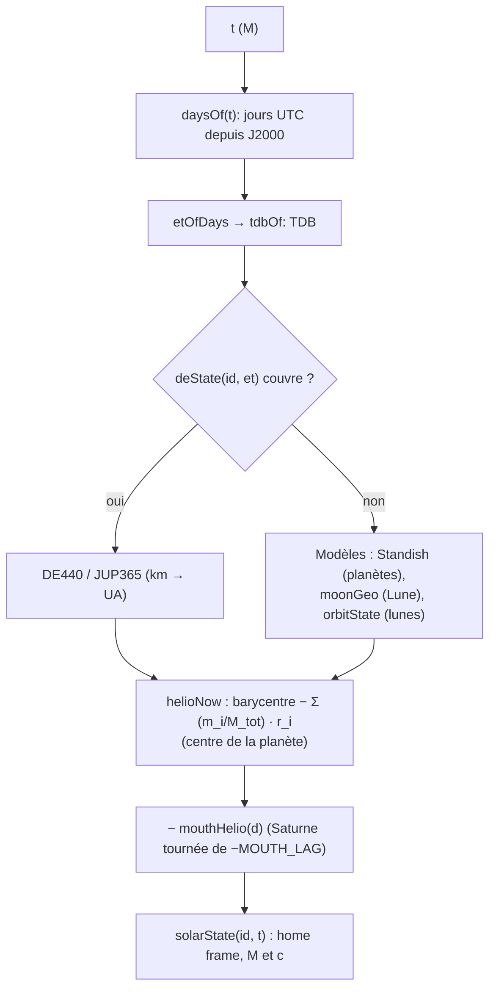
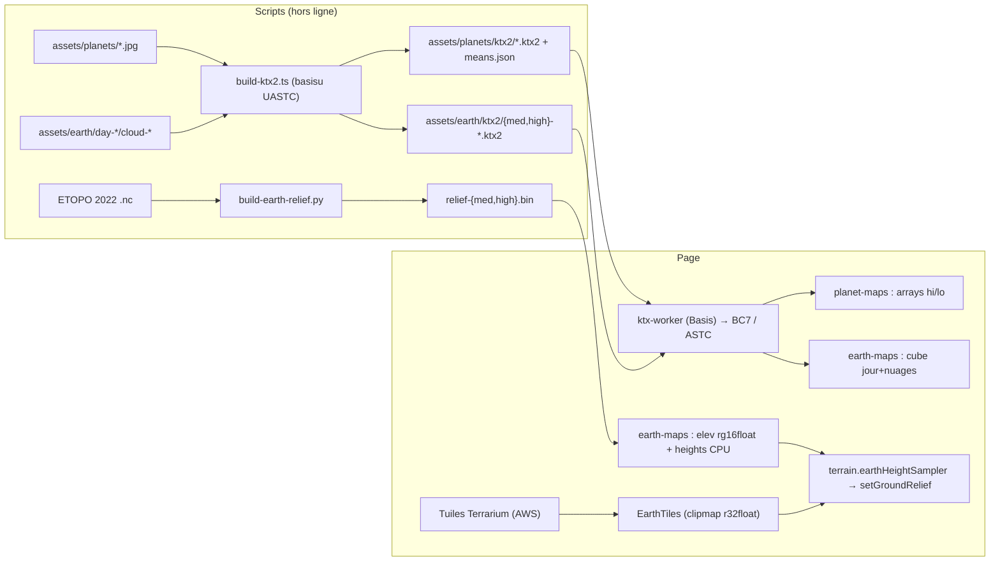

# L’univers : éphémérides, corps, Terre, ciel

Ce système dit **où sont les corps, comment ils tournent et à quoi ressemble leur surface**, à
l’instant de l’horloge de la scène. Il couvre les deux univers du jeu : le côté de Gargantua (trou
de Kerr de 10⁸ M☉, Miller, Mann, l’étoile d’Edmunds et Edmunds, en orbites circulaires de Kerr ou
képlériennes) et le nôtre, de l’autre côté du trou de ver (le Système solaire à l’échelle, placé par
les éphémérides DE440/JUP365 de la NASA, tourné par les modèles IAU, la Terre avec précession et
nutation, l’ISS par SGP4). Il alimente le traceur GPU (liste des corps, cartes, reliefs), le vol
(gravité, sol, air), le HUD (date, carte du ciel) et le planificateur (via son worker). Tout est
calculé en float64 sur le CPU ; le GPU ne reçoit que des positions relatives, petites, en float32.

Voir aussi : `README.md` (résumé de la physique), `ANALYSE-INTEGRATION.md` (choix du système de
Gargantua, §3.9 pour la bouche de notre côté), `docs/MAP.md`, `docs/PERFORMANCE.md`,
`docs/perf/audit-plan.md` (KTX2 = audit B6), `assets/sky/README.md`, `assets/earth/README.md`,
`assets/planets-hd/README.md`, `assets/iss/README.md`.

---

## Fichiers

| Fichier | Lignes | Rôle |
|---|---:|---|
| `src/system/timescale.ts` | 26 | UTC → TDB (secondes intercalaires + 32,184 s + terme périodique) ; `J2000_MS`. |
| `src/system/iau-data.ts` | 49 | **Généré** par `scripts/build-ephemeris.ts` : modèles de rotation IAU (pck00010), angles des systèmes, secondes intercalaires (naif0012). Ne pas éditer. |
| `src/system/de440.ts` | 90 | Lecture du format `EPHM` et évaluation de Tchebychev (position + vitesse) ; `loadEphemerides`, `deState`. |
| `src/system/ephemeris-files.ts` | 10 | URL absolues de `assets/ephemeris/de440.bin` et `jup365.bin` (pour la page et le worker du planificateur). |
| `src/system/orientation.ts` | 127 | Axes propres des corps : IAU (pôle, méridien W, termes périodiques), Terre (précession IAU 1976, nutation tronquée, temps sidéral apparent) ; équateur de la date ; écliptique ↔ ICRF. |
| `src/system/solar.ts` | 521 | Le Système solaire : catalogue `SOLAR_BODIES`, états héliocentriques (DE440 sinon Standish / éléments moyens), repère « home » centré sur notre bouche, temps de lumière (`seenFrom`), éclipses (`sunShare`), axes et spin, index des cartes. |
| `src/system/bodies.ts` | 138 | Registre des corps des deux univers (`GARGANTUA_SYSTEM`) : orbites, masses, surfaces, atmosphères. |
| `src/system/kerr-orbits.ts` | 174 | Orbites circulaires équatoriales de Kerr (Ω, uᵗ, E, ℓ, ISCO, marées) ; constantes SI ; tests d’audit de l’étude. |
| `src/system/ephemeris.ts` | 116 | `bodyState` / `bodyTrack` : position, vitesse, dτ/dt d’un corps à un temps t (les deux univers). |
| `src/system/scene-bodies.ts` | 205 | Liste des corps que le traceur dessine (`sceneBodies`), éclairage, empaquetage GPU (`packBodies`, 6 vec4 par corps). |
| `src/system/local-patch.ts` | 244 | « Patch local » : le corps proche de la caméra rendu autour d’une origine flottante (rayons droits, aberration, retard). |
| `src/system/planet-probe.ts` | 187 | Sondes de lumière des planètes de Gargantua : harmoniques sphériques, irradiance, température d’équilibre. |
| `src/system/planet-maps.ts` | 212 | Cartes du Système solaire en deux texture arrays (2048×1024, 1024×512), KTX2 ou JPEG ; albédo moyen ; profil des anneaux de Saturne. |
| `src/system/hd-maps.ts` | 226 | Cartes fines (4K/8K) du monde proche, streamées une à la fois ; normales depuis normal map ou height map. |
| `src/system/earth-maps.ts` | 316 | Cartes de la Terre : cube jour+nuages (KTX2 ou JPEG), cube nuit, relief ETOPO (`rg16float`) ; deux paliers `med` / `high`. |
| `src/system/earth-tiles.ts` | 390 | Tuiles d’altitude Terrarium (AWS) z6–z13 en clipmap toroïdal ; mêmes hauteurs sur CPU (`heightAt`). |
| `src/system/earth-air.ts` | 36 | Transmission de la lumière solaire dans l’air terrestre (CPU), pour le posemètre. |
| `src/system/ktx2.ts` | 68 | Client du transcodeur KTX2 : choix BC7/ASTC/RGBA, écriture des niveaux. |
| `src/system/ktx-worker.ts` | 48 | Worker Basis Universal (UASTC → BC7 / ASTC 4×4 / RGBA8), bundlé à part en `ktx-worker.js`. |
| `src/system/our-surface.ts` | 117 | Les sols de notre univers : vitesse du sol, air, traînée, repère fixe du corps, relief, hauteur du train. |
| `src/system/sgp4.ts` | 271 | SGP4 « near-Earth » (Vallado 2006), parsing TLE/OMM, GMST, TEME → ECEF. |
| `src/system/iss.ts` | 331 | L’ISS : éléments CelesTrak (fetch + cache 6 h + éléments embarqués), orbite dans le repère home, attitude LVLH, joints des panneaux, `IssTracker` (vol propre près du Ranger). |
| `src/terrain.ts` | 328 | Relief procédural CPU identique au traceur (bruit PCG, cratères, vagues de Miller, détail terrestre, échantillonneur de la carte ETOPO). |
| `src/clock.ts` | 75 | Horloge vue par l’utilisateur : vitesse temps réel, échelle de warp, formatage date/durée. |
| `src/sim.ts` | 118 | `Simulation` : le pas unique (boucle live, `__bh.step`, vidéo) qui fait avancer le temps de scène. |
| `src/skychart.ts` | 370 | Carte du ciel : constellations, étoiles nommées, grilles équatoriale (de la date) et horizontale, écliptique ; projection, pointage. |
| `src/chartoverlay.ts` | 114 | Dessin GPU des segments de la carte puis composition là où les rayons ont atteint le ciel. |
| `src/ui/skylabels.ts` | 68 | Étiquettes 2D (halo, anti-chevauchement par priorité). |
| `src/ui/skypanel.ts` | 221 | Panneau « Sky chart » (interrupteurs, recherche, opacité) et carte d’info au survol. |
| `scripts/build-ephemeris.ts` | 244 | Réajuste DE440s/JUP365 en Tchebychev compacts (`assets/ephemeris/*.bin`) et génère `iau-data.ts`. |
| `scripts/spk.ts` | 53 | Lecteur de fichiers SPK/DAF (segments type 2). |
| `scripts/build-sky.ts` | 306 | Voie lactée (`milkyway.webp`), catalogue HYG (`stars.bin`, `starlod.bin`). |
| `scripts/build-constellations.ts` | 294 | `assets/sky/constellations.json` depuis `assets/etoiles/` (**entrée non commitée**, voir Pièges). |
| `scripts/build-earth-relief.py` | 56 | `assets/earth/relief-{med,high}.bin` depuis ETOPO 2022. |
| `scripts/build-ktx2.ts` | 76 | KTX2 UASTC de la Terre et des planètes + `means.json`. |

Hors périmètre mais intimement liés : `src/system/our-side.ts` (gravité du côté « nous »,
`ourState`, `homeToRep`, départs), `src/renderer.ts` (consommateur principal), `src/wormhole.ts`
(`setSceneTime`, `mouth`), `src/shaders/trace.wgsl` (miroir GPU du relief, des cartes, des corps).

---

## Fonctionnement

### 1. Unités, temps et repères

**Unités géométrisées.** Partout `G = c = M = 1`, `M` étant la masse du trou (10⁸ M☉ pour le jeu) :

- 1 M (longueur) = `M_METRES` = 1,476625·10¹¹ m ≈ 0,98706 UA ;
- 1 M (temps) = `M_SECONDS` = 492,549 s ;
- une masse est un GM exprimé en M (le Soleil vaut 10⁻⁸) ; une vitesse est une fraction de c.

`kerr-orbits.ts:units(massSolar)` recalcule `rg`, `tg` pour une autre masse ; mais `solar.ts` code en
dur les valeurs pour 10⁸ M☉ (voir Pièges).

**Horloge de la scène.** `Simulation.time` (`src/sim.ts`) est le temps de scène `t` en M. Il avance à
chaque `step(dt)` de `dt · s.timeSpeed` (M par seconde réelle), sauf si le vaisseau impose sa propre
horloge (`camera.shipClock()`). `setTime(t)` sert aux presets, sauvegardes, `__bh.setTime` ; il
appelle `setSceneTime(t)` (bouche de ver orbitante).

Sur le côté Gargantua, `t` est le temps coordonnée de Boyer–Lindquist de l’observateur lointain. Sur
le nôtre, `t` est converti en **date UTC** :

```
utcOf(t) = EPOCH_DATE + t · M_SECONDS · 1000      EPOCH_DATE = 2067-01-01T00:00Z
daysOf(t) = (EPOCH_DATE − J2000)/86400 s + t · M_SECONDS / 86400   (jours UTC depuis J2000)
```

`clock.ts` en fait l’affichage (`fmtClock` : date ISO UTC si `hasCalendar`, c.-à-d. système
`gargantua` et `massSolar = 10⁸` ; sinon « t = … M »). La vitesse temps réel vaut
`1 / secondsPerM` = 1/492,549 M/s (c’est la valeur `timeSpeed` des presets de jeu). L’échelle de
warp (`warpLadder`) concatène des multiples du temps réel (0,1× … 1000×) sous l’échelle « classique »
0,25 … 100 000 M/s ; au-delà de 500 M/s le vaisseau passe « sur rails » (controls.ts).

**Échelles de temps** (`timescale.ts`). Les éphémérides et les modèles IAU sont en TDB :

```
TT  = UTC + (TAI − UTC) + 32,184 s           (TAI − UTC : table LEAP_SECONDS, la dernière valeur tenue)
TDB = TT + 0,001657 · sin(g + 0,01671 sin g),  g = 357,53° + 0,98560028° · jours
```

La Terre tourne sur UT1, pris égal à UTC (écart réel ≤ 0,9 s).

**Repères.**

| Repère | Où | Définition |
|---|---|---|
| Carte plate BL (« black-hole frame ») | côté Gargantua | (x, y, z) cartésiens de Boyer–Lindquist, trou à l’origine, spin selon z, orbites dans z = 0. |
| ICRF / J2000 équatorial | données sources | Ce que fournissent les SPK, le catalogue d’étoiles, les pôles IAU. |
| J2000 écliptique (`ECLIPJ2000`, ε = 84381,448″) | tout le côté « nous » | `eclOf` / `icrsOf` (`orientation.ts`, `skychart.ts`). |
| **Home frame** | côté « nous » | Axes J2000 écliptiques, **origine sur notre bouche du trou de ver**, qui co-orbite Saturne 0,7 UA derrière elle. Positions en M. |
| Axes propres d’un corps | sol, cartes | colonnes x = méridien origine (centre de la carte), y = 90° E, z = pôle nord (`bodyAxes`). |
| TEME | SGP4 | Vrai équateur, équinoxe moyen de la date. |
| Rep (« representation ») | caméra côté nous | Composantes vues à travers le trou de ver (`homeToRep`, `sideToRep` — our-side/wormhole). |

### 2. Les deux univers : le registre `GARGANTUA_SYSTEM`

`bodies.ts` définit un seul `System` (spin `a* = 0,998`, 10⁸ M☉) qui contient les deux univers
(`universe: "gargantua" | "ours"`). Chaque `BodyDef` a un `kind` (`hole`, `planet`, `star`, `mouth`),
une masse GM [M], un rayon [M], une `orbit` et éventuellement une `surface` (type, gravité en g,
atmosphère `aero.ts`), des anneaux, un pôle, une période de rotation, une carte.

Côté Gargantua :

| Corps | Orbite | Remarque |
|---|---|---|
| Gargantua | `fixed` à l’origine | masse 1 |
| Miller | `kerr`, r = 10 M | océan, 1,3 g ; dτ/dt = 1/uᵗ ≈ 1/1,18 (« 1 h ici ≈ 1 h 11 min au loin ») |
| Mann | `kerr`, r = 40 M | glace, 1 g |
| Trou de ver (mouth) | `kerr`, r = 300 M | ρ = 0,05 M ; particule test, non dessinée comme sphère |
| Étoile d’Edmunds (K2) | `kerr`, r = 2000 UA | 0,78 M☉, 0,35 L☉, 4 900 K, 0,72 R☉ |
| Edmunds | `kepler` autour de K2, a = √0,35 UA | même insolation que la Terre |

Les planètes « terrestres » sont générées par `earthLike(g)` : densité terrestre, rayon `g · R⊕`,
masse `g³ M⊕`.

Côté « nous » : `SOLAR_BODIES.map(ourBody)` — Soleil, 8 planètes, Cérès, Pluton, la Lune et 15 lunes
(Phobos, Deimos, les Galiléens, Mimas → Japet, Triton, Charon), toutes en `orbit: { type: "solar" }`.
La gravité de surface est recalculée depuis GM/R².

### 3. Positions côté Gargantua (`ephemeris.ts`, `kerr-orbits.ts`)

`bodyState(sys, id, t)` renvoie `{ pos, vel, dtau }` en float64 :

- `kerr` : cercle équatorial prograde, `Ω = 1/(x^{3/2} + a)` (Bardeen–Press–Teukolsky),
  `φ = phase + Ω t`, `dtau = 1/uᵗ` avec `uᵗ = (x^{3/2} + a)/(x^{3/4} √(x^{3/2} − 3√x + 2a))`.
- `kepler` : cercle autour du parent (Newton, `n = √((M_p + m)/a³)`), plus le mouvement du parent ;
  horloge `dtau = dtau_parent · (1 − v²/2 − M_p/a)` (champ faible).
- `fixed` : immobile, `dtau = 1`.
- `solar` : délègue à `solarState` (ci-dessous), `dtau = 1` (pas de dilatation de notre côté).

`properTime` = `dtau(0) · t` (taux constant sur ces orbites circulaires). `bodyTrack` met en cache des
fermetures `pos(t)`/`vel(t)` par système (WeakMap) : les intégrateurs du vol les appellent des milliers
de fois par image.

`kerr-orbits.ts` contient aussi `circularOrbit` (E, ℓ, K, facteurs épicycliques, vZAMO, périodes,
contrôles de normalisation), `isco`, `horizon`, `tides` (marées Kerr vs Newton, Wiggins & Lai),
`hillRadius`, `rocheLimit`, `tideRatio`, `throatTide`, `integrateHierarchy` (test hiérarchique de
l’étude) : ils ne servent qu’aux tests (`tests/system.test.ts`) et aux constantes `SI`/`units`.

### 4. Le Système solaire (`solar.ts`)

#### 4.1 Sources de position, par ordre de préférence



1. **DE440 / JUP365** (`de440.ts`) si chargés et couvrants :
   - planètes et barycentre Terre–Lune (`emb`) depuis le Soleil, **1990 – 2150** ;
   - la Lune depuis la Terre, 1990 – 2150 ;
   - Io, Europe, Ganymède, Callisto depuis le centre de Jupiter, **2040 – 2100 seulement**.
2. Sinon les **modèles analytiques** :
   - `standish` : éléments képlériens moyens de Standish (J2000 écliptique, taux par siècle) ;
     vitesse = dérivée exacte des éléments angulaires + (paresseusement) la dérive lente de a, e, I ;
   - `moonGeo` : éléments moyens de Schlyter + principales inégalités (évection, variation,
     équation annuelle… ~2′), ramenés de l’équinoxe de la date à J2000 ; vitesse par différence
     centrée sur ±0,01 j ;
   - `orbitState` : éléments moyens JPL des lunes dans leur **plan de Laplace** (pôle RA/Dec), avec
     précession des apsides et régression du nœud.

Le **centre** d’une planète à lunes est déduit du barycentre de son système moins le décalage pondéré
de ses lunes dessinées : `P = B − Σ (m_i/M_tot) r_i` (`MOONS_OF`). Pour la Terre, la masse de la Lune
est remplacée par `M⊕/EMRAT` (EMRAT = 81,30056822 de DE440). C’est pour cela que `build-ephemeris.ts`
ne réajuste que les barycentres : la Terre oscille de ±4 700 km autour de l’EMB chaque mois, la fitter
directement coûtait 30 fois plus.

**Notre bouche** : sur l’orbite de Saturne, tournée de `−MOUTH_LAG = −2 asin(0,7/(2·9,537))` autour
de l’axe écliptique (0,7 UA de corde « derrière » Saturne). `solarState` soustrait sa position
héliocentrique : le home frame est donc **non inertiel** — `mouthAccel(t)` donne son accélération
(chute vers le Soleil), que `our-side.ts` retire de la gravité ressentie par le vaisseau.

**Mémoïsation.** `helio()` garde tous les états d’un même instant `d` (la gravité sur le vaisseau
demande tous les corps au même t) ; `bodyAxes()` idem par `t`. Les vitesses sont **paresseuses**
(`LazyState`) : la majorité des appels ne veulent que les positions.

#### 4.2 Le format `EPHM` et l’évaluation

`scripts/build-ephemeris.ts` lit les noyaux SPK (`scripts/spk.ts`, segments type 2) et réajuste chaque
corps sur des intervalles fixes `L` (0,5 à 128 jours) et un degré `n` (3 à 20), en choisissant la
combinaison la moins coûteuse en octets/an qui respecte sa tolérance :

| Corps | Tolérance | Précision |
|---|---|---|
| Lune (depuis la Terre) | 20 m (« l’ombre d’une éclipse ») | float64 |
| EMB | 50 m | float64 |
| Mercure, Vénus, Mars | 1 km | float64 |
| Jupiter | 2 km | float64 |
| Saturne → Pluton | 5 km | float64 |
| Galiléens (JUP365) | 5 km | terme constant float64, autres float32 |

(Le commentaire d’en-tête du script annonce « Moon 50 m, planets 0.5–10 km, Galilean 10 km » ; les
valeurs ci-dessus sont celles du tableau `FITS`.)

L’ajustement se fait aux **nœuds de Lobatto** `cos(πj/n)`, extrémités incluses : deux intervalles
consécutifs se rejoignent exactement (pas de saut). Format du fichier :

```
"EPHM" | u32 longueur de l'en-tête | en-tête JSON (padding à 8) | enregistrements par corps
en-tête : { version: 1, frame: "J2000 ecliptic, km", time: "TDB seconds past J2000",
            bodies: [{ id, center, et0, L, n, prec, count, offset }] }
enregistrement prec 64 : 3 × (n+1) float64
enregistrement prec 32 : 3 float64 (termes constants) puis 3 × n float32
```

`deState(id, et)` calcule l’intervalle `i = ⌊(et − et0)/L⌋`, `x = 2(et − et0 − iL)/L − 1`, puis
`Σ c_k T_k(x)` et la vitesse `Σ c_k k U_{k−1}(x) · 2/L` (récurrences de Tchebychev de 1ʳᵉ et 2ᵉ
espèce). Résultat en km et km/s dans le repère J2000 écliptique, relatif au `center`.

Chargement : `main.ts` appelle `loadEphemerides(ephemerisUrls(), …)` au démarrage (étape de chargement
« ephemeris ») ; en cas d’échec un `console.warn` et les modèles prennent le relais. Le worker du
planificateur (`plan-worker.ts`) reçoit les mêmes URL par message (`plan-client.ts`) et charge sa
propre copie (bundle séparé).

`build-ephemeris.ts` génère aussi `src/system/iau-data.ts` à partir de `pck00010.tpc` et
`naif0012.tls` (petit parseur de noyaux texte `\begindata`).

#### 4.3 Lumière retardée et éclipses

`seenFrom(id, t, obs)` (dans `solar.ts` — à ne pas confondre avec `local-patch.ts:seenFrom`) renvoie
la position **retardée** d’un corps vue d’un point du home frame : une itération du temps de lumière
(`tr = t − |pos(t) − obs|`, c = 1), prise dans le repère du Soleil puis ramenée dans le home frame
actuel (le home frame bouge avec la bouche). Sans cela le Soleil serait décalé de 20″ par rapport à la
Lune (aberration) et l’ombre d’une éclipse passerait 40 s en retard, 40 km à côté.

`sunShare(obs, t)` = part du disque solaire non couverte par la Lune (`diskShare` : aire
d’intersection de deux disques), avec les deux retards ; `renderer.ts` l’utilise pour l’éclairage.

#### 4.4 Rotation des corps (`orientation.ts`, `solar.ts:bodyAxes`)

`bodyAxes(b, t)` renvoie les axes propres en home frame :

- **Terre** : `earthAxes(utc, et)` = ICRF tourné par la précession IAU 1976 (Lieske : ζ, z, θ), la
  nutation (4 termes principaux de Meeus ch. 22 : ~0,5″) et le **temps sidéral apparent** (GMST IAU
  1982 sur UT1 = UTC + équation des équinoxes `Δψ cos ε`).
- **Lunes autres que la Lune** : pôle IAU (ou pôle de Laplace), méridien origine **pointé vers la
  planète** (rotation synchrone exacte, pas de dérive entre position modélisée et rotation).
- **Lune et autres corps** : modèle IAU (`iauAngles` : RA/Dec du pôle en °/siècle, W en °/jour et
  °/jour², termes périodiques sur les angles du système — librations physiques de la Lune, oscillations
  des Galiléens).
- **Sans modèle** : rotation uniforme `rotation` [h] autour du pôle J2000 donné.

`axesOf(ra, dec, W)` : `Q` = nœud ascendant de l’équateur du corps sur l’équateur ICRF, `x = cos W Q
+ sin W P`, le tout passé en écliptique.

`spinAngle(b, t)` et `bodyPole(b, t)` réduisent ces axes à ce que le traceur utilise : un pôle et un
angle mesuré depuis `poleAxes(z).x` (nœud de l’équateur sur l’écliptique). `spinVector(b, t)` donne
le vecteur rotation [rad/M] (taux IAU instantané, ou période sidérale de la Terre, ou période orbitale
des lunes) ; sans `t`, un spin moyen mémorisé autour du pôle J2000.

`equatorOfDate(et)` donne les axes de l’équateur vrai de la date, utilisés par la grille équatoriale
de la carte du ciel.

### 5. Des corps au GPU (`scene-bodies.ts`)

Chaque image, `renderer.ts` appelle :

```
sceneBodies(s, time, s.wormhole ? homePosition(s) : null)   // liste GpuBody (float64)
→ sondes de planètes (illum, lightDir, lightT)              // côté Gargantua
→ localPatch(cam, bodies, velocity, dRdL)                   // le corps proche → where = 3
→ brightness /= albédo moyen de la carte
→ packBodies(bodies, bodyData, origin)                      // Float32Array, 6 vec4 / corps
```

`sceneBodies` :

1. le compagnon stellaire des scènes classiques si `s.sun` (`targeting.ts:starCentre`) ;
2. si `s.system === "gargantua"` : les planètes et étoiles du côté Gargantua (parents d’abord), avec
   `where = 1` au-delà de `TRACED_RADIUS = 600 M` (rencontrés sur les rayons échappés) sinon 0 ; un
   enfant képlérien est stocké en **offset** depuis son parent (`parent` = index) ; éclairage par
   `planetLight` (étoile hôte : `(R★/a)²` ; sinon estimation du disque d’accrétion vu de la planète,
   remplacée ensuite par la sonde) ;
3. si `s.wormhole` : nos corps, **vus avec le retard de lumière depuis la caméra** (`seenFrom`) sauf le
   monde sur lequel la caméra se trouve (à moins de 50 rayons : décaler tout le sol du retard de son
   centre déplacerait le terrain de centaines de mètres) ; `where = 4` dans la région Dneg
   (< 100 ρ + extension des anneaux), `2` au-delà ; illumination `(R☉/d)²` ; pôle et `spin` pris au
   temps retardé.

Valeurs de `where` (le commentaire de l’interface n’en documente que trois) :

| where | Signification |
|---|---|
| 0 | tracé (sphère parmi les géodésiques) |
| 1 | au-delà de la région tracée (rayons droits) |
| 2 | notre univers, au-delà de la région Dneg |
| 3 | rendu par le patch local (exclu des sphères tracées), ou caché pour une sonde |
| 4 | notre univers, dans la région Dneg |

`ourStart(list)` = index du premier corps de notre univers ; le traceur boucle sur chaque côté
séparément. `MAX_BODIES = 40` (32 utilisés aujourd’hui : 4 côté Gargantua + 27 nôtres + compagnon
éventuel).

**Layout GPU** (`BODY_VEC4 = 6`, buffer `bodyBuf`) :

| vec4 | x | y | z | w |
|---|---|---|---|---|
| 0 | pos.x | pos.y | pos.z | rayon |
| 1 | omega | parent | kind (0 étoile, 1 planète) | masse (étoiles) |
| 2 | température | brillance (albédo / carte moyenne) | surface | anneau interne ou seed |
| 3 | light (index ou −1 = disque) | illum = E/(πB) | where | anneau externe |
| 4 | lightDir.xyz (sonde) | | | lightT |
| 5 | pôle.xyz | | | spin |

`surface` : 0 océan, 1 glace, 2 roche, 3 gaz, ≥ 4 = `SURFACE_MAPPED + mapIndex(map)`.

**Précision.** Les positions côté « nous » sont envoyées **relatives à `origin`** (la caméra dans le
home frame quand elle est de notre côté, sinon la bouche) : de petits nombres en float32 près de la
caméra. Côté Gargantua, les places absolues en float32 suffisent pour les sphères tracées, mais pas
pour un corps proche (à Miller, 1 ulp ≈ 10⁻⁶ M ≈ 2 % de son rayon) — d’où le patch local. Le GPU ne
reçoit jamais le temps absolu : il ne fait tourner les corps que de `Ω·Δt` sur le petit retard le long
de chaque rayon (`omega`, nul pour nos corps).

`throatLight(s)` devait donner la luminance moyenne de notre gorge vue de loin (côté Gargantua),
dominée par le Soleil ; voir Pièges : elle renvoie toujours `null`.

### 6. Le patch local (`local-patch.ts`)

Quand la caméra est à moins de `LOCAL_RANGE = 300` rayons d’un corps et que le trou courbe la ligne
droite de moins de `LOCAL_BEND = 10⁻³ rad` (`holeBending`, intégrale de champ faible
`2M/b (sin α_B − sin α_A)`), ce corps est rendu en **rayons droits autour d’une origine flottante** :

- `centre` : position du corps relative à la caméra, en **unités de son rayon**, dans le repère au
  repos de la caméra, obtenue par `seenFrom(x, v, β)` (transformation de Lorentz de l’événement,
  composition relativiste des vitesses, puis position retardée `|x₀ − uτ| = τ`) ;
- `axes` : axes propres du corps vus par la caméra (côté Gargantua : x vers le primaire, y le long de
  l’orbite, z nord — rotation synchrone ; côté nous : pôle + spin) ;
- `light` : direction de la source (trou/disque ou étoile hôte), aberrée par `aberrate`.

Côté « nous » (`ourPatch`, caméra en `ℓ < 0`) : la composante radiale passe de la longueur propre Dneg
(loin) aux longueurs plates du home frame (près du sol), mélange entre 110 et 10 rayons — pour que le
vaisseau vole et se pose dans les mêmes longueurs que celles dessinées.

Le renderer passe le centre aussi en « double float » (paramètres 67/68 : ancre float32 + reste) pour
que le sol ne tremble pas à l’arrondi.

### 7. Sondes de lumière des planètes (`planet-probe.ts`)

Pour les planètes de Gargantua éclairées par le disque (`light < 0`), le renderer lance de temps en
temps le noyau de sonde du traceur depuis le centre de la planète, en mouvement avec elle
(`probeCamera`, planète masquée par `where = 3`) : carte 256×128 de la radiance reçue. `reduceProbe`
en tire :

- 9 harmoniques sphériques RGB (éclairage du patch local) ;
- la direction dominante (`dir`, et `worldDir` dans la carte BL après avoir défait l’aberration) et
  l’irradiance dans cette direction (`eMax`) ;
- une estimation **bolométrique** : chaque texel → température de couleur (LUT corps noir) → fraction
  d’une surface de corps noir → `σT⁴/π` ; puis `teq = ((1 − A) π ⟨L⟩ / σ)^{1/4}`.

`blendProbe` moyenne exponentiellement (w = 0,25) des sondes successives, bruitées par les structures
fines (anneau de photons, côté Doppler du disque).

### 8. Cartes des planètes et de la Terre



**Cartes du Système solaire** (`planet-maps.ts`). Chargées une fois, à la première scène qui a un corps
cartographié (`requestPlanetMaps`). `MAPS_HI` (Terre, Lune, Mars, Mercure, Jupiter, Saturne) dans un
array 2048×1024, `MAPS_LO` (17 autres) dans un array 1024×512, mip-mappés. Chemin préféré : KTX2
transcodé en BC7 (desktop) ou ASTC 4×4 (Apple/mobile) — un quart de la mémoire RGBA8 —, l’albédo moyen
lu dans `means.json`. Sinon JPEG redimensionné par le navigateur niveau par niveau et albédo moyen
mesuré (luminance linéaire pondérée par cos latitude sur la copie 64×32). Le renderer divise la
brillance du corps par cette moyenne : la carte donne les contrastes, l’albédo géométrique la valeur
absolue. Les anneaux de Saturne : les lignes de `saturn_ring.png` moyennées en un profil radial
(couleur pondérée par l’opacité), filtré en mips à la main.

**Cartes fines** (`hd-maps.ts`). Un seul corps à la fois (le plus proche, si `HD_SETS` en a), chargé
quand le texel de la carte grossière dépasse un pixel (`dN < 1 + 1,3·(2π/4096)/pixelAngle` rayons),
libéré au-delà du double. Couleur 4K/8K en JPEG (pas de KTX2 : trop lourd dans le dépôt), relief soit
depuis une normal map (rouge = est, vert = sud), soit calculé depuis une height map (Mars ×6, Mercure
×5) par la passe `fromHeight`. Mips générés sur GPU (moyenne en lumière linéaire pour le sRGB).

**Terre** (`earth-maps.ts`). Trois textures :

- `cube` (rgba8 sRGB ou BC7/ASTC) : couleur du jour + couverture nuageuse en alpha ; faces ordonnées
  +X…−Z = rt, lf, up, dn, ft, bk, la direction du cube étant `(q.y, q.z, q.x)` sur les axes de la Terre
  (x Greenwich, y 90° E, z nord) ;
- `night` (r8, cube 2048²) : lumières des villes ;
- `elev` (rg16float équirectangulaire) : hauteur [m] (r) et masque océan (g).

Deux paliers : `med` (faces 2048², relief 4096×2048) et `high` (4096², 8192×4096). Le renderer
choisit selon la taille apparente de la Terre (libérée si < 12 px pendant 5 s ; `high` si
`dE < 1 + (π/2/2048)/pixelAngle` ; `med` au-delà avec hystérésis), avec repli `high → med → none` sur
erreur « out-of-memory » (`earthCap`). Les hauteurs sont aussi gardées sur le CPU (`EarthHeights`,
Int16) pour le sol du vaisseau.

Format `relief-*.bin` (gzip) : `"ELV1"`, W, H, 0, puis les int16 ligne par ligne en **différences**
le long de la ligne, octets bas puis octets hauts (deux plans) ; le fond marin est mis à 0 (le traceur
dessine la mer à 0). `loadHeights` décompresse via `DecompressionStream` et intègre par bandes de 256
lignes en rendant la main entre chaque (pas de longue tâche).

**Tuiles de terrain** (`earth-tiles.ts`, réglage `earthTerrain`). Près de la Terre, des tuiles
Terrarium 256² (`https://s3.amazonaws.com/elevation-tiles-prod/terrarium/z/x/y.png`,
`h = R·256 + G + B/256 − 32768`) aux niveaux z = 6 … 13 (2,4 km → 19 m/texel à l’équateur) :

- chaque niveau garde une **fenêtre 4×4 tuiles** autour de la caméra dans une couche d’un
  `r32float` 1024×1024×8 (32 Mo), aux coordonnées modulo 4 (clipmap toroïdal) ;
- niveau le plus fin voulu : `zNeed = ⌈log₂(2πR cos φ / (256 · max(alt·pixAngle, 0,5)))⌉` ≤ 13 ;
  rien sous z6 ;
- recentrage avec hystérésis de 0,8 tuile ; un niveau n’est dessiné que sur son rectangle **valide**
  (toutes ses tuiles chargées) ;
- au plus 8 requêtes en vol, timeout 15 s, reprise après 3 s × n échecs ; au 2ᵉ échec, la tuile est
  remplie depuis la carte globale (`fallback`) ;
- `params()` remplit les vec4 69 à 85 des paramètres du traceur (`P.tiles`, `P.tileL`) ; `stamp`
  change quand un rectangle valide change.

`heightAt(q, foot)` reproduit exactement l’échantillonnage du shader (`earthTiles`, `tileSample`) :
niveau le plus fin dans l’empreinte et le suivant, mélange par l’empreinte et vers les bords de fenêtre
(`edge` : 0 à 2 px du bord, plein à 48 px), bilinéaire ou B-spline cubique quand le texel dépasse deux
fois l’empreinte. Ce qui reste (`rem`) revient à la carte globale.

### 9. Le relief et les sols (`terrain.ts`, `our-surface.ts`)

`terrain.ts` est la **copie CPU des fonctions du traceur** (`trace.wgsl`), bit pour bit autant que
possible (hash PCG en arithmétique entière 32 bits via `Math.imul`) :

- `relief(surf, q, mR, foot)` : planètes de Gargantua (glace, roche) — fbm, ridged, multifractal de
  Musgrave, dunes ; octaves limitées par l’empreinte du pixel (`layerOct`) ;
- `craterRelief(m, q, mR, foot)` : nos mondes sans air (Lune, Mercure, Cérès … Rhéa, par index de
  carte) — cratères sur 7 tailles de cellule (4 km → ~5 m), densité par corps (`craterDensity`) ;
- `millerWaves` : les vagues géantes de Miller (dessinées, pas ressenties) ;
- `earthDetail` : détail plus fin que la carte (crêtes multifractales sur les montagnes, collines,
  rochers), les octaves déjà résolues par les données atténuées (`octaveKept`, `firstKept`) ;
- `earthHeightSampler(map, W, H, tiles)` : B-spline cubique de la carte ETOPO (valeurs arrondies en
  demi-flottant comme dans `rg16float` : `toHalf`), sous les tuiles, plus `earthDetail`, mer à 0.

`our-surface.ts` branche ces reliefs sur la physique de notre côté : `setGroundRelief("earth", …)` est
appelé par le renderer quand les cartes de la Terre arrivent ; les mondes à cratères sont enregistrés
au chargement du module. Fonctions : `groundVelocity` (mouvement du corps + `ω × r`), `airDensity`,
`dragAccel` (`½ρv²/B`, B = `TUNING.ballistic`), `toBodyFixed`/`fromBodyFixed`, `bodyFixedOf`
(lat/lon/hauteur), `groundRelief`, `gearHeight`, `groundSpeeds`.

`earth-air.ts` calcule la transmission du soleil à travers l’air (Rayleigh, ozone, aérosols ; Chapman
en approximation de Schüler ; ombre de la planète), avec l’air dessiné **3× plus épais** qu’il n’est
(`AIR_K = 3`, comme le traceur) — utilisé par le posemètre.

### 10. L’ISS (`sgp4.ts`, `iss.ts`)

- Éléments : ceux du 1ᵉʳ octobre 2026 embarqués (`BUNDLED`), remplacés au démarrage du renderer par
  `refreshIssElements()` : cache `localStorage["kerr.iss-gp"]` (6 h), sinon fetch CelesTrak (OMM JSON,
  timeout 8 s). Un élément plus ancien que celui en place est ignoré.
- `sgp4(el)` : initialisation et propagation SGP4 « near-Earth » (période < 225 min, constantes
  WGS-72), en TEME (km, km/s). Au-delà de **14 jours** de l’époque, on propage une copie sans traînée
  (`bstar = 0`) : la station garde son altitude comme le font ses reboosts.
- `issOrbit(t)` : TEME → axes terrestres par GMST, puis dans le home frame via **les mêmes axes que
  ceux du rendu de la Terre** (`bodyAxes(earth)`) et la position de la Terre : la station passe au-dessus
  des bons endroits aux bons moments.
- `issAxes` : attitude LVLH +XVV (x vitesse, z nadir, y tribord). `stationAngles`/`jointAngles` : joints
  alpha et beta des panneaux face au Soleil, radiateurs de profil. `partTransforms` : matrices 3×4 des
  pièces (`station.ts`).
- `IssTracker` (`issTrack`, singleton) : au-delà de 30 km du vaisseau, SGP4 pur ; en deçà (hystérésis
  à 40 km), la station est **volée** avec la gravité et la traînée du jeu (`gravityHome` +
  `dragAccel`), Verlet par pas ≤ 2 s, ré-ancrée sur SGP4 après un saut d’horloge ou un trou > 600 s.
  Raison : le J2 de SGP4 et les masses ponctuelles du jeu sépareraient les deux de quelques mètres par
  minute, l’amarrage demande des centimètres.
- `issStart` : départ du Ranger à `dist` m sur l’axe du port IDA-2, trappe arrière face au port.
- `gameTimeOf(utcMs)` : inverse de `utcOf` (scènes « maintenant » : ISS, flotte).

### 11. La carte du ciel (`skychart.ts`, `chartoverlay.ts`, `ui/skylabels.ts`, `ui/skypanel.ts`)

Données : `assets/sky/constellations.json` (88 constellations, 676 segments, 102 étoiles nommées,
vecteurs unitaires ICRS), convertis une fois en écliptique J2000 (home frame). `figureOf` rattache
chaque étoile nommée à la constellation de la figure la plus proche (< 12°).

Chaque image, si une option est active **et que la caméra est de notre côté** (`onOurSide`) :

1. `viewOf` : matrice linéaire home → rep à la caméra (`homeToRep` appliqué aux trois axes), puis
   aberration de son mouvement (`aberrateRep`) ;
2. `buildChart` découpe chaque courbe (grand cercle d’une figure, parallèles/méridiens des grilles,
   écliptique) en segments projetés en NDC (`projectLook`), en ne subdivisant finement que les
   morceaux proches du champ ; pas des grilles choisis selon le FOV (`RA_STEPS`, `DEC_STEPS`) ;
3. grille équatoriale = **équateur vrai de la date** (`equatorOfDate(tdbOf(utcOf(t)))`) ; grille
   horizontale = horizon du corps sous la caméra (`horizonOf` : à moins de 2 rayons de sa surface ;
   zénith, nord, est depuis son pôle courant), points cardinaux ;
4. les mots ne sont pas placés derrière le corps sous la caméra, ni sous l’horizon quand on est au sol ;
   le nombre d’étoiles nommées croît avec le zoom (`magMax = 1,6 + 1,3·log₂(60°/fov)`).

Sortie `ChartFrame` : `segs` (10 floats par segment : x0, y0, x1, y1, r, g, b, a, largeur CSS, 0),
`labels`, `picks`, `figures`, `horizon`, `unproject`. `ChartOverlay.encode` dessine les segments en
instances (6 sommets) dans une texture rgba8 de la taille de sortie avec un blend **max** (les
jointures ne s’additionnent pas), puis la compose sur l’image **là où les rayons ont échappé vers le
ciel** (buffer `moments`) et pas sur le Ranger. `drawChartLabels` écrit les mots sur le calque 2D par
priorité (cardinaux, étoiles, constellations, écliptique, graduations) sans chevauchement.
`pickChart` donne l’étoile ou la constellation sous le pointeur, RA/Dec J2000 et de la date, alt/az ;
`SkyPanel.showCard` l’affiche. `aimAngles`/`lookOf` servent au « Go to » du panneau.

### 12. Données du ciel de fond (`scripts/build-sky.ts`)

Hors ligne : la Voie lactée de la NASA SVS (EXR 8K) réduite à 4096×2048, encodée en log sur 8 bits
(`v = 2^{16c − 16}`) dans `milkyway.webp` ; le catalogue HYG v4.4 en grille de cube 6×128² (`stars.bin` :
direction float32, magnitude V et T/1000 en f16 ; T depuis B−V par Ballesteros 2012) et une carte de
radiance mip-mappée en rgb9e5 (`starlod.bin`) pour les pixels dont l’empreinte lentillée couvre beaucoup
d’étoiles. Échelle photométrique : `flux = 10^{−0,4 m}/4250`. Détails : `assets/sky/README.md`. Le
rendu de ces données appartient au système du ciel/traceur, pas à celui-ci.

---

## Interfaces avec les autres systèmes

**Consomme**

- `Settings` (`src/settings.ts`) — voir Réglages.
- `targeting.ts` : `starCentre`, `starOmega` (compagnon), `cameraHome`, `onOurSide`, `aberrateRep`.
- `wormhole.ts` : `mouth`, `sideToRep`, `sphericalFrame`, `setSceneTime`.
- `camera.ts`/`physics.ts` : `CameraFrame`, `zamo`, `coordToZamo`, `blToCartesian`, LUT corps noir.
- `our-side.ts` : `gravityHome` (pour voler l’ISS), `homeToRep`, `ourState`.
- `aero.ts` (`airAt`), `landing.ts` (`GEAR`), `game/tuning.ts` (`TUNING.ballistic`).
- Réseau : `assets/ephemeris/*.bin`, cartes (`assets/planets*`, `assets/earth`), tuiles AWS,
  CelesTrak.

**Expose (principaux appelants)**

| API | Utilisée par |
|---|---|
| `loadEphemerides`, `ephemerisUrls` | `main.ts` (démarrage), `plan-worker.ts`/`plan-client.ts` |
| `solarState`, `seenFrom`, `sunShare`, `bodyAxes`, `bodyPole`, `spinAngle`, `spinVector`, `mouthAccel`, `utcOf`, `daysOf`, `EPOCH_DATE`, `M_SECONDS`, `M_METRES`, `SOLAR_BODIES`, `solarBody`, `mapIndex` | renderer, controls, our-side, our-predict, our-plan, entry-env, game/place, targeting, endurance, HUD |
| `GARGANTUA_SYSTEM`, `body`, `bodyState`, `bodyTrack`, `meanMotion`, `properTime` | controls, landing, lenses, targeting, flight HUD, save, game tools, their-extend |
| `sceneBodies`, `packBodies`, `ourStart`, `throatLight`, `MAX_BODIES`, `TRACED_RADIUS`, `SURFACE_MAPPED` | renderer |
| `localPatch`, `aberrate`, `holeBending` | renderer, planet-probe, tests |
| `loadPlanetMaps`, `loadEarthMaps`, `loadHdMap`, `EarthTiles`, placeholders, `planetMapUrl` | renderer, `ui/groundtrack.ts` |
| `setGroundRelief`, `groundRelief`, `gearHeight`, `groundSpeeds`, `dragAccel`, `toBodyFixed`… | renderer, controls, our-side, iss |
| `issTrack`, `issOrbit`, `issAxes`, `issStart`, `stationAngles`, `partTransforms`, `station`, `refreshIssElements`, `gameTimeOf` | main, renderer, controls, station |
| `buildChart`, `pickChart`, `aimAngles`, `lookOf`, `horizonAt`, `chartOptions`, `CONSTELLATIONS`, `NAMED_STARS` | main, controls, skypanel |
| `Simulation` (`step`, `setTime`, `applyRender`) ; `clock.ts` (`warpLadder`, `stepWarp`, `fmtClock`…) | main, transport bar, HUD, vidéo |

**Hooks d’automatisation** (`main.ts`) : `__bh.time()`, `__bh.setTime(t)`, `__bh.step(dt)`,
`__bh.freeze(on)`, `__bh.sim`, `__bh.sys.bodyState(id, t)`, `__bh.sys.setHomePose(X, fwd, up, vel)`,
`__bh.sys.homePosition()`, `__bh.sys.look(id)` ; `__bh.game` (outils F2) a aussi `time`/`setTime`.

**Clavier** : `N` constellations, `⇧N` noms d’étoiles, `U` cycle des grilles (hors pilotage) ; `,` `.`
`/` le warp (`clock.ts`).

---

## Réglages

| Clé | Défaut | Effet ici |
|---|---|---|
| `system` | `"none"` | `"gargantua"` active le registre (`sceneSystem`), les planètes et notre univers. |
| `wormhole` | `false` | Ajoute nos corps à la liste ; `whRho` fixe la région Dneg (`100 ρ`). |
| `sun`, `sunRadius`, `sunMass`, `sunTemp`, `sunBrightness` | — | Compagnon stellaire des scènes classiques. |
| `diskOuter` | — | Estimation de l’éclairage des planètes par le disque (`planetLight`). |
| `animate`, `timeSpeed` (M/s) | `true`, `6` | Avance de l’horloge (`sim.ts`) ; presets de jeu : `1/492,549` = temps réel. |
| `massSolar` | `6,5e9` | Secondes par M de l’horloge et du warp ; `hasCalendar` exige `1e8`. |
| `earthTerrain` | `true` | Tuiles d’altitude près de la Terre. |
| `volumetricClouds` | — | Nuages volumiques de la Terre sous 30 km (paramètre 61.w). |
| `skyLines`, `skyNames`, `starNames`, `gridEquatorial`, `gridHorizontal`, `skyEcliptic` | `false` | Couches de la carte du ciel. |
| `skyChartOpacity` | `0,85` | Opacité de la carte. |
| `fov` | — | Pas des grilles, magnitude limite des noms. |

Les clés sont déclarées dans `src/settings.ts` et décrites dans `src/ui/schema.ts` (section « sky » pour
la carte et la Terre, « matter » pour `system`, « camera/Time » pour `timeSpeed`).

---

## Pièges et limites

**Bugs probables / incohérences relevés**

- ⚠️ **`throatLight` renvoie toujours `null`** (`scene-bodies.ts:153`). Elle cherche un Soleil de notre
  côté avec `orbit.type === "fixed"`, mais `ourBody` lui donne `{ type: "solar" }`. Conséquence :
  `P.bodyCfg.z = 0` et la lueur de notre gorge vue de loin depuis le côté Gargantua
  (`trace.wgsl:694–704`) n’est jamais dessinée. Reliquat d’une version où le Soleil était fixe.
- ⚠️ **Saut de l’ISS à 14 jours de l’époque des éléments** (`iss.ts:99`) : on bascule de `prop`
  (avec traînée) à `propKept` (sans traînée) d’un coup ; les deux solutions divergent avec le temps
  (dérive le long de l’orbite due à la traînée), donc la station saute à la frontière. Sans effet
  tant que les éléments sont rafraîchis (< 6 h) et la date de scène proche d’aujourd’hui.
- `scripts/build-constellations.ts` lit `assets/etoiles/` qui est **non commité** (en cours, non
  commité, et absent de `.gitignore`) : depuis un clone propre, `constellations.json` ne peut pas être
  régénéré.
- Commentaires inexacts : `equatorOfDate` dit « le pôle de 2067 à 0,9° de J2000 » alors que le test
  (`tests/skychart.test.ts`) et l’en-tête du fichier disent 0,37°/0,4° (0,9° est le déplacement de
  l’équinoxe) ; la JSDoc « The Earth’s axes at a UTC instant… » est orpheline au-dessus de
  `precessionNutation` (`orientation.ts:95`) ; l’en-tête de `build-ephemeris.ts` ne cite pas
  `jup365.bin` et donne d’autres tolérances que `FITS` ; la doc de `issStart` est mal recollée
  (`iss.ts:308–311`) ; `GpuBody.where` ne documente pas 3 et 4.
- Code mort : `de440.ts:covers` (jamais appelé), `void yr` dans `orbitState`, la ternaire à deux
  branches identiques pour `sys` dans `build-ephemeris.ts:215`, `+ 0` dans `jointAngles`,
  `EarthTiles.wanted()`/`put()` publics surtout pour les tests.
- Deux `seenFrom` homonymes (`solar.ts` : temps de lumière newtonien ; `local-patch.ts` : Lorentz +
  retard) et deux `poleAxes` presque identiques (`solar.ts`, `local-patch.ts`) — attention aux imports.

**Couverture et approximations**

- DE440 couvre **1990 – ~2150** (intervalles entiers : fin un peu avant 2150) ; JUP365 seulement
  **2040 – 2100** : aux dates « réelles » (2026, scènes ISS/flotte), les Galiléens sont sur leurs
  éléments moyens, pas sur JUP365. Hors couverture, bascule silencieuse sur les modèles (Lune ~2′,
  planètes Standish ~quelques minutes d’arc).
- Si les éphémérides ne sont pas encore chargées, les premières images utilisent les modèles ; le
  worker du planificateur attend les siennes.
- `MOUTH_LAG` utilise un rayon fixe de 9,537 UA, pas la distance courante de Saturne.
- UT1 = UTC (jusqu’à 0,9 s ≈ 420 m à l’équateur ; l’en-tête annonce ~15 m pour Greenwich, valable
  seulement si |UT1 − UTC| est petit) ; nutation à 4 termes (~0,5″) ; pas de mouvement du pôle ;
  secondes intercalaires futures inconnues (la dernière valeur, 37 s, est tenue).
- `seenFrom` (solar) : une seule itération (erreur ~v/c du retard, ¼ s à Jupiter).
- Pas de dilatation temporelle de notre côté (`dtau = 1`) ; gravité newtonienne.
- `solar.ts` code en dur 10⁸ M☉ (`M_METRES`, `M_SECONDS`) alors que `clock.ts` et le renderer
  dérivent les secondes de `s.massSolar` : hors du jeu (autre masse), l’horloge affichée et les
  positions du Système solaire ne parlent plus la même unité.
- Les lunes autres que la Lune ont un méridien **pointé exactement** vers leur planète (pas de
  libration) ; la Lune suit le modèle IAU (librations).
- Côté Gargantua, toutes les orbites sont circulaires et équatoriales ; Edmunds est képlérien autour
  de K2 (pas de perturbation par le trou).

**Précision**

- Tout en float64 sur CPU ; le GPU reçoit des positions relatives à la caméra (côté nous) ou des
  centres en unités de rayon (patch local), avec ancre double-float pour la caméra sur le corps proche.
  Ne jamais envoyer un temps absolu au GPU.
- Les coefficients JUP365 non constants sont en float32 (erreur relative ~10⁻⁷ sur ≤ 10⁶ km : des
  mètres).
- Mémos `helio`/`bodyAxes` clés sur un seul instant : alterner deux temps (rendu à `t`, vol à `t+dt`)
  vide le cache à chaque appel — correct mais plus coûteux.
- `IssTracker.state` est appelé par le renderer (image dessinée) **et** par controls (pas suivant) :
  la logique « un peu en arrière : revoler depuis le dernier état, sans ré-ancrer » (≤ 120 s) gère ces
  allers-retours ; ne pas la simplifier.

**Performance**

- `seenFrom` pour chaque corps lointain, chaque image : 2 × `solarState` + 2 × `mouthHelio` par corps.
- Cartes : Terre `high` = cube 4096² × 6 + relief 8192×4096 rg16float mip-mappé + hauteurs CPU Int16
  (64 Mo) ; d’où le repli OOM `high → med → none` et la libération quand la Terre fait < 12 px.
- Tuiles : 32 Mo de `r32float`, jusqu’à 8 fetch simultanés vers AWS (dépendance réseau externe ; en
  hors-ligne, la carte globale).
- Le transcodeur KTX2 traite **un fichier à la fois** (instance Basis partagée : des fichiers
  entrelacés échouaient) ; worker chargé depuis `ktx-worker.js` à la racine (`server.ts`,
  `scripts/build-pages.ts` le bundlent à part).
- `earth-maps`/`planet-maps` gardent le `fetcher` du premier appel dans une variable de module : les
  téléchargements suivants (palier `high`) passent encore par le compteur de l’écran de chargement.

---

## Pour aller plus loin

1. **Ajouter une lune (ou un corps) au Système solaire.** Ajouter une entrée `moon(...)` dans
   `SOLAR_BODIES` (`solar.ts`) avec GM, rayon, éléments moyens JPL dans le plan de Laplace ; elle
   rejoint automatiquement `GARGANTUA_SYSTEM`, la gravité (`OUR_BODIES`) et la liste GPU (vérifier
   `MAX_BODIES = 40`). Pour une carte : l’ajouter à `MapName`, `MAPS_LO` (attention, cela **décale les
   index** de carte utilisés par `craterRelief`/`trace.wgsl` : mettre à jour `our-surface.ts:86`,
   `craterDensity` et le shader), puis `bun scripts/build-ktx2.ts planets`. Pour sa position précise,
   ajouter un `Fit` dans `build-ephemeris.ts` et le `CENTER`.
2. **Régénérer / étendre les éphémérides.** Placer `de440s.bsp`, `pck00010.tpc`, `naif0012.tls` dans
   `assets/kernels/` (et `jup365.bsp` dans `assets/nasaSolar/kernels/`), ignorés par git, puis
   `bun scripts/build-ephemeris.ts`. Pour couvrir les Galiléens en 2026, élargir `from`/`to` de
   `JUP_FITS` (`jup365.bin` pèse 3,9 Mo pour 4 lunes × 60 ans, soit ≈ 16 Ko/an par lune). Le script régénère aussi `iau-data.ts` (nouvelle seconde
   intercalaire : mettre à jour `naif0012.tls`).
3. **Changer la date de départ ou l’origine de notre univers.** `EPOCH_DATE` (`solar.ts`) fixe t = 0 ;
   `MOUTH_LAG` et `mouthHelio` placent la bouche. Tout le home frame en dépend (sauvegardes et presets
   stockent `t` en M : changer l’époque décale toutes les scènes).
4. **Modifier le sol.** Toute modification du relief doit être faite **dans `trace.wgsl` et dans
   `terrain.ts` à l’identique** (le vaisseau se pose sur la version CPU) ; les tests
   `tests/earth-relief.test.ts`, `tests/ground-detail.test.ts`, `tests/landing.test.ts` comparent.
   Pour la Terre, changer de source d’altitude : `tileUrl` + `decode` (`earth-tiles.ts`) et
   `TILE_RES_MIN`.
5. **Ajouter une couche à la carte du ciel.** Une option dans `SkyChartOptions`/`chartOptions`, une
   clé dans `settings.ts`/`schema.ts`, un style dans `STYLE`, puis émettre des segments via `curve()`
   dans `buildChart` et des étiquettes d’un nouveau `LabelKind` (style et priorité dans
   `ui/skylabels.ts`), un interrupteur dans `ui/skypanel.ts`. Les figures elles-mêmes :
   `bun scripts/build-constellations.ts` (nécessite `assets/etoiles/`).

Tests utiles : `tests/ephemeris.test.ts` (échelles de temps, DE440, éclipse du 12 août 2026 à
Burgos, librations), `tests/sgp4.test.ts` (vérification Vallado 00005), `tests/iss.test.ts`,
`tests/skychart.test.ts`, `tests/earth-tiles.test.ts`, `tests/system.test.ts`,
`tests/local-patch.test.ts`, `tests/disk-share.test.ts`.
