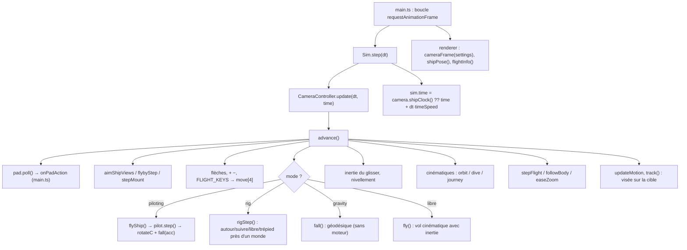
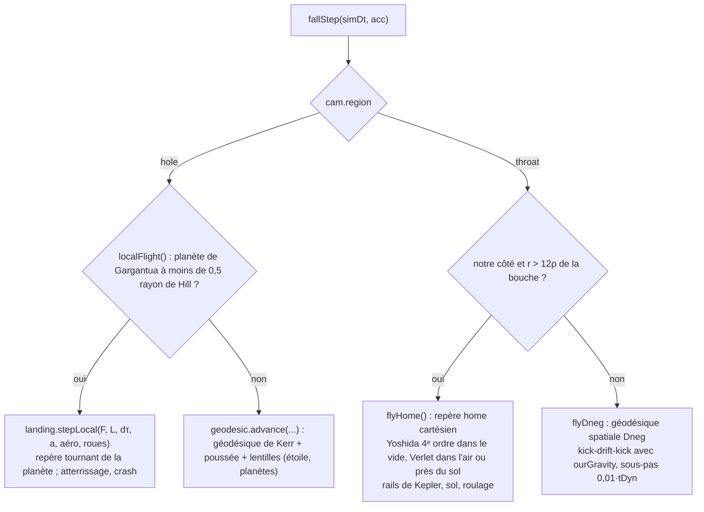

# Commandes, caméra et vaisseaux

Ce système transforme les entrées du joueur (clavier, souris, manette, écran tactile) en mouvement de la caméra et des vaisseaux. Il pose la caméra du traceur de rayons (position, orientation et vitesse dans les réglages `Settings`) et la déplace selon le mode actif : autour d'une cible, en vol libre, sur trépied, en chute libre géodésique, en cinématique, ou à bord d'un vaisseau (Ranger, Lander, Endurance). Quand on pilote, **l'état du vaisseau, c'est la pose de la caméra**. Il est intégré en float64 sur le CPU, dans le repère Kerr près de Gargantua, dans le repère local d'une planète ou dans le repère « home » de notre système solaire. Les engins qu'on ne pilote pas suivent une orbite de Kepler ou restent amarrés (`fleet.ts`). Le système gère aussi les contacts (sol, ISS, autres engins, amarrage), les limites de la distorsion temporelle et les surcouches télescope et verrouillage de cible.

Au cœur se trouve `CameraController` (`src/controls.ts`), que `Sim.step` (`src/sim.ts`) appelle à chaque image. Le rendu (`renderer.ts`, `ship.ts`) ne fait que lire le résultat : `cameraFrame(settings)` et `shipPose()`.

## Fichiers

| Fichier | Lignes | Rôle |
|---|---:|---|
| `src/controls.ts` + `src/controller/*` | 1188 + 6 500 | `CameraController` : entrées, modes de caméra, rig planétaire, intégration du vaisseau (chute libre Kerr, repère planète, repère home), pilotage, flotte, amarrage, contacts, distorsion « sur rails », plan de vol (nœuds), autopilotes (branchement), cinématiques. Exporte `FLIGHT_KEYS`, `TELE_MIN`, `isTyping`. **Depuis le 2026-10-02**, ses méthodes sont rangées par sujet dans `src/controller/` (installées sur son prototype) : les numéros de ligne `controls.ts:N` de cette fiche renvoient à l'ancien fichier ; voir la [fiche 11](11-ajouts-depuis-octobre.md#le-contrôleur-découpé). |
| `src/camera.ts` | 281 | Pose de la caméra ↔ `Settings` : `cameraFrame()` (région `hole`/`throat`, base ZAMO, vitesse β, γ), `basis`/`yawPitchRoll`, `setHolePose`/`setRepPose`/`setHomePose`, `switchAnchor`, `gpuTheta`. |
| `src/mounts.ts` | 93 | Points d'attache de la caméra sur le vaisseau (`MOUNTS`), `shipToCamera()` (matrice vaisseau → caméra, regard libre), `setMountVessel`. |
| `src/vessels.ts` | 224 | Catalogue `VESSELS` : masse, accélération, rayon de giration, agilité, centre de masse, ports d'amarrage, tuyères, points d'attache, aérodynamique. `dockedFrame()`. |
| `src/fleet.ts` | 340 | `Fleet` : l'engin piloté, les engins libres (Kepler + rotation propre), les liens d'amarrage (assemblages rigides), `massProps`, `fleetStart`. |
| `src/gamepad.ts` | 219 | `GamepadInput` (API Gamepad, mapping « standard », zones mortes) et repli WebHID pour les manettes Xbox 360 filaires sous Chromium/macOS. |
| `src/system/collide.ts` | 201 | `TriBVH` (BVH de triangles, segment × triangles, sommets proches), `samplePoints`, coques `vesselHulls`, `cockpitHull` et `stationHulls`, que `ship.ts` et `station.ts` remplissent. |
| `src/ui/touchflight.ts` | 153 | Commandes tactiles de vol : manche (tangage/lacet), manette des gaz, boutons de roulis. |
| `src/ui/telescope.ts` | 129 | Surcouche télescope : réticule, échelle angulaire, focale équivalente en 35 mm, disque de la cible. |
| `src/ui/targethud.ts` | 180 | HUD de verrouillage (façon Outer Wilds) : anneau, distance, vitesse de rapprochement, vitesse relative, point d'approche minimale ou impact. |

Ces fichiers sont branchés dans `src/main.ts` (raccourcis, `pilotKey`, `onPadAction`, `TouchFlight`, `lockDraw`, `telescopeView`) et dans `src/sim.ts` (horloge, `applyRender`).

## Fonctionnement

### 1. Vue d'ensemble d'une image

Points clés :

- `update()` se contente de déléguer à `advance()`. Avec `scripted = true` (une vidéo pilote la scène depuis `sim.ts`), les jeux de touches sont vidés le temps de l'appel : seules les cinématiques avancent. `enabled = false` coupe tout, par exemple pendant un rendu hors ligne (`renderdialog`).
- `advance()` renvoie `true` si la pose a changé. La comparaison se fait sur `poseKey()` : azimut, inclinaison, yaw/pitch/roll, distance, fov, `whL`, ancre, `motion`, `velP`. Sur cette base, le rendu décide de relancer ou non l'accumulation.
- **L'horloge de la scène suit le vaisseau.** Pendant l'intégration, `fall()` note dans `shipTime` le temps coordonné réellement atteint. `Sim.step` reprend `shipClock()` à la place de `time + dt·timeSpeed`, si bien que les corps sont dessinés là où l'intégrateur les avait, même quand un autopilote a changé la distorsion au cours de l'image (`controls.ts:594`).
- Budget de sous-pas : `subCap = 400 × clamp(dt·60, 1, 6)`. Il est calculé par seconde d'image et non par image, pour que la distorsion temporelle ne dépende pas du nombre d'images par seconde. Un à-coup de plus de 0,1 s n'est pas rattrapé.

### 2. Les entrées

#### Clavier

- Le constructeur écoute `keydown`/`keyup` sur `window` et remplit deux ensembles : `keys` (`e.key`, utilisé pour les flèches, `+ − = _`) et `codes` (`e.code`, la **position physique**). Les frappes dans un champ de saisie (`isTyping`) ou avec Cmd/Ctrl sont ignorées. `blur` vide les deux ensembles pour qu'aucune touche ne reste bloquée.
- `FLIGHT_KEYS` (`controls.ts:71`) associe chaque code physique à `[avant, droite, haut, roulis]` : `KeyW/S` avance/recul, `KeyA/D` gauche/droite, `KeyE/Q` haut/bas, `KeyZ/X` roulis gauche/droite. Sur un clavier AZERTY, cela donne Z Q S D / A E / W X. Ces touches sont **réservées au vol** : `main.ts:1132` et `ui/panel.ts:1073` les écartent de tout autre raccourci.
- Hors pilotage, les **flèches** tournent autour de la cible (`orbitBy`, 60°/s) ou font pivoter la vue (`rotateView`). Les touches `+`/`−` (et ▲▼ sur la croix de la manette) règlent la distance, ou la focale quand le télescope est actif.
- En **pilotage**, `pilotInput()` (`controls.ts:2508`) reprend la disposition de KSP, toujours par position physique : W/S tangage (S cabre), A/D lacet, Q/E roulis, I/K translation bas/haut, J/L gauche/droite, H/N avant/arrière, Maj/flèche ▲ pour augmenter les gaz, Alt/flèche ▼ pour les réduire (Ctrl est évité parce que Ctrl+W ferme l'onglet). En vue extérieure libre et dans la cabine, ces mêmes touches déplacent la caméra et le vaisseau garde son vol (`pilotInput` renvoie alors des zéros). Les autres touches de pilotage (1–7 maintiens, 8–0/G/U autopilotes, Z plein gaz, X coupure, T SAS, B amarrage, F loi de vol, [ ] engin suivant, etc.) sont gérées par `pilotKey()` dans `main.ts:964`, pas par le contrôleur.
- Le modificateur « rapide » est Maj (ou L3 sur la manette). Son facteur dépend du mode : ×3 en vol cinématique, ×5 sur la poussée en chute libre, ×5 en caméra extérieure libre, ×3 pour le rig, 3 m/s au lieu de 1,1 dans la cabine.

#### Souris et tactile (Pointer Events sur le canvas)

- `onDown` capture le pointeur et mémorise s'il s'agit d'un « glisser-regard » (bouton droit ou Maj). Un **clic du milieu** passe en `flyMode`, c'est-à-dire en pointer lock façon FPS : la souris tourne la caméra (`0,12°/px × min(1, fov/60)`) et la molette règle `flySpeed` (0,05 à 30). Échap quitte ce mode.
- `dragBy()` (`controls.ts:1154`) interprète le glisser selon le contexte, dans cet ordre de priorité :
  1. Rig autour d'un monde : azimut et élévation du rig (0,25°/px).
  2. Rig sur trépied avec `lookAt` : décalage de visée (`yawOff`/`pitchOff`).
  3. Vue extérieure `around` : yaw/pitch autour du vaisseau (0,3°/px).
  4. Vue extérieure `free` : orientation de la caméra, ou décalage `lookOff` si la vue est verrouillée.
  5. `flyby` : rien, la vue vise toute seule.
  6. Pilotage : regard libre sur le point d'attache (`setLook`, limité à ±170° et ±85°), ou `lookOff` si verrouillé.
  7. Rotation `free` : regard, et roulis au glisser droit.
  8. Sinon, en orbite : `orbitBy`, avec une inertie lissée plafonnée à 120°/s.
- Inertie : les vitesses `vAz/vInc/vYaw/vPitch` décroissent en `exp(−4·dt)` et s'annulent sous 0,05°/s. Si le doigt est relâché plus de 80 ms après le dernier mouvement, il n'y a pas d'élan.
- Clic simple (moins de 5 px, moins de 400 ms) : d'abord l'ISS (`pickIss`, 60 m ou 14 px de tolérance), sinon `pickAt()`, qui lance un rayon tracé via `targeting.pick`. Le corps visé devient la cible. Le **double-clic** (ou deux tapes en moins de 320 ms à moins de 30 px, parce que le `dblclick` natif n'est pas fiable sur écran tactile) passe en orbite autour du corps et le cadre (`frameTarget`). Sur le ciel, il recentre la vue. En pilotage, il remet le regard droit devant.
- Au survol, un rayon est lancé au plus toutes les 70 ms (`hover`) pour afficher l'étiquette et changer le curseur.
- Deux doigts : l'écart agit comme la molette (`zoomStep(log(d0/d)/0,0015)`), le déplacement du point milieu comme un glisser droit. Il n'y a pas d'élan avec deux doigts.
- La **molette** (`zoomStep`) dépend du mode : focale du télescope ; `flySpeed` en `flyMode` ; altitude ou travelling du rig ; distance de la vue `around` (12 m à 20 km) ; focale (avec Alt, en chute libre ou en pilotage) ; travelling inertiel en rotation libre ; sinon `zoomBy` (distance logarithmique au trou, à la gorge ou à l'étoile).

#### Manette (`gamepad.ts`)

- `GamepadInput.poll()` est appelé une fois par image dans `advance()`. Il choisit le premier pad connecté, de préférence au mapping `standard`, en conservant l'index choisi. Il renvoie `move = [avant, droite, haut, roulis]` (même convention que `FLIGHT_KEYS`), `look` (stick droit), `zoom` (croix ▲▼ maintenue), `fast` (L3) et `actions`, des fronts montants transmis à `onPadAction` dans `main.ts:1029`.
- Zone morte radiale de 0,14 renormalisée, avec une courbe `|v|^1,6` pour plus de finesse au centre. Zone morte de 0,06 sur les gâchettes.
- En pilotage, `pilotInput` réinterprète le stick gauche (avant → tangage piqué, côté → lacet), LB/RB pour le roulis et RT/LT pour les gaz. `onPadAction` réaffecte A/B/X/Y (SAS, coupure moteur, prograde, rétrograde), R3 (regard droit devant) et ▲▼ (point d'attache). L'en-tête de `gamepad.ts` ne décrit que l'usage caméra libre.
- `HidPads`/`HidPad` : sous Chromium/macOS, une manette Xbox 360 filaire (045E:028E/028F) n'apparaît jamais dans l'API Gamepad. Elle est alors ouverte en WebHID (`request()` doit être déclenché par un clic) et ses rapports de 20 octets sont décodés en un objet qui ressemble à un `Gamepad` standard (axes Y inversés pour respecter la convention « +Y vers le bas »).
- `rumble()` produit une vibration `dual-rumble`, par exemple au passage de la gorge ou au changement de cible.

#### Tactile de vol (`ui/touchflight.ts`)

- `TouchFlight` affiche un manche en bas à gauche, une manette des gaz et deux boutons de roulis en bas à droite. Il n'est visible que si l'on pilote sur un écran à pointeur grossier, hors vue extérieure libre et hors planificateur (`main.ts:1631`).
- Le manche écrit dans `camera.touchInput` (`pitch` = tirer vers soi pour cabrer, `yaw`), avec une zone morte de 0,08 et une courbe `|v|^1,6`. `pilotInput` additionne ces valeurs au clavier. La manette des gaz écrit directement `pilot.throttle` ; ses extrémités s'aimantent à 0 et 1, et la toucher coupe l'autopilote en cours (`main.ts:822`).

### 3. La pose de la caméra : `camera.ts` et les réglages

La pose **est stockée dans `Settings`**, c'est-à-dire sauvegardée et réglable depuis le panneau :

- `anchor = "hole"` : `distance`, `inclination`, `azimuth` sont des coordonnées Boyer–Lindquist (r, θ, φ) autour du trou.
- `anchor = "wormhole"` : `whL` vaut ℓ (ℓ < 0 de notre côté), et `inclination`/`azimuth` donnent la direction n̂ dans le repère du côté de la bouche.
- `yaw/pitch/roll` : base de la caméra dans le repère orthonormé local (r̂, θ̂, φ̂). `basis(0, 0, 0)` regarde le centre (−r̂) avec l'axe de spin vers le haut.
- `motion` + `velR/velT/velP` : la vitesse de l'observateur relativement au ZAMO (ou au repère « rep » de la bouche), en unités de c.

`cameraFrame(s)` (`camera.ts:160`) reconstruit à partir de ces champs un `CameraFrame` : région (`hole` = Kerr, `throat` = intérieur de la sphère de recollement de la métrique Dneg), (r, θ, φ) ou (ℓ, n̂), base `right/up/fwd`, `zamo` (α, ω, ϖ…), β, γ et vitesse. Le traceur et toutes les fonctions du contrôleur partent de là. Quelques détails :

- `safeTheta` évite l'axe (0,2° à 179,8°). `gpuTheta` décale de 2·10⁻⁷ rad la caméra *du traceur* si elle se trouve exactement dans le plan équatorial, à cause des croisements du disque mince en float32, mais la pose physique n'est pas modifiée.
- `withMotion` plafonne la vitesse à 0,9999 c. Les mouvements `orbit` (Kepler prograde) et `infall` (pluie, γ = 1/α) sont analytiques.
- Les écritures inverses `setHolePose(X, fwd, up, vel)`, `setRepPose(p)` et `setHomePose(X, fwd, up, vel)` repassent par `yawPitchRoll`. **Chaque pas d'intégration fait l'aller-retour** cartésien ↔ réglages sphériques. Le contrôleur prend donc soin de ne pas réécrire une pose identique : sinon les derniers bits changeraient à chaque image et une image en pause ne convergerait jamais (`written`, `rig.stamp`, `moved > 1e-7`).
- `switchAnchor` change ce autour de quoi la caméra orbite sans la déplacer. C'est impossible vers le trou depuis notre côté.

**Repères et unités** :

| Côté | Repère | Longueurs | Vitesses | Temps |
|---|---|---|---|---|
| Gargantua (Kerr) | Boyer–Lindquist, base ZAMO, « carte plate » cartésienne `blToCartesian` | M = G·M_trou/c² = 1476,625 m × `massSolar` | c (β relative au ZAMO) | M (coordonné) ; la seconde vaut `Msec = 4,925490947·10⁻⁶ × massSolar` M |
| Planète de Gargantua | `PlanetFrame` de `landing.ts` (ξ local, tournant avec la planète) | M (et `F.mPerM`) | c | M |
| Notre univers | repère « home » : notre bouche à l'origine, cartésien | M de **1e8 M☉ fixe** : `M_METRES = 1,476625·10¹¹ m` | c | M (temps réel = 1/492,549 M/s) |
| Vaisseau | x à **gauche**, y en haut, z vers le nez ; mètres ; ventre à y ≈ 0 | m | m/s | s |
| Caméra | x à droite, y en haut, z en avant | m (décalage d'attache) | | |

`ourNav(cam)` (`controls.ts:4827`) passe de notre côté au repère home : X, V, corps de référence (la plus petite sphère d'influence), `toRep` pour convertir un vecteur home en composantes locales. C'est le pivot de tout le pilotage dans le système solaire.

### 4. Modes de caméra hors vaisseau

`settings.rotation` (`orbit | follow | free | tripod`) donne le **placement** de la caméra. `settings.lookAt` dit si la **visée** est verrouillée sur la cible, indépendamment du placement. À cela s'ajoutent `gravity` (vue « chute libre », sélectionnée par `View = "fall"` dans `ui/camerapanel.ts`), `flyMode` et les cinématiques. La touche V parcourt `VIEWS` = around → follow → free → tripod → fall (`main.ts:452`).

- **Visée (`track`)** : la caméra est orientée selon `aimFrame(direction apparente de la cible)` composé avec un décalage stocké sous forme de quaternion (`offset`). La direction apparente vient de `targeting.bodyLook` : lentille gravitationnelle, retard de la lumière, aberration. Elle est mise en cache (`aimCache`) sur une clé qui couvre la pose et la scène, et repart de la réponse précédente. Si l'utilisateur tourne la vue, le contrôleur le détecte parce que la chaîne `yaw,pitch,roll` diffère de `written`, et le nouveau décalage devient la référence. `startFocus` ramène ce décalage vers l'identité par un slerp en *smootherstep* `x³(6x² − 15x + 10)`, sur `0,45 + 0,55·angle/π` s. La visée est désactivée en pilotage, en `flyMode`, en plongée ou voyage, dans la gorge (`inThroat`), et quand le rig fait tourner la caméra autour d'une planète.
- **Autour (orbit)** : `orbitBy` modifie azimut et inclinaison. Le zoom est logarithmique (`easeZoom`, taux 10/s) vers `targetDistance`, borné à `[r_H + 0,05, 1000]` M ; pour la bouche, la borne est `|ℓ| ≥ a + 0,3ρ` et la zoom ne traverse jamais la gorge (il faut voler pour la franchir). `poseAllowed` refuse toute pose à moins de r_H + 0,3. Autour de l'étoile ou du barycentre, `followBody` conserve la position dans le repère tournant de l'étoile, ou au repos dans le repère du centre de masse. `updateMotion` impose alors la vitesse correspondante (`comoving` : v = ϖ(Ω★ − ω)/α ; `barycentric`), avec un lissage de 0,35 s.
- **Cadrer (`frameTarget`)** : la distance est choisie pour que le rayon angulaire couvre environ un sixième du champ. Le vol se fait sur un arc : slerp de la direction n0 → n1 et interpolation logarithmique de la distance, durée bornée entre 0,8 et 2,4 s (`stepFlight`). `clearDirection` incline n1 vers l'extérieur et au-dessus du disque pour que la ligne de visée ne passe ni près du trou ni à travers le disque.
- **Vol libre (`fly`)** : la vitesse cible vaut `0,8 × flySpeed` (×3 avec Maj) et la vitesse réelle la rejoint avec une constante de 0,12 s. La vitesse est **proportionnelle à la distance à l'objet le plus proche** : `min(r − r_H, 100, distance à la surface la plus proche)`, avec un minimum de 1 m. Près de la bouche, le déplacement suit une géodésique spatiale de la métrique Dneg (`flyDneg`), ce qui permet de traverser la gorge. Ailleurs, il suit une droite, et l'ancre est recalculée vers l'objet le plus proche. La portée est limitée à `MAX_RANGE = 1000` M.
- **Chute libre (`gravity`)** : voir §6. Les touches de vol produisent une poussée `s.thrust` (c²/M) selon les axes de la caméra, et l'orientation reste fixe par rapport aux étoiles lointaines, comme un gyroscope.
- **Rig planétaire (`rigStep`, `controls.ts:5159`)** : près d'une planète, d'une lune, de l'ISS ou d'un engin, les placements prennent un corps comme référence et la caméra adopte sa vitesse : l'image est celle d'un observateur co-mobile (Miller file à une demi-vitesse de la lumière).
  - *orbit* : azimut, élévation et altitude au-dessus de la surface. La molette fait varier l'altitude de façon logarithmique ; les touches agissent aussi.
  - *follow* : le décalage `off` par rapport au centre du corps est conservé, et les touches le modifient.
  - *free* : la caméra est portée par le corps le plus proche (dans un rayon de 40 de ses rayons ; elle bascule vers un autre corps s'il est 0,7 fois plus proche). Sous 2 % du rayon, elle se fixe au sol et tourne avec lui.
  - *tripod* : la caméra est fixée sur le corps (coordonnées body-fixed de notre côté, ξ du `PlanetFrame` sur Miller, Mann et Edmunds) et vise la cible, verticale locale en haut. Sans `lookAt`, la vue tourne avec le sol, comme en time-lapse.
  - Le sol sert de plancher : 1 m au-dessus du relief (`groundRelief`) quand il est connu. `standOn()` (⇧T) pose un trépied à 1,7 m au-dessus du relief.
  - Deux instants sont utilisés : `tNow`, où la caméra se trouve, et `t = tNow + dt·timeSpeed`, l'instant que l'image affichera. Placer la caméra à `tNow` faisait trembler le sol (30 km/s × une image de retard).
- **Cinématiques** :
  - `orbit` : dérive d'azimut à `cinematicSpeed` °/s.
  - `dive` (`stepDive`) : chute radiale exacte depuis le repos à l'infini (E = 1, L = Q = 0), en temps propre, avec `Σ dr/dτ = −√(2r(r² + a²))` et `Σ dφ/dτ = 2ar/Δ` (entraînement du référentiel), intégrées en RK2 avec un pas de `0,02(r − r_H)`. Elle s'arrête à r_H + 0,04 M, reste 2,5 s, puis restaure la pose.
  - `journey` (`stepJourney`) : traversée scriptée de la gorge, en phases 0–0,22 / 0,22–0,58 / 0,58–1, avec ℓ interpolé en `asinh(ℓ/ρ)`.
  - Les cinématiques n'avancent que si le temps tourne (`animate` ou `bulletTime`).
- **Télescope (`setTelescope`, touche Y)** : la vue est verrouillée sur la cible et le champ descend jusqu'à `TELE_MIN = 0,02°`, limite des rayons en float32, soit environ 10 ulp par pixel en 1080p. À l'activation, la cible occupe trois fois son diamètre apparent dans le champ. La molette agit alors sur la focale (`zoomLens`, lissage logarithmique à 12/s, plage de 0,02 à 20°). En sortie, le champ et le verrouillage précédents sont rétablis. La surcouche `ui/telescope.ts` affiche la focale équivalente `f = 12 mm / tan(fov/2)` (hauteur de 24 mm), le grossissement f/50 et une échelle choisie dans `SCALE_ARCSEC` (au plus 20 % de la demi-largeur).

### 5. À bord : points d'attache, vues, cabine

- **Principe central** : la position de la pose (dans les réglages) est le **centre du vaisseau** (origine du repère vaisseau), et son orientation est celle de la **caméra**. Le vaisseau est obtenu à partir de la caméra par la matrice `S` de `shipToCamera(mount, lookYaw, lookPitch)` (`mounts.ts:69`) : les lignes de `S` sont les axes de la caméra exprimés dans le repère vaisseau, et `t = −S·eye` est le centre du vaisseau vu depuis l'œil. Le rendu dessine le vaisseau à `shipPose()` (`renderer.shipPose`, `ship.ts:728`). La base (droite, haut, avant) est **gauche** dans un repère droit, comme celle du traceur. Si la vue est alignée sur l'axe y du vaisseau (caméra de trappe du Lander), le nez apparaît en haut de l'image.
- Quand la caméra change de point d'attache, **le vaisseau ne doit pas tourner**. `reorient(S0, S1)` fait donc tourner la caméra exactement de la rotation qui conserve l'attitude du vaisseau. `stepMount` interpole l'œil et le point visé entre deux attaches en 0,6 s (smoothstep). `setLook` fait de même pour le regard libre.
- `MOUNTS` (`mounts.ts:10`) contient 13 entrées. Les attaches sur la coque (cockpit, cabin, quarter, chase, dorsal, wing, belly, rear, dock) ont des positions propres à chaque engin (`VESSELS[id].mounts`, lues par `mountPose`). Les quatre vues extérieures sont dynamiques :
  - `around` : yaw, pitch et distance autour de `VESSELS[id].centre`. Avec `lookAt`, la caméra se place derrière le vaisseau, sur la ligne de la cible.
  - `free` : œil libre dans le repère vaisseau, à au plus 50 km, à une vitesse de `max(5, 0,2·|œil|)` m/s.
  - `flyby` (`flybyStep`) : la caméra reste fixe dans le repère du corps de référence (`refBeta`) et attend le vaisseau plus loin, à une distance `D = clamp(3,5·v, 60, 2500)` m, sur le côté et au-dessus de la trajectoire. Si la distorsion est trop forte pour cela, elle se replace derrière.
  - `station` : caméra du port visé, 40 cm devant l'anneau, le long de l'axe du port (`stationCam`), d'après la géométrie d'amarrage de l'image précédente.
- **Cabine** (`moveCabin`) : les touches déplacent l'œil dans la cabine du Ranger à 1,1 m/s (3 avec Maj), avec un lissage de 0,12 s. L'œil est une sphère de 15 cm qui glisse sur les triangles de `cockpitHull` (jusqu'à trois rebonds par image) et reste dans la boîte de la cabine. Les flèches orientent le regard.
- `resetShipView()` (⇧R) supprime le verrouillage, remet les vues extérieures à leur place et revient au dernier point d'attache sur la coque (`hullMount`). `settleMount()` place directement la caméra sur l'attache lors de l'application d'une scène, sans transition.
- `setPilot(on)` est appelé quand `settings.ship` change. Il active `gravity` et met `rotation` à `free`, remet le pilote à zéro, et place le vaisseau en orbite circulaire prograde s'il est immobile près du trou (au-delà de l'ISCO). En descendant (`stepOffMount`), la caméra se retrouve là où était son œil, et non au centre du vaisseau, qui pourrait être à des kilomètres en vue extérieure. Le vaisseau quitté passe en roue libre (`fleet.setFree`).

### 6. Intégration de l'état (CPU, float64)

`fall(simDt, keys, fast, acc?)` reçoit un pas de **temps coordonné** `simDt = timeSpeed·dt`, et éventuellement l'accélération propre `acc` calculée par le pilote (en composantes locales, c²/M). Il oriente ensuite vers l'un de quatre intégrateurs :

- **Kerr** : `fromZamo → advance(st, a, simDt, 0,05, accel, dir, lenses) → toZamo`. L'attitude conserve ses composantes cartésiennes sur la carte plate (`w0(cam.fwd)`). Le temps propre est cumulé dans `properTime`.
- **Repère planète** (Miller, Mann, Edmunds) : on y entre sous 0,5 rayon de Hill et on en sort au-delà de 0,6 (hystérésis contre le clignotement). `local.key` détecte une pose modifiée de l'extérieur et force alors une réinitialisation. L'attitude conserve ses composantes ZAMO, si bien que le vaisseau tourne avec la planète. Au toucher, `levelShip` pose le vaisseau sur le ventre.
- **Notre côté, loin de la bouche (`flyHome`)** :
  - Le pas vaut `0,025·tDyn` dans le vide et `0,01·tDyn` dans l'air. Près du sol, il est limité à 10 % du temps nécessaire pour l'atteindre ; dans l'air, à 5 % du temps de freinage aérodynamique (`aAir`).
  - **Rails** : moteur coupé, orbite stable (`stableOrbit` : liée, périapside au-dessus du sol et de 30 hauteurs d'échelle d'atmosphère, apoapside inférieure à 0,25 de la sphère d'influence) et pas supérieur à 2 % de la période. Dans ce cas, propagation de Kepler exacte (`keplerProp`) emportée avec le corps, comme la distorsion de KSP.
  - **Au sol** (`ourLanded`, coordonnées body-fixed) : le vaisseau est emporté par la rotation du corps. Il décolle si la poussée verticale dépasse le poids, ou commence à rouler si la poussée horizontale dépasse 2 % du poids.
  - **Roulage** (`rolling`) : maintenu au sol ; frottement de roulement 0,015, freinage 0,3 moteur au ralenti, adhérence latérale 0,6. Arrêt sous 5 cm/s.
  - **Toucher** : sur les roues si le vaisseau est à moins de 25° de l'horizontale, à une vitesse horizontale entre 0,5 et 220 m/s, et à une vitesse verticale au plus égale à `TUNING.crashSpeed` (12 m/s par défaut). Sinon il se pose ou s'écrase (`crashed`, si `damage` est actif).
  - La vitesse est plafonnée à 0,999 c.
- **Près de la bouche** : mouvement géodésique à vitesse constante. La poussée modifie γβ, selon `U = γv + a·dt` puis `v = U/√(1 + U²)`. De notre côté, la gravité newtonienne du système solaire (`ourGravity`) s'ajoute en *kick-drift-kick*, avec des sous-pas de 0,01·tDyn bornés par `subCap`. Si la distorsion dépasse ce que les sous-pas peuvent couvrir, l'horloge du vaisseau prend du retard sur la demande, et `shipClock` l'impose à la scène.
- **Docké à la station** (`flyDocked`) : aucune intégration ; la pose est recopiée depuis `fleet.pose(active, t1, true)`, portée par l'ISS.

### 7. Une image de pilotage : `flyShip()` (`controls.ts:2540`)

L'ordre a de l'importance :

1. Si le temps est en pause, on sort : le vaisseau ne bouge pas.
2. On annonce un éventuel passage de la gorge et, à la sortie d'une traversée en distorsion, on revient au temps réel.
3. Si `s.vessel` a changé, `switchVessel()` est appelé.
4. Lecture de `pilotInput()`.
5. Si le vaisseau est docké : une poussée ou une translation déclenche `undock()`, sinon `flyDocked()` et retour.
6. Gestion de la distorsion : `rails()` (§9), exécution d'un nœud (`nodeBurn`), restitution de la distorsion choisie par le pilote à la fin d'un autopilote.
7. **Agilité d'un assemblage** : `ag = agility × I_propre / I_assemblage`. `TUNING.turnAccel` est multiplié par `ag` et `TUNING.turnRate` par `min(1, 1,4·√ag)`, *temporairement* : ce sont des globales, restaurées après `pilot.step`.
8. Dans l'air : distorsion plafonnée à ×4 (`AIR_WARP`), et le pilote travaille sur l'horloge du vaisseau (`dtPilot`).
9. Contextes : loi de vol en atmosphère (`airCtx`), commandes du calculateur de vol « SF » (`sfWant`), attitude imposée par l'autopilote de rentrée (`entryStep`) ou des combustions (`burnsStep`), vitesse visée par les autres autopilotes (`autopilotWant`).
10. `out = pilot.step(ctx, inp)` (`pilot.ts`), puis `rotateC(out.rot)`. Au sol, `groundAttitude` garde les ailes à plat et le nez entre −3° et +15°. Un assemblage tourne autour de son centre de masse (`turnAboutCom`).
11. Configuration aérodynamique (aérofreins, train), `fall(simDt, 0, false, out.acc)`, contacts (`stationContact`), puis `airAfter` (échauffement, facteur de charge, moment aérodynamique appliqué à `pilot.omega`).
12. Comptabilité : `spent` (rapidité consommée, pour la jauge de carburant), Δv fourni au nœud ou à la combustion en cours, `dockCheck()` et `measureSpin()`.

`thrustMax()` = `engineThrust(s) × accel_engin × masse_engin / masse_assemblage`. Il vaut 0 si le réservoir est vide (`tank`, quand `fuel` est actif).

Convention : `pilot.omega` est exprimé **dans le sens inverse de la règle de la main droite**. `spinPhysical()` en change le signe pour l'aérodynamique et la flotte (`controls.ts:3343`).

### 8. La flotte (`fleet.ts`, `vessels.ts`)

- Un seul engin est piloté (`fleet.active`). Sa pose est **lue** auprès du contrôleur à travers le crochet `fleet.activePose = () => controller.activePoseNow()`, branché dans le constructeur. Les autres engins sont :
  - **libres** (`free[id]: FreeState`) : centre de masse de l'assemblage sur une orbite de Kepler à deux corps autour de `ref`, qui vaut `"earth"` à moins de 1,5·10⁹ m de la Terre et `"sun"` sinon. La rotation est uniforme (`w` constant, moment d'inertie scalaire) et appliquée par Rodrigues (`coast`).
  - **amarrés** (`links: DockLink[]`) : le repère de b dans celui de a, en mètres et en axes. Les assemblages sont des composantes connexes (`assembly`, en largeur). `pose(id, t)` choisit une **racine**, par ordre de priorité : l'engin piloté, puis la station, puis le premier engin libre de l'assemblage. Elle parcourt ensuite les liens (`posesFrom`), en inversant la transformation pour un lien parcouru à rebours (`Rᵀ`, `−Rᵀc`), et ajoute `ω × r` à la vitesse des pièces quand la racine tourne (l'ISS fait un tour par orbite).
- `massProps(root)` renvoie la masse, le centre de masse et l'inertie scalaire `Σ m(k² + d²)` dans le repère de la racine. Ces valeurs alimentent l'agilité, la poussée par unité de masse et le partage des impulsions.
- `fleetStart(t, active)` : l'Endurance sur une orbite circulaire à 800 km, 40° derrière l'ISS ; le Lander à 500 km, 25° devant, dans le plan de l'ISS ; le Ranger, s'il n'est pas piloté, amarré au port avant de l'Endurance (`dockedFrame`).
- `switchVessel(id)` n'est possible que **de notre côté** (`ourNav`). L'ancien engin passe en roue libre (sauf s'il reste porté par le nouvel assemblage ou par la station), en gardant le spin mesuré par `measureSpin`, c'est-à-dire la rotation entre les axes de deux pas successifs, lissée avec k = 0,3. La caméra passe sur le même type d'attache du nouvel engin, et la loi de vol devient `plane` pour le Ranger, `rocket` pour les autres.
- `dockedFrame(guest, host, up)` : rotation qui amène l'axe du port invité sur l'opposé de l'axe du port hôte, avec un roulis aussi proche que possible de `up`, et anneau sur anneau.

### 9. Distorsion temporelle et ses limites

`timeSpeed` s'exprime en M par seconde réelle. Le temps réel vaut `1/Msec`. Plusieurs mécanismes la plafonnent, et le joueur ne la fixe pas toujours lui-même :

- **Rails** (`rails` + `railsLimit`, `controls.ts:4145`) : actifs dès que la demande dépasse 500 M/s, ou à tout moment dans un système (`system ≠ none`). La distorsion est réduite à la plus petite des limites suivantes, et le souhait du pilote est conservé dans `warpWant` puis rétabli quand c'est possible :
  - de notre côté : une orbite de la sphère d'influence en au moins 2 s environ (sauf orbite stable sur rails) ; près du sol, une image ne parcourt pas plus d'un cinquième de la hauteur restante ;
  - ISS proche : ×100 ;
  - moteur allumé : 500 M/s (5000 avec le moteur Crew) ;
  - près de Gargantua : 1/100 d'orbite par image ;
  - approche d'une sphère de Hill ou de la bouche : au plus un tiers de l'écart par image, et quelques secondes avant l'entrée ;
  - à l'intérieur d'une sphère de Hill : une orbite en au moins 12 s (1,67 s pour l'étoile des scènes classiques) ;
  - repère planète : près du sol, et pendant l'atterrissage ou le décollage.
  - Le plancher est 0,25 M/s, sauf près du sol. `railsNote` indique au HUD la raison de la limitation.
- **Air** : ×4 au plus (`AIR_WARP`, annoncé une fois par descente).
- **Amarrage** : ×10 au-delà de 150 m, ×5 au-delà de 40 m, ×2 au-delà de 4 m, puis temps réel (`dockWant`).
- **Nœuds** (`setNodeWarp`) : avec `autoWarp`, c'est l'autopilote qui fixe la distorsion. Sinon, le pilote choisit, mais jamais au-dessus de la valeur de l'autopilote. `nodeWarp` vaut `auto`, `manual` ou `held`.
- **Rentrée et calculateur de vol** : accélération de l'attente jusqu'à environ 25 s avant la combustion, puis temps réel pendant la combustion.

### 10. Contacts et état posé

- **Sol** : voir §6 (repère planète, `flyHome`). `landed`, `ourLanded` (`{body, q}` en coordonnées body-fixed, sauvegardé avec la partie) et `rolling` en décrivent l'état. `crashed()` ne fait quelque chose que si `settings.damage` est actif.
- **Maillages** (`stationContact`, `controls.ts:3689`) : sur le pas qui vient d'être volé, on prend la pose avant (`contactPose()`) et la pose après.
  1. Chaque point de coque (`hull.points`, échantillonnés tous les 0,5 m, tous les 2 m pour l'Endurance) parcourt un segment qui est testé contre la BVH de chaque pièce de l'obstacle, dans le repère propre de la pièce. Les panneaux de l'ISS tournent : on applique `partTransforms` aux instants t0 et t1.
  2. Dans l'autre sens, les sommets de l'obstacle proches de la sphère balayée parcourent un segment relatif à la coque, testé contre la BVH de la coque. Ce second test attrape un coin qui entre dans un panneau entre deux points.
  3. Au premier contact, le vaisseau est **ramené** au point de contact, 2 cm au-dessus de la surface. La composante normale de la vitesse relative est renvoyée avec un coefficient 0,3 (Δv = −1,3·vₙ), le glissement est amorti de 30 %, et le spin est annulé.
  4. Un engin libre heurté reçoit sa part de l'impulsion au prorata des masses. La station et les engins amarrés à elle n'en reçoivent pas.
  5. Si les anneaux sont alignés à moins de 1,5 m, il n'y a pas de test de contact : c'est la capture qui s'en charge.
- **Amarrage** (`dockCheck`) :
  - *Capture* : anneau à moins de 30 cm en avant du port (et pas plus de 60 cm derrière), à moins de 30 cm de l'axe, ports à moins de 10° l'un de l'autre, vitesse inférieure à 0,5 m/s, pas en phase d'éloignement. Un `DockLink` est créé, la quantité de mouvement est partagée, et le vaisseau est replacé à partir de la cible (pas de saut).
  - *Rebond* : trop rapide ou désaxé contre la face du port, le vaisseau repart avec un tiers de sa vitesse (renvoi de 1,3·v) et l'anneau est replacé sur la face.
  - `undock()` : poussée de ressort de 5 cm/s et pas de nouvelle capture tant que les anneaux sont à moins de 1 m. Les morceaux restants passent en roue libre.
- **TriBVH** (`system/collide.ts`) : découpage médian sur l'axe le plus long (sélection rapide partielle), 4 triangles par feuille. Les boîtes sont en `Float32Array`. Tests rayon-boîte par slabs et rayon-triangle de Möller–Trumbore, sur les deux faces. `verticesNear` renvoie les sommets des triangles dont la boîte coupe celle de la sphère : c'est un sur-ensemble.

### 11. HUD de verrouillage et de télescope

- `lockView()` (`controls.ts:513`) renvoie, pour l'ISS (si on a cliqué dessus) ou pour la cible : la direction dans le repère caméra, le rayon angulaire, la distance à la surface (au sommet le plus proche pour un engin ou pour l'ISS à moins de 1,5 km), la vitesse relative et la vitesse de rapprochement. Il calcule aussi l'approche en ligne droite : `t_ca = −p·u/|u|²`, et l'impact s'il existe, en résolvant `|p + u t| = R`.
- `drawLock()` (`ui/targethud.ts`) dessine un anneau de la taille apparente (au moins 18 px, au plus 0,34 H), le nom, la distance, la vitesse de rapprochement (▼ chaud ou ▲ froid), une flèche de vitesse latérale sur une échelle logarithmique `14 + 34·log10(1 + v/0,05)` px, ⊙ ou ⊗ pour la composante en profondeur, et IMPACT ou CLOSEST. Hors écran, une flèche est dessinée au bord, en tenant compte des bandeaux du HUD (`inset`). `lockKey()` sert de clé de mémoïsation : la surcouche n'est redessinée que si elle change (`main.ts:1717`).
- `lockDraw()` (`main.ts:1838`) fait disparaître le HUD après 1,6 s + 0,8 s d'inactivité (`camera.activity`). En pilotage, il reste toujours visible.

## Interfaces avec les autres systèmes

**Consomme**
- `targeting.ts` : `bodyLook`, `pick`, `pixelLook`, `aimFrame`/`slerp`, `bodyCentre`/`bodyVelocity`/`bodyMass`/`bodyHill`, `ourTarget`, `onOurSide`.
- `geodesic.ts` (`advance`, `fromZamo`, `toZamo`), `physics.ts` (ZAMO, horizon, ISCO), `wormhole.ts` (Dneg, `flyDneg`, conversions rep ↔ trou).
- `system/our-side.ts` (`homeOf`, `repToHomeVec`, `gravityHome`, `ourGravity`, `referenceBody`, `soiOf`), `system/our-surface.ts` (relief, vitesse du sol, `gearHeight`), `system/our-plan.ts` (`keplerProp`), `system/iss.ts` (`issTrack`, `issAxes`, articulations).
- `landing.ts` (repère planète), `aero.ts`/`flightair.ts` (`AirFlight`, `AIR_WARP`), `engine.ts` (poussée, réservoir), `game/tuning.ts` (`TUNING`).
- Pilote et autopilotes : `pilot.ts` (`FlightComputer.step`), `maneuver.ts`, `lowthrust.ts`, `entry.ts`, `fc/*`, `system/iss-plan.ts`, `system/our-predict.ts`, et le worker de planification `system/plan-client.ts` (`runPlanner` : `deorbit`, `guide`, `refine`, `predict`, `predictPlan`, `kerrPath`, `orbit`, `transfer`).

**Expose** (méthodes publiques de `CameraController`, utilisées par `main.ts`, `sim.ts`, `mission.ts`, `game/tools.ts`, `ui/*`)
- Caméra : `update`, `sync`, `resetView`, `setRotation`, `setLookAt`, `setTelescope`, `zoomLens`, `setFov`, `stopZoom`, `setCinematic`, `setFlyMode`, `setGravity`, `rotateView`, `selectTarget`, `cycleTarget`, `availableTargets`, `pickAt`, `targetInfo`, `lockView`, `standOn`, `rigStatus`, `shipClock`.
- Vaisseau : `setPilot` (indirectement, via `settings.ship`), `shipPose`, `outsideView`, `setLook`, `resetShipView`, `cycleMount`, `settleMount`, `flyFrom`, `placeShipRep`, `placeNearPort`, `switchVessel`, `cycleVessel`, `undock`, `docked`, `setOurLanded`, `ourLandedOn`, `thrustMax`, `refuel`, `flightModeNow`.
- Plan et calculateur de vol : `planTransfer`, `planOurs`, `planAlign`, `addNode`, `nudgeNode`, `deleteNode`, `clearPlan`, `refreshPlan`, `fcContext`, `fcSetPlan`, `fcExecute`, `fcClear`, `fcPlan`, `fcBudget`, `planLowThrust`.
- Affichage : `flightInfo()` (navball, orbite, surface, air, rentrée, plan, amarrage, masse) et `predictPath()` (trajectoire libre future, calculée dans le worker).
- Champs : `pilot`, `pad`, `touchInput`, `airFlight`, `plan`, `dockInfo`, `dockAuto`, `entrySite`, `airBrake`, `speedMode`, `hover`, `activity`, `path`, `ourPlan`, `rig`, `local`, `landed`, `properTime`, `gravity`, `flyMode`, `flySpeed`, `scripted`, `bulletTime`, `enabled`.
- Rappels : `onPilotMessage(text)`, `onAirEntry()`, `onCraftLost(why)`, `onPadAction(a)`. Le troisième argument du constructeur (`onCinematicChange`) sert à rafraîchir l'interface.
- `fleet.activePose` (crochet installé par le contrôleur), `fleet` et `fleetStart` (appelés par `main.ts:359` au chargement d'une scène).
- Automatisation : `__bh` (`main.ts`) donne accès à `settings`, `touch`, `render` et `video`. Pour piloter les entrées depuis un script, il faut passer par `camera` dans `main.ts`. `scripted`/`bulletTime` servent aux vidéos (`sim.ts`).

## Réglages

Champs de `src/settings.ts`, exposés pour la plupart dans `src/ui/schema.ts` :

| Clé | Rôle ici |
|---|---|
| `distance`, `inclination`, `azimuth`, `yaw`, `pitch`, `roll`, `anchor`, `whL` | **La pose** (écrite par le contrôleur à chaque image en mouvement). |
| `motion`, `velR/velT/velP`, `beta` | Vitesse de l'observateur ; `geodesic` en chute libre ou en pilotage, `comoving`/`barycentric` imposés par `updateMotion`. |
| `rotation` (`orbit/follow/free/tripod`), `lookAt`, `target` | Placement, verrouillage, cible. |
| `fov`, `telescope` | Champ (1 à 150°, jusqu'à 0,02° au télescope). |
| `thrust` | Poussée des touches en chute libre et du moteur Cinema [c²/M]. |
| `engine` (`cinema`/`crew`), `crewG`, `fuel`, `exhaust`, `massRatio` | Moteur et réservoir (`thrustMax`, `tank`). |
| `ship`, `vessel`, `shipMount`, `shipLookYaw`, `shipLookPitch` | Pilotage, engin, point d'attache, regard libre. |
| `timeSpeed`, `animate`, `autoWarp` | Distorsion (M/s), pause, distorsion automatique des manœuvres. |
| `turnRate`, `turnAccel`, `rcsFraction`, `crashSpeed` | Copiés dans `TUNING` par `game/tuning.ts`. |
| `flightMode` (`rocket/plane/sf`), `antigrav`, `damage` | Loi de vol en atmosphère, antigravité du calculateur SF, destruction. |
| `cinematicSpeed`, `journeyDuration` | Cinématiques orbite, plongée, voyage. |
| `massSolar` | Échelle physique (m, s) du côté Kerr. **Les scènes du système utilisent 1e8.** |
| `showGeodesic`, `pathInView` | Trajectoire future (calculée par `predictPath`). |

## Pièges et limites

- **La pose vit dans des coordonnées sphériques en degrés**, réécrites à chaque pas (`setHolePose`/`setHomePose`). Toute pose qui ne bouge pas doit être recopiée bit pour bit, sans réécriture, sinon l'image ne converge jamais (voir `written`, `rig.stamp`, `R.placed`, le seuil `moved > 1e-7` dans `track`, et `if (Math.hypot(...sub3(Y, X)) < 1e-9 …) return` dans `followBody`). C'est la source la plus fréquente de « l'image n'accumule plus ».
- **Précision float64 dans le repère home** : 1 M vaut 1,48·10¹¹ m, et près de la Terre (environ 1000 M de l'origine), la résolution de position est d'environ 1000 × 2,2·10⁻¹⁶ M, soit à peu près 3 cm. D'où le recul de 2 cm au contact, le test « en descente » au toucher (le train peut se retrouver à quelques millimètres sous le sol après l'aller-retour home ↔ rep), et la marge de 1 m avant une nouvelle capture. Le GPU travaille en float32 : `gpuTheta`, `TELE_MIN = 0,02°`, et le patch local du traceur pour les corps proches.
- **Le Ranger côté home suppose 1e8 M☉** : `M_METRES` est une constante, et plusieurs durées sont écrites en dur avec `492.5490947` (= `Msec` à 1e8), par exemple dans `dockWant` (`controls.ts:4050`), la limite ISS de `railsLimit` (`:4195`), `planOurs`/`planIss` et `addNode`. D'autres endroits utilisent `1476.625 × s.massSolar` ou `4.925490947e-6 × s.massSolar` (`stepOffMount`, `lockView`, `rigStep`). Tant que les scènes du système imposent `massSolar: 1e8`, c'est cohérent. Ce ne le serait plus si l'on changeait la masse dans une scène du système solaire.
- **`TUNING` est global et modifié temporairement** dans `flyShip` (agilité d'un assemblage), puis restauré après `pilot.step`, sans `try/finally`. Une exception dans le pilote laisserait les valeurs modifiées.
- **Signe de `pilot.omega`** : il est inversé par rapport à la main droite. Toujours passer par `spinPhysical()`.
- **Dépendances circulaires d'état** : `aimShipViews`, `flybyStep` et `stepMount` lisent la pose de l'image *précédente* (`lastPose`), parce que la vue extérieure verrouillée dépend de la visée, qui dépend elle-même de la pose.
- **Coût** : `cameraFrame(s)` est recalculé de nombreuses fois par image (il n'y a pas de cache). `lockView` parcourt tous les sommets de l'ISS à moins de 1,5 km, sans BVH. `stationContact` est en O(points de coque × profondeur de la BVH) par pièce. Les prédictions coûteuses (`kerrPath`, `predict`, guidage de rentrée, désorbitation, raffinement de nœuds) sont envoyées au worker de planification, avec des garde-fous `pending` et des cadences de 4 Hz, 3 Hz ou 1 Hz (voir `docs/PERFORMANCE.md`, `docs/perf/audit-plan.md`).
- **Approximations** :
  - Les engins libres sont propagés en Kepler à deux corps autour de la Terre ou du Soleil.
  - L'inertie est scalaire (sphère équivalente) et la rotation libre se fait sans couple.
  - Le vol libre est cinématique, sans gravité.
  - La plongée est radiale, avec θ figé.
  - Les contacts traitent des points et des sommets, pas des arêtes contre des arêtes (les points sont espacés de 0,5 m).
  - Le sol de notre côté est le relief (`groundRelief`) une fois les cartes chargées. Avant, c'est la sphère moyenne, et une scène chargée trop tôt se retrouve sous la montagne, ce que `flyHome` corrige ensuite.
- La plupart des interactions avec la flotte (changer d'engin, `placeNearPort`, amarrage, contacts) n'existent **que de notre côté** (`ourNav` non nul).
- `pickAt` et le survol lancent un vrai rayon tracé. Le survol est donc limité à une fois toutes les 70 ms et désactivé au toucher.

## Pour aller plus loin

- **Ajouter ou modifier une touche** : pour une commande de vol continue, ajouter le code dans `FLIGHT_KEYS` (caméra libre) ou dans `pilotInput()` (pilotage), puis l'ajouter à la liste des touches tenues de `pilotKey` (`main.ts:964`) pour bloquer le comportement par défaut du navigateur. Pour une action ponctuelle, l'ajouter dans `pilotKey` (en pilotage) ou dans le gestionnaire `keydown` de `main.ts`. Toujours utiliser `e.code` pour les touches de vol (AZERTY), et vérifier `ui/panel.ts:1073` (M).
- **Ajouter un point d'attache** : ajouter l'entrée dans `MOUNTS` (`mounts.ts`) et ses positions `eye/aim` dans `VesselDef.mounts` pour chaque engin (`vessels.ts`). Pour une vue extérieure dynamique, ajouter `outside: "<nom>"`, un cas dans `mountTarget()`, dans `dragBy()`/`zoomStep()` si besoin, et une icône dans `ui/camerapanel.ts`.
- **Ajouter un engin** : ajouter une entrée `VesselId` et `VESSELS` (masse, `gyr`, `agility`, `ports`, `jets`, `mounts`, `aero`), son maillage et sa coque dans `ship.ts` (`vesselHulls`), son placement dans `fleetStart`, puis vérifier `cycleVessel` (qui a sa propre liste d'identifiants) et le choix de `settings.vessel` dans `ui/schema.ts`.
- **Changer une limite de distorsion** : `railsLimit()` pour le vol libre, `AIR_WARP` (`flightair.ts`) pour l'atmosphère, `dockWant` pour l'amarrage, `nodeBurn`/`setNodeWarp` pour les manœuvres. Penser à `railsNote` pour que le HUD affiche la raison.
- **Modifier l'intégrateur** : point d'entrée unique `fallStep()`. Le pas et les rails de notre côté sont dans `flyHome` (`stepOf`, `stableOrbit`), le sol dans `landing.stepLocal` (Gargantua) et `our-surface.ts` (notre côté). Les tests à relancer sont `tests/flight-system.test.ts`, `landing.test.ts`, `fleet.test.ts`, `collide.test.ts`, `gamepad.test.ts` et `pilot.test.ts` (`bun test`).

Voir aussi `docs/MAP.md` (la carte 3D, qui consomme `flightInfo` et `ourPlan`), `docs/SOUND.md` (repères sonores du pilote), `docs/GAME-TOOLS.md` (outils de jeu, `flightInfo`), `README.md` (résumé de la physique : Kerr, ZAMO, Dneg).
