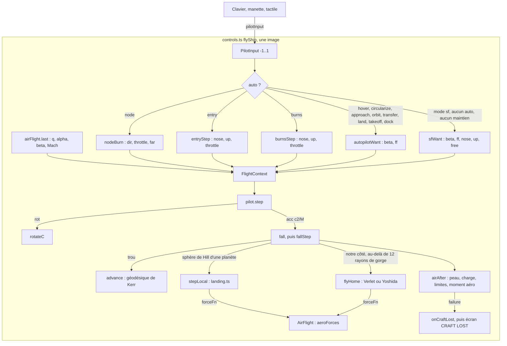
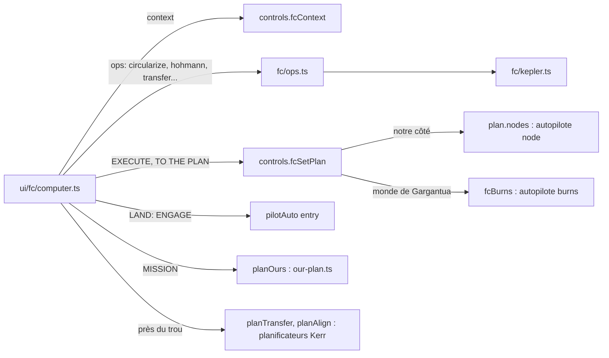

# Pilote, autopilotes, moteurs, atterrissage et atmosphère

Ce système transforme les commandes du joueur (clavier, manette, écran tactile) et les consignes des
autopilotes en deux grandeurs physiques par image : une **rotation** de la caméra, qui porte le vaisseau,
et une **accélération propre** (en c²/M). Les intégrateurs de vol de `src/controls.ts` les consomment :
géodésiques de Kerr, repère tournant des planètes de Gargantua, repère « home » newtonien de notre
système solaire. Le système couvre aussi le contact avec le sol (atterrissage, roulage, crash), l'air des
planètes (traînée, portance, échauffement, charge) et la rentrée guidée vers un site. Il comprend enfin
l'**ordinateur de bord** (« flight computer », FC) affiché par-dessus la carte plein écran (M), qui
planifie des manœuvres képlériennes et les fait exécuter.

> Statut git : au moment de la rédaction, tous les fichiers de ce périmètre sont **commités** (commits
> `a23d345`, `ef7f4ff` et `90b169b` pour la rentrée et le FC). Aucun n'apparaît dans `git status`. Le plan
> d'origine de la partie atmosphère et FC se trouve dans `docs/PLAN-ATMOSPHERE-ORDINATEUR.md`.

## Fichiers

| Fichier | Lignes | Rôle |
|---|---:|---|
| `src/pilot.ts` | 429 | `FlightComputer` (côté physique) : SAS, maintiens d'attitude, boucle en vitesse des autopilotes, loi « avion », mode SF, sortie `{rot, acc}` ; `circularSpeed` de Kerr |
| `src/engine.ts` | 36 | Moteurs Cinema et Crew (g → c²/M) ; réservoir de fusée relativiste (rapidité) |
| `src/lowthrust.ts` | 118 | Épicycles de Kerr (mouvement relatif linéarisé) et poussée de rendez-vous à énergie minimale (grammien) |
| `src/landing.ts` | 337 | Repère propre d'une planète de Gargantua : passage local ↔ global, forces, intégrateur RK4, contact sol et roulage |
| `src/aero.ts` | 389 | Atmosphères (US76, exponentielles), forces et moments aérodynamiques, flux de chaleur, températures de peau |
| `src/flightair.ts` | 149 | `AirFlight` : l'aéro appliquée au vaisseau piloté, échauffement, charge, limites, perte du vaisseau |
| `src/entry.ts` | 368 | Prédiction de rentrée (RK4), guidage en inclinaison (prédicteur-correcteur), planification de la désorbitation |
| `src/entry-env.ts` | 56 | Description sérialisable d'un repère de rentrée (`EnvDesc` → `EntryEnv`), pour le worker |
| `src/fc/kepler.ts` | 264 | Mécanique à deux corps en SI : éléments, propagation (variable universelle), Lambert, approche minimale, repère P/N/R |
| `src/fc/ops.ts` | 308 | Opérations du FC : circulariser, apoapside, périapside, Hohmann, inclinaison, plans, résonance, rendez-vous (porkchop), vitesses, correction fine |
| `src/ui/fc/computer.ts` | 561 | Interface du FC (onglets ORBIT, TARGET, LAND, MISSION ; analyse ; éditeur de plan ; porkchop) |
| `src/ui/fc/fc.css` | 77 | Styles du FC |
| `src/ui/craftlost.ts` | 59 | Écran « CRAFT LOST » (reprendre avant la rentrée, continuer sans dégâts, relancer la scène) |
| `src/system/earth-air.ts` | 36 | Transmission solaire de l'air terrestre, côté CPU, pour la mesure de lumière du rendu (pas de l'aéro) |
| `src/controls.ts` (parties) | ~2 500 sur 6 655 | `flyShip`, `fallStep`, `flyHome`, `autopilotWant`, `ourWant`, `ourSurfaceWant`, `surfaceWant`, `transferWant`, `nodeBurn`, `dockWant`, `dockCheck`, `entryStep`, `burnsStep`, `fc*`, `thrustMax` |
| `src/game/tuning.ts` | 25 | `TUNING` : réglages de pilotage recopiés depuis les settings à chaque image |
| `tests/aero.test.ts` | 141 | US76, finesse du Ranger, entrée hypersonique, peau, Lander, rentrée simulée |
| `tests/{entry,fc,pilot,landing,engine}.test.ts` | 79 à 127 | Rentrée et guidage, opérations du FC, attitude et SAS, repère planétaire, moteurs et épicycles |

## Fonctionnement

### 1. Repères et unités

- **Unités de la scène** : longueurs en M (masse du trou, G = c = 1), temps en M, accélérations en c²/M.
  Les conversions reviennent partout en dur : 1 M = `1476.625 × massSolar` m, 1 M de temps =
  `4.925490947e-6 × massSolar` s (`Msec`), c = 299 792 458 m/s. Le FC, l'aéro et la rentrée travaillent
  en **SI**.
- **Repère « local »** de `pilot.ts` : les composantes dans lesquelles la caméra donne ses vecteurs.
  Près du trou, c'est le repère ZAMO (r̂, θ̂, φ̂). Dans la gorge du trou de ver et de notre côté, ce sont
  les vecteurs « rep ». `FlightContext.right/up/fwd/beta` y sont exprimés.
- **Repère « C »** : les axes de la caméra (x droite, y haut, z avant). Les axes du vaisseau dans C sont
  les colonnes de `S` (`mounts.ts: shipToCamera`) : x à **gauche** du vaisseau, y haut, z le nez.
- **Signe des vitesses angulaires** : `pilot.omega` suit la convention du pilote (rotation positive
  autour de x = nez qui monte), opposée à la règle de la main droite. `spinPhysical()` renvoie
  `−omega` à l'aéro, et `airAfter` soustrait l'accélération angulaire aérodynamique.
- **Temps** : l'attitude tourne en secondes d'horloge murale (`dt`), sauf dans l'air, où elle tourne sur
  l'horloge du vaisseau (`dtPilot`). La translation se fait en temps de scène (`simDt = timeSpeed × dt`).
  Le temps propre est `dτ = α/γ` (ZAMO) ou `1/γ`.

### 2. Une image de pilotage : `CameraController.flyShip`



Étapes de `flyShip` (`src/controls.ts`, vers la ligne 2540) :

1. Pause (`!s.animate`) : rien ne bouge. Passage du trou de ver : message, et retour au temps réel après
   une traversée sous distorsion temporelle. Changement de vaisseau : `switchVessel`.
2. Si le vaisseau est amarré, une poussée provoque `undock()` ; sinon `flyDocked` le fait porter par la
   station.
3. Agilité de l'assemblage. `TUNING.turnAccel` et `TUNING.turnRate` sont **modifiés temporairement**
   (× `agility·m_propre/inertie`) puis restaurés après `pilot.step`.
4. Dans l'air (`airFlight.inAir`, q > 1 Pa), la distorsion temporelle est plafonnée à ×4 (`AIR_WARP`),
   et `dtPilot = dt × min(timeSpeed·Msec, 4)` : en ×4, l'attitude et l'air vont quatre fois plus vite que
   l'horloge murale.
5. Construction du contexte air (`airCtx`, si q > 20 Pa). L'autorité des gouvernes vaut
   `ctrl × q/1000`, plafonnée à 4 rad/s². `path` donne la rotation de la trajectoire et `gamma`/`bank`
   l'attitude au-dessus du sol.
6. Consigne de l'autopilote actif (voir §4), puis `pilot.step(...)` → `{rot, acc, burn}`.
7. Au sol en roulage, `groundAttitude` maintient les ailes à plat et un tangage entre −3° et +15°.
8. Configuration aéro : aérofrein automatique au roulage moteur coupé, train sorti au sol ou sous
   600 m et 160 m/s.
9. `fall(simDt, …, out.acc)` intègre la translation. `stationContact`, puis `airAfter` : peau, charge,
   limites, puis moment aérodynamique appliqué à `omega`.
10. `onAirEntry` se déclenche quand on entre dans l'air à plus de 1 000 m/s : `main.ts` prend alors un
    instantané « before the entry ».
11. Propergol : `w = |acc − free| × Δτ` (rapidité dépensée ; la part « antigravité » est gratuite). Elle
    s'ajoute à `spent`, au Δv livré au nœud en cours (`nodeDone`), à la combustion de désorbitation
    (`entryRun.done`) ou à la combustion du FC (`fcBurns[0].done`).
12. `dockCheck()` (capture ou rebond), puis `measureSpin()`.

### 3. `FlightComputer.step` (`src/pilot.ts`)

#### 3.1 Choix de la consigne (ordre de priorité)

| Condition | Comportement |
|---|---|
| `c.sf` et `auto === "none"` | Mode SF : boucle en vitesse sur `sf.beta`, poussée dans toutes les directions (moteur principal le long du nez, propulseurs pour le reste, `sf.free` ajouté gratuitement) ; attitude imposée `sf.nose`/`sf.up` |
| `auto` vaut `entry` ou `burns`, et `c.att` existe | Attitude imposée ; `throttle = att.throttle × rampe(cos 6° → cos 2°)` |
| `auto === "node"` et `c.burn` existe | Nez sur la direction de la combustion ; même rampe d'alignement ; si `far` et un maintien actif, le maintien garde le nez et le moteur reste coupé |
| `auto === "dock"` et `c.want` existe | Propulseurs **seuls**, plafonnés à `TUNING.rcs × thrust` ; attitude `dock.nose`/`dock.up` sur l'axe du port |
| autre `auto`, et `c.want` existe | Boucle en vitesse générique (ci-dessous) |
| `hold !== "none"` | Le nez vise la direction du maintien |

**Boucle en vitesse** (les autopilotes « want » et le mode SF). On travaille sur la 4-vitesse spatiale
`U = γβ` (`toU`, `toBeta`) :

```
T   = max(1.2 · tauRate, 1e-3)          // tauRate = timeSpeed · dτ/dt : réponse en ~1,2 s murale
err = (U_want − U) / T
A   = err + ff                           // ff : feed-forward (gravité, traînée, repère)
si |A| > thrust :
   si |ff| ≥ thrust : A = ff · thrust/|ff|
   sinon A = ff + k·err, où k ∈ [0, 1] résout |ff + k·err| = thrust
```

Le feed-forward passe **en premier** : une grosse erreur latérale n'affame jamais le maintien contre la
chute. Ensuite :
- si `|A| < 0.8 · rcsMax`, seuls les propulseurs de translation agissent (le nez peut rester sur un
  maintien) ;
- sinon le nez vise `A`. La manette des gaz suit `|A|/thrust`, multipliée par une rampe
  d'alignement `clamp((cos θ − 0.978)/(0.9986 − 0.978))`, soit pleine poussée à moins de 3° et nulle
  au-delà de 12°. Les propulseurs prennent le reste latéral, dans leur autorité.

#### 3.2 Attitude

- **Pointage** (maintien ou autopilote, sans commande manuelle) : la vitesse angulaire voulue vaut
  `min(turnRate, √(2·0.7·turnAccel·θ), 3θ)`. C'est une courbe de freinage loin de la cible (arrivée à
  l'arrêt) et une loi linéaire près d'elle (pas de vibration). Le roulis met le haut du vaisseau vers la
  normale orbitale (`levelUp`, option `rollAlign`, touche R), ou vers `upC` quand l'autopilote l'impose.
- **Manuel avec SAS** : la vitesse voulue vaut `stick × turnRate` ; manche relâché, elle revient à zéro.
  **Sans SAS** : le manche intègre une accélération et le vaisseau garde sa rotation.
- **Couple** : chaque axe change d'au plus `acc3·dt`, avec `acc3 = turnAccel + autorité des gouvernes`
  (gouvernes comptées en mode avion ou SF, et pendant la rentrée). `|omega|` est plafonnée à
  `1.5·turnRate`. Le mode précision (CapsLock) multiplie le manche par 0,25 et la manette par
  0,15/s au lieu de 0,6/s.
- **`snap`** (« attitude sur rails ») : quand une image dure plus de ~20 s de temps du vaisseau
  (moteur Crew près du trou, notre côté), ou pendant une combustion de nœud de notre côté, le nez est
  posé directement sur la cible. C'est cinématique, pas piloté.
- **`gimbal`** : pendant une combustion de nœud de notre côté, la poussée suit exactement la direction
  commandée et non le nez. Le commentaire du code le justifie : un nez en retard d'un milliradian sur
  un prograde qui tourne donne 3 m/s d'erreur sur une injection translunaire.

#### 3.3 Loi « avion » (`flightMode = "plane"`, q > 300 Pa, aucun maintien ni autopilote)

- Le manche commande des vitesses : 0,35 rad/s en tangage, 0,14 en lacet, 1,2 en roulis.
- Manche relâché, la loi maintient l'**angle de pente** γ (gains `1.2·Δγ − 1.5·γ̇`), annule le dérapage
  (`−2β` sur le lacet) et garde l'inclinaison (à plat sous 6°).
- Au-dessus de Mach 4, la loi maintient l'**incidence** plutôt que la pente, comme en rentrée.
- Protection de décrochage : sous `stall − 0,035 rad`, le tangage est rabattu.
- Au sol (`ground`), commande directe, sans maintien.

#### 3.4 Sorties

`rot` est un vecteur rotation dans C : `omega × dt`, ou l'alignement direct en mode `snap`. `acc`
contient le moteur (le long du nez, ou de `point` si `gimbal`) plus les propulseurs, ramenés en
composantes locales. `fired` décrit ce qui a tiré (gaz, RCS, côté, effort, force et couple
normalisés) ; le son le lit (voir `docs/SOUND.md`).

`circularSpeed(r, a, prograde, zamo)` donne la vitesse ZAMO d'une orbite circulaire équatoriale de
Kerr : `Ω = ±1/(r^{3/2} ± a)`, `v = ϖ(Ω − ω)/α`. Elle renvoie null si `|v| ≥ 1` (sous l'orbite des
photons).

### 4. Les autopilotes (`src/controls.ts`)

`autopilotWant` aiguille vers `ourWant` de notre côté (newtonien, repère home) ou vers la branche Kerr
près du trou. Les consignes sont toujours `{beta, ff}` en composantes locales.

| Auto (touche) | Près du trou (Kerr) | Notre côté (newtonien) |
|---|---|---|
| `hover` (8) | Reste à l'ancre (`P.anchor`) : vitesse d'un observateur statique `−ωϖ/α`, rappel `k = min(1/4T, 0,08/d)`, `ff = −chute libre` | Reste au repos par rapport au corps de référence (ou à la bouche), `ff = −g` |
| `circularize` (9) | `circularWant` : la formule équatoriale sert de première estimation, puis deux sondes de `freeFallAccel` annulent l'accélération radiale (a_r est linéaire en v²) | Cercle autour du corps de la sphère d'influence, au rayon courant ; rappel radial doux |
| `approach` (0) | Vers un point de distance de sécurité (3 R, 4 R_étoile, 1,3 r_glue) ; vitesse plafonnée par un freinage à mi-poussée et par la poussée de Coriolis `thr/(4Ω)` | « Brachistochrone » à 60 % de la poussée, plafond 0,2 c (Crew) ou 0,5 c ; distorsion pour une arrivée en ~8 s ; ne plonge jamais dans une planète ; à l'arrivée, passe en `orbit` ou `hover` |
| `orbit` | Orbite circulaire autour du corps ciblé, rayon fixé à l'engagement (entre 1,03 R et 0,3 rayon de Hill) ; approche préalable vers un point latéral si d > 2 d₀ | Orbite basse (1,1 R + 12 H d'air) |
| `node` | `nodeBurn` : distorsion vers le nœud, combustion **centrée** sur le nœud (`start = t_node − burnT/2`), arrêt au Δv livré ; le moteur Crew suit le repère orbital | Pareil, plus le re-visé des nœuds de mission (`ourRefineTick`, `issRefineTick`), la fin de combustion ralentie au cm/s près, et un maintien prograde automatique en croisière |
| `transfer` | Transfert à faible poussée (machine à états, ci-dessous) | (non) |
| `land` (G) | `surfaceWant` dans le repère planétaire | `ourSurfaceWant` |
| `takeoff` (U) | Montée puis virage vers l'est jusqu'à 0,3 rayon de Hill (≥ 1,2 R), puis `orbit` | Virage gravitationnel jusqu'à l'orbite basse, puis `circularize` |
| `dock` (B) | (non) | `dockWant` : propulseurs seuls, couloir conique, attente à 10 m, contournement de la cible |
| `entry` (⇧G) | `entryStep` (les deux univers) | idem |
| `burns` | `burnsStep` : combustions du FC autour d'un monde de Gargantua | (de notre côté, le FC passe par `node`) |

Échap coupe la mission, le maintien et l'autopilote. Les maintiens d'attitude sont sur 1 à 7
(prograde, rétrograde, radial sortant, radial entrant, normal, antinormal, cible). T bascule le SAS,
Z met plein gaz et X coupe les gaz. `setHold` et `setAuto` sont des **bascules** : rappeler la même
valeur la coupe. Beaucoup de code s'appuie là-dessus (`P.setAuto(P.auto)` pour arrêter).

**Atterrissage** (deux univers). La vitesse horizontale par rapport au sol est annulée. La vitesse
verticale voulue vaut `−max(min(√(2·0.5·(thr−g)·h), h/(durée), 0.02 c), 1.5 m/s)` : ce que la moitié de
la marge sur le poids peut arrêter, et au moins 1,5 m/s au contact. Le feed-forward tient le poids et la
traînée. L'autopilote refuse si `thr < 1.05·g`. Notre côté : la correction de la descente passe par le
feed-forward, l'erreur horizontale prend la poussée restante.

**Décollage** (notre côté, `ourSurfaceWant`). On monte jusqu'à `d₀ = R + max(18 H, 0.03 R)`. La vitesse
est que l'est inertiel vaut `v_c·√f`, avec f = fraction de l'altitude atteinte. Dans l'air, la vitesse est
plafonnée pour que la traînée propre du vaisseau (`dragPerMass()`, son C_D·A/m réel) reste sous 30 % de
la poussée et que q reste sous 35 kPa (max-Q). Fin : `f > 0.95` et vitesse est à 8 % près, puis
`circularize`.

**Transfert à faible poussée** (`planLowThrust`, puis `transferWant`) : `spiral` → `coast` → `circ` →
(`drift` → `spiral`)* → `rdv` → `final`. Une spirale tangentielle donne `dr/dt = ±2 a r^{3/2}`. Le
mode co-orbital gare le vaisseau sur un cercle à ±10 % du rayon du corps, laisse dériver la phase, puis
fait l'approche finale par `rendezvousGuidance` : la poussée à énergie minimale de `lowthrust.ts`,
re-résolue à chaque image avec le temps restant ; le temps initial est le plus court qui garde la
poussée sous la moitié du moteur. Le mode `cruise` est choisi si `3/R² < a`, c'est-à-dire si le moteur
domine le trou : spirale vers l'extérieur, attente d'une ligne droite qui évite le trou, puis vol
direct. L'autopilote se transfère ensuite à `orbit` ou `approach`.

**Amarrage** (`dockWant` et `dockCheck`) :
- La consigne est relative au point du port cible, mouvement de rotation de la cible et marée
  différentielle compris (`ff`).
- Couloir : `along > −0,5 m` et écart latéral `< cône = 1 + 0,15·along`.
- Vitesse d'approche : `min(3, 0.08 + 0.012·along)` m/s. Arrêt à 10 m tant que l'écart latéral
  dépasse 0,1 m, l'angle 2° ou la dérive 0,04 m/s.
- Distorsion temporelle selon la distance (×10 au-delà de 150 m, puis ×5, ×2, ×1).
- Capture : `along ∈ (−0,6 ; 0,3)`, écart latéral < 0,3 m, angle < 10°, vitesse < 0,5 m/s. Sinon le
  vaisseau **rebondit** (1,3 fois la vitesse d'approche renvoyée). À la capture, les quantités de
  mouvement sont partagées et un lien est créé dans `fleet.links`.

### 5. Moteurs et propergol (`src/engine.ts`)

- **Cinema** : `thrust` (réglage, en c²/M), soit des milliers de g pour un trou de 10⁸ M☉ ; les
  combustions sont quasi impulsionnelles.
- **Crew** : `crewG` (0,1 à 3 g), converti par `gToAccel = g·g₀ / (c²/r_g)`. Les combustions durent des
  jours et les transferts deviennent des spirales.
- **Poussée réelle** : `thrustMax() = engineThrust × V.accel × V.mass / masse de l'assemblage`, et 0 si
  le réservoir est vide (`fuel` actif).
- **Réservoir** (fusée relativiste) : budget de rapidité `vₑ·ln R₀`. Chaque combustion dépense
  `w = ∫ a dτ`. Il reste `m/m₀ = e^{−w/vₑ}` de masse et `Δv restant = tanh(budget − dépensé)`. Le coût
  d'un plan vaut `Σ atanh|Δv|` (`rapidityCost`). `refuel()` remet `spent` à 0.
- Le FC lit `fcBudget()` : Δv restant en m/s (∞ sans jauge) et accélération pleine poussée en m/s². La
  durée d'une combustion est estimée par `|Δv| / accel`.

### 6. Épicycles et poussée à énergie minimale (`src/lowthrust.ts`)

Coordonnées relatives autour d'un corps en orbite circulaire équatoriale de Kerr : `x = ϖ − R`,
`y = R·Δφ`, `z`. Le système linéaire s'écrit :

```
ẍ = −κ² x + κ² (ẏ + γ x)/Γ + a_x      Γ = γ + R dΩ/dr
ÿ = −γ ẋ + a_y
z̈ = −ν² z + a_z
κ² = Ω²(1 − 6/R + 8a/R^{3/2} − 3a²/R²)    ν² = Ω²(1 − 4a/R^{3/2} + 3a²/R²)
```

`γ = −R ∂φ̇/∂r` à E et L fixés, calculé par différence finie sur la métrique. Le cas newtonien redonne
Clohessy-Wiltshire (κ = ν = Ω, γ = 2Ω, Γ = Ω/2).

`rendezvousPush(e, s, T)` calcule la commande qui annule l'état en T avec le moindre ∫a² :
`a(0) = −Bᵀ Φ(T)ᵀ W(T)⁻¹ Φ(T) s`. `Φ = e^{At}` est obtenue par scaling-and-squaring d'un Taylor
d'ordre 12. Le grammien W est intégré par Simpson sur 48 pas, puis résolu par Gauss avec pivot partiel.
La même matrice sert de système `A` du repère planétaire (§7).

### 7. Le repère d'une planète de Gargantua (`src/landing.ts`)

On y entre dans la moitié du rayon de Hill et on en sort au-delà de 0,6 (hystérésis), ou jamais tant
que le vaisseau est posé (`localFlight`). Planètes de type `planet` de l'univers Gargantua seulement.

- **`planetFrame(id, t, a, massSolar)`** : position et vitesse de la planète et de son primaire (le trou,
  ou l'étoile hôte pour une orbite képlérienne). Si le primaire est le trou, A est la matrice des
  épicycles de Kerr, avec facteurs d'échelle `S = (√(Σ/Δ), γ·ϖ/r_orb, √Σ/r)` et `uᵗ` de l'orbite
  circulaire. Si c'est une étoile, ce sont les équations de Hill (S = 1, uᵗ = 1). Le passage aux
  coordonnées et au temps propres se fait par `A_p = uᵗ·T·A·T⁻¹`, avec `T = diag(S, uᵗS)`.
- **État local** `{xi [M], w [c], landed, rolling}` : axes x opposé au primaire, y le long de l'orbite,
  z nord. Le sol est **au repos** (planètes en rotation synchrone). `toLocal` et `toGlobal` font
  l'aller-retour vers la carte (les tests vérifient la réversibilité).
- **`localAccel`** additionne le terme linéaire du primaire (marée, Coriolis, centrifuge), la gravité
  exacte de la planète `−m·ξ/|ξ|³` et la poussée. Pour l'air : si une fonction `aero` est fournie et que
  la planète a une atmosphère, c'est l'aéro du vaisseau (en m/s², convertie). Sinon, une traînée
  balistique `½ρv²/B` avec `B = TUNING.ballistic`.
- **`stepLocal`** intègre en RK4 avec un pas
  `h = min(reste, 0.02·T_orb, 0.2·T_traînée, max(0.2·h_sol/v, 1e-3·T_orb))`, au plus 20 000 sous-pas.
  - Posé : il reste au sol tant que la poussée verticale reste sous le poids local (`weightUp`), ou se
    met à rouler si la poussée le long du sol dépasse 2 % du poids (vaisseau à train).
  - Roulage : collé au sol à `GEAR = 6 m` du centre. Frottement de roulement 0,015, freinage +0,3
    (moteur au ralenti, sans autopilote), adhérence latérale 0,6. Arrêt sous 0,05 m/s frein serré. Le
    vaisseau décolle si la pression sur le sol devient ≤ 0 en montée.
  - Contact : posé sur ses roues si `lands`, ailes à moins de 25° de l'horizontale, `0.5 < v_h < 220`
    m/s et vitesse verticale ≤ `crashSpeed`. Sinon c'est un **impact** : vitesse verticale (sur le
    ventre, à plat) ou totale. `fallStep` affiche « Landed » ou « Crashed » et appelle `crashed()`
    au-delà de `crashSpeed`.
- `groundR` ajoute le relief de `terrain.ts`. `zamoToLocal` et `localToZamo` permutent les axes :
  local (x, y, z) ↔ ZAMO (r̂, −ẑ…) comme `[v0, v2, −v1]`.

**Notre côté** (`flyHome`, même logique de sol) :
- posé = coordonnées fixes sur le corps (`ourLanded.q`), portées par sa rotation, attitude tournée avec
  lui ;
- intégration : Yoshida d'ordre 4 dans le vide, loin du sol ; leapfrog dans l'air ou près du sol, avec
  un pas réduit à `0.05/a_air` ;
- **rails** : orbite képlérienne stable, moteur coupé ;
- mêmes coefficients de roulage et mêmes critères de contact.

### 8. L'air (`src/aero.ts`)

**Atmosphères.** La Terre utilise US Standard Atmosphere 1976 (`model: "us76"`) : sept couches à
gradient constant sur l'altitude géopotentielle jusqu'à 86 km, puis une table ρ et T jusqu'à 1 000 km,
interpolée en log ρ. Les autres corps ont une atmosphère exponentielle isotherme `{rho0, H, T, gas}`,
avec trois gaz (air, CO₂, N₂/CH₄ : γ, R, constante de Sutton-Graves, couleur du plasma). Seuils :
- `AIR_FLOOR = 1e-10 kg/m³` : en dessous, c'est le vide. Sur Terre cela tombe vers 230 km ; au-dessus,
  les orbites sont « sur rails ».
- `entryInterface` : 10⁻⁸ kg/m³, soit environ 125 km sur Terre.

**Forces** (`aeroForces(A, v, air, w, cfg)`, repère vaisseau, SI) :
1. **Boîte newtonienne** : trois faces d'aires effectives `area`. Chaque face est poussée par
   `q·Cp·A·(v̂·n)²`. Cp passe de 1,15 (corps non profilé subsonique) à la valeur de stagnation newtonienne
   modifiée `cpMax(γ)`, soit 1,84 dans l'air, entre Mach 0,6 et 2,5. Une face courbe (`curve`) pousse
   en partie le long du mouvement, à travers son centre de courbure : bouclier de capsule stable.
2. **Traînée parasite** `cdA0`, aérofrein (+0,04 × aire ventrale), train (+0,012), plus une **bosse
   transsonique** gaussienne centrée sur Mach 1,05.
3. **Aile** (plan xz) : `C_Lα` corrigé par Prandtl-Glauert sous Mach 0,8, par Ackeret (4/√(M²−1))
   au-dessus de Mach 1,2, et effacé de Mach 3 à 6 (la boîte prend le relais). Linéaire jusqu'au
   décrochage, chute à 60 %, puis zéro vers `stall + 0,9`. Volets : +0,45 de C_L et +0,03 de traînée.
   Aérofrein : −65 % de portance. Traînée induite `C_L²/(π e AR)`. Facteur `cos²β` en dérapage.
4. **Moments** : chaque poussée appliquée à son point `cp`, la portance à `cw` (en aval du centre de
   masse, donc le vaisseau se met en girouette), plus un amortissement `−q·S·L²/(2V)·damp·ω`.

On obtient aussi α = atan2(−u_y, u_z), β = asin(u_x), L, D, q, Mach, et la température de récupération
`T_r = T(1 + 0.85·(γ−1)/2·M²)`.

**Chaleur.** Convection au point d'arrêt par Sutton-Graves, `q = k·√(ρ/Rₙ)·V³`. Au-dessus de 9 km/s
dans l'air, on ajoute le rayonnement de la couche de choc (table de Tauber-Sutton 1991). `heatShares`
répartit le flux : le bouclier le prend s'il fait face à l'écoulement (cône `shield.cos`), la coque en
reçoit environ 5 % (côté sous le vent), sinon tout. `heatStep` intègre deux nœuds thermiques
`C·dT/dt = q(1 − T/T_r) − εσ(T⁴ − T_puits⁴) − h·(T − T_c)`, implicite linéarisé, avec au plus 64
sous-pas. Le puits est l'air (au moins 150 K) ou l'espace, 260 K (`T_SPACE`). La convection forcée suit
une plaque plane turbulente (refroidissement à basse vitesse).

**Paramètres des vaisseaux** (`src/vessels.ts`) :

| Vaisseau | Aile | Bouclier | Coque | Charge max | Remarque |
|---|---|---|---|---|---|
| Ranger | 91 m² | 1 950 K | 1 150 K | 9 g | Finesse ≈ 6 en planeur, ≈ 1 à 40° hypersonique |
| Lander | 304 m² | sous le ventre, 2 300 K | 1 000 K | 6 g | Chute ventre en avant, ≈ 85 m/s terminale |
| Endurance | aucune | aucun | 700 K | 1,5 g | `flies: false` : brûle |

### 9. Le vaisseau dans l'air (`src/flightair.ts`)

`AirFlight` (`camera.airFlight`) relie l'aéro aux intégrateurs :
- `forceFn(atm, body, mass, axes, w)` renvoie une fonction `(h, v_air) → accélération [m/s²]` dans le
  repère de l'intégrateur. Chaque appel mémorise `last` (le dernier sous-pas, donc la fin de l'image).
- `after(dt, thrust, mass, inertia, damage)` est appelé une fois par image. Il lisse la rotation de la
  trajectoire (`pathRate`, constante 0,3 s, utilisée par la loi avion), fait évoluer la peau, calcule la
  charge `g = |F/m + poussée|/g₀` et son pic, puis vérifie les limites : bouclier > `tMax`, coque >
  `tMax`, ou charge > `gMax` **tenue 0,25 s**. Il renvoie l'accélération angulaire aérodynamique
  `M/I`.
- `Q_FREE = 1 Pa` : sous cette valeur, l'air n'est qu'une trace. `AIR_WARP = 4`.
- En cas d'échec, `onCraftLost(why)` met la scène en pause et `CraftLost.show` propose trois choix :
  recharger l'instantané d'avant l'entrée, continuer avec `damage = false`, ou relancer la scène.

### 10. Rentrée guidée (`src/entry.ts`, `src/entry-env.ts`, `entryStep`)

**`EntryEnv`** : un repère centré sur le corps, en SI, avec `gravity(x, v)` (termes du repère compris),
`ground(x)` (vitesse de l'air) et `carry(p, dt)` (où se trouve un site du sol dt plus tard).
- Notre côté : axes home non tournants, gravité ponctuelle, `ground = ω × x`, `carry` = rotation autour
  de l'axe de spin.
- Gargantua : le repère tournant de la planète. La gravité est `localAccel` avec une fonction aéro
  **nulle** (astuce : comme elle est fournie, la traînée balistique est court-circuitée), le sol est
  immobile.
- `EnvDesc` est la forme sérialisable envoyée au worker (`src/system/plan-worker.ts`, types `deorbit` et
  `guide`).

**`predictEntry`** modélise un point matériel à incidence fixe, avec la portance inclinée par
`bank(t, x, v)` (`attitudeFor` construit les axes du vaisseau ; bank > 0 = portance à droite). RK4 :
- pas de 5 s hors de l'air (ou jusqu'à son sommet) ;
- environ 1,5 km de trajet dans l'air, entre 0,1 et 2 s, raccourci près du sol ;
- au plus 40 000 pas.

Arrêts : passage de relais (`Mach < handoverMach` ou `h < handoverH`), sol, ou **rebond** (`skip` : on
ressort au-dessus de la hauteur de départ). La fonction intègre aussi la peau et note les pics (flux,
g, q, températures).

**`miss(from, end, place)`** : écart le long de la trace (arcs vers l'avant entre 0 et 2π dans le plan
de l'orbite) et en travers (positif = site à droite).

**`EntryGuidance.update`**, à chaque mise à jour :
1. Prédire la suite de la chute avec l'inclinaison actuelle.
2. `e = écart_le_long + short` (on vise `short` mètres avant le site).
3. Corriger par la **sécante** si la pente est physique (plus d'inclinaison, moins de portée), sinon
   par un pas fixe de ±0,08 rad. Chaque mise à jour bouge d'au plus ±0,25 rad, dans [0 ; 1,4] rad ; un
   rebond ajoute 0,2.
4. Le côté de l'inclinaison s'inverse quand l'écart latéral dépasse une bande morte
   `max(4 km, 7 s × v)` : 50 km à 7 km/s, 7 km à 1 km/s.

Au-dessus de l'air, l'inclinaison nominale est conservée sans prédiction.

**`planDeorbit`**, en cinq étapes :
1. La combustion est rétrograde horizontale, dimensionnée pour un périgée képlérien à `peH`.
2. Une rentrée nominale complète donne l'arc et la durée.
3. Cet arc est **transporté** le long de l'orbite pour chaque instant de combustion : 16 orbites ×
   120 échantillons, côte en RK4. Les changements de signe de l'erreur le long de la trace sont
   retenus comme candidats.
4. Le premier candidat dont l'écart latéral reste dans la portée `reach` est préféré, sinon le plus
   proche.
5. Les deux meilleurs sont affinés par des rentrées complètes : Newton (4 itérations, avec la pente du
   modèle rapide), puis fausse position Illinois (10 itérations). Tolérance 300 m, acceptation si
   |e| < 30 km.

`μ` est estimé par `|g(x₀)|·r₀²`.

**`entryStep`** est une machine à états :

```mermaid
stateDiagram-v2
  [*] --> plan: dans l'orbite, au-dessus de l'air (site choisi ou le plus proche du plan orbital)
  [*] --> entry: déjà dans l'air
  plan --> wait: le worker renvoie (t, Δv) ; nez rétrograde
  plan --> [*]: aucune désorbitation en 16 orbites
  wait --> burn: t ≤ t_burn − durée/2 (distorsion ≤ ×1000 jusqu'à ~1 min avant)
  burn --> entry: Δv livré (temps réel)
  entry --> glide: Ranger, Mach < 2,5 et h < sommet/2
  entry --> land: Lander, Mach < 1,4 (autopilote land)
  entry --> [*]: pas de site, Mach < seuil : commandes au pilote
  glide --> [*]: posé (fallStep coupe l'autopilote)
```



| Paramètre | Ranger | Lander |
|---|---|---|
| Incidence tenue | 40° | 65° |
| Mach de passage de relais | 2,5 | 1,4 |
| `short` (visée avant le site) | 90 km | 8 km |
| `peH` (périgée visé) | 45 km | 30 km |
| `reach` (portée latérale) | 600 km | 150 km |

Distorsion temporelle : jusqu'à ×500 avant l'interface de rentrée (~20 s avant), puis ×4 dans l'air. Le
guidage tourne **dans le worker**, une fois par seconde murale (`R.pending`) ; l'inclinaison arrive
quelques images plus tard.

**Plané final** du Ranger :
- inclinaison `clamp(1.4·Δψ, ±0.6)`, réduite sous 150 m ;
- pente de référence `−atan(h/(d − 2 km))` dans [−0,35 ; −0,035], arrondi (flare) sous 60 m ;
- incidence intégrée `α̇ = 1.2·(γ_ref − γ) − 0.9·γ̇`, plafonnée sous le décrochage ;
- aérofrein si `v > min(110 + 0.004·d, 320)` m/s.

Les consignes sont des attitudes (`att`) : `pilot.ts` les tient avec les gouvernes en plus des roues
de réaction.

### 11. L'ordinateur de bord (FC)



- **`fcContext()`** renvoie un `FcContext` en SI centré sur le corps : `μ = M·M_METRES·c²`, R, r, v, le
  pôle du corps, et la cible si elle tourne autour du même corps (la Lune, l'ISS, un autre vaisseau).
  - Notre côté : axes home.
  - Monde de Gargantua : le repère tournant rendu inertiel (`v = w·c + n ẑ × x`). La marée et les
    facteurs `S`, `uᵗ` sont ignorés, et il n'y a **jamais de cible** (`targetName: null`).
  - Près du trou, hors de toute sphère : `null`. L'interface bascule alors sur les planificateurs de
    Kerr (`kerr()` et `kerrPlan()` dans `main.ts`).
- **`fc/kepler.ts`** :
  - `elements` (a, e, i, Ω, ω, ν, rp, ra, T, h, vecteur excentricité, P, Q) et `stateAt` ;
  - `propagate` : variable universelle, Newton (60 itérations), Stumpff ;
  - `timeTo` (elliptique et hyperbolique), `nuAtRadius`, `nodesAgainst`, `phaseAngle`, `synodic` ;
  - `closestApproach` : 400 échantillons puis section dorée ;
  - `lambert` : variables universelles, bissection sur z ;
  - repère de combustion `pnr` : P = vitesse, N = normale orbitale, R = N × P (même convention que les
    nœuds de `our-predict`).
- **`fc/ops.ts`** : chaque opération renvoie des combustions `{t, dv:[P,N,R], label}` et l'orbite
  obtenue (`afterBurns`). Points notables :
  - `setInclination` choisit le nœud **le plus éloigné** (le plus lent, donc le moins cher) ;
  - `matchPlanes` choisit le **prochain** nœud relatif ;
  - `resonant` utilise `a₂ = a·k^{2/3}` ;
  - `transfer` construit un porkchop : départs sur 1,05 période synodique (au moins une orbite, au plus
    30 jours), entre 72 et 480 colonnes avec un pas ≤ T/12 ; 40 durées de vol de 0,25 à 1,5 fois
    Hohmann ; coût = Δv au départ + Δv d'adaptation à l'arrivée (rendez-vous) ;
  - `fineTune` : recherche par motif (pattern search) sur les trois composantes, qui minimise
    l'approche minimale ;
  - `relation` donne la fenêtre de Hohmann (`phaseWant = π − n_T·t_H`).
- **Interface** : chaque opération est d'abord **prévisualisée** (combustions, durée = |Δv|/accel,
  orbite après, barre de budget rouge si Δv > reste, porkchop cliquable via `transferAt`). EXECUTE ou
  TO THE PLAN appellent ensuite `setPlan`. Le panneau d'analyse se rafraîchit toutes les 250 ms ; il est
  reconstruit si le corps, la cible ou le mode Kerr changent. L'éditeur de plan permet de modifier P, N,
  R et le temps, de caler sur AP, PE, AN, DN ou ±1 orbite, et de supprimer ou vider.
- **Exécution** :
  - notre côté : `fcSetPlan` convertit en nœuds (`plan.nodes`, Δv en c, temps de scène) et l'autopilote
    `node` les vole ;
  - Gargantua : `fcBurns` est volé par `burnsStep`, qui calcule la direction P/N/R à l'instant de
    combustion (Kepler), accélère le temps jusqu'à `t − durée/2` (×1000 au plus), puis brûle en temps
    réel jusqu'au Δv livré.

### 12. `src/system/earth-air.ts`

Ce fichier ne fait **pas** partie de l'aéro. C'est la transmission du soleil à travers l'air terrestre
(Rayleigh, ozone, aérosols ; Chapman en incidence rasante, approximation de Schüler), en double du
`sunThrough` du traceur (`trace.wgsl`). `renderer.ts` s'en sert pour la mesure de lumière.
`AIR_K = 3` épaissit l'air dessiné (hauteurs d'échelle × 3, densités ÷ 3), comme `airK()` côté shader.
Il faut garder les constantes `BR`, `BO`, `BME`, `HR`, `HM` identiques des deux côtés.

## Interfaces avec les autres systèmes

**Consomme :**
- `physics.ts` (ZAMO, conversions coordonnées ↔ ZAMO), `geodesic.ts` (`advance`, `geoStep`),
  `wormhole.ts` (`sphericalFrame`), `mounts.ts` (`S`) ;
- `system/kerr-orbits.ts` (`circularOrbit`, `units`), `system/bodies.ts`, `system/ephemeris.ts`
  (planètes de Gargantua), `system/solar.ts`, `system/our-side.ts`, `system/our-surface.ts` (notre côté :
  gravité, sol, `dragAccel`, `gearHeight`) ;
- `terrain.ts` (`relief`, `SURF`), `vessels.ts` (masse, `accel`, `agility`, `aero`, `lands`, `flies`),
  `game/fleet` (masse et inertie d'assemblage), `game/sites.ts` (sites d'atterrissage) ;
- `system/plan-worker.ts` (worker : `deorbit`, `guide`) via `runPlanner`.

**Expose :**
- `camera.pilot` (`FlightComputer` de `pilot.ts`) : `hold`, `auto`, `sas`, `rollAlign`, `precision`,
  `throttle`, `omega`, `fired` (lu par le son et le HUD), `setHold`, `setAuto` ;
- `camera.airFlight` : `last`, `skin`, `g`, `cfg` (volets avec P, aérofrein avec ⇧P), `failure`,
  `margins()` ;
- `camera.flightInfo()`, `airInfo()`, `entryInfo()`, `surfaceInfo()` (HUD et carte, voir
  `docs/MAP.md`) ;
- `camera.fcContext / fcSetPlan / fcExecute / fcClear / fcPlan / fcBudget`, `entrySite`,
  `planLowThrust`, `planTransfer`, `planOurs`, `thrustMax`, `refuel` ;
- callbacks `onPilotMessage`, `onAirEntry`, `onCraftLost` (branchés dans `main.ts`) ;
- `src/mission.ts` enchaîne aussi les autopilotes (`circularize`, `node`, `orbit`). Les sauvegardes
  (`game/tools.ts`, voir `docs/GAME-TOOLS.md`) restaurent `sas` et `precision`.

## Réglages

| Clé (`src/settings.ts`) | Défaut | Effet |
|---|---|---|
| `engine` | `"cinema"` | Cinema (`thrust`) ou Crew (`crewG`) |
| `thrust` | 0,02 c²/M | Poussée du moteur Cinema et des touches de vol libre |
| `crewG` | 1 g | Accélération du moteur Crew (0,1 à 3) |
| `fuel`, `exhaust`, `massRatio` | false, 0,1 c, 20 | Jauge de propergol (fusée relativiste) |
| `autoWarp` | true | Une manœuvre (nœud, amarrage) règle elle-même la distorsion temporelle |
| `turnRate`, `turnAccel` | 43 °/s, 92 °/s² | → `TUNING` (rad), multipliés par l'agilité de l'assemblage |
| `rcsFraction` | 0,08 | Autorité des propulseurs de translation, en fraction du moteur principal |
| `crashSpeed` | 12 m/s | Seuil de crash au contact |
| `ballistic` | 900 kg/m² | Traînée balistique (vol non piloté ; feed-forward des autopilotes de sol) |
| `damage` | true | Les limites de l'air détruisent le vaisseau (sinon : alarmes) |
| `flightMode` | `"plane"` | `rocket`, `plane`, `sf` (touche F ; seuls les vaisseaux `flies`) |
| `antigrav` | false | Mode SF : le maintien contre la gravité et l'air est gratuit (⇧F) |

`applyTuning` (`src/game/tuning.ts`) recopie ces valeurs dans `TUNING` à chaque image. La définition
des contrôles (groupes « Ranger », « Ranger handling », « Ground & air ») est dans
`src/ui/schema.ts`.

## Pièges et limites

- **Feed-forward incohérent avec l'aéro réelle.** Les autopilotes `land` et `takeoff` compensent la
  traînée **balistique** (`dragAccel` de notre côté, `localAccel` sans `aero` dans `surfaceWant`, avec
  `B = TUNING.ballistic`). L'intégrateur applique pourtant l'aéro complète du vaisseau. L'écart est
  rattrapé par la boucle proportionnelle, mais le réglage `ballistic` n'a presque plus d'effet sur le
  vaisseau piloté.
- **`TUNING` est un état global muté** dans `flyShip` (multiplié par l'agilité, restauré après
  `pilot.step`). Une exception entre les deux laisserait les valeurs modifiées.
- **Bascules** : `setAuto` et `setHold` inversent l'état. `fcClear()` appelle `setAuto("burns")` pour
  **couper** l'autopilote `burns` : c'est voulu mais peu lisible.
- **Distorsion temporelle forcée** : `entryStep`, `burnsStep`, `nodeBurn`, `dockWant` et `approach`
  réécrivent `s.timeSpeed` à chaque image (`warpSet` et `warpWant` mémorisent le choix du pilote). Une
  combustion se fait toujours en temps réel, parce qu'une image accélérée tirerait des secondes de
  poussée d'un coup. Dans l'air, ×4 au plus.
- **Précision** : tout est en float64 côté CPU. Le repère planétaire existe précisément pour intégrer
  des mètres plutôt que des positions à 10 M du trou. Les constantes (c, `Msec`, `1476.625`) sont
  recopiées dans de nombreux fichiers.
- **FC autour des mondes de Gargantua** : Kepler à deux corps dans un repère rendu inertiel, sans la
  marée du trou ni les facteurs relativistes `S` et `uᵗ`. `burnsStep` recalcule la direction à chaque
  image, ce qui corrige en partie. Aucune cible n'y est proposée. `planDeorbit` estime μ à partir de
  `|g(x₀)|`, termes du repère compris.
- **Coût** : `predictEntry` peut faire jusqu'à 40 000 pas RK4 avec l'aéro complète. `planDeorbit` en
  enchaîne plusieurs, d'où le passage par le worker (`90b169b`). Le test « the guidance brings the
  handover over its aim » de `tests/entry.test.ts` **dépasse son délai de 20 s** sur la machine de
  rédaction (29 s mesurées, possiblement avec la machine chargée) : il est fragile.
- **Le guidage en worker** renvoie un état partiel : `G.last` est remplacé par un faux `EntryResult` qui
  ne contient que `path` (`as unknown as EntryResult`). Seuls `path` et `lastMiss` sont fiables côté
  interface.
- **Seuils d'alignement différents** : la boucle générique pousse entre cos 12° et cos 3°
  (0,978 → 0,9986) ; les nœuds, la rentrée et les combustions du FC entre cos 6° et cos 2°
  (0,9945 → 0,9994). Le commentaire « within ~3° » de la branche `node` est approximatif.
- **`pilot.ts`** : les branches `entry` et `burns` ne renseignent pas `this.burn`, donc l'affichage ne
  montre pas de vecteur de combustion pour la désorbitation.
- **Petites incohérences relevées** :
  - `airFlight.cfg.flaps` part de `undefined`. Le premier appui sur P (`main.ts`) le met donc à 0
    (« Flaps up ») au lieu de 0,5 : un appui est perdu.
  - Dans le FC, les textes d'aide d'« Apoapsis » et « Periapsis » annoncent « (or now) », mais
    l'interface passe toujours `"pe"` ou `"ap"`. Seul « Circularize » propose NOW.
  - `tests/aero.test.ts:71` vérifie `heatFlux(x)/heatFlux(x) === 1`, ce qui est toujours vrai. Le cas
    « pas de rayonnement à 7 km/s » annoncé par le commentaire n'est pas testé.
  - `src/fc/kepler.ts` et `src/game/kepler.ts` réimplémentent tous deux la propagation en variable
    universelle.
- **Le contact sol est binaire** : posé, roulant ou impact. Pas d'amortisseurs ; la vitesse est remise
  à zéro.
- **Modèles approchés** : boîte newtonienne plus aile empirique, transsonique gaussien, convection en
  plaque plane, deux nœuds thermiques, pas d'ablation. Atmosphères exponentielles hors de la Terre.
  Rentrée prédite avec une incidence fixe et un sol sphérique (le relief est laissé à la phase finale).

## Pour aller plus loin

1. **Ajouter un autopilote** : ajouter la valeur à `Auto` et `AUTO_NAMES` (`pilot.ts`). Produire une
   consigne `{beta, ff}` dans `autopilotWant` ou `ourWant` (`controls.ts`), ou une attitude `att`
   comme `entryStep`. Lier une touche dans `pilotKey` (`main.ts`). Couper l'autopilote par
   `P.setAuto(P.auto)` quand il a fini.
2. **Changer l'aérodynamique ou les limites d'un vaisseau** : modifier `VESSELS[id].aero` dans
   `src/vessels.ts` (aires, `cp`, aile, bouclier, `gMax`, `ctrl`), puis relancer `bun test
   tests/aero.test.ts tests/entry.test.ts`. Les tests encadrent la finesse, la vitesse d'approche, les
   pics de rentrée et la stabilité.
3. **Nouvelle atmosphère** : renseigner `atmosphere: {rho0, H, T, gas}` sur le corps (`system/solar.ts`
   ou `system/bodies.ts`), avec un gaz de `GASES`. Pour un modèle tabulé, s'inspirer de `us76` et du
   champ `model`.
4. **Nouvelle opération du FC** : écrire une fonction `(FcContext, …) → OpResult` dans `fc/ops.ts`
   (combustions en P/N/R, terminer par `result(...)`), l'ajouter dans `buildOrbit` ou `buildTarget`
   (`ui/fc/computer.ts`) avec `this.op(...)`, et la tester dans `tests/fc.test.ts`.
5. **Régler la rentrée d'un vaisseau** : les constantes par vaisseau (incidence, `handover`, `short`,
   `peH`, `reach`) sont dans `entryStep` et `entryCraft` (`controls.ts`). La logique de guidage est dans
   `EntryGuidance.update` (`entry.ts`) : gain de la sécante, pas de 0,08, bande morte `7·v`.
