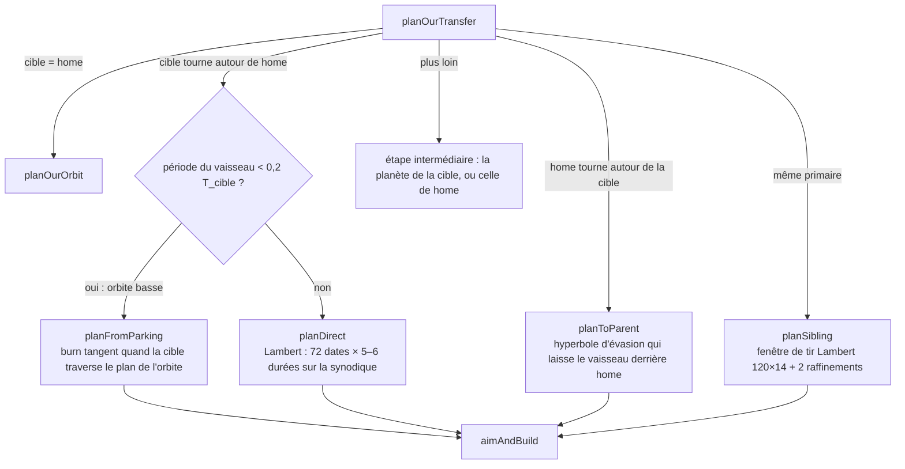
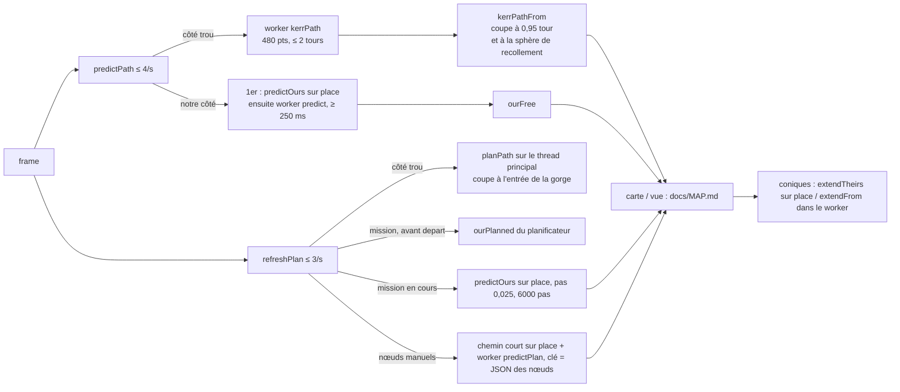

# Planification de vol et prédiction de trajectoires

Ce système dit au pilote **où le vaisseau va** et **quelles poussées faire pour aller ailleurs**. Il
couvre deux univers aux physiques différentes. Côté Gargantua, on suit les géodésiques de Kerr exactes,
avec le champ faible de l'étoile compagne. Côté « notre univers » (le système solaire derrière notre
bouche du trou de ver), on applique Newton à n corps sur les éphémérides DE440. Il comprend :

- le prédicteur de chute libre (le chemin tracé dans la vue et sur la carte) ;
- les nœuds de manœuvre (impulsions Δv à une date) et leur exécution automatique (warp, visée, poussée finie) ;
- les planificateurs par objectif : orbite circulaire, transfert, survol, retour libre, rendez-vous, entrée dans le trou de ver, changement de plan ;
- les coniques raccordées, qui prolongent l'aperçu de la carte au-delà des prédictions ;
- la mission automatique « à travers le trou de ver » (`src/mission.ts`).

Le gros du calcul côté « notre univers » tourne dans un Web Worker. Le dessin des chemins sur la carte
est décrit dans [docs/MAP.md](../MAP.md).

---

## Fichiers

| Fichier | Lignes | Rôle |
|---|---:|---|
| `src/maneuver.ts` | 522 | Côté Gargantua : type `ManeuverNode` et repère P/N/R en ZAMO. Chemin à travers les nœuds (`planPath`) et planificateurs par tir sur les géodésiques de Kerr : `planCircular`, `planRendezvous`, `planIntercept`, `planAlign` |
| `src/targeting.ts` | 689 | Surtout la visée caméra (lancer de rayons inverse) ; pour la planification, il fournit la position, la vitesse, la masse et la sphère de Hill des corps côté Gargantua (`bodyCentre`, `bodyVelocity`, `bodyMass`, `bodyHill`, `starCentre`…) |
| `src/mission.ts` | 396 | Mission automatique en 9 phases (de notre côté → gorge → orbite de Gargantua → changement de plan → étoile), pilotée par les planificateurs et l'autopilote `node` |
| `src/system/our-plan.ts` | 1205 | Planificateur de notre univers : mécanique à deux corps (Lambert, Kepler, plan B), solveur de Newton visé avec le prédicteur n‑corps, plans orbite / direct / parent / frère / retour libre, ré‑visée en vol (`refineOurNode`) |
| `src/system/our-predict.ts` | 266 | Prédicteur n‑corps de notre univers (Verlet + composition de Yoshida d'ordre 4, poussées finies, traînée), conversions Δv P/N/R ↔ repère « home » |
| `src/system/our-extend.ts` | 49 | Coniques raccordées dans le système solaire (aperçu de la carte au-delà de la prédiction) |
| `src/system/their-extend.ts` | 55 | Coniques raccordées côté Gargantua (newtonien, GM = 1) |
| `src/system/patched.ts` | 135 | Algorithme générique des coniques raccordées (changement de sphère trouvé par bissection) |
| `src/system/plan-worker.ts` | 74 | Worker : répartit les requêtes `transfer`, `orbit`, `refine`, `predict`, `extend`, `predictPlan`, `kerrPath`, `deorbit`, `guide` |
| `src/system/plan-client.ts` | 48 | Côté page : `plan<T>(req)` renvoie une promesse, avec repli synchrone sans worker |
| `src/system/iss-plan.ts` | 173 | Rendez-vous avec l'ISS ou un vaisseau de la flotte : Lambert à 2 impulsions sur 16 révolutions, 2 corrections, ré‑visée (`refineIssNode`) |
| `src/system/our-side.ts` | 316 | Repère « home », `referenceBody` / `soiOf` (sphères d'influence), gravité `gravityHome`, poses de départ des scènes |
| `src/game/kepler.ts` | 58 | Propagation képlérienne en variables universelles (Vallado, alg. 8), utilisée par `patched.ts` |
| `src/game/orbit.ts` | 164 | Éléments classiques ↔ état, temps aux apsides, `classify` (posé / vol / suborbital / orbite / évasion). Sert à la télémétrie et aux outils (`game/status.ts`, `game/place.ts`), pas aux planificateurs |
| `src/controls.ts` (partie) | ≈ 4280–4830, 5727–5790, 6373–6452 | `planTransfer`, `planOurs`, `planIss`, `planAlign`, nœuds manuels, `refreshPlan`, `nodeBurn`, `setNodeWarp`, ré‑visées (`ourRefineTick`, `issRefineTick`), `predictPath` |

Tests : `tests/maneuver.test.ts`, `tests/our-plan.test.ts` (Hohmann, Artemis II, Lune → Terre, Mars),
`tests/kepler.test.ts` (coniques raccordées des deux côtés), `tests/game-orbit.test.ts`, `tests/iss.test.ts`.

---

## Fonctionnement

### 1. Deux univers, deux physiques, un même vocabulaire

| | Côté Gargantua (« hole ») | Notre univers (« ours ») |
|---|---|---|
| Où | caméra en `region === "hole"` | `onOurSide` : `region === "throat"` et `ell < 0`, scène `system: "gargantua"` |
| Unités | G = c = M = 1 (M = masse du trou), spin `a = s.spin` | longueurs et temps en M d'un trou de 10⁸ M☉ : 1 M = 1,476625·10¹¹ m = 492,549 s (`M_METRES`, `M_SECONDS` dans `system/solar.ts`), vitesses en c, GM en M. 1 jour ≈ 175,4 M |
| État | `Massive` de `geodesic.ts` : Boyer–Lindquist (r, θ, φ, t) et quantité de mouvement | `X`, `V` cartésiens dans le **repère home** (notre bouche à l'origine, axes écliptiques) |
| « Carte plate » | (r sin θ cos φ, r sin θ sin φ, r cos θ) : cartésien des coordonnées BL | le repère home lui-même |
| Dynamique | géodésique de Kerr + champ faible de l'étoile et des corps massifs (`lens`) | Newton : Soleil, planètes, Lune, plus les lunes de la planète proche, moins l'accélération du repère (`mouthAccel`) |
| Δv d'un nœud | Δ(γβ) dans le repère ZAMO local | Δv newtonien relatif au **corps de référence** (sphère d'influence) |
| Nœud | `ManeuverNode` (`maneuver.ts`) | `OurNode` / `PlanNode` (`our-predict.ts`, `our-plan.ts`), stocké dans le même `plan.nodes` |

Le **repère P/N/R** est le même des deux côtés :

- P (prograde) : selon la vitesse ;
- N (normale) : r̂ × P, normalisée ;
- R : N × P, « radiale vers l'extérieur » perpendiculaire à la vitesse.

Le Δv d'un nœud est stocké en composantes `[P, N, R]`, en unités de c. Côté Gargantua, la vitesse est
la 3‑vitesse ZAMO β et le Δv porte sur γβ (`maneuver.ts`, `orbitalFrame`, `dvLocal`, `dvComponents`).
Côté « notre univers », c'est la vitesse relative au corps de la sphère d'influence où se trouve le
nœud (`our-predict.ts`, `nodeDvHome`, `nodeDvComponents`).

### 2. Le contrôleur : `plan`, nœuds et chemins

Tout l'état vit dans le `CameraController` (`src/controls.ts`) :

```ts
plan: { nodes: ManeuverNode[]; path: PlanPath | null; at: number; note: string; kind?: "align" }
ourMission: OurMission | null   // mission de notre univers (ré‑visée en vol)
ourPlanned: OurPath | null      // chemin calculé par le planificateur (affiché avant le départ)
ourPlan: OurPath | null         // chemin à travers les nœuds, notre univers
ourFree: OurPath | null         // chute libre, notre univers
path                            // chute libre côté Gargantua (pour la vue et la carte)
issGoal                         // rendez-vous ISS / flotte en cours
transfer: LowThrust | null      // transfert à faible poussée (moteur Crew), hors nœuds
```

Entrées utilisateur (câblées dans `src/main.ts`, `FlightHud` et `FlightComputer`) :

| Action | Méthode |
|---|---|
| PLAN TRANSFER côté trou (orbite / étoile ou corps ciblé / trou de ver) | `camera.planTransfer(goal, r2, { orbitStar })` |
| Alignement de plan | `camera.planAlign(goal)` |
| Planificateur de notre univers (orbite / cible / trou de ver, arrivée orbit, flyby ou freeReturn) | `camera.planOurs(kind, arrival, altKm, retKm)` (asynchrone, dans le worker) |
| Cible = ISS ou vaisseau | `planOurs("target", …)` redirige vers `planIss` |
| Nœud manuel, modification, suppression | `addNode(after?)`, `nudgeNode(i, dv, dt)`, `deleteNode(i)`, `clearPlan()` ; un clic sur un chemin de la carte appelle `addNodeAt` |
| Ordinateur de vol | `fcSetPlan(burns, note)` transforme des « burns » (s, m/s) en nœuds de notre côté ; `fcExecute()` |
| EXECUTE | `pilot.setAuto("node")` (ou `"transfer"` pour un plan à faible poussée) |

### 3. Côté Gargantua : planification par tir sur les géodésiques (`maneuver.ts`)

Tous les planificateurs reçoivent un `World` `{ a, lens, lead }`. La valeur `lead` vient de
`controls.world()` : `8 × timeSpeed` (8 s de temps pilote au warp courant, de quoi tourner le
vaisseau). Le premier allumage a lieu au plus tôt après `max(20, 0,03·T, lead)`, avec la période
képlérienne T = 2π r^1.5.

Primitives :

- `advanceTo(st, t, w)` : chute libre jusqu'à la date t avec `geodesic.advance`, tolérance `PLAN_TOL = 1e-7`. Elle renvoie `null` si le vaisseau tombe dans l'horizon ou touche l'étoile.
- `applyDv(st, dv, a)` : convertit le nœud en vecteur ZAMO, puis l'applique avec `geodesic.thrust(st, dir, |dv|, 1, a)`. Une poussée d'une unité de temps propre à l'accélération |Δv| est équivalente à une impulsion.
- `pathFrom(st, w, tMax, n, stop?)` : `geodesic.predict` à n points régulièrement espacés en temps coordonnée (`times[j] = t + (j+1)·tMax/n`). Destin : `horizon` / `escape` (r > 2000) / `star` / `continues`.
- `planPath(st0, nodes, w, tail)` : enchaîne croisière, impulsion, croisière… puis une queue de durée `tail`. Elle sert à la fois au tracé du plan (`refreshPlan`) et à « partir de l'orbite déjà alignée ».
- `apsides(path)` : r min et max échantillonnés, et leurs dates.

Planificateurs :

1. **`planCircular(st0, r2)`** (type Hohmann, en Kerr exact).
   - `apsisBurn` cherche le Δv prograde qui place l'apside opposée à r2. Il encadre d'abord : premier essai ±0,004 c, multiplié par 1,7 tant que l'apside n'est pas atteinte, abandon au-delà de 0,6 c. Il fait ensuite 28 bissections, chacune sur un chemin réel de durée `π((r1+r2)/2)^1.5 × 1,35 + 50`.
   - Le second nœud tombe à l'apside atteinte. Il fait passer la vitesse à la **vitesse circulaire de Kerr** (`circularBeta`). Cette fonction part de Ω = 1/(r^1.5 + a) (prograde) ou −1/(r^1.5 − a) (rétrograde), d'où v₀ = ϖ(Ω − ω)/α. Elle corrige ensuite par deux sondes de l'accélération radiale (a_r supposée linéaire en v²) : v_c² = v₁² − a₁ (v₂² − v₁²)/(a₂ − a₁). Elle renvoie `null` à l'intérieur de l'orbite photonique.
   - Ensuite `then: "circularize"`. `controls.planTransfer` impose r2 ≥ max(1,02·ISCO, r_H + 2).
2. **`planRendezvous(st0, w, body)`** : étoile compagne, ou corps ciblé du système (Miller, Mann…).
   - Le balayage utilise des lentilles « grossières » (`coarseLenses` : seulement les masses > 1e‑10, donc sans les planètes).
   - Burn d'apside vers D − ½·standoff. La date de départ est balayée en 48 pas sur une fenêtre `min(max(T, min(synodique, 3 T_D)), 6000)`, puis affinée par 12 demi-pas. Le coût vaut |d_min − d_voulu|, plus 1e4 en cas de collision.
   - Au plus proche, un nœud égale la vitesse du corps, convertie en ZAMO en divisant par le lapse α (petits facteurs négligés).
   - Avec `orbit`, il ajoute la vitesse circulaire √(m/r) autour du corps, dans le plan `n`. Si l'approche reste au-delà de ½ rayon de Hill (D·∛(m/3)), le vaisseau s'arrête à côté du corps et l'autopilote `orbit` finit l'insertion.
   - Valeurs de `controls` : standoff 4 R (3,2 R pour une orbite), plan [0, 0, 1].
3. **`planIntercept(st0, target, w, tol)`** : entrer dans la bouche du trou de ver, fixe ou en orbite (`s.whOrbit`).
   - Douze dates de départ sur une période. Pour chacune, la première estimation vise la cible à la vitesse courante.
   - Gauss–Newton amorti sur le **vecteur d'écart** 3‑D (point du chemin le plus proche de la cible, affiné sur chaque segment). Le jacobien est obtenu par différences finies (h = 1e‑3) et résolu par `solve3` (règle de Cramer). Recherche linéaire sur 6 demi-pas ; refus si |Δv| > 0,9.
   - Le chemin d'essai s'arrête quand la distance a augmenté 8 fois de suite et dépasse 2·d_min + 1. On garde la solution de plus petit |Δv| dont l'écart est < 4·tol, avec tol = 0,25 ρ (ρ = rayon de la gorge).
4. **`planAlign(st0, w, n, name)`** : changement de plan.
   - Il parcourt 1,6 période (720 points) et détecte les changements de signe de (position · n). Chaque passage est affiné par 30 bissections.
   - Au passage, la vitesse est projetée dans le plan, avec module et sens conservés. On retient le moins cher des deux prochains nœuds.
   - `controls.goalPlane` fournit le plan : l'équateur de Gargantua (celui du disque et de l'orbite de l'étoile) ou, pour le trou de ver, le plan passant par le trou et la bouche le plus proche de l'orbite actuelle.
   - Un `planTransfer` qui suit un alignement planifié (`plan.kind === "align"`) part de l'état après ce nœud (`planPath(...).states[0]`) avec `lead = 0` et conserve le nœud d'alignement en tête.

Le **moteur Crew** (`s.engine === "crew"`, quelques g) ne passe pas par les nœuds : `planTransfer`
délègue à `planLowThrust` (spirales tangentielles, phasage coorbital ou croisière), exécuté par
l'autopilote `transfer`. Voir le commentaire au-dessus de `transfer: LowThrust` dans `controls.ts`.

### 4. Notre univers : le prédicteur n‑corps (`our-predict.ts`)

`predictOurs(X0, V0, t0, nodes, o)` renvoie un `OurPath` :
`{ pts, vels, times, refs, fate: "continues" | "impact" | "wormhole", hit?, nodeAt }`.

- **Corps ressentis** : le Soleil, les planètes et la Lune (`PLANETS`), plus les lunes de la planète proche (`bodiesNear(ref)`). La force est r̂·m/max(r, R)², moins `mouthAccel(t)`, l'accélération héliocentrique de la bouche, qui suit Saturne autour du Soleil (seule l'attraction du Soleil sur la bouche est prise en compte).
- **Pas** : `dt = step × tDyn`, avec `step = 0,02` par défaut (0,05 pour les visées grossières, 0,025 pour la carte d'une mission) et tDyn = min √(r³/m), le plus court temps de chute local. Dans l'air, dt est réduit à `0,004 tDyn` et `0,05/rate`.
- **Intégrateur** : en croisière, composition de Yoshida de trois pas de Verlet vitesse, poids `[Y1, 1−2Y1, Y1]` avec Y1 = 1/(2 − ∛2). Il est d'ordre 4 et symplectique (« des mois entre les planètes restent à quelques km »). Le dernier sous-pas tombe exactement à la fin du pas. Pendant une poussée ou dans l'air, on utilise un Verlet simple.
- **Nœuds** : le pas est raccourci pour tomber pile sur le nœud (ou sur le début de sa poussée). Avec `accel > 0`, une **poussée finie** est centrée sur le nœud (début `t − |Δv|/accel/2`) ; sa direction suit le repère P/N/R du corps de référence et son pas vaut `≤ T/40`. Sinon l'impulsion est instantanée. `nodeAt` donne l'indice du point de chaque nœud.
- **Horizon** : sans `tMax`, il vaut 1,1 révolution autour du corps de référence (orbite liée) ou 1,3·10⁵ M ≈ 2 ans ; il est prolongé après chaque nœud et chaque poussée. Un `tMax` explicite est plafonné à 2,6·10⁶ M (≈ 40 ans). `maxSteps` borne le travail (2500 par défaut, 200 000 pour les visées).
- **Corps de référence** : réévalué tous les `0,2·tDyn` par `referenceBody`, la plus petite sphère d'influence contenant le point, avec r_SOI = a·(m/M)^0,4.
- **Arrêts** : `impact` (sous la surface d'un corps) et `wormhole` (|X| < `mouthR`, le rayon de gorge ρ).
- **Traînée** (`o.drag` = C_D·A/m) : densité `airAt` dans l'atmosphère tournante du corps de référence.

`ourApsides` et `ourClosest` servent à la carte (périapse et apoapse dans la première sphère,
approche la plus proche).

### 5. Notre univers : le planificateur (`our-plan.ts`)

#### Outils à deux corps

- `elementsOf(mu, r, v)` : h, e, vecteur excentricité, rp, a, ra, période, énergie.
- `keplerProp` : problème de Kepler en variables universelles (Newton sur χ, fonctions de Stumpff C et S).
- `lambert(mu, r1, r2, tof, normal)` : variables universelles, une révolution, bissection sur z ∈ [−400, 4π²) ; le sens de parcours est fixé par `normal`.
- `stateAt(path, t)` : interpolation d'Hermite cubique (positions et vitesses) sur un `OurPath`.
- `bPlane(path, id)` : arrivée sur une cible. On prend l'hyperbole osculatrice à l'entrée dans la sphère d'influence, ou au point le plus proche pour une cible sans masse (la bouche). Elle donne S (asymptote), T = S × n̂_orbite‑du‑corps, R = S × T, les composantes bT et bR du paramètre d'impact, v∞ et le rp réellement volé (ou osculateur, sous le sol, en cas d'impact : la fonction reste lisse).
- `bFor(m, rp, v∞) = rp·√(1 + 2m/(rp v∞²))` : paramètre d'impact pour un périapse rp (focalisation gravitationnelle).
- `returnPerigee(path, passed, home)` : périgée du retour, **signé** par le sens de rotation autour de home (un retour libre « en 8 » revient dans l'autre sens, le rayon passe par zéro sans discontinuité).

#### Le solveur `solve` et la visée `aim`

`solve(goals, x0, step, tol)` cherche goals(x) = 0. Le jacobien est obtenu par différences finies et
mis à l'échelle (colonnes par les pas, lignes par les tolérances). Le pas de norme minimale vaut
dx = −Jᵀ(JJᵀ + 1e‑9·I)⁻¹ r, ce qui accepte plus d'inconnues que d'objectifs. Il est amorti : 8 demi-pas
au plus tant que le coût Σ(r/tol)² ne baisse pas. Pour le débogage, `globalThis.__planDebug = true`
journalise les itérations.

`aim(m, X, V, t, tn, dv0, stage, o, moveTime, coarse, withTime, inFlight)` : les inconnues sont le Δv
[P, N, R], plus éventuellement le décalage temporel du nœud (`moveTime`, pas de 1 s). Chaque évaluation
est un `predictOurs` complet (pas 0,02, ou 0,05 en mode grossier). Les objectifs dépendent du `stage` :

| stage / type | Objectifs (résidus) | Tolérance |
|---|---|---|
| `escape` (départ interplanétaire) | v∞ de l'hyperbole de sortie − `m.vinf` (3 composantes) | 0,3 m/s |
| `parent` (Lune → Terre) | périgée signé − (R + alt) | 60 km au départ, puis `aimTol` |
| `back` (correction du retour) | périgée signé au retour | `aimTol` |
| `out`, `freeReturn` | (rp au passage − rp voulu, périgée de retour signé) | `aimTol` |
| `out`, cible sans masse (bouche) | (bT, bR) → 0 | 10⁶ km |
| `out`, cible massive | d'abord cartésien (bT − b*·bDir, bR − b*·bDir), tolérance ×5, puis (rp volé − rp voulu, angle par rapport à `bDir` × b*) | `aimTol` |
| + `withTime` (MCC d'une lune, type `direct`, home ≠ Soleil) | date de l'approche − `tArrive` | 300 s |

`aimTol` vaut 10 km près de la maison, 300 km entre les planètes (30 km en vol) et 10⁶ km pour la bouche.

#### Les plans

`planOurOrbit` traite l'orbite circulaire autour du corps de référence. Si on y est déjà à 1 % près,
un seul nœud `circ`. Sinon un Hohmann analytique : deux nœuds `depart` et `circ`, le second à
t1 + π√(a³/μ). Pour Saturne, `clearOfRings` relève l'altitude au-dessus des anneaux
(1,08 × rayon externe).

`planOurTransfer` → `planOurTransferRaw` choisit la topologie :



- **Coût d'une solution de Lambert** : |Δv départ| + capture √(v∞² + 2μ/rp) − √(μ/rp) si l'arrivée est une orbite.
- **`planFromParking`** (de type Apollo / Artemis) : la date d'arrivée est le premier passage de la cible dans le plan de l'orbite (240 pas sur un mois, puis 50 bissections). La durée de vol vaut 0,7 × Hohmann (retour libre) ou 0,85 × Hohmann. L'ellipse est choisie par bissection géométrique sur l'apoapse. Le point d'allumage est placé à ν avant la direction d'arrivée. La visée part d'un quart d'orbite avant l'allumage, propagé en Kepler : les jours d'attente en orbite basse ne sont pas intégrés.
- **Évasion** (`planToParent`, `planSibling`) : on veut une hyperbole d'excentricité e = 1 + r0·v∞²/μ, dont l'asymptote de sortie sort à l'angle φ = atan2(e − 1/e, −√(1 − 1/e²)) du périapse. L'allumage a lieu là où le rayon du vaisseau s'aligne le mieux avec ce périapse.
- **`planSibling`** : le coût de départ inclut un terme hors plan (`vpH·|v̂∞ · ĥ|`). La visée commence ~2 jours d'évasion (×√(m/m_Terre)) avant la fenêtre.

`aimAndBuild` vise le premier allumage, puis ajoute les nœuds suivants :

- **sibling** : on vise l'évasion sur `m.vinf`, puis une première correction (MCC) visée **au‑delà de 1,5 sphère de la maison** sur le plan B de la cible. Une **correction différentielle** répète 4 fois au plus : le Δv de cette MCC est reporté dans le v∞ demandé à l'évasion, jusqu'à ce que la MCC soit < 1 m/s. La MCC est enfin revisée depuis un vrai point du chemin complet (et non un point interpolé : « steps of days there, ~300 km at Mars »).
- **freeReturn** : `freeReturnSearch`. Le Δv est purement prograde. Pour chaque taille (pas de 2,5 m/s, ±12), la date est ajustée par sécante pour obtenir la bonne hauteur de passage d'un côté. Le périgée de retour est encadré puis résolu par fausse position (Illinois), avec les deux côtés et les deux sens ; le plus petit Δv gagne. Le résultat est poli par un `aim` complet.
- **autres** : le côté du plan B (`bDir`) est pris au passage de la première estimation, puis `aim`.

Nœuds produits (`role`) :

| Type | Nœuds |
|---|---|
| direct, orbite | `depart` → `mcc` (30 % du trajet, Δv 0) → `capture` (au périapse, `then: "circularize"`) |
| sibling | `depart` → `mcc` (visé) → `mcc` (80 %) → `capture` |
| freeReturn | `depart` → `mcc` → `mccReturn` (30 % du chemin entre la sortie de la sphère et le périgée) → `captureHome` |
| parent | `depart` → `mccReturn` → `captureHome` (si `arrival === "orbit"`) |
| flyby / bouche | `depart` → `mcc` → `arrive` (Δv 0 : un point d'arrivée vers lequel le vol avance en warp ; pour le trou de ver, l'entrée dans la gorge) |

Les nœuds à Δv nul sont des **emplacements** : ils sont visés en vol.

#### Ré‑visée en vol : `refineOurNode`

- `arrive` : date recalculée (approche la plus proche, ou bord de la gorge).
- `capture`, `captureHome`, `circ` : on reprédit la chute libre, on prend le périapse (ou, pour `circ`, le point le plus proche du rayon voulu) et on calcule le Δv qui donne la vitesse circulaire horizontale.
- `depart`, `mcc`, `mccReturn` : `aim` depuis l'état réel. `depart` peut glisser dans le temps ; `mcc` conserve la date de rencontre. Le nœud est supprimé (`null`) si |Δv| < 0,03 m/s **et** l'objectif est atteint. Il est gardé tel quel si l'`aim` échoue ou si la correction dépasse 500 m/s.

### 6. Rendez-vous ISS ou flotte (`iss-plan.ts`)

Mécanique à deux corps autour de la Terre, dans le repère home :

- Point visé : à 200 m (`RENDEZVOUS_M`) sur l'axe du port IDA‑2 de Harmony (`station.ports[0]`), dans les axes de la station. Sa vitesse est celle du repère tournant (ω × offset). Pour un vaisseau de la flotte, `craftPoint` prend le premier port libre (`freePort`), avec l'attitude figée.
- Recherche : 16 × 24 dates de départ (16 révolutions de 92,9 min), puis 29 durées de vol entre 0,3 et 1,45 période, et un Lambert pour chacune. On rejette les arcs dont le périgée est sous 200 km. Coût = |Δv1| + |Δv2| + 0,2 m/s par heure d'attente.
- Nœuds : `depart`, `mcc` à 55 % et à 88 %, `arrive` (`then: "dock"`).
- En vol, `issRefineTick` appelle `refineIssNode` sur le thread principal (Lambert depuis l'état propagé en Kepler ; à l'arrivée, vitesse de la station moins celle du vaisseau). Le nœud est re‑visé dès qu'il devient le prochain, au tiers restant, puis quand il est proche. Une correction < 2 cm/s est supprimée.

### 7. Le worker (`plan-worker.ts` / `plan-client.ts`)

`server.ts` (`/plan-worker.js`, `Bun.build` à la volée) et `scripts/build-pages.ts` construisent le
worker séparément. Au démarrage, la page envoie `{ kind: "ephemeris", urls }`. Le worker charge les
mêmes fichiers DE440 (`loadEphemerides`), et **toutes les requêtes attendent** cette promesse : un
chemin prédit avec les modèles de repli serait faux de milliers de km.

| Requête | Appelant | Calcul |
|---|---|---|
| `transfer`, `orbit` | `planOurs` | `planOurTransfer`, `planOurOrbit` |
| `refine` | `ourRefineTick` | `refineOurNode` |
| `predict` | `predictPath` (notre côté) | chute libre `predictOurs` |
| `predictPlan` | `refreshPlan` (nœuds manuels) | chemin long à travers les nœuds (12 000 pas) |
| `extend` | `map3d.extension` | coniques `extendFrom` |
| `kerrPath` | `predictPath` (côté trou) | `geodesic.predict`, 480 points, lentilles `lensesOf(s)` |
| `deorbit`, `guide` | rentrée atmosphérique (`entry.ts`, hors périmètre) | |

Sans worker (tests, ou `onerror`), `plan()` calcule de façon synchrone sur place. En cas d'erreur
du worker, les requêtes en attente reçoivent `{ error }`.

### 8. Les prédicteurs de chute libre et leur rafraîchissement



- **Côté trou** : `tMax = clamp(2 × 2π r^1.5, 300, 60000)`, puis découpe à 0,95 tour (angle cumulé du rayon vecteur) pour qu'un segment ne revienne pas balayer la vue derrière la caméra. Le chemin s'arrête à l'entrée de la sphère de recollement de la bouche (`fate: "wormhole"`). Il est dessiné dans le rendu comme tube lentillé (`showGeodesic`).
- **Plan côté trou** : la queue vaut `40` après le dernier nœud pour `then: "approach"`, une orbite autour de l'étoile pour `then: "orbit"`, sinon `max(2 tours, 1,5 × délai, 600)`, plafonnée à 60 000. Pendant une poussée, le premier nœud est remplacé par **ce qu'il reste** de son Δv, à la date courante.
- **Notre côté, nœuds manuels** : un chemin court sur place (jusqu'au dernier nœud + 30 min, 3000 pas) s'affiche tout de suite ; le chemin long du worker le remplace quand les nœuds n'ont pas changé (comparaison par clé JSON, rafraîchi toutes les 2 s).
- `planCost` (coût mesuré de la dernière prédiction sur place) ralentit le rafraîchissement : `max(330 ms, 8 × coût)`.

### 9. Exécution des nœuds : `nodeBurn` et `setNodeWarp`

Chaque frame où `pilot.auto === "node"`, `fly()` appelle `nodeBurn(cam, dt, dtau)` (`dtau` = α/γ
côté trou, 1/γ de notre côté). Le résultat `{ dir, throttle }` alimente le pilote (visée et poussée).

```mermaid
sequenceDiagram
  participant N as nodeBurn (chaque frame)
  participant R as ourRefineTick / issRefineTick
  participant W as worker
  N->>N: total = |Δv|, left = total − nodeDone, burnT = total / aMax / dtau
  N->>R: ré-visée due ?
  R-->>W: refine (notre univers)
  R-->>N: hold = ré-visée en cours ET début < 3 × timeSpeed
  alt start = toNode − burnT/2 > 0 (croisière)
    N->>N: warp pour atteindre le début en ~2,5 s ; SAS prograde loin du nœud (notre côté)
  else début atteint, pas de hold
    N->>N: nodeBurning = true, burnDir figé (côté trou, Cinema) ou suivi P/N/R (Crew, notre côté)
    N->>N: warp : poussée ≈ 2 s (Cinema) / ≈ 10 s ; notre côté : ≤ moitié du reste par frame
    N->>N: left ≤ seuil → shift du nœud ; dernier nœud → pilot.setAuto(then)
  end
```

- **Fin de poussée** : de notre côté, `left ≤ max(3e‑11, 1e‑6·total)` (≈ 1 cm/s, car « 1 m/s au départ de la Terre ≈ 1000 km à la Lune ») ; côté trou, `left ≤ max(min(1e‑5, 1e‑3·total), 0,02·perFrame)`. La manette vaut `min(1, left/perFrame)`, avec `perFrame = aMax × timeSpeed × dt × dtau`.
- **Warp en croisière** : côté trou, `clamp((start − 20)/2,5, 4, 1e5)` loin du nœud, puis `clamp(start/1,5, 3, 12)` près de lui. De notre côté, `clamp(start/3, 0,002, 1e5)`, puis jusqu'au temps réel pour une poussée de plus de 30 s (sinon ×5 minimum). Le warp est limité par les rails (`railsLimit`) dans un système ou au-delà de ×500.
- **`setNodeWarp(auto)`** : avec `s.autoWarp`, le warp est celui de l'autopilote. Sinon le pilote choisit (touches `,` et `.`), mais **jamais au-dessus** de l'automatique. `nodeWarp` vaut alors `"auto"`, `"manual"` ou `"held"` ; la barre de transport l'affiche. Le warp du pilote (`userWarp`) est rétabli entre les nœuds et à la fin (`restoreWarp`).
- **Ré‑visées** (`ourRefineTick`) : une première visée dès que le nœud devient le prochain (sauf un `depart` à plus de 1,2 orbite et plus de 0,3 jour). Ensuite, quand le temps restant passe sous 15 % (ou 40 % pour capture, circ, arrive) de l'intervalle depuis la dernière visée. Au plus 3 visées (8 pour les nœuds « bon marché »). `lead = min(max(60 s, burnT), 0,8 × start)`. Une correction inutile est mise à zéro si elle est loin (plus d'une demi-journée), sinon supprimée avec un message.
- **Trou de ver** : à l'`arrive` sur `wormhole`, ou quand la caméra quitte la région de navigation, le warp est porté à `min(24ρ/v/20, 1e4)` pour traverser la gorge en ~20 s, le plan est vidé et `traversing = true`.
- **Fin du plan** : `pilot.setAuto(then)` (`circularize`, `approach`, `orbit`, `dock`) et un message (« Manoeuvre done — circularizing »…).

### 10. Les coniques raccordées (`patched.ts`, `our-extend.ts`, `their-extend.ts`)

Elles servent d'**aperçu**, pas de vol. `patchedConics(bodies, X0, V0, t, ref, horizon)` :

- propage `game/kepler.propagate` autour du corps `ref` (variables universelles : ellipse, parabole et hyperbole) ;
- prend un pas de 2 % du temps de rotation (`0,02 r/v`), jamais plus de la moitié du chemin vers une sphère enfant, plafonné à `horizon/250` ;
- à une entrée ou une sortie de sphère ou à un impact, localise l'instant par 24 bissections, puis repart sur la conique du nouveau corps ;
- note le point bas de chaque sphère traversée (`apsides`).

| | `our-extend.ts` | `their-extend.ts` |
|---|---|---|
| Corps | tout `SOLAR_BODIES`, sphère a·(m/M)^0,4 prise à t ; « bande » héliocentrique des planètes (test bon marché) | trou (GM = 1, arrêt à l'horizon), étoile (si `sunMass > 0`), corps massifs du système Gargantua ; sphères = Hill (`bodyHill`) |
| Horizon | lune 10 j, planète 40 j, Soleil 730 j (`extensionHorizon`) | orbite liée : 1,5 tour ; sinon `max(10 × prédit, 5000)` ; ≤ 1e6 |
| Où | dans le worker (`extend`) | sur le thread principal (`map3d.theirExtension`, ≤ 2/s) |

Côté trou, la vitesse de départ est estimée par **différence finie** des deux derniers points du
chemin prédit. Près du trou (r ≲ 20 M), une conique ignore la précession et la plongée de Kerr :
c'est un croquis.

### 11. La mission automatique (`mission.ts`)

Elle démarre par le preset `"Mission: through the wormhole to the companion star (automatic flight)"`
(`mission: true`, `src/settings.ts`). Ensuite `main.ts` appelle `mission.start()`, et `sim` appelle
`mission.update(dt)` à chaque frame.

`start()` force `ship`, `wormhole`, `sun`, `target = "wormhole"`, active le pilotage, masque le
chemin et surexpose l'éclairage de la coque (≥ 12). Il calcule un **point de sortie** sur la sphère de
recollement de la bouche lointaine : on y sort tangent à l'orbite autour de Gargantua, à la vitesse
circulaire de Kerr `circularSpeed(rExit)`, donc presque en orbite à l'arrivée. Le vaisseau est placé
à ℓ = −16 de notre côté, cap sur la gorge selon cette direction (`placeShipRep`).

| # | Phase | Ce qu'elle fait | Fin |
|---|---|---|---|
| 1 | `start` | caméra `quarter`, warp 2, maintien radial-in | 5 s |
| 2 | `ignition` | pleins gaz jusqu'à `vExit` | vitesse atteinte et 2 s écoulées |
| 3 | `throat` | prograde, warp 7 | `region === "hole"` |
| 4 | `arrival` | autopilote `circularize`, la vue se tourne vers Gargantua | vitesse ≈ vitesse voulue et v_r ≈ 0 (±2e‑3), ou 10 s |
| 5 | `raise` | `planTransfer("orbit", r2)` avec r2 = ⌈|C_bouche| + r_glue + 4⌉ (sinon l'orbite revient dans la bouche un tour plus tard), puis `node` | nœuds faits + 5 s de circularisation |
| 6 | `orbit` | warp 22, légende de la dilatation du temps (1/dτ) | 13 s |
| 7 | `align` | `planAlign("star")` puis `node` | autopilote ≠ `node` |
| 8 | `transfer` | `planTransfer("star", 30, { orbitStar: true })` puis `node` | autopilote ≠ `node` |
| 9 | `star` | autopilote `orbit`, changements de caméra | 24 s |

Le « réalisateur » (`direct`) oriente la vue vers un corps (`aim`, `aimK` < 1 pour garder le vaisseau
dans le cadre ; tangage limité à [−8°, 60°]). `burnCameras` change de point de fixation entre poussée
et croisière. La mission s'arrête si le vaisseau ou le pilotage est coupé, si on revient dans le trou
de ver après l'arrivée, ou sur Échap (`main.ts`). Elle attend pendant la pause (`!s.animate`).

---

## Interfaces avec les autres systèmes

**Consomme**

- `src/geodesic.ts` : `advance`, `predict`, `step`, `thrust`, `fromZamo`, `toZamo` (intégration de Kerr) ; `src/physics.ts` : `horizon`, `isco`, `zamo`.
- `src/lenses.ts` : `lensesOf(s)` (champ faible de l'étoile et des corps), transmis comme `World.lens`.
- `src/targeting.ts` : centres, vitesses, masses et rayons de Hill des corps côté Gargantua ; `ourTarget`.
- `src/wormhole.ts` : `mouth(s, t)` (centre `C`, `rGlue`, rayon de gorge `w.rho`), conversions rep ↔ home (`our-side.ts`).
- `src/system/solar.ts`, `de440.ts`, `ephemeris-files.ts` : `solarState`, `solarBody`, `mouthAccel`, `spinVector` ; éphémérides chargées aussi dans le worker.
- `src/system/iss.ts` (SGP4, `issTrack.peek`, `issAxes`, `station.ports`), `src/fleet.ts`, `src/vessels.ts` (ports).
- `src/aero.ts` (`airAt`, `airTop`) pour la traînée dans les prédictions.
- `src/pilot.ts` : `pilot.auto` (`node`, `circularize`, `approach`, `orbit`, `dock`, `transfer`), `pilot.hold`, `circularSpeed`.

**Expose**

- `CameraController` : `plan`, `planTransfer`, `planOurs`, `planAlign`, `addNode`, `nudgeNode`, `deleteNode`, `clearPlan`, `refreshPlan`, `fcSetPlan`, `fcExecute`, `fcPlan`, `nodeWarp`, `ourPlan`, `ourFree`, `ourMission`, `planBusy`, `lastRefine` (dernier résultat de ré‑visée, pour l'automatisation).
- `flightInfo().plan` : `{ nodes, path, note, burning, done, now, lowThrust }`, plus `ourPlan` et `ourArrive`, lus par le HUD, la carte (`ui/map3d/map3d.ts`) et les écrans du cockpit.
- `onPilotMessage(t)` : messages (« Mid-course correction not needed », « Manoeuvre done … »), affichés en toast, sur les écrans et dans le journal.
- `Mission` : `start`, `stop`, `update`, `phase`, `captionText` (sous-titres des vidéos), `onStart` / `onEnd`.
- Fonctions pures réutilisées par l'ordinateur de vol et les outils : `lambert`, `keplerProp`, `elementsOf`, `bPlane` (our-plan) ; `elements`, `classify` (game/orbit).
- Automatisation : `__bh.camera` (toutes les méthodes ci-dessus), `__bh.preset(...)` pour la mission, `globalThis.__planDebug = true` pour journaliser le solveur. Voir [docs/GAME-TOOLS.md](../GAME-TOOLS.md) pour `__bh.game`.

## Réglages

| Clé (`src/settings.ts`, `src/ui/schema.ts`) | Effet sur ce système |
|---|---|
| `engine` (`cinema` / `crew`) | Cinema : nœuds impulsionnels. Crew : `planTransfer` côté trou bascule sur `planLowThrust` (autopilote `transfer`) ; les poussées de notre côté sont finies (`accel`) |
| `thrust`, `crewG`, `fuel` | `thrustMax()` = accélération des poussées (`accel` du prédicteur, `aMax` de `nodeBurn`) |
| `autoWarp` | warp automatique pendant l'exécution, ou manuel plafonné |
| `timeSpeed`, `animate` | `lead` du premier nœud (8 à 10 s de temps pilote) et warp d'exécution |
| `showGeodesic` | affichage du tube de chute libre dans le rendu (la mission le masque) |
| `spin`, `sun`, `sunMass`, `sunOrbit`, `sunRadius`, `sunPhase` | métrique et lentilles côté trou, orbite de l'étoile visée |
| `wormhole`, `whOrbit`, `whRho`… | cible de `planIntercept` (bouche fixe ou en orbite), arrêt des prédictions à la gorge |
| `system`, `target` | corps visé par PLAN TRANSFER et par `planOurs` |
| `iss` | ISS ciblable |

## Pièges et limites

- **Précision.** Tout le planning se fait en float64 sur CPU. De notre côté, les distances en M sont minuscules (1 km ≈ 6,8·10⁻⁹ M, 1 m/s ≈ 3,3·10⁻⁹ c). D'où les seuils en absolu : fin de poussée `3e‑11`, Δv nul `1e‑15`, pas de différences finies 0,05 m/s. Ne pas les remplacer par des epsilons « raisonnables ».
- **Coût.** Une visée réalise des dizaines à des centaines de `predictOurs` jusqu'à 200 000 pas : de quelques secondes à quelques dizaines de secondes dans le worker (Mars, retour libre). `planBusy` empêche les requêtes concurrentes ; `planGen` jette les réponses périmées.
- **Côté trou, tout est sur le thread principal.** `planTransfer`, `planAlign` et `refreshPlan` (→ `planPath`, tolérance 1e‑7) tournent dans la frame : un `planRendezvous` balaie ~70 chemins de 240 points, plus les bissections d'`apsisBurn`. Seul le chemin de chute libre (`kerrPath`) passe par le worker. Le `planCost` qui régule `refreshPlan` n'est mesuré que de notre côté.
- **Approximations côté trou.** La correspondance vitesse coordonnée → ZAMO néglige les facteurs α (`planRendezvous`) ; le balayage ignore les planètes (`coarseLenses`) ; `circularBeta` suppose a_r linéaire en v² ; `apsisBurn` suppose l'apside monotone en Δv (faux si une grosse poussée rétrograde inverse l'orbite). Les coniques côté trou sont newtoniennes et partent d'une vitesse obtenue par différence finie.
- **Approximations de notre côté.** Le repère home n'est accéléré que par le Soleil (`mouthAccel`). La bouche est sans masse et ne courbe pas la lumière. Les attentes en orbite basse avant un départ sont propagées en Kepler, sans intégration : le chemin affiché avant `depart` est `ourPlanned`, pas une prédiction en direct. Les tolérances de visée interplanétaire (300 km) comptent sur les MCC.
- **Les nœuds à Δv nul ont un rôle.** Ne pas les « nettoyer » : `mcc`, `mccReturn` et `arrive` sont des emplacements visés en vol. Un nœud sans `role` (manuel, ou venant de l'ordinateur de vol) n'est jamais re‑visé.
- **`hold` peut retarder une poussée** : tant qu'une ré‑visée est en cours dans le worker et que le début de la poussée est à moins de 3 × timeSpeed, la poussée attend (le warp est réduit à `start/4`).
- **Réservoir vide** : `thrustMax()` renvoie 0 ; `nodeBurn` prend `aMax = max(0, 1e‑9)`, donc `burnT` devient gigantesque. Le planificateur de notre côté reçoit alors `accel: 0` (impulsions). Rien n'empêche explicitement d'exécuter un plan sans carburant (**non vérifié en vol**).
- **Un chemin traversant le trou de ver** est coupé à la gorge : la carte plate ne sait rien de l'au-delà. De notre côté, le prédicteur s'arrête à |X| < ρ.
- **Mission et moteur Crew.** Le preset de la mission ne fixe pas `engine`. Si la valeur courante est `crew`, chaque `planTransfer` de la mission passe par `planLowThrust` et ne produit aucun nœud. Les phases `raise`, `align` et `transfer` affichent alors le message et passent à la suite sans rien piloter : le transfert planifié n'est pas exécuté (**incohérence probable**, déduite du code).
- **Code mort et incohérences.**
  - `MISSION_PRESET` (`mission.ts`) n'est importé nulle part, et sa valeur (« Interstellar: wormhole to Gargantua ») ne correspond à aucun preset : le preset réel s'appelle « Mission: through the wormhole to the companion star (automatic flight) ».
  - `extendOurs` (`our-extend.ts`) n'a aucun appelant : la carte passe par `extendFrom` dans le worker.
  - Le test de destin de `pathFrom` (`maneuver.ts`) est redondant : `predict` ne renvoie déjà que ces quatre valeurs.
- **Commentaires mal placés** (sans effet sur le code) :
  - dans `our-plan.ts`, la JSDoc « A transfer from the reference body's neighbourhood… » est collée au-dessus de celle de `clearOfRings`, et `planOurTransfer` n'a pas la sienne ;
  - dans `iss-plan.ts`, la JSDoc de `planIssRendezvous` précède celle de `freePort` ;
  - dans `plan-worker.ts`, le commentaire « (hand-made nodes…) » précède la branche `kerrPath` au lieu de `predictPlan`.

## Pour aller plus loin

1. **Ajouter un objectif côté trou** (par exemple une orbite elliptique) : écrire `planX(st0, w, …)` dans `maneuver.ts` à partir de `apsisBurn`, `pathFrom` et `matchDv`, l'ajouter à `planTransfer` dans `controls.ts`, puis l'exposer dans `FlightHud` (`plan`) et `FlightComputer.kerrPlan` (`main.ts`). Ajouter un test dans `tests/maneuver.test.ts`.
2. **Ajouter une topologie de transfert de notre côté** (par exemple une assistance gravitationnelle) : brancher dans `planOurTransferRaw`, produire une première estimation à deux corps, définir les résidus dans `residualsCore` (nouveau `Stage` si besoin), puis réutiliser `aimAndBuild` et `refineOurNode` pour les rôles. Ajouter un cas dans `tests/our-plan.test.ts` (la référence est le test Mars).
3. **Régler la précision et le coût** : `aimTol`, les pas de `aim` (0,05 m/s et 1 s), `step` de `predictOurs` (0,02 en visée, 0,025 pour la carte), `maxSteps`. Mesurer avec `__planDebug` et le nombre de chemins de `freeReturnSearch`.
4. **Modifier le comportement d'exécution** (warp, durée apparente des poussées, seuils de fin) : tout est dans `nodeBurn` et `setNodeWarp` (`controls.ts`). Les ré‑visées sont dans `ourRefineTick` (règles `due`, `maxN`) et `issRefineTick`.
5. **Ajouter une phase à la mission** : insérer un objet `Phase` dans le tableau du constructeur de `Mission` (`enter` lance un plan et l'autopilote, `step` renvoie `true` à la fin). Garder la mission côté trou après `arrival` (voir le test dans `update`).
