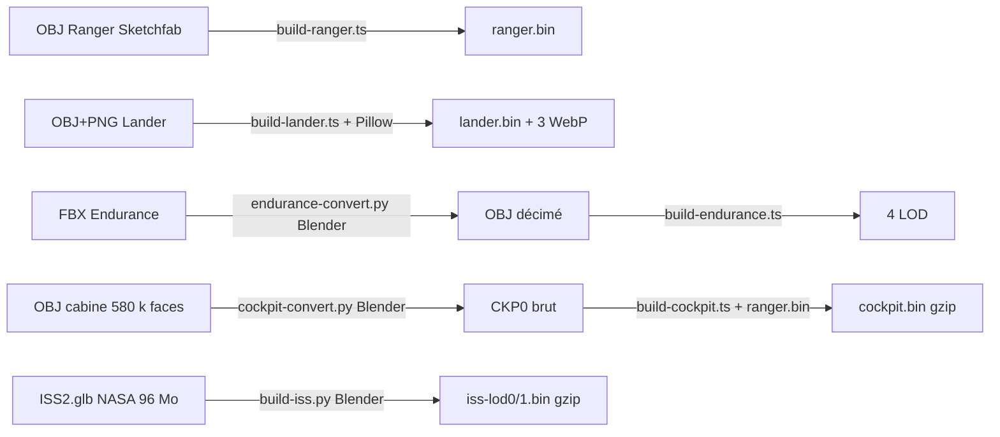

# Modèles 3D : vaisseaux, cockpit, stations

Ce système dessine tout ce qui est **maillé** plutôt que tracé : le vaisseau piloté (Ranger, Lander ou
Endurance) et les autres vaisseaux de la flotte proches de la caméra, la cabine du Ranger et ses écrans
de télémétrie, l'Endurance « cinématique » en orbite autour de Gargantua, et la Station spatiale
internationale (ISS) avec ses joints orientés vers le Soleil. Ces maillages sont rastérisés en 4× MSAA
avec la **même projection sténopé que le traceur**, dans le repère de repos local de la caméra (un
morceau d'espace-temps plat à l'échelle du mètre), puis composités sur l'image HDR tracée **avant le
bloom**. Ils sont éclairés par ce que le traceur voit autour de la caméra (sonde de lumière, lumière clé
analytique, harmoniques sphériques).

Les maillages sont préparés hors ligne (scripts Bun/Blender) en formats binaires maison ; le moteur les
télécharge à la demande.

---

## Fichiers

| Fichier | Lignes | Rôle |
|---|---:|---|
| `src/ship.ts` | 1 101 | `ShipRenderer` : chargement des maillages (Ranger, Lander, Endurance, cabine), sonde de lumière (mips, GGX, SH), carte d'ombre, passe MSAA dans une « boîte » d'écran, tuyères, rentrée atmosphérique, écrans de la cabine. |
| `src/shaders/ship.wgsl` | 1 248 | Tous les kernels/shaders du vaisseau : `envCopy/envDown/envGGX/envSH`, `shadowVs`, `depthVs`, `vs/fs` (coque), `plumeVs/plumeFs` (flammes), `glowVs/glowFs`, `distVs/distFs`, `sheathVs/sheathFs` (plasma), `fsCabin/fsCabinGlass` (cabine), `compVs/compFs` (inutilisés, voir pièges). |
| `src/mounts.ts` | 93 | Points d'attache de la caméra sur le vaisseau (`MOUNTS`), `mountPose`, `shipToCamera` (matrice vaisseau → caméra), `shipAxis`. |
| `src/endurance.ts` | 336 | `EnduranceRenderer` : l'Endurance cinématique en orbite circulaire autour du trou (échelle en M), 4 LOD, éclairage par le disque projeté sur SH (`diskSH`), `endurancePose`. |
| `src/shaders/endurance.wgsl` | 144 | Shading GGX de l'Endurance cinématique, sortie couleur + profondeur (distance, couverture), composite. |
| `src/station.ts` | 278 | `StationRenderer` : ISS (2 LOD gzip), joints articulés (13 parties), carte d'ombre solaire, boîte MSAA, composite ; expose `depthTexture()` pour cacher le Ranger derrière la station. |
| `src/shaders/station.wgsl` | 208 | Shading de l'ISS : Soleil (GGX + ombre), Terre (SH), cellules solaires procédurales, radiateurs. |
| `src/ui/cockpitscreens.ts` | 529 | `CockpitScreens` : 8 écrans de télémétrie (PFD, orbite, nav, systèmes, amarrage, plan, horloges, journal) dessinés dans un `OffscreenCanvas` 2048 × 1024. |
| `src/vessels.ts` | 224 | (hors périmètre strict, consommé) `VESSELS` : masse, centre de masse, propulseurs (`jets`), ports d'amarrage, points d'attache propres à chaque vaisseau, `flame`. |
| `scripts/build-ranger.ts` | 311 | OBJ du Ranger → `assets/ranger/ranger.bin` (triangulation, raffinement, normales, AO). |
| `scripts/build-lander.ts` | 228 | OBJ + textures du Lander → `assets/lander/lander.bin` + 3 cartes WebP. |
| `scripts/build-endurance.ts` | 196 | FBX de l'Endurance (via Blender) → 4 LOD `endurance-*.bin`. |
| `scripts/endurance-convert.py` | 29 | Étape Blender : jointure, décimation, triangulation, export OBJ. |
| `scripts/cockpit-convert.py` | 141 | Étape Blender de la cabine : types de matériaux, manches, décimation, parties connexes → `CKP0`. |
| `scripts/build-cockpit.ts` | 178 | `CKP0` → `assets/ranger/cockpit.bin` (gzip) : calage dans la coque, AO + « ciel vu », écrans, pivots des manches. |
| `scripts/build-iss.py` | 311 | GLB de la NASA (Blender) → `assets/iss/iss-lod{0,1}.bin` (gzip) : couleurs par sommet, joints, ports. |
| `assets/{ranger,lander,endurance,iss}/README.md` | — | Licences (CC BY 4.0 / NASA), commandes de reconstruction, formats binaires. |

Tailles actuelles des ressources (lues dans les en-têtes) :

| Ressource | Triangles | Sommets | Taille |
|---|---:|---:|---:|
| `ranger.bin` (RNGR v2) | 32 050 | 20 155 | 1,0 Mo |
| `cockpit.bin` (CKPT v2, gzip) | 75 894 | 147 675 | 3,1 Mo |
| `lander.bin` (LNDR v1) + 3 WebP 2048² | 37 351 | 39 209 | 2,0 Mo + 1,2 Mo |
| `endurance-lod2/lod1/.bin/full` (ENDR v1) | 11 907 / 23 926 / 96 046 / 240 269 | — | 0,97 / 1,7 / 5,8 / 11 Mo |
| `iss-lod0/lod1.bin` (ISS1 v2, gzip) | 92 915 / 536 901 | 192 160 / 1 178 943 | 2,1 / 9,9 Mo |

---

## Fonctionnement

### 1. Vue d'ensemble d'une image

Tout est piloté par `Renderer.encodePost` (`src/renderer.ts`, autour de la ligne 2160), juste après la
passe de *resolve* du traceur (`i === r0`) et **avant** la descente du bloom :

```mermaid
flowchart TD
  T[trace.wgsl env\nsonde 256×128 + lumière clé] -->|envBuf| E[ShipRenderer.encodeEnv\nmips boîte, GGX, SH]
  E -->|shBuf copié dans bodyBuf| TR[traceur : ombre du Ranger au sol]
  R[resolve / denoise / temporal] --> ST[StationRenderer.encode\nombre solaire + MSAA + composite dans hdr]
  ST -->|depthTexture + rect| SH[ShipRenderer.encodeShip]
  E --> SH
  SH --> SM[carte d'ombre 2048² (1 image sur 2)]
  SH --> MS[MSAA 4× dans la boîte : pré-passe profondeur, coque, cabine, vitres]
  SH --> PL[demi-résolution : flammes, incandescence, plasma]
  MS -->|copie| RES[resolved (taille image)]
  ST2[EnduranceRenderer.encode\nMSAA + composite dans hdr] --> BL
  RES --> BL[post.wgsl downShip : 1er niveau de bloom avec le vaisseau]
  PL --> BL
  RES --> D[display.wgsl : vaisseau premultiplié + flammes sur l'image]
  PL --> D
```

Ordre important :

1. **La station d'abord**, écrite directement dans `hdr` (mip 0) : les vitres et le vernis du Ranger la reflètent
   (`screenRefl` lit `hdr`) et sa profondeur cache la coque du Ranger.
2. **Le vaisseau** n'est *pas* écrit dans `hdr` : il produit une texture `resolved` (taille image, seule
   la boîte est valide) et une texture `plume` (demi-résolution). C'est `display.wgsl` qui les compose
   (`c = sp.rgb + (1 − sp.a)·c`, puis `+ plumes`) et `post.wgsl:withShip` qui les injecte dans le premier
   niveau du bloom, pour que la coque cache le disque au bloom aussi. Cette composition « tardive »
   remplace l'ancienne passe plein écran (gain de 5 à 7,6 ms, voir `docs/PERFORMANCE.md`).
3. **L'Endurance cinématique**, écrite dans `hdr`, et sa profondeur transmise à la profondeur de champ.

### 2. Repères et unités

- **Repère vaisseau** (tous les maillages de vaisseau, `vessels.ts`, `mounts.ts`) : x vers la *gauche* du
  vaisseau, y vers le haut, z vers le nez ; en mètres. Ranger : boîte −4,1…4,2 × 0,05…2,5 × −5,3…9,4 m.
  Lander : 17,3 × 5,8 × 24 m, ventre à y = 0. Endurance : maillage de diamètre 1 (axe du moyeu sur z),
  multiplié par 64 au chargement dans `ship.ts` (`k = 64`).
- **Repère caméra C** : x à droite, y en haut, z vers l'avant (celui du traceur). Le triplet (droite,
  haut, avant) est *gaucher* dans un repère droitier : c'est voulu, identique à la base du traceur
  (`mounts.ts:72`).
- **`shipToCamera(m, yaw, pitch)`** (`src/mounts.ts:69`) : à partir d'un œil et d'une visée dans le repère
  vaisseau, `fwd = norm(aim − eye)`, `right = norm(fwd × up₀)` (avec `up₀ = z` si on regarde quasiment le
  long de y : caméra de trappe du Lander), `up = right × fwd`. `S = [right, up, fwd]` (lignes = axes de la
  caméra exprimés dans le repère vaisseau), puis rotation libre (yaw/pitch en degrés), et
  `t = −S·eye`. Un point vaisseau q donne `p_C = S·q + t`. La caméra dans le repère vaisseau est
  `−Sᵀ t` (`ship.ts:730`).
- **Profondeurs inverses** : le shader de coque projette `clip = (ndc·z, NEAR, z)`, donc
  `depth = NEAR / z` avec `NEAR = 0,01 m` ; test `greater-equal`, effacement à 0, `depth32float`. Une
  trappe à 1 m et un vaisseau à 60 km sont tous deux exacts.
- **Unités du traceur** : les profondeurs tracées (`moments[i].y`) sont en M (rayon gravitationnel) ;
  `mPerM = 1476,625 × massSolar` m convertit. L'Endurance cinématique travaille entièrement en M.
- **Sonde de lumière** : repère propre P (équirectangulaire, `u = atan2(x, z)`, `v = angle polaire depuis
  +y`), fixe quand la caméra tourne ; `probeX/Y/Z` dans l'uniforme donnent les axes de C dans P
  (`toProbe`/`fromProbe`).

### 3. Points d'attache (`src/mounts.ts`)

`MOUNTS` liste 14 vues : intérieures (`cockpit` : siège du pilote ; `cabin` : libre dans la cabine),
sur la coque (`quarter`, `chase`, `dorsal`, `wing`, `belly`, `rear`, `dock` : dans la trappe arrière), et
extérieures (`around`, `free`, `flyby`, `station`) dont la pose est animée par `controls.ts`. Chaque
vaisseau peut redéfinir les neuf premières dans `VESSELS[id].mounts` ; `setMountVessel(id)` choisit le
vaisseau courant et `mountPose(m)` rend sa pose propre ou, à défaut, la valeur de la table. Les
transitions entre deux points d'attache passent une `MountPose` interpolée (`controls.ts`, `mountAnim`).

### 4. Formats binaires

Tous en petit-boutiste, en-tête de 40 octets commun aux trois vaisseaux :

| Offset | Contenu |
|---|---|
| 0 | magique ASCII (`RNGR`, `LNDR`, `ENDR`, `CKPT`) |
| 4 | `u32` version |
| 8, 12 | `u32` nombre de sommets, nombre d'indices |
| 16 | 6 × `f32` boîte englobante (min xyz, max xyz) |
| 40 | sommets (`f32`), puis indices `u32` |

- **RNGR v2 / ENDR v1** : 8 floats par sommet (position, normale, matériau, AO).
- **LNDR v1** : 10 floats (… + UV). UV avec `v` retourné (`1 − v`) pour l'ordre des lignes d'image.
- **CKPT v2** (gzip) : après les bornes, à 40 un `u32` nombre de manches, puis 4 `f32` par manche (pivot,
  0), puis des sommets de 10 floats dont les deux derniers ont un sens double :
  - écrans (matériau 68) : `uv.x = 2·slot + u` (u ∈ [0, 0,999]), `uv.y = v` ;
  - autres : `uv.x` = part du ciel vue par le sommet (0…1), `uv.y` = taille de la pièce en cm (partie
    entière, plafonnée à 9 999) + hachage de la pièce (partie fractionnaire).
- **ISS1 v2** (gzip) : magique, version, `nv`, `ni`, nombre de joints, nombre de ports (24 octets) ; par
  joint 12 `f32` (pivot, axe, normale au repos, parent, type 1 alpha / 2 bêta / 3 radiateur, 0) ; par port
  8 `f32` (centre, axe sortant, 0, 0) ; puis des **sommets de 24 octets** (position 3 × `f32`, normale
  4 × `snorm8`, couleur sRGB 4 × `unorm8` dont alpha = type de surface 0 coque / 1 cellules / 2 radiateur,
  partie `u8` : 0 = station, k + 1 = joint k, 3 octets de bourrage), puis les indices.

Au chargement, `ShipRenderer.loadVessel` (`ship.ts:451`) **convertit tous les vaisseaux dans un format
commun de 10 floats** (`STRIDE = 40` : position, normale, matériau, AO, UV), en ajoutant 20 aux
matériaux de l'Endurance (0…6 → 20…26) et en multipliant ses positions par 64. La version n'est pas
vérifiée pour RNGR/LNDR, seulement le magique.

### 5. Chaîne de construction hors ligne



Points communs (Ranger, Lander, Endurance) :

- **Triangulation par oreilles** (`earClip`) dans le plan dominant de chaque n-gone (normale de Newell),
  repli en éventail si l'algorithme se bloque.
- **Normales lissées** à 40° (« auto smooth » de Blender) : moyenne pondérée par l'aire des faces autour
  d'un coin dont la normale fait moins de 40° avec la face courante.
- **AO par sommet** : `AO_RAYS` rayons distribués en cosinus (spirale de Fibonacci sur le disque,
  méthode de Malley), BVH (coupe médiane sur l'axe le plus long, feuilles ≤ 4), Möller–Trumbore,
  occlusion pondérée par `1 − t/AO_RANGE`, motif tourné par un hachage par sommet (le banding devient un
  bruit fin). Ranger : 96 rayons, 3,5 m. Lander : 96, 5 m. Endurance : 32, 0,06 (diamètre 1). Cabine :
  64 rayons, 1,2 m.

Spécificités :

- **Ranger** : les textures PBR du modèle ont un autre dépliage UV que l'OBJ, elles sont ignorées ; la
  coque est procédurale. Matériau par nom d'objet russe (`steklo` verre 1, `soplo` tuyères 2, `okna`
  cadres 3, `stykovochniy|vorota` trappe/sas 4, coque 0). **Raffinement rouge-vert** jusqu'à des arêtes
  ≤ 0,45 m (`REFINE`) sans fissure : la décision de couper dépend de l'arête seule. Les normales sont
  calculées **sur le maillage grossier puis interpolées** dans les enfants (sinon chaque face grossière
  restait plate : aspect « papier froissé »). Le raffinement sert à l'AO par sommet.
- **Lander** : demi-tour autour de y (`(x, y, z) → (−x, y, −z)`, une rotation : l'enroulement est
  conservé), mise à l'échelle à 24 m, ventre à y = 0. Matériau unique 10 (coque texturée). Le script
  affiche la position de la trappe dorsale (reportée à la main dans `vessels.ts`). Utilise
  `/tmp/lander-src` et `python3 -c` (Pillow) pour les WebP.
- **Endurance** : Blender joint les 145 objets instanciés, décime à 5/10/40/100 %, triangule. Puis
  centrage, diamètre 1, axe le plus mince (l'axe du moyeu) envoyé sur z par permutation circulaire
  (repère droitier conservé). Matériaux par `usemtl` : 0 métal, 1 non-métal, 2 verre, 3 tuiles,
  4 lumières, 5 intérieur, 6 navette amarrée. Option `name,name…` pour ne reconstruire que certains LOD.
- **Cabine** (deux étapes) :
  1. `cockpit-convert.py` (Blender) : type par préfixe d'objet (`KINDS` : 60 sol, 61 murs/plafond,
     62 consoles (défaut), 63 sièges, 64 caissons cryo, 65 sacs, 66 métal, 67 portables, 68 écrans,
     69 plateforme de TARS, 70 sas, 71 verre) ; les deux **manches** reconnus par leur position codée
     en dur (|x| ≈ 1,482, y ≈ 0,84, z ≈ 3,547, hauteur 12–24 cm) → type 72 ; décimation sous un budget de
     150 k triangles (écrans et verre entiers), normales lissées à 35°, et pour chaque pièce connexe sa
     taille et un hachage.
  2. `build-cockpit.ts` : **calage** sur les vitres de la coque (`ranger.bin`, matériau 1) — translation
     seule, échelle 1 (les proportions du film ; la cabine n'est jamais vue en même temps que la coque) :
     centre des vitres aligné en x et z, sommets des vitres de niveau. Bake par sommet de l'AO et du
     **« ciel vu »** (part des 64 rayons qui sortent de la cabine sans toucher autre chose que le verre,
     `TriBVH.segment` de `src/system/collide.ts`, portée 30 m). Pour chaque écran (regroupé par hachage),
     UV normalisées 0…1 et **choix de l'affichage** selon sa position (`slotOf` : devant le pilote le PFD,
     etc.). Pivots des manches = pied de chaque poignée. Écrit en gzip niveau 9.
- **ISS** (`build-iss.py`, Blender) : le GLB a une échelle racine négative (miroir) et des pouces ;
  `to_station(p) = −SCALE·p` les annule (IGOAL en mètres : x avant/vitesse, y tribord, z nadir, origine au
  centre de la poutre). Couleur par sommet échantillonnée dans la texture de couleur de base (≤ 1024²),
  triangles majoritairement transparents (alpha moyen < 0,4) supprimés. Regroupement par joint (2 SARJ
  alpha, 8 BGA bêta, 2 TRRJ radiateurs = 12 joints → 13 parties), décimation par partie et par type (les
  panneaux plats : ratio × 3), normales coupées à 40°, normales et enroulement retournés pour annuler le
  miroir. Axe des bêta et normale de repos par ACP des sommets portés. Ports IDA-2 (PMA2, +x) et IDA-3
  (PMA3, −z) : centre de l'anneau extérieur. Deux niveaux : 90 k et 520 k triangles visés.

### 6. Chargement et LOD à l'exécution

- **`ShipRenderer.load`** télécharge le Ranger seul (≈ 1 Mo) au premier besoin
  (`renderer.dispatchEnv`, suivi par l'écran de chargement). Les autres vaisseaux sont chargés par
  `has(id)` quand ils sont vus la première fois ; `onLoaded` invalide le rendu.
- Au chargement d'un vaisseau, sa **coque de collision** est construite dans `vesselHulls[id]`
  (`system/collide.ts`) : points échantillonnés sur une grille de 0,5 m (2 m pour l'Endurance), `TriBVH`
  des triangles, rayon et boîte.
- **Cabine** : chargée par `loadCockpit()` la première fois que la caméra est à l'intérieur du Ranger ;
  décompressée par `DecompressionStream("gzip")` si les deux premiers octets valent `1f 8b` (le serveur
  peut l'avoir déjà décompressée). Les triangles sont **réordonnés : solides d'abord, verre (71) à la
  fin** ; `solid` = nombre d'indices solides. Construit aussi `cockpitHull.bvh` (les murs qui arrêtent
  la caméra libre).
- **Lander** : trois textures (`albedo` et `lights` en `rgba8unorm-srgb`, `normal` en `rgba8unorm`),
  mip-mappées sur le CPU par `createImageBitmap(…, resizeQuality: "high")` niveau par niveau.
- **Endurance cinématique** : 4 LOD par largeur de boîte à l'écran (≤ 200, 600, 1 500 px, puis complet),
  hystérésis ± 15 %, téléchargement à la demande, LOD plus fins que `want + 1` libérés ; on dessine le
  plus fin disponible ≤ `want`, sinon le plus grossier au-dessus.
- **ISS** : LOD0 au départ ; LOD1 demandé quand `dist < 2 500 m` ou boîte > 500 px, jamais libéré. Les
  sous-maillages de collision par partie (`stationHulls[k]`) viennent du LOD0.

### 7. La sonde de lumière (éclairage des vaisseaux)

1. Le traceur (`trace.wgsl`, kernel `env`) trace une sonde équirectangulaire **256 × 128** autour de la
   caméra dans `envBuf` (`(256·128 + 2) × vec4f`) ; les deux derniers texels portent la **lumière clé**
   (`keyLight`) : direction dans P et rayon angulaire, puis éclairement RVB et un drapeau. La lumière clé
   est l'étoile du monde proche, analytique (disque partiellement caché par le limbe, atténué par
   l'atmosphère) ; la sonde n'en contient pas. Le traceur ne retrace qu'un texel par bloc 2×2 ou 4×4 et
   une image sur 4 quand la vue change lentement (`envStride`, `envEvery`).
2. `encodeEnv` (compute) :
   - `envCopy` : buffer → mip 0 de `envRaw` et de `envSpec` (`rgba16float`) ;
   - `envDown` : 8 mips boîte 2×2 **pondérés par l'angle solide** (sin θ des lignes source) ;
   - `envGGX` : mips 1…5 de `envSpec` pré-filtrés par le lobe GGX (N = V = R), rugosité = niveau/5
     (min 0,02), 48 à 128 échantillons de Hammersley, **filtrage par importance** (Křivánek & Colbert) :
     chaque échantillon lit le mip de `envRaw` dont le texel a l'angle solide de l'échantillon,
     `lod = ½·log₂(Ω_s / Ω_texel) + 1` avec `Ω_s = 1/(N · D/4)` ;
   - `envSH` : projection sur les **harmoniques sphériques d'ordre 2** (9 coefficients RVB), réduction en
     mémoire de groupe sur 64 fils ; puis `sh[9]` = direction dominante (bande L1 en luminance) et
     directivité `|L1| / (√3·L0)` (1 pour une source ponctuelle) ; `sh[10]`, `sh[11]` = lumière clé. Si
     la clé est allumée, elle devient la direction dominante.
   La phase GGX/SH n'est relancée qu'une image sur deux quand la sonde est tracée par blocs 4×4.
3. Les 10 premiers `vec4` de `shBuf` sont recopiés dans le buffer des corps du traceur (`SH_BYTES`) :
   le traceur s'en sert pour projeter l'**ombre du Ranger au sol** (`trace.wgsl:shipShadow`, avec la
   carte d'ombre `shadowView` et `shadowBound`).

### 8. Passe principale du vaisseau (`encodeShip`)

Uniforme `Ship` (448 octets, `ship.wgsl:28`) — offsets en octets :

| Offset | Champ | Écrit par |
|---:|---|---|
| 0 | `model` (mat4, vaisseau piloté → C) | `writeUniform` |
| 64 | `proj` : tan·aspect, tan, near, far (plans adaptés à la distance du vaisseau ± (1,2 r + 400 m)) | id. |
| 80 | `mat` : albédo, métal, échelle de rugosité, nombre de mips spéculaires | réglages |
| 96 | `bound` : sphère de la carte d'ombre (C) | id. |
| 112 | `light` : gain × pré-exposition, vernis, pré-exposition | réglages |
| 128 | `plasma` : direction de l'air (C), niveau | `renderer.shipPlasma` |
| 144–176 | `probeX/Y/Z` | `renderer.shipProbeAxes` |
| 192 | `view` : centre et échelle NDC de la boîte | `encodeShip` |
| 208 | `jet` : nombre de jets, échelle d'émission (pré-exposition / 2^EV), temps, densité de l'air | `writeUniform` |
| 224 | `box` : rectangle de la station dans l'image [px] | `encodeShip` |
| 240 | `img` : largeur, hauteur, `mPerM`, profondeurs tracées liées | id. |
| 256–336 | `ctl`, `piv0`, `piv1`, `dash0..2` : manches, pivots, tableau de bord | `writeUniform` (cabine seulement) |
| 352–432 | `re0..re5` : rentrée atmosphérique | `writeReentry` |

Instances (`instBuf`, 8 au plus, 20 floats chacune) : matrice modèle + `flags` = (type 0 Ranger /
1 Lander / 2 Endurance, dans la carte d'ombre, « lointain » = caché par l'image tracée). L'instance 0 est
le vaisseau piloté (s'il y en a un), suivie des autres de la flotte fournis par `renderer.shipOthers`
(à moins de 60 km ; dans la carte d'ombre s'ils sont à moins de 150 m + rayons du vaisseau piloté :
amarrés ou côte à côte).

Étapes :

1. **Boîte d'écran** (`scissor`) : les 8 coins de la boîte de chaque instance sont projetés ; si un coin
   est derrière 6 cm (caméra dans ou contre le vaisseau), toute l'image. Taille arrondie au multiple de
   128 px supérieur (peu de réallocations ; les anciennes textures sont détruites après
   `onSubmittedWorkDone`). La projection est recentrée sur la boîte : `ndc' = (ndc − c)·scale` dans
   `project()`. Les cibles MSAA ne font donc que la taille du vaisseau à l'écran.
2. **Carte d'ombre** 2048² `depth32float`, **une image sur deux** : vue orthographique depuis la lumière
   dominante (`sh[9]`) sur la plus petite sphère englobant les instances marquées « ombre ». Le verre de
   la cabine (71) est exclu (la lumière entre).
3. **Passe MSAA 4×** (couleur `rgba16float`, profondeur `depth32float`, résolue dans `small` puis
   copiée dans `resolved` à la position de la boîte) :
   - **pré-passe de profondeur** (`depthVs`, `greater`) pour toutes les instances, verre exclu ;
   - **coque** (`vs`/`fs`, `greater-equal`, faces arrière éliminées) pour toutes les instances sauf la
     cabine : chaque pixel n'est ombré qu'une fois ;
   - **cabine** (`fsCabin`) puis **vitres** (`fsCabinGlass`, mélange prémultiplié, sans écriture de
     profondeur, les deux faces).
4. **Passe demi-résolution** (si des jets tirent ou en rentrée) dans `plume` (`rgba16float`, additif,
   `depth24plus` standard) : profondeur de la coque (ou des murs de la cabine), puis les flammes, puis
   l'incandescence de la coque, puis la gaine de plasma. Sinon, `plume` est effacée une seule fois.

### 9. Shading de la coque (`fs`)

- **Occultations** : caché si la station est plus proche à ce pixel (`stationDepth` : distance/couverture
  en m dans la boîte de la station) ; une instance « lointaine » est cachée si `moments.y × mPerM` <
  sa distance × 0,999 (planète, disque devant).
- **Relief procédural** (Ranger, matériaux 0 et 4) : plaques projetées sur le **plan dominant seul**
  (mélanger les projections croiserait deux grilles de joints), tailles 1,1 × 0,7 m ou 0,7 × 0,7 m ;
  joint de 1,2 cm creux de 3 mm, panneau bombé de 4 mm légèrement incliné au hasard, rivets de 8 mm tous
  les 12 cm à 4 cm du bord. Gradient par différences finies (3 évaluations) ; les détails plus fins que
  quelques pixels s'estompent (`fw` = empreinte du pixel). Pas de branches (mesurées plus lentes).
- **Matériaux** : saleté par bruit de valeur à 3 octaves ; cas 1 verre, 2 tuyères, 3 cadres, 4 sas,
  10 Lander (cartes couleur, normales en **repère cotangent dérivé des dérivées écran**, Schüler 2013,
  lumières émissives), 20–26 Endurance (mêmes valeurs que `endurance.wgsl`).
- **Anti-crénelage spéculaire** (Kaplanyan & Hoffman 2016) : la variation de normale dans le pixel
  élargit la rugosité : `α' = sqrt(α² + min(2·|fwidth(n)|², 0,25))`.
- **Lumière ambiante** : irradiance SH (Ramamoorthi & Hanrahan : `E(n) = Σ Â_l L_lm Y_lm(n)` avec
  `Â = π, 2π/3, π/4`), spéculaire *split-sum* (approximation analytique de Karis 2014 pour `envAB`) avec
  **compensation de diffusion multiple** (Fdez-Agüera 2019 : `F_ms = F_ss·F_avg / (1 − (1 − E_ss)·F_avg)`),
  occlusion spéculaire de Lagarde, fondu des reflets sous l'horizon géométrique.
- **Reflets nets de l'image tracée** (`screenRefl`) : le monde est à l'infini comparé aux mètres du
  vaisseau, donc ce qu'un miroir montre dans la direction r est ce que la caméra voit dans la direction r ;
  5 lectures dans `hdr` (cône de demi-angle α²), pondérées par `inFrame(r)` (0 hors champ, fondu sur les
  6 % du bord). Utilisé pour les couches lisses (verre, vernis) ; la sonde (texels de 1,4°) ailleurs.
- **Lumière clé** (si `sh[11].w > 0,5`) : Lambert + GGX corrélé (Smith) avec lobe élargi par le disque
  de l'étoile (`α' = α + r_s/2`, Karis 2013), ombre PCF à 8 points de Poisson × bilinéaire, biais par
  décalage de normale ; la sonde ne porte alors plus d'ombre directionnelle. Le reflet de l'étoile déjà
  visible dans l'image tracée n'est pas compté deux fois (`1 − wB·inFrame(l)`).
- **Vernis** : couche F0 = 0,04, rugosité `0,05 × échelle`, qui assombrit la base par son Fresnel.
- **Lumière des tuyères sur la coque** (instance 0 seulement) et **lumières émissives** : en unités
  « affichage » (`S.jet.y` = pré-exposition / 2^EV) : aussi visibles quelle que soit l'exposition.
- **Sortie compressée** : `o / (1 + L(o))` (L = luminance), pour que la résolution MSAA (moyenne
  matérielle) ne soit pas dominée par un échantillon de reflet. **Voir « Pièges » : l'inverse n'est
  plus appliqué.**

### 10. Tuyères (flammes)

`writeJets` (`ship.ts:677`) convertit les commandes (`Thrust` : poussée principale, force RCS, couple,
densité de l'air, temps) en au plus 40 jets (`JET_FLOATS = 16` : sortie, niveau, direction, type,
demi-largeurs, longueur, graine, axe de largeur) à partir de `VESSELS[id].jets` :

- moteurs principaux : niveau = manette, longueur `(4 + 20·niveau)·(1 − 0,45·air)·flame` m ;
- RCS : chaque propulseur s'allume selon `push = max(0, F·force)` et sa contribution au couple demandé
  (`τ = F × (p − com)`, alignement lissé entre 0,35 et 0,85), puis **modulation de largeur d'impulsion**
  à ~9 Hz sous 90 % de la demande (comme de vraies vannes) ; longueur 1,2 + 1,6·niveau m.
- On détecte si la caméra est **dans** le volume d'un jet (`jetInside`) : il est alors dessiné par ses
  faces arrière sans test de profondeur.

`plumeVs` dessine un tronc de pyramide autour du panache (halo × 1,45, de −0,15 m à 0,85 × longueur) ;
`plumeFs` intersecte le rayon avec cette boîte (dans le repère du jet) et **marche 12 pas** avec
gigue (bruit de gradient entrelacé, Jimenez 2014). Moteur : cœur bleu-blanc très chaud à la sortie
(`0,22 + 5,5·e^{−s/1,1}`), halo faible, décroissance `e^{−s/(0,28 L)}`, **diamants de choc** dans l'air
(période ≈ 1,6 × hauteur de sortie + 0,5 m), évasement 0,16 dans le vide contre 0,03 dans l'air,
scintillement advecté. RCS : bouffées blanches courtes.

### 11. Rentrée atmosphérique (« incandescence de la coque »)

Deux mécanismes coexistent :

- **`S.plasma`** (ancien, `renderer.shipPlasma`) : dans `fs`, les faces exposées au flux se teintent
  d'orange (`8·pl²·face²`), purement visuel.
- **`Reentry`** (`renderer.shipReentry`, rempli par `src/sim.ts`) : `writeReentry` calcule le niveau du
  plasma depuis le flux thermique au point d'arrêt, `lev = clamp((log₁₀ q − 4,6)/1,7, 0, 1)` (de
  40 kW/m² à 2 MW/m²), la géométrie du corps le long du flux (avant/arrière de la boîte projetée,
  rayon `Rp = sqrt(0,75·aire projetée/π)`, sillage `Rp·(4 + 14·lev)`).
  - **`glowFs`** (si peau > 720 K, pas depuis la cabine) : corps noir (ajustement de Tanner Helland) à la
    température de la peau, faces au vent à `T_w`, sous le vent à `T_w/2` (le flux y est ~20 fois
    plus faible et `T ∝ q^{1/4}`), intensité `∝ ((T − 700)/900)³`.
  - **`sheathFs`** : boîte orientée selon le flux, marche de 20 pas jusqu'à la **distance de la coque**
    (`distFs`, texture `r16float` à demi-résolution) : onde de choc paraboloïde détachée
    (`Rs = 1,35 Rp`), couche chaude brillante au point d'arrêt, sillage ionisé en stries, et **cône de
    vapeur** près de Mach 1 dans l'air dense (Mach 0,85–1,15, ρ > 0,25 kg/m³). Saturation douce
    `1,8·(1 − e^{−g/1,8})` si la caméra est dans le plasma.
  - Dans la cabine : la lueur du plasma entre par les vitres et vacille (`fsCabin`).

### 12. Cabine du Ranger et écrans

- Activée quand `s.ship` et `shipMount ∈ {cockpit, cabin}` et vaisseau = Ranger. La coque n'est alors pas
  dessinée : l'instance 0 utilise le maillage de la cabine (`draws[0].cabin`).
- **Manches** (matériau 72) : tournés dans le vertex shader autour de leur pivot (`stickRot` =
  Rz·Rx·Ry) par `ctl.xyz`. Les angles suivent l'effort d'attitude (`torque` × 0,26 / 0,2 rad) lissé sur
  0,1 s (`ship.ts:802`).
- **`fsCabin`** (shader allégé : pas de placage, pas de cartes, pas de reflets tracés) : relief par type
  (`cabinHeight` : murs capitonnés 22 cm, tôle larmée 3 cm, tissu 8 cm, lignes de console 12 cm),
  matériaux par type, étiquettes sérigraphiées procédurales sur les consoles, **voyants** (pièces < 3 cm :
  blanc, ambre, rare rouge clignotant) ; lumière extérieure **multipliée par le « ciel vu » baké** (elle
  n'entre que par les vitres) ; taches de soleil avec ombre PCF 4 points ; 4 plafonniers froids en unités
  d'affichage (cabine éclairée quelle que soit l'exposition extérieure).
- **Écrans** (68) : `slot = floor(uv.x/2) mod 8`, coordonnées dans l'atlas 4 × 2 avec 2 % de marge,
  `textureSampleGrad` (dérivées prises en flot uniforme), émission × 2,4.
- **`fsCabinGlass`** : Fresnel de Schlick, reflets spéculaires très serrés des plafonniers,
  alpha `0,02 + 0,9·F`.
- **`CockpitScreens`** (`src/ui/cockpitscreens.ts`) dessine 8 affichages de 512 px (dessinés en 512 × 683
  puis écrasés : les écrans sont en portrait) dans un `OffscreenCanvas` 2048 × 1024, **au plus 8 fois par
  seconde** et seulement si `renderer.ship.cabinShown`. `ShipRenderer.updateScreens` copie le canevas
  dans une texture `rgba8unorm-srgb` à 11 mips, chaque mip réduit sur un `OffscreenCanvas`. Contenu :
  0 PFD (horizon artificiel depuis `info.dirs.radialOut` ramené dans le repère vaisseau, marqueur de
  trajectoire), 1 orbite à l'échelle, 2 navigation/rentrée, 3 systèmes (barres manette, ergols, vitesse
  angulaire, bouclier, coque), 4 amarrage (réticule ± 1 m), 5 plan de manœuvres, 6 horloges (UTC, τ
  propre, accélération du temps, heure locale), 7 journal (`message(text)`, 30 messages gardés).
  Une exception pendant le dessin d'un écran laisse simplement l'écran tel quel.

### 13. L'Endurance cinématique (`src/endurance.ts`)

- **Orbite** : `endurancePose(s, t)` — orbite circulaire prograde de rayon `a` (≥ 3 M) à la vitesse
  angulaire de Kerr équatoriale `Ω = 1/(a^{3/2} + a_spin)`, inclinée de `enduranceIncl` autour de la
  ligne des nœuds (`enduranceNode`). Le vaisseau vole **le long de l'axe de son moyeu** (comme dans le
  film), l'anneau tournant autour avec la période `enduranceSpin` (en M de temps).
- **Vu depuis la caméra** : position relative ramenée dans le repère ZAMO puis aberration/retard
  (`seenFrom`, `system/local-patch.ts`) ; axes ramenés au repos (`mapToRest`). **Non lentillé** : rayons
  droits depuis la caméra (acceptable tant qu'il est loin du trou relativement à sa taille).
- **Taille** : `enduranceSize` M (cinématique : à 64 m il ferait bien moins d'un pixel près d'un trou de
  10⁸ M☉).
- **Éclairage** : `diskSH(C, r_in, r_out, toCam)` intègre la face visible du disque mince (24 anneaux
  espacés en √r × 48 secteurs), radiance ∝ `r⁻³ (1 − √(r_in/r))` (flux de Novikov-Thorne simplifié),
  angle solide `dA·h / l³`, projeté sur SH d'ordre 2 puis normalisé pour que l'irradiance dans la
  direction dominante vaille 1. Irradiance absolue `E ≈ min(0,75·(r_out² − 4)/r², 1)·enduranceLight`.
  Images lentillées et ombre du trou ignorées.
- **Rendu** : boîte de la sphère englobante (rayon 0,55 × taille) arrondie à 64 px, réutilisée tant
  qu'elle fait au plus 1,5× le besoin ; MSAA 4× avec deux sorties (couleur `rgba16float`, profondeur
  « distance, couverture » `rg16float`), pas d'élimination de faces (parties ouvertes), caché si
  `moments.y < dist × 0,97` ; shading GGX : diffus par SH, spéculaire par la direction dominante,
  « reflets » par SH dans la direction miroir mélangée à la normale selon la rugosité. Composite
  prémultiplié dans `hdr` avec un ciseau. `depthTexture()` alimente la profondeur de champ.

### 14. L'ISS (`src/station.ts`)

- Activée par `s.iss` dans le système Gargantua, de notre côté du trou de ver, si la caméra est à
  moins de 3 000 km d'altitude ; position par SGP4 (`issTrack.state`), axes par `issAxes`, angles des
  joints vers le Soleil (`jointAngles` dans `system/iss.ts`) : alpha met les mâts perpendiculaires au
  Soleil, bêta tourne les panneaux vers lui, radiateurs par la tranche.
- **13 parties** (station + 12 joints) : `partTransforms` compose chaque joint avec son parent
  (bêta ← alpha) ; l'uniforme reçoit `[axes | rel] ∘ T_k` sous forme de 3 lignes `vec4` par partie
  (`part: array<vec4f, 39>`), le vertex shader choisit la ligne par l'octet de partie (borné à 12).
- **Éclairage** (calculé dans `renderer.encodeStation`) : Soleil avec la part de son disque au-dessus du
  limbe terrestre (+ 30 km d'air), rougi ; Terre éclairée projetée sur SH (albédo 0,3). **Ombre propre**
  par carte d'ombre 2048² orthographique sur une sphère de 62 m (`REACH`), biais matériel
  (`depthBias 2`, pente 2), PCF 3×3.
- **Shading** : couleur baked (sRGB → linéaire `^2,2`), cellules solaires procédurales (bleu-noir, grille
  d'interconnexions argentées dans le plan de repos x–z, estompée sous un pixel), radiateurs éclaircis ;
  GGX avec lobe élargi par le disque solaire.
- **Ports d'amarrage** : lus dans l'en-tête et publiés par `setStationGeometry(joints, ports)`
  (`PORT_NAMES` : « IDA-2 · Harmony forward », « IDA-3 · Harmony zenith ») pour l'amarrage et la caméra
  de port (`mount: station`).
- **Sortie** : composite dans `hdr` ; `depthTexture()` (distance en m, couverture) et `rect` sont passés
  à `encodeShip` comme occulteur du Ranger.

---

## Interfaces avec les autres systèmes

**Consommé :**

- `src/renderer.ts` : appelle `ship.load`, `dispatchEnv` → `ship.encodeEnv`, `encodeStation` →
  `station.encode`, `ship.encodeShip(enc, hdr, ShipView, occluder, moments)`, `endurance.encode(...)` ;
  lit `ship.rectFor`, `ship.target(hdr).resolved/.plume` (bind groups de `display.wgsl` et
  `post.wgsl:downShip`), `ship.shadowView`/`shadowBound` (ombre au sol dans le traceur), `ship.shBuf`
  (copié dans `bodyBuf`), `ship.envBuf` (écrit par le traceur, binding 14), `endurance.depthTexture()`
  et `rect` (profondeur de champ). `ship.forget(hdr)` à la destruction d'une cible.
- Champs publics du renderer remplis par d'autres systèmes : `shipPose` (controls.ts), `shipThrust` et
  `shipPlasma` (boucle de vol / prises vidéo), `shipReentry` (`src/sim.ts`), `cockpitDash` et
  `shipProbeAxes`.
- `src/vessels.ts` (`VESSELS` : jets, centre de masse, `flame`, points d'attache, ports),
  `src/system/collide.ts` (`vesselHulls`, `cockpitHull`, `stationHulls`, `TriBVH`, `samplePoints`),
  `src/system/iss.ts` (joints, ports, angles, SGP4), `src/system/local-patch.ts`, `src/physics.ts`
  (`isco`, `coordToZamo`), `src/gpuprof.ts` (étiquettes de passes : `ship probe: …`, `ship: …`).

**Exposé :**

- `mounts.ts` : `MOUNTS`, `MOUNT_KEYS`, `mountPose`, `setMountVessel`, `shipToCamera`, `shipAxis`
  (utilisés par `controls.ts`, `main.ts`, `mission.ts`, `renderer.ts`, `pilot.ts`).
- `ShipRenderer.cabinShown`, `updateScreens(canvas)` (main.ts redessine les écrans),
  `onLoaded` (invalidation).
- `CockpitScreens.message(text)` (journal du pilote, `main.ts:946`), `draw({ info, status, settings, time })`.
- `endurancePose`, `diskSH` (exportés depuis `endurance.ts`).
- `StationRenderer.joints/ports` et `setStationGeometry` (géométrie pour l'amarrage et les collisions).
- Ressources de collision construites au chargement des maillages (voir § 6).

Aucun crochet `__bh` propre à ce système ; les rendus automatisés passent par les crochets généraux
(voir `docs/GAME-TOOLS.md`).

---

## Réglages

(`src/settings.ts`, interface dans `src/ui/schema.ts`)

| Clé | Défaut | Effet |
|---|---|---|
| `ship` | `false` | Pilote un vaisseau (la caméra montée dessus). |
| `vessel` | `"ranger"` | Vaisseau piloté : `ranger`, `lander`, `endurance`. |
| `shipMount` | `"quarter"` | Point d'attache (`MOUNTS`). `cockpit`/`cabin` → cabine (Ranger). |
| `shipLookYaw`, `shipLookPitch` | 0 | Regard libre sur le point d'attache [°]. |
| `shipAlbedo` | 0,6 | Albédo de la peinture de coque. |
| `shipMetal` | 0,15 | Métallicité du placage. |
| `shipRough` | 1 | Échelle de rugosité (aussi celle du vernis). |
| `shipLight` | 1 | Gain sur la lumière reçue (1 = physique : silhouette aux bords éclairés). |
| `shipCoat` | 1 | Vernis transparent (0…1). |
| `endurance` | `false` | L'Endurance cinématique autour du trou. |
| `enduranceOrbit` | 24 M | Rayon de l'orbite circulaire. |
| `endurancePhase`, `enduranceIncl`, `enduranceNode` | 0°, 4°, 0° | Phase à t = 0, inclinaison, nœud ascendant. |
| `enduranceSize` | 1,2 M | Diamètre (échelle cinématique). |
| `enduranceSpin` | 60 M | Période de rotation de l'anneau. |
| `enduranceLight` | 1,5 | Échelle de la lumière du disque. |
| `iss` | `true` | ISS affichée sur son orbite réelle, près de la Terre. |

Interviennent aussi : `fov`, `exposure`/auto-exposition (pré-exposition et `glow`), `massSolar`
(`mPerM`), `spin`, `disk`, `diskOuter` (éclairage de l'Endurance), `timeSpeed` (écran horloges).

---

## Pièges et limites

- **[BOGUE probable] La compression `c/(1 + L)` n'est jamais inversée.** `fs` et `fsCabin` écrivent
  `o / (1 + L(o))` pour une résolution MSAA « tone-mappée » (commit `7c99547`, 29/09) ; l'inverse est dans
  `compFs` (`ship.wgsl:1052`, `c'/(1 − L')` × couverture). Mais depuis `45d11f5` (27/09, antérieur) le
  vaisseau n'est plus composité par la passe `comp` : `display.wgsl:269` et `post.wgsl:240` lisent
  `resolved` directement (`c = sp.rgb + (1 − sp.a)·c`). Conséquence : la luminance de la coque est
  plafonnée sous 1 (en unités pré-exposées) — reflets du Soleil et éclats sur la coque écrasés, bloom
  de la coque affaibli. Correctif : appliquer l'inverse dans `display.wgsl` et `post.wgsl:withShip`
  (ou dans une passe sur la boîte), en tenant compte de la couverture `a` et des vitres prémultipliées.
- **Code mort** : le pipeline `pipes.comp` (`ship.ts:405`) et `compVs/compFs` ne sont plus utilisés ;
  `glyph()` (`ship.wgsl:1070`) n'est appelé nulle part ; `dash0`/`dash1` (haut local, vitesse, cap,
  altitude) sont envoyés mais le shader ne lit que `dash2.x` (le temps des voyants) — la télémétrie passe
  désormais par `CockpitScreens` ; `re2.w` (« température de l'air ») et `re3` (« direction du bouclier »)
  sont documentés dans la structure mais écrits à 0 ; dans `cockpit-convert.py`, `if k < 0: continue`
  ne peut jamais servir (`kind_of` rend 62 par défaut).
- **Build non reproductible** : `cockpit-convert.py` hache les pièces avec `hash(ob.name)`, randomisé par
  processus en Python (`PYTHONHASHSEED`) : les variations de teinte et les voyants changent à chaque
  reconstruction.
- **Valeurs codées en dur** liées aux modèles : position des manches (`cockpit-convert.py`), bornes des
  vitres de la cabine `IG_LO/IG_HI` et affectation des écrans (`slotOf`) dans `build-cockpit.ts`,
  positions des jets et ports dans `vessels.ts`, `MOUNTS` (dupliqués entre `mounts.ts` et
  `VESSELS.ranger.mounts`). Changer un modèle impose de les revoir.
- **Uniformes uniques** : `ShipRenderer`, `EnduranceRenderer` et `StationRenderer` ont chacun un seul
  buffer d'uniformes écrit par `queue.writeBuffer`. Deux cibles encodées dans le même *command buffer*
  verraient toutes deux les dernières valeurs (aujourd'hui une seule cible par soumission, à garder en
  tête pour des exports multiples).
- **Précision** : tout est en `float32` dans le repère caméra, en mètres. Les autres vaisseaux sont
  limités à 60 km (résolution ~4 mm) ; la profondeur inverse en float garde le z exact. La conversion
  M → m (`mPerM`) et les facteurs 0,999 / 0,97 des tests d'occultation sont des marges contre le bruit.
- **Approximations** : vaisseaux non lentillés (rayons droits dans le repère local) ; Endurance
  cinématique éclairée par un disque mince en rayons droits (sans ombre du trou ni images secondaires) ;
  sonde de 1,4° par texel (d'où `screenRefl`) ; incandescence et plasma purement visuels (« la chaleur ne
  fait rien encore » pour `S.plasma`) ; Lander sans cabine (vue « cockpit » = la coque vue de
  l'intérieur).
- **Coûts** : sonde tracée (le plus cher, réduit par blocs et cadence), MSAA de la boîte (1,5–2,7 ms,
  plein écran dans la cabine car un coin est derrière le plan proche), carte d'ombre (une image sur
  deux : une image de retard possible en rotation rapide), Endurance complète (240 k triangles, 11 Mo)
  quand elle couvre l'écran, ISS LOD1 (537 k triangles, 9,9 Mo) jamais libéré. Chiffres dans
  `docs/PERFORMANCE.md` et `docs/perf/audit-plan.md`.
- **Occultations partielles** : les flammes et le plasma ne sont cachés que par la coque du vaisseau
  piloté (ni par les autres vaisseaux, ni par la station) ; seul le vaisseau piloté reçoit la lumière de
  ses tuyères et l'incandescence ; la station ne masque la coque que par sa boîte et sa profondeur
  résolue (bords MSAA approximatifs).
- **Endurance pilotée** : toujours `endurance.bin` (40 %, 5,8 Mo), sans LOD, contrairement à l'Endurance
  cinématique.
- **Formats** : versions non vérifiées pour RNGR/LNDR ; `build-cockpit.ts` lit `ranger.bin` comme
  entrée : reconstruire la coque peut décaler la cabine.
- `ISS.glb`, `ISS3.glb` (non suivis par git) ne sont utilisés par aucun script.

---

## Pour aller plus loin

1. **Corriger la compression MSAA** : dans `display.wgsl` (bloc « the Ranger over the traced image ») et
   `post.wgsl:withShip`, remplacer `sp.rgb` par `m/(1 − L(m))·a` avec `m = sp.rgb/sp.a`, comme dans
   `ship.wgsl:compFs` ; puis supprimer `pipes.comp`. Vérifier les vitres (prémultipliées dans le même
   espace compressé) et le contour du vaisseau.
2. **Ajouter un vaisseau** : construire un `.bin` au format RNGR/ENDR (script calqué sur
   `build-endurance.ts`), l'ajouter à `VesselId`/`VESSELS` (jets, ports, `mounts`, `com`, `flame`, aéro),
   à `loadVessel` (URL, `inStride`, échelle, décalage de matériaux) et à `kind` dans `writeUniform` ;
   ajouter son `case` de matériaux dans `fs`.
3. **Changer un écran de la cabine** : modifier la méthode correspondante de `CockpitScreens` (slot
   512 × 683 unités) ; pour changer *quel* écran physique montre quel affichage, modifier `slotOf` dans
   `build-cockpit.ts` et reconstruire `cockpit.bin` (la commande Blender est dans
   `assets/ranger/README.md`).
4. **Régler l'éclairage** : la sonde et sa cadence sont dans `renderer.ts` (`dispatchEnv`, `envStride`,
   `envEvery`) ; le filtrage dans `encodeEnv` (`SPEC_MIPS`, `GGX_SAMPLES`) ; la lumière clé dans
   `trace.wgsl:keyLight` ; l'ombre (taille `SHADOW`, cadence `shadowTick`, PCF `shadowAt`).
5. **Flammes et rentrée** : forme et couleur dans `plumeFs` / `plumeRadius` (constante `HALO`, 12 pas) ;
   allumage des RCS dans `writeJets` ; seuils de rentrée dans `writeReentry` (niveau du plasma,
   720 K pour l'incandescence, fenêtre du cône de vapeur) et `sheathAt`.

Voir aussi : `README.md` (résumé physique), `docs/PERFORMANCE.md`, `docs/perf/audit-plan.md`,
`docs/GAME-TOOLS.md`, et les README des ressources `assets/{ranger,lander,endurance,iss}/README.md`.
