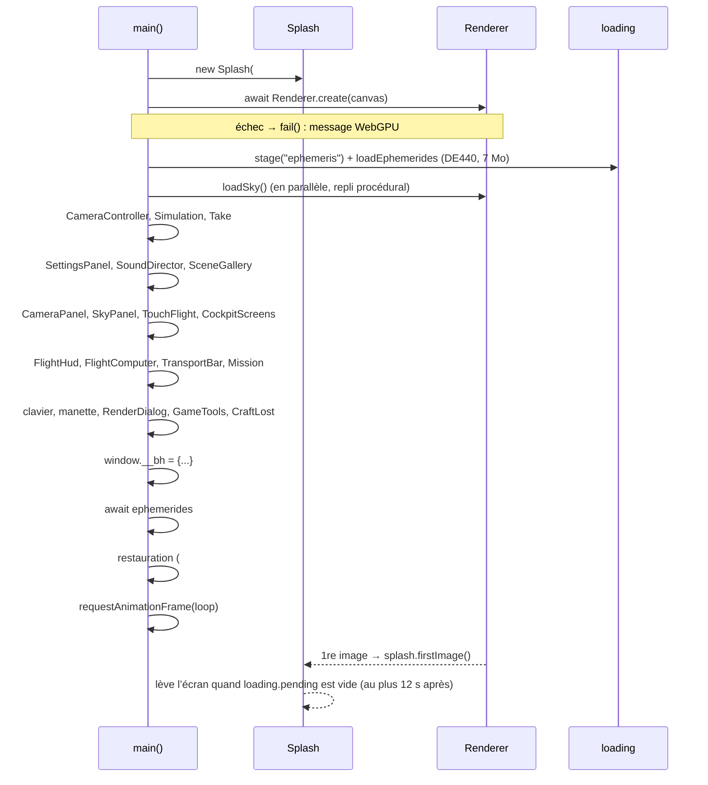
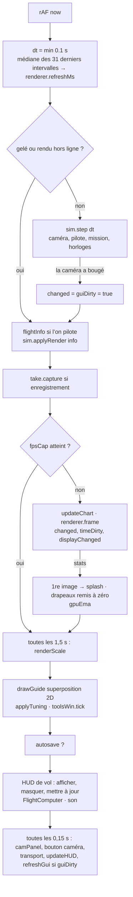

# L’interface : application, réglages, HUD

Ce système est la « peau » de l’application. Il démarre le moteur WebGPU, l’écran de chargement et la
boucle `requestAnimationFrame`. Il tient l’objet `Settings` unique, que tout le reste lit, ainsi que les
scènes prédéfinies, l’annulation et le panneau de réglages généré à partir d’un schéma. Il route chaque
touche, chaque clic et chaque bouton de manette vers la caméra, le pilote ou le temps. Enfin, il dessine
tout ce qui recouvre l’image tracée : la barre d’outils, la barre de transport (le temps), le panneau
caméra, la pastille d’état, les marqueurs de cible et, en vol, le HUD complet du Ranger (instruments,
boule d’attitude, anneau des maintiens et des autopilotes, planificateur, mini‑carte). Le point d’entrée
est `src/main.ts`. Tout le reste de ce document part de lui.

---

## Fichiers

| Fichier | Lignes | Rôle |
|---|---:|---|
| `index.html` | 140 | Squelette DOM fixe : `#view` (canvas WebGPU), `#overlay` (canvas 2D), écran `#loading`, pastille `#hud`, `#panel`, `#toolbar`, dialogue `#render`, `#tip`, `#hint`, `#error`. Charge les polices Google (Inter, JetBrains Mono, Rajdhani), puis `style.css`, `panel.css` et `main.ts`. |
| `src/main.ts` | 2143 | Le câblage de toute l’application : démarrage, routage des réglages, application des scènes, clavier et manette, boucle, résolution dynamique, superpositions 2D, pastille d’état, infobulles, API `window.__bh`. |
| `src/settings.ts` | 751 | Interface `Settings` (≈ 190 clés), `defaultSettings()`, niveaux `QUALITY`, type `Preset`, dictionnaire `presets` (79 scènes). |
| `src/urlstate.ts` | 40 | `loadFromUrl` (lit d’anciens liens `#clé=valeur`) et `saveToUrl` (**plus appelé nulle part**). |
| `src/ui/schema.ts` | 1159 | Description déclarative de chaque réglage du panneau (`SCHEMA`) : section, groupe, type, bornes, échelle, effet, visibilité. Contient aussi `SECTIONS`, `GROUP_SWITCH`, `QUALITY_KEYS`, `SCENE_GROUPS` et `PRESET_INFO` (titres, textes et glyphes des scènes). |
| `src/ui/panel.ts` | 1101 | `SettingsPanel` : panneau généré depuis le schéma, recherche, onglets, annuler/rétablir, préréglages utilisateur, import/export JSON, feuille des raccourcis, toasts. |
| `src/ui/panel.css` | 1039 | Styles du panneau (`.sp-*`). |
| `src/ui/scenes.ts` | 233 | `SceneGallery` : galerie modale des scènes, avec filtres par groupe, recherche et navigation au clavier. |
| `src/ui/scene-thumbs.ts` | 163 | Imports des 79 vignettes `assets/scenes/*.webp`, avec la table nom de scène → URL. |
| `src/ui/splash.ts` | 207 | Écran de chargement (étapes, progression, astuces) et `AssetPill`, la pastille des téléchargements tardifs. |
| `src/ui/transport.ts` | 151 | `TransportBar` : lecture/pause, échelle de distorsion du temps, temps réel, AUTO, horloge, enregistrement d’une prise. |
| `src/ui/camerapanel.ts` | 508 | `CameraPanel` : placements, vues du vaisseau, regard, objectif ou télescope, cibles, mouvement de l’observateur, cinématiques. Exporte `BODY_COLOURS`, `VIEWS`, `VIEW_LABEL`, `fmtHeight`. |
| `src/ui/flighthud.ts` | 3117 | `FlightHud` : tout le HUD de vol (voir § 6). |
| `src/ui/hudkit.ts` | 107 | Code partagé entre le HUD et la carte : couleurs (`OUR_COLOURS`, `COL`), polices, `marker()` et les formats `fmtLen`, `fmtDv`, `fmtDur`. |
| `src/ui/mobile.ts` | 21 | `watchMobile()` pose `body.mobile` et `body.portrait`. |
| `src/ui/nozoom.ts` | 26 | `preventPageZoom()` : la page ne zoome jamais. |
| `src/readouts.ts` | 85 | `physicalReadouts()` : grandeurs physiques du trou noir pour la pastille dépliée. |
| `src/style.css` | 2278 | Styles de l’application et du HUD de vol, mise en page mobile. |

Les fichiers suivants sont cités sans être détaillés ici : `src/ui/map3d/*` (la carte 3D, voir
[docs/MAP.md](../MAP.md)), `src/ui/groundtrack.ts` (globe et planisphère, voir la section *The ground
track* de MAP.md), `src/ui/gametools.ts` et `src/game/tools.ts` (fenêtre F2, voir
[docs/GAME-TOOLS.md](../GAME-TOOLS.md)), `src/ui/skypanel.ts`, `src/ui/telescope.ts`,
`src/ui/targethud.ts`, `src/ui/touchflight.ts`, `src/ui/cockpitscreens.ts`, `src/ui/craftlost.ts`,
`src/ui/fc/computer.ts`, `src/renderdialog.ts`, `src/loading.ts`, `src/sim.ts` et `src/clock.ts`.

---

## Fonctionnement

### 1. Démarrage

`main.ts` s’exécute comme module. Le code de premier niveau fait trois choses :

1. Il appelle `preventPageZoom()` et `watchMobile()`.
2. Il construit l’objet unique **`settings`** :
   `sanitize({ ...defaultSettings(), ...loadFromUrl(defaultSettings()) })`.
   `loadFromUrl` ne garde que les clés connues et convertit chaque valeur selon le type du défaut
   (nombre, booléen, `"auto"` ou entier pour `realtimeSubsampling`). `sanitize` remet le défaut à la
   place de tout choix absent du schéma, de tout nombre non fini, de toute couleur qui n’a pas la forme
   `#rrggbb` et de toute qualité inconnue.
3. Il appelle `main()`, qui est asynchrone.

L’objet `settings` est **un objet mutable partagé** : la caméra, le moteur de rendu, le pilote, le son
et le HUD en gardent tous la même référence. Pour changer un réglage, on écrit dans l’objet puis on
signale le changement (voir § 2).

Points importants :

- **Ordre des constructions.** `onSettingsChange` et `applyPreset` sont des déclarations de fonction
  hissées, mais elles utilisent des `const` (`panel`, `audio`, `camera`, `mission`, `tools`…) déclarées
  plus loin dans `main()`. L’ordre fonctionne parce qu’aucun rappel n’est déclenché avant la fin de la
  construction. Avant de déplacer un bloc, vérifiez qu’il n’appelle pas une fonction qui touche une
  constante pas encore initialisée (ce serait une erreur TDZ).
- **Perte du GPU.** `renderer.onLost` fait une sauvegarde automatique si `settings.autosave` est vrai,
  ajoute `body.gpu-lost` et affiche un bouton *Reload*. `renderer.onGpuError` affiche un toast (le
  `try/catch` couvre le cas où le panneau n’existe pas encore).
- **Restauration** (`main.ts:1681`). Elle attend les éphémérides : sans elles, un vaisseau placé près
  d’une planète la verrait bouger sous lui. L’ordre de priorité est :
  1. `#save=…` : un vol partagé, via `saveFromHash` puis `tools.load` ;
  2. `#scene=<nom>` : une scène, via `applyPreset` ;
  3. un hash vide et une sauvegarde automatique présente : `autosave.get()` puis `tools.load`.

  Ensuite le hash est effacé avec `history.replaceState`. Un ancien lien contenant des réglages
  (`#spin=0.5&…`) a déjà été lu par `loadFromUrl` à l’étape 2 du démarrage.
- **Écran de chargement** (`splash.ts`). L’animation du trou noir est faite en CSS pur (transformations
  et opacité), pour continuer à tourner pendant que le thread principal compile les pipelines. La barre
  ne recule jamais : `shown = max(shown, p)`. Elle plafonne à 0,97 tant qu’aucune image n’est sortie.
  Après la première image, l’écran se lève dès que `loading.pending` est vide, ou au plus tard au bout
  de `MAX_WAIT = 12 s`. Le bouton « Enter now » apparaît au bout de 9 s s’il y a déjà une image.
  `splash.gone` est une promesse ; le panneau s’en sert pour retenir ses toasts (`panel.holdToasts`)
  jusqu’à ce que l’écran soit parti. Si `#loading` n’a pas de `.ld-bar` (rechargement à chaud après la
  levée), le splash se considère comme déjà levé.
- **Indice de première visite** (`#hint`). Il s’affiche 1,2 s après le démarrage, sauf sur un écran
  tactile (`hover: none`) ou si la clé `kerr.hint-seen` existe. Il disparaît au premier clic ou au
  premier coup de molette, ou au bout de 12 s.

### 2. Le modèle de réglages

#### 2.1 `Settings`, défauts et qualité

`Settings` (`settings.ts:57`) est un objet plat. Ses unités suivent la physique du moteur :

- les longueurs sont en **M = GM/c²** ;
- le temps de scène est en **M = GM/c³**, et `timeSpeed` en M par seconde réelle ;
- les angles sont en degrés et les vitesses en fractions de c ;
- `massSolar` ne sert qu’à convertir vers les unités physiques. 1 M vaut 1476,625 m × `massSolar`, et
  1 M de temps vaut 4,925490947 µs × `massSolar`. Ces constantes reviennent partout dans le HUD.

`QUALITY` (`settings.ts:34`) regroupe les budgets d’intégration et d’échantillonnage de six niveaux :
`low`, `medium`, `high`, `ultra`, `realtime` (« RT max », environ 15 i/s, budget GPU de 60 ms) et
`game` (environ 60 i/s, budget de 16 ms, `dynamicResolution: true`). Choisir un niveau fait
`Object.assign(settings, QUALITY[q])`. Si l’une des clés de `QUALITY_KEYS` (`realtimeEps`,
`realtimeSteps`, `qualityEps`, `qualitySteps`, `targetSpp`, `adaptiveIntegrator`,
`integratorTolerance`, `noiseThreshold`) ne correspond plus au niveau choisi, le panneau allume
« Custom ».

#### 2.2 Le routage d’un changement : `onSettingsChange(keys)`

Toute modification qui passe par une interface (panneau, panneau caméra, panneau du ciel, outils F2,
annulation) aboutit à `onSettingsChange(keys)` (`main.ts:212`). La fonction traite d’abord trois
réglages qui demandent une action :

- **`anchor`** : la valeur demandée est d’abord remise à l’ancienne, puis `switchAnchor` réexprime la
  caméra autour de l’autre objet en gardant la vue. Si c’est impossible, la caméra reste sur l’ancrage
  actuel.
- **`rotation`** : `camera.setRotation`.
- **`target`** : la valeur précédente (`previousTarget`) est remise, puis `camera.selectTarget(want)`.
  Si la cible n’est pas dans cet univers, un toast le dit et la cible reste inchangée.

Ensuite, pour chaque clé, le champ **`effect`** du schéma (par défaut `"scene"`) décide de ce qu’il
faut refaire :

| `effect` | Conséquence |
|---|---|
| `scene` | `changed = true` : le tracé est refait et l’accumulation repart de zéro. |
| `display` | `displayChanged = true` : seule la résolution finale est refaite (exposition, tonemap, bloom, profondeur de champ, apparence de la coque…). |
| `resize` | `resize()` : seul `pixelRatio` est dans ce cas. |
| `none` | Rien côté rendu (temps, son, réglages de jeu, carte du ciel…). |

Une clé absente du schéma vaut `scene`, sauf `quality` qui vaut `none`. Après cette boucle :
`distance` et `whL` appellent `camera.sync()`, toute clé `sound*` appelle `audio.applyMix()`, puis on
appelle `syncButtons()` et `scheduleUrlSave()` (voir § 3.4).

Si vous changez `settings` en dehors de ce chemin (raccourcis clavier, `__bh`), appelez vous‑même
`touch()`, `refreshGui()` et au besoin `resize()`. Les gestionnaires clavier de `main.ts` le font.

#### 2.3 Les scènes (`presets`) et `KEEP_ON_PRESET`

Un `Preset` (`settings.ts:476`) est un `Partial<Settings>` qui peut porter en plus :

- `time` : le temps de scène de départ, en M ;
- `mission` : lance la mission automatique (`mission.ts`) ;
- `pose` : un placement calculé à l’application. Les valeurs possibles sont `"saturn"`, `"earth"`,
  `"earthGround"`, `"earthMoon"`, `"iss"` et `"fleet"`, ou un `BodyView` de `system/our-side.ts`
  (corps, `at` [lat, lon], `altKm`, `look`, `off`, `tilt`, `phase`, `holeEl`, `holeAz`…) ;
- `issDistance` et `issOffset` pour la pose `iss`.

Les scènes sont composées par étalement d’objets : `EARTH_VIEW` (le système Gargantua à 10⁸ M☉, la
bouche du trou de ver près de Saturne, `timeSpeed = 1/492,549` soit le temps réel, exposition
automatique, Ranger en moteur *crew* à 2 g), `WORLD_VIEW`, `GARGANTUA_WORLD` et `GARGANTUA`. Les dates
se comptent depuis `T0 = 109,6 M`, le départ du jeu (2067‑01‑01 15:00 UTC, à une pleine Lune) ;
`DAY = 86400/492,549 M`. Les scènes datées réellement (éclipse de Burgos, Yosemite…) calculent `time`
à partir d’un `Date.UTC(...)` et de la même constante.

`applyPreset(name)` (`main.ts:290`) se déroule ainsi :

1. Il retient la scène courante, réinitialise l’historique temporel du rendu et arrête la mission.
2. Il sauvegarde les clés de **`KEEP_ON_PRESET`** (`main.ts:94`). Ce sont les choix de rendu et de
   performance, le comportement du jeu, le son et la carte du ciel, qui doivent **survivre** à un
   changement de scène. Puis il fait
   `Object.assign(settings, defaultSettings(), keep, preset)` : on repart des défauts, on remet les
   préférences gardées, puis on applique la scène.
3. Cas particulier : quand la scène précédente avait une `pose`, c’est‑à‑dire qu’elle était exposée pour
   notre côté (Saturne au soleil, environ 21 IL au‑dessus du disque), `exposure` et `bgIntensity` ne sont
   **pas** gardées (variable `exposedForOurSide`).
4. Il active le vaisseau (`fleet.active`, `setMountVessel`) puis calcule la pose. Il y a quatre
   branches :
   - sol d’un monde de Gargantua : `theirGroundPose`, nez à l’horizontale, regard levé vers Gargantua ;
   - orbite d’un monde de Gargantua : `theirOrbitPose`, regard vers le bas puis incliné de `tilt` ;
   - un de nos corps : `bodyView`, puis `setHomePose`, et le trépied si l’on est posé sans vaisseau ;
   - une pose nommée (Terre, ISS, flotte, Saturne).

   Le regard est ensuite orienté par `aimAt()`. Cette fonction fait jusqu’à 12 corrections calculées
   sur le CPU (aucun rendu n’est attendu) pour amener le corps au centre de l’image, aberration et
   montage compris, puis ajoute le décalage `off` en [lacet, tangage]°.
5. Il fixe le temps, coupe les cinématiques, met le Ranger en pilotage si `ship` est vrai et place la
   flotte (`fleetStart`). Puis il démarre la mission éventuelle, affiche le toast propre aux scènes
   `game:*`, et appelle `refreshGui()`, `touch()`, `touchDisplay()` et `scheduleUrlSave()`.

La galerie et le panneau passent par `panel.applyScene(name)`, qui encadre `applyPreset` par
`begin()`/`commit()`. Changer de scène compte donc pour **une seule étape d’annulation**. Mais
l’annulation ne restaure que les clés de `Settings`. Elle ne revient ni sur l’état de la caméra
(pilotage, gravité, ancrage) ni sur la flotte ou la mission.

La métadonnée d’affichage d’une scène (titre, description, glyphe, groupe) est dans `PRESET_INFO`
(`schema.ts:1079`), et sa vignette dans `SCENE_THUMBS`. Une scène sans entrée `PRESET_INFO` tombe dans
le groupe `hole` avec son nom brut comme titre.

#### 2.4 Le panneau généré depuis le schéma (`panel.ts`, `schema.ts`)

Chaque `ControlDef` du schéma décrit une ligne du panneau :

- `type` : `number` (curseur et champ texte), `toggle`, `choice` (segmenté ou `select`) ou `color` ;
- `section` : un des sept onglets `camera`, `scene`, `matter`, `sky`, `physics`, `render`, `game` ;
- `group` : un sous‑titre repliable ;
- `help` et `keywords` : alimentent la recherche ;
- `advanced` : la ligne est masquée hors du mode « Advanced » ;
- `visible(s)` et `enabled(s)` : prédicats évalués à chaque rafraîchissement ;
- `effect` : voir § 2.2 ;
- pour les nombres : `min`, `max`, `step`, `scale: "log"`, `unit`, `offAtZero`, `precision`.

Un curseur logarithmique va de 0 à 1000 : `v = min·(max/min)^(x/1000)`, arrondi à `precision`
chiffres significatifs. Le champ texte accepte `36`, `1e-5`, `6.5×10^9`, `0,5`, et `off` quand
`offAtZero` est vrai. Les flèches ↑ et ↓ changent la valeur d’un pas ; avec ⇧ c’est ×10, avec Alt ×0,1
(sur une échelle log, un pas vaut ×10^0,02).

`GROUP_SWITCH` place l’interrupteur général d’une physique dans l’en‑tête de son groupe : `disk`,
`jet`, `hotFlow`, `polarization`, `hotSpot`, `wormhole` et `sun`. C’est pourquoi `disk`, `jet` et
`hotFlow` n’ont pas de ligne propre dans `SCHEMA`. Deux clés de `Settings` restent sans aucun contrôle :
`quality` (pilotée par la barre de qualité) et `flowPeriod` (qui n’est plus un réglage).

Le rendu est simple. `renderBody()` reconstruit les lignes de l’onglet courant, ou de tous les onglets
si une recherche est en cours. Chaque ligne enregistre une fonction `updater` qui relit `settings`.
`refresh()` appelle tous les updaters ; c’est ce qui garde le panneau synchrone quand la caméra ou un
raccourci change une valeur.

La **recherche** est déclenchée par ⌘K ou Ctrl+K. Chaque mot tapé doit apparaître dans la chaîne
`label groupe section help keywords clé`. Les scènes correspondantes sont proposées en tête (6 au plus,
puis un lien vers la galerie).

L’**annulation** fonctionne par instantanés :

- `begin()` prend un `structuredClone(settings)` (`pending`), si aucun n’est déjà en cours ;
- `commit()` compare toutes les clés à cet instantané et empile la liste des différences
  (`{key, before, after}`). La pile est limitée à 200 entrées et un nouveau commit vide la pile de
  rétablissement ;
- un glissement de curseur ne produit qu’une entrée : `begin` au `pointerdown`, `set(..., false)`
  pendant `input`, `commit` au `change`. Un `pointerup` n’importe où dans la page appelle aussi
  `commit()` ;
- ⌘Z / Ctrl+Z annule, ⇧⌘Z / Ctrl+Y rétablit, et `applyValues` renvoie les clés touchées à
  `onSettingsChange`.

Les **préréglages utilisateur** sont stockés dans `localStorage["kerr.userPresets.v1"]`. Chacun contient
les différences avec les défauts, sans `pixelRatio`, et se réapplique par-dessus les défauts. Le menu
« ⋯ » propose : copier un lien de partage, exporter ou importer un JSON
(`{format: "kerr-gr-settings", version: 1, settings}`), la feuille des raccourcis, la connexion d’une
manette en WebHID et « Reset everything » (annulable). L’import ne garde que les clés connues, et
seulement si le type correspond.

L’état de l’interface (onglet, mode avancé, groupes repliés, panneau fermé) est stocké dans
`kerr.panel.v1`. Le panneau démarre **fermé** tant que l’utilisateur ne l’a jamais ouvert, et toujours
fermé sous 800 px de large.

Le toast `panel.toast(msg)` est **le** canal de messages de toute l’application : main, caméra, pilote,
mission, outils. Il reste affiché 2,2 s et le message suivant remplace le précédent.

### 3. La boucle principale (`loop`, `main.ts:1525`)

#### 3.1 Les drapeaux de rendu

Trois booléens transmis à `renderer.frame(settings, sim.time, changed, sim.timeDirty, displayChanged)`
déterminent le travail du GPU :

- `changed` : la scène ou la caméra a changé (posé par `touch()`) ;
- `sim.timeDirty` : le temps de scène a avancé ;
- `displayChanged` : seule la résolution finale doit être refaite.

Ils ne sont remis à zéro **que si** `frame` renvoie des statistiques. Quand le moteur est occupé
(images en vol, perte du GPU, toile pas encore redimensionnée), il renvoie `null` et la demande reste
en attente pour le tour suivant. `fpsCap` saute des tours : pas de nouvelle image avant
`1000/fpsCap − 0,25 × refreshMs` ms.

#### 3.2 Le pas de simulation

`Simulation.step(dt)` (`sim.ts`) est le **même code** pour la boucle en direct, l’automatisation
(`__bh.step`) et la vidéo. Il fait avancer la caméra, le vaisseau et ses autopilotes, puis la mission.
Si le temps tourne, le temps de scène avance de `dt × timeSpeed`, ou prend l’horloge du vaisseau
(`camera.shipClock()`, utilisée « sur rails »). L’horloge de lecture `play` avance aussi : c’est elle qui
anime les flammes et les vagues de la gorge liquide. `applyRender(info)` transmet au moteur ce qu’il
dessine du vol : pose du vaisseau, poussée, plasma de rentrée, tremblement de caméra et trajectoire
prédite.

#### 3.3 La résolution dynamique

La résolution dynamique n’est active que si `dynamicResolution` est vrai (qualité *Game*), si
`realtimeSubsampling` vaut `"auto"` et si aucun rendu hors ligne n’est en cours.

- `renderScale` varie entre 0,5 et 1 par pas de 1/8. Il est réévalué toutes les 1,5 s.
- `gpuEma` est une moyenne glissante du temps GPU : 0,9 × ancienne valeur + 0,1 × nouvelle.
- `scaleMs` mémorise le temps mesuré à chaque échelle pendant 30 s.
- Une échelle n’est jugée qu’après 3 s de stabilité (`scaleHeld`), car ses premières images
  reconstruisent leurs cibles.
- **Baisser** : il faut `gpuEma > 1,2 × budget`, un sous‑échantillonnage déjà grossier
  (`realtimeBlockNow ≥ 4`), et une échelle plus basse jamais mesurée ou mesurée au moins 10 % plus
  rapide.
- **Monter** : l’échelle supérieure a été mesurée sous `max(0,85 × budget ; 1,1 × gpuEma)`. Sans mesure
  récente, on estime le coût en le multipliant par le rapport des aires, `(higher/renderScale)²`, et
  on monte si le résultat reste sous `0,85 × budget`.

Ces précautions existent parce qu’une image plus petite n’est pas toujours plus rapide : le temps peut
être pris par la composition du navigateur. Une échelle plus basse doit **prouver** qu’elle fait gagner
du temps.

`resize()` calcule `ratio × renderScale` et fixe la taille du canvas. Avec la résolution dynamique, le
ratio est d’abord plafonné au budget de pixels du palier matériel :
`cappedRatio(pixelRatio, w, h, tier.capMpx) = min(ratio, √(capMpx·10⁶ / (w·h)))`. L’overlay 2D reste
toujours à `devicePixelRatio`. Un `ResizeObserver` sur `#view` appelle `resize()`.

#### 3.4 Sauvegarde automatique et le piège de `scheduleUrlSave`

L’URL ne porte plus l’état. La sauvegarde se fait dans le navigateur (`game/save.ts`).
`scheduleUrlSave()` ne fait que `saveSoon = true`. La boucle sauvegarde si `settings.autosave` est vrai,
si une première image existe, si aucun rendu hors ligne n’est en cours, **et** si l’une de ces deux
conditions est remplie : `saveTimer > autosaveEvery`, ou bien `saveSoon` et `saveTimer > 2 s`. Il y a
aussi une sauvegarde au `pagehide`, qui libère en plus la mémoire GPU (`renderer.release()`) quand la
page ne part pas dans le bfcache.

#### 3.5 Les mises à jour lentes (toutes les 0,15 s)

Toutes les 0,15 s, la boucle :

- applique `body.glass-blur` ;
- rafraîchit `camPanel.refresh()` (bon marché tant que sa clé ne change pas), `syncCameraButton()` et
  `transport.update()` (qui compare une clé avant de toucher au DOM) ;
- met à jour la pastille d’état `updateHUD()` ;
- si `guiDirty` est vrai, appelle `refreshGui()` et `scheduleUrlSave()`.

### 4. Entrées : clavier, souris, manette

**Clavier.** Le gestionnaire global `keydown` de `main.ts:1107` traite les touches dans cet ordre :

1. Il ignore les champs de saisie (`isTyping`), ⌘ et Ctrl.
2. **F2** ouvre les outils de jeu.
3. **En vol** (`flying()` = pilotage, pas de cinématique, pas de rendu hors ligne), `pilotKey(e)` passe
   en premier. Il gère les maintiens 1 à 7, les autopilotes 8, 9, 0, G, U, B et ⇧G, SAS (T), roulis (R),
   ⇧R, ⇧Y, Z/X (plein gaz ou coupure), Caps Lock (mode précision), `²`/`` ` `` (densité du HUD),
   M (carte), O (planificateur), V/⇧V, Échap, F/⇧F (loi de vol, antigravité), P/⇧P (volets,
   aérofrein), [ et ] (vaisseau piloté). Les touches tenues (I J K L H N, Alt, Maj, flèches) sont
   absorbées ici ; le contrôleur les lit à chaque image.
4. **Temps, dans tous les modes**, par code physique : Espace (lecture/pause), `,` et `.` (plus lent,
   plus rapide), `/` (temps réel). Sur AZERTY ce sont `;`, `:` et `!`.
5. Si `e.code` est une touche de vol (`FLIGHT_KEYS` : WASD/QE/ZX par position, donc ZQSD/AE/WX sur
   AZERTY), la fonction s’arrête là.
6. Le reste se lit par `e.key` : H, R/⇧R, Tab, P, F, V, C, Y, O, ⇧C, T, ⇧T, B, G, N/⇧N, U, J, L, K/⇧K,
   I, ?, Échap, et 1 à 6 pour la qualité.

Le panneau a son propre gestionnaire (`panel.onKey`) : ⌘Z, ⇧⌘Z, Ctrl+Y, ⌘K, et M pour le basculer. Le
prédicat `panel.flightKeys` lui retire M en vol, car c’est alors la carte ; ⇧M ouvre le panneau. La
galerie de scènes est modale : elle arrête la propagation de tous ses `keydown` et `keyup`.

**Souris sur la vue.** Les gestes de caméra appartiennent à `controls.ts`. `main.ts` n’ajoute que le
survol de la carte du ciel : `pickChart()` sur une tolérance de 14 px CSS allume la constellation
survolée et affiche la carte d’une étoile.

**Manette.** `camera.onPadAction` reçoit des actions abstraites (`focus`, `gravity`, `auto`,
`rotation`, `prevTarget`…). En vol, elles sont réaffectées : A pour le SAS, B coupe le moteur, X et Y
pour prograde et rétrograde, la croix ▲▼ pour les vues. Les notifications de connexion attendent 900 ms
avant de s’afficher, parce que Safari déconnecte puis reconnecte une manette en changeant de
fournisseur interne.

**Écran tactile.** `TouchFlight` (manche, gaz, roulis) n’est actif qu’en vol, sur pointeur grossier,
hors vue libre, sans planificateur ouvert et sans interface masquée.

### 5. La barre d’outils, la barre de transport, le panneau caméra, les superpositions

**Barre d’outils** (`#toolbar`). Ses boutons sont branchés par la table `actions` de `main.ts:391` :
scènes, caméra, jet, Ranger, cinéma (gorge liquide), guide d’ombre, ciel, outils, son, rendu, PNG,
plein écran, masquer, aide. `syncButtons()` met à jour leurs états `active` et `muted`. Le bouton caméra
affiche la vue et la cible ; `--body` le teinte de la couleur du corps visé. Si la barre déborde, la
molette verticale la fait défiler latéralement (`wheelScrollsSideways`), car les souris Windows n’ont
pas de molette horizontale. En vol, la barre est masquée (`body.piloting #toolbar`) ; le bouton « ⋯ »
de la barre de mission la fait revenir (`body.show-tools`).

**Barre de transport** (`transport.ts`). C’est un seul widget, **déplacé** selon le contexte :

- hors vol, dans `#tp-dock` au-dessus de la barre d’outils ;
- en vol, dans `flightHud.transportSlot`, en mode `compact` (sans l’horloge, que le HUD affiche).

La boucle fait le déplacement quand `flightHud.visible` change. Le bouton de distorsion ouvre un menu
avec tous les échelons de `warpLadder(settings)` : des multiples du temps réel, puis l’échelle
« classique ». Au‑delà de 500 M/s, le vaisseau est « sur rails ». Le sous‑titre affiche, dans l’ordre
de priorité : le mode de distorsion d’une manœuvre (`auto`, `held`, `manual`), puis la note des rails,
puis la valeur en M/s. Le bouton AUTO (`settings.autoWarp`) n’apparaît que si un plan existe. Pendant
l’exécution d’une manœuvre en distorsion automatique, `autoWarpHeld()` refuse toute distorsion
manuelle. ● lance ou arrête une **prise** (`take.ts`) : la session en direct est enregistrée, plafonnée
à 10 min, puis peut être rendue en vidéo depuis Render › Video.

**Panneau caméra** (`camerapanel.ts`, `#cam-pop`). Il réunit au même endroit :

- sans vaisseau : les cinq placements (`VIEWS` : `orbit`, `follow`, `free`, `tripod`, `fall`) et
  « poser sur le sol » (⇧T) ;
- avec vaisseau : les points d’attache `MOUNTS`, groupés en « sur le vaisseau » et « dehors » ;
- le regard (verrou sur la cible C, télescope Y, regard souris, mise à niveau) ;
- l’objectif : un curseur logarithmique en **focale 35 mm**, `fov = 2·atan(12/f)` (12 mm est la
  demi‑hauteur d’un capteur 24 × 36). La plage va de 8 mm jusqu’à `focalLength(1)` pour un objectif,
  et de 300 mm jusqu’à `focalLength(TELE_MIN)` au télescope ;
- les cibles par catégorie, avec recherche, « Frame », « Go to » et « Stand on » ;
- le mouvement de l’observateur relativiste (seulement près du trou et hors chute libre) ;
- les cinématiques.

Le panneau ne se reconstruit que si sa clé change (vaisseau, montage, vue, verrou, télescope, cible,
mode vol, cinématique, mouvement, région, cibles disponibles). Le reste du temps, seule sa ligne d’état
est mise à jour. Les actions passent par des dépendances injectées (`setView`, `setMount`, `goTo`,
`standOn`, `changed` → `onSettingsChange`).

**Superpositions 2D** (`drawGuide`, `#overlay`). Le canvas `#overlay` est redessiné **seulement si sa
clé change**. Cette clé concatène la pose, le FOV, les marqueurs, le survol, le télescope et la clé de
la carte du ciel. La superposition contient :

- les mots de la carte du ciel ;
- le réticule du mode vol souris ;
- le télescope (`ui/telescope.ts`) ;
- le verrou de ciblage (`ui/targethud.ts`), ou à défaut les crochets de cible ;
- le nom du corps survolé ;
- le marqueur du vaisseau vu de l’extérieur (losange et distance, ou flèche au bord de l’écran) ;
- la **courbe critique analytique** quand `shadowGuide` est vrai (`criticalCurveDirections` et
  `projectLook` de `shadow.ts`).

Hors vol, les marqueurs s’estompent : ils restent pleins 1,6 s après la dernière manipulation de la
caméra (`camera.activity`), puis s’effacent en 0,8 s.

**Pastille d’état** (`#hud`, `updateHUD`). Elle affiche la phase de rendu (Live, Refining x/spp,
Converged, Rendering %), des puces (cinématique, vue, télescope, manette) et une barre de progression.
Une fois dépliée (touche I, état gardé dans `kerr.hud`), elle montre aussi la taille de l’image, le
temps GPU, le ratio rayon/pixels ou les spp, la position, le temps et les **grandeurs physiques** de
`readouts.ts`, calculées avec les constantes CODATA 2018 :

- r₊ = 1 + √(1 − a²) et r₋ = 1 − √(1 − a²) ;
- l’aire A = 4π(r₊² + a²) ;
- la gravité de surface κ = (r₊ − r₋)/(2(r₊² + a²)), et T_H = ħc³κ/(2π k_B G M) ;
- l’entropie S = k_B A c³/(4Għ) ;
- Ω_H = a/(2r₊) et M_irr = √(r₊² + a²)/2 ;
- le rendement η = 1 − E_isco (Novikov–Thorne) ;
- la période à l’ISCO 2π(r^1,5 + a) ;
- la durée d’évaporation, avec l’estimation de Schwarzschild ;
- côté observateur : le lapse et la vitesse de rotation du référentiel au point de la caméra.

**Infobulles.** Il en existe trois systèmes indépendants :

- `#tip` de `main.ts`, délégué sur `[data-tip]`, hors `.fl-root`, avec un délai de 280 ms ;
- `.sp-tooltip` du panneau, sur `[data-help]` ;
- `.fl-tip` du HUD de vol, qui reprend aussi les attributs `title` et gère des « régions » sur les
  canvas d’instruments.

Aucun des trois ne s’affiche sur un écran sans survol.

### 6. Le HUD de vol (`flighthud.ts`)

#### 6.1 Cycle de vie

`FlightHud` est construit une fois. Son DOM est créé d’un coup et rattaché à `body` :

- `.fl-hud` : un canvas plein écran pour les marqueurs et les rubans ;
- `.fl-root` : les panneaux. On y trouve `.fl-warn` (alertes), `.fl-airdata`, `.fl-mission` (barre du
  haut), `.fl-dock`, `.fl-target`, `.fl-tel` (Ranger et télémétrie), `.fl-plan` (planificateur),
  `.fl-orbit`, `.fl-cockpit` (boule d’attitude et anneau), `.fl-right` (carte), et les menus de vue et
  de vaisseau.

`flightHud.attach(flightComputer.root)` ajoute la couche de l’ordinateur de vol dans `.fl-root`.

La boucle appelle `show(pil)` quand l’état de pilotage change : cela bascule `body.piloting` et remet
à zéro la traînée, les échantillons et le chronomètre. Ensuite, à chaque tour **qui a rendu une image**
(`if (st || !flightHud.drawn)`), elle appelle `flightHud.update({...info, probe, status}, sim.time)`.
Les marqueurs restent ainsi calés sur l’image affichée et non sur une pose en avance d’une ou deux
images. `info` vient de `camera.flightInfo()`, `status` de `rangerStatus()` (`game/status.ts`) et
`probe` de `renderer.planetProbes` (l’éclairement reçu par la cible).

#### 6.2 Ordonnancement : un instrument par image

`update()` :

1. enregistre l’échantillon courant (`record`) et le transmet au tracé au sol (`ground.observe`) ;
2. dessine **à chaque image** les marqueurs et les rubans (`drawHud`), les données d’air et l’aide à
   l’amarrage, qui sont mises en cache par clé ;
3. choisit **une seule** tâche parmi les instruments, la plus en retard. Chaque tâche `[nom, Hz, fn]`
   reçoit un score `(now − drawnAt) × Hz / 1000`, c’est‑à‑dire le nombre de périodes écoulées depuis
   son dernier dessin, et celle qui a le score le plus haut (≥ 1) est dessinée.

| Tâche | Fréquence | Densité |
|---|---:|---|
| `ball` : boule d’attitude | 20 Hz | 0 et 1 |
| `instr` : instruments Cible et Ranger | 15 Hz | 0 |
| `tel` : télémétrie (la dernière minute) | 10 Hz | 0 |
| `orbit` : panneau d’orbite | 10 Hz | 0 |
| `map` : carte 3D ou tracé au sol | 20 Hz (carte 3D) ou 15 Hz / 30 Hz en plein écran (tracé au sol) | 0 |
| `text` : panneaux texte, planificateur, barre de mission, alertes, boutons | 10 Hz | toutes |

La carte en plein écran (M) et ses animations sont dessinées à chaque image, hors tâches ; c’est aussi
le cas du globe pendant qu’on le fait tourner. Le commentaire du code justifie ce choix : un HUD complet
redessiné 60 fois par seconde coûtait environ 6 ms par image.

#### 6.3 Densité

`density` vaut 0 (complet), 1 (minimal) ou 2 (épuré). Elle se change avec la touche `²` ou `` ` ``
(code `Backquote`) ou le bouton de la barre de mission, et elle est mémorisée dans `kerr.hud-density`.
Sur téléphone, la valeur par défaut est 1. `setDensity` (utilisé par la mission automatique, qui force
2 puis restaure) ne mémorise rien. Le CSS applique la densité à partir de `.fl-root[data-density]` :

- 1 masque `.fl-tel`, `.fl-orbit`, `.fl-right` et `.fl-target` ;
- 2 masque tout sauf `.fl-warn` et `.fl-mission`.

Les marqueurs du canvas `.fl-hud` restent visibles dans toutes les densités. Les rubans disparaissent à
la densité 2 (`density < 2` dans `drawHud`).

#### 6.4 Les instruments

- **Marqueurs dans la vue** (`drawHud`). La projection reprend celle de la caméra : x = d·x/(d·z ·
  tan(fov/2) · aspect), puis le même calcul en y. On y trouve : le nez (le chevron doré, troisième
  colonne de la matrice `S`) ; le vecteur de trajectoire dans l’air (`air.u`, vert, rouge en
  décrochage) ; prograde et rétrograde ; la combustion ou le nœud ; prograde et rétrograde relatifs à
  la cible ; le port d’amarrage. Chaque marque est tracée deux fois, d’abord avec un contour sombre
  pour le ciel clair, puis dans sa couleur.
- **Ruban de vitesse** (à gauche). Il va de 0 à une pleine échelle « ronde » (1, 2, 2,5, 5 × 10ⁿ)
  au-dessus de la vitesse et de la consigne de l’autopilote. L’unité est le **c** au‑dessus de 1 % de
  c, le km/s au‑dessus de 2 km/s, le m/s sinon. L’échelle change quand la vitesse dépasse 90 % ou
  tombe sous 30 % de la pleine échelle, avec un lissage logarithmique de facteur 0,18. Une zone rouge
  marque 0,95 à 1 c, un repère la consigne, un trait la tendance sur une seconde. La vitesse est donnée
  par rapport au ZAMO, au corps de la sphère d’influence, ou à la cible quand `speedMode` vaut
  `target`.
- **Ruban d’altitude** (à droite). Il en existe deux versions :
  - `bodyAltTape` près d’un corps : hauteur au‑dessus du sol en m ou km, avec le périapside,
    l’apoapside et la vitesse verticale ;
  - `altTape` près du trou : r sur une échelle **logarithmique** (0,75 × la hauteur du ruban par
    décade), avec les repères HORIZON, PHOTON, ISCO, STAR, Pe et Ap, une zone rouge sous l’horizon et
    une barre de v_r (±0,1 c sur une demi‑hauteur).

  Les rubans se placent dans la bande libre entre les panneaux, mesurée avec `getBoundingClientRect`.
  S’il reste moins de 110 px (90 px sur téléphone), le ruban n’est pas dessiné.
- **Cible** (`drawTargetInstr`). Un oscilloscope de relèvement montre l’angle de la cible par rapport
  au nez : 0 au centre, 180° sur le bord, cercle creux si la cible est derrière. Il est accompagné du
  nom, de la distance, d’une barre du taux de rapprochement à deux sens (échelle log10(1 + m/s)/4,5),
  du point d’approche le plus proche et, près du sol, des valeurs d’atterrissage (ALT, V/S, GND, T/W).
  Les infobulles du canvas viennent de « régions » enregistrées pendant le dessin.
- **Ranger** (`drawRangerInstr`). Il montre l’altitude et la vitesse, une barre des apsides (impact si
  Pe < 0, ∞ si l’orbite est ouverte), trois cadrans (inclinaison, excentricité dessinée à la vraie
  forme, fraction de période écoulée) et le prochain événement. Le titre du panneau donne le vaisseau
  piloté et ceux qui y sont amarrés, avec la masse de l’ensemble.
- **Panneau d’orbite** (`drawPotential`). Autour d’un corps, `drawKepler` dessine l’orbite à l’échelle :
  la position du vaisseau vient de l’anomalie moyenne, résolue par Newton sur l’équation de Kepler en
  12 itérations, avec des repères tous les douzièmes de période et l’impact au sol. Près du trou,
  `drawWell` trace le **potentiel effectif de Kerr**. À partir de l’équation radiale
  (Σ dr/dτ)² = R(r) = [E(r² + a²) − aL]² − Δ[r² + (L − aE)² + Q], avec Δ = r² − 2r + a², V(r) est
  l’énergie qui annule R, sur la branche future (racine positive de A·E² + B·E + C = 0). Le vaisseau
  évolue là où E ≥ V(r). Le tracé montre aussi la ligne E = 1 (libération), la sphère des photons γ et
  l’ISCO.
- **Télémétrie** (`drawTelemetry`). Quatre courbes sur 60 s, échantillonnées toutes les 0,1 s en temps
  mural : vitesse, altitude, dτ/dt et poussée en g. Les échantillons sont effacés quand on passe des
  unités SI (près d’un corps) aux unités géométriques. Le facteur g vaut c²/(1476,625 m · massSolar) /
  9,80665.
- **Boule d’attitude** (`drawBall`). Elle est calculée **pixel par pixel sur le CPU** dans un
  `ImageData` limité à 1,5× la résolution CSS : ciel bleu du côté radial‑sortant, sol brun, horizon
  blanc, latitudes tous les 30°. Autour d’elle, deux arcs (gaz à gauche, qu’on peut faire glisser
  dans les 30 % gauches de la boule ; charge g par rapport à la poussée maximale à droite), les taux de
  rotation en tangage et en lacet, et les marqueurs orbitaux. Ceux qui sont derrière sont ramenés au
  bord, à 40 % d’opacité. L’**anneau** est fait de boutons DOM disposés sur un cercle de rayon 118 px :
  les neuf maintiens d’attitude à gauche, à partir de 108° tous les 14,5° ; SAS, roulis, les six
  autopilotes et le mode de vitesse à droite, à partir de 72° tous les 15°. Une lunette SVG porte les
  libellés ATTITUDE et AUTOPILOT en `textPath`. Les boutons inapplicables sont grisés (`.off`) et leur
  infobulle donne la raison (`data-why`).
- **Barre de mission**. Elle contient les puces SAS, HOLD et AUTO (cliquer dessus libère ce qui est
  engagé), le transport, quatre horloges (τ du vaisseau, t lointain, le rapport τ/t et « Earth + » =
  t − τ depuis la prise des commandes), puis les menus du vaisseau et de la vue, Plan, la trajectoire
  dans la vue, le son, les outils, la densité et « ⋯ ».
- **Alertes** (`.fl-warn`). Elles sont recalculées dans `drawText` : trajectoire de collision avec
  l’horizon ou un corps (sauf au sol, en orbite stable autour de ce corps, ou si un autopilote le gère),
  limites de l’air (bouclier, coque, charge, décrochage, plasma), au sol, ergosphère, sous la sphère des
  photons, sous l’ISCO, temps en pause.
- **Planificateur** (O, `.fl-plan`). Il a deux modes :
  - Kerr : orbite autour de Gargantua de rayon `r2`, rendez‑vous avec l’étoile ou une planète, ou trou
    de ver ; ALIGN PLANE et PLAN TRANSFER ;
  - notre univers, dès que `info.ref` existe : orbite autour de la référence, cible (orbite, survol,
    retour libre) ou bouche du trou de ver, avec les hauteurs en km.

  On y trouve aussi la liste des nœuds (compte à rebours, Δv et ses composantes, rôle), un éditeur de
  combustion (pas de 0,002 c en Kerr ; 1 m/s et 1 min par clic dans notre univers ; ⇧ ×10, Alt ×0,1),
  et EXECUTE/CLEAR. Les actions remontent par `FlightHudActions` vers `camera.planTransfer`,
  `camera.planOurs` et les fonctions voisines de `main.ts`. Suppr ou Retour arrière supprime le nœud
  sélectionné quand la carte ou le planificateur est ouvert.
- **Carte**. `.fl-right` héberge `Map3D` (`ui/map3d/map3d.ts`) en mini‑carte, avec trois onglets :
  3D, Globe et Planisphère (`GroundTrack`). L’onglet choisi est mémorisé dans `kerr.map-tab`. Les
  onglets au sol ne sont disponibles que dans la sphère d’influence d’un monde ; sinon on revient à
  la 3D sans perdre le choix. M passe la carte en plein écran (`.fl-root.mapview`), et le
  `FlightComputer` (`ui/fc/computer.ts`) s’affiche par‑dessus. Le détail est dans
  [docs/MAP.md](../MAP.md).

Les panneaux texte « hérités » (tuiles `.fl-tile` de la cible et du Ranger, grille d’orbite) restent
dans le DOM comme **mémoire des valeurs** : les instruments dessinés relisent leur `textContent`. Le CSS
les masque (`.fl-legacy { display: none !important }`), et la grille d’orbite n’est jamais insérée
(`void grid`).

### 7. Mise en page adaptative et mobile

- **Pas de zoom de page** (`nozoom.ts`). Le module bloque les gestes Safari, le pincement à deux doigts
  hors du canvas, le pincement du pavé tactile (molette avec Ctrl), ⌘/Ctrl ± 0, et remet la page à
  (0, 0) si un champ ayant le focus l’a fait défiler. Le CSS complète avec `touch-action: none` et
  `overscroll-behavior: none` sur `body`, et `pan-x pan-y` pour les panneaux qui défilent.
- **Téléphone** (`mobile.ts`). `body.mobile` est posé si le pointeur est grossier et que le plus petit
  côté de l’écran mesure au plus `PHONE_SIDE = 560` px CSS. `body.portrait` suit l’orientation. Toute
  la section *phones* de `style.css` (à partir de la ligne 2181) en dépend : panneau réduit à un bouton
  rond, ouvert en feuille latérale en paysage ou en feuille du bas en portrait ; barre de mission sur
  deux lignes ; boule d’attitude entre le manche et les gaz ; panneaux réduits à 72 % ; planificateur
  en feuille.
- **Écrans plus petits** (requêtes média du HUD). Les horloges disparaissent progressivement, de
  1440 px à 1100 px de large ; le cockpit est réduit à 86 % puis 72 % ; l’orbite et la télémétrie
  disparaissent sous 900 px, la carte sous 700 px.
- **Verre dépoli.** `backdrop-filter` n’est actif que si `glassBlur` est vrai (`body.glass-blur`). Sans
  cette classe, une règle `!important` le coupe partout et la teinte du verre devient plus opaque. Le
  navigateur refait ce flou à chaque image où la vue change.
- **Classes de `body`** utilisées par le CSS : `piloting`, `show-tools`, `hide-ui`, `offline`,
  `gpu-lost`, `glass-blur`, `mobile`, `portrait`.

---

## Interfaces avec les autres systèmes

**Ce que l’interface consomme**

| Fournisseur | Ce qui est utilisé |
|---|---|
| `Renderer` (`renderer.ts`) | `create`, `frame`, `resize`, `loadSky`, `exportPNG`, `exportRGBA`, `startOffline`, `cancelOffline`, `offlineActive`, `offlineScene`, `offlineState`, `frameBudget`, `lastGpuMs`, `realtimeBlockNow`, `refreshMs`, `tier.capMpx`, `planetProbes`, `earthSettled`, `setChart`, `exportWords`, `cockpitDash`, `ship.updateScreens`, `water.clock`, `autoExposureEV`, rappels `onLost`, `onGpuError`, `onAssets` |
| `CameraController` (`controls.ts`) | `update` (via `sim`), `flightInfo`, `fcContext`, `pilot` (hold, auto, sas, throttle…), `selectTarget`, `availableTargets`, `cycleTarget`, `setRotation`, `setGravity`, `setLookAt`, `setTelescope`, `setFov`, `setLook`, `setCinematic`, `standOn`, `rigStatus`, `lockView`, `targetInfo`, `hover`, `activity`, `planTransfer`, `planOurs`, `planAlign`, nœuds, `pad`, `touchInput`, rappels `onPilotMessage`, `onPadAction`, `onAirEntry`, `onCraftLost` |
| `Simulation` (`sim.ts`) | `time`, `step`, `applyRender`, `setTime`, `timeDirty` |
| `clock.ts` | `warpLadder`, `stepWarp`, `realTimeSpeed`, `warpFactor`, `fmtWarp`, `fmtClock`, `secondsPerM` |
| `game/*` | `GameTools` (`snapshot`, `load`, `autosaveNow`, `shareLink`, `watch`), `autosave`, `saveFromHash`, `rangerStatus`, `gameLog`, `applyTuning`, `sitesOf` |
| `loading.ts` | Étapes et progression lues par le splash et la pastille |
| `skychart.ts` | `buildChart`, `pickChart`, `chartOptions`, `aimAngles`, `horizonAt` |

**Ce que l’interface expose**

- **`window.__bh`** (`main.ts:1422`), l’API de débogage et d’automatisation :
  - `settings`, `renderer`, `camera`, `sim`, `mission`, `fleet`, `audio`, `sound` ;
  - `touch()`, `refresh()`, `resize()`, `preset(name)`, `presets`, `scenes()`, `skyLoading` ;
  - `snapshot(name)` : envoie un PNG à `POST /__snapshot` du serveur de dev, dans `snapshots/` ;
  - `render(name, preset, patch, opts)` : rendu hors ligne. Il attend que la Terre soit prête (30 s au
    plus) et utilise par défaut 1920×1080, 128 spp, tolérance 1e-6 ;
  - `video(name, {seconds, fps, rate, path, ...})` : MP4 H.264 image par image, avec la progression
    dans `videoState` ;
  - `captureScenes(names, maxMs)` : vignettes de la galerie en 640×360 webp, ensuite traitées par
    `bun scripts/scene-thumbs.ts` ;
  - `freeze(on)`, `step(dt)`, `setTime(t)`, `time()` : pilotage pas à pas ;
  - `goTo(target)` ;
  - `sys` (`bodyState`, `setHolePose`, `setHomePose`, `homePosition`, `mouth`, `look`) ;
  - `sky` (`goTo`, `update`, `chart`), `iss` (orbite, suivi, éléments, coques de collision) ;
  - `ourState`, et `game` = `GameTools`, voir [docs/GAME-TOOLS.md](../GAME-TOOLS.md).

  La mémoire du projet le rappelle : le rechargement à chaud (HMR) **tue les files d’automatisation**
  en cours.
- **Le toast** `panel.toast`, partagé par tous.
- **`FlightHudActions`** : le contrat entre le HUD et `main.ts`. Le HUD ne connaît pas
  `CameraController` en écriture, il ne fait qu’appeler ces actions.
- **Clés `localStorage`** : `kerr.panel.v1`, `kerr.userPresets.v1`, `kerr.hud`, `kerr.hint-seen`,
  `kerr.hud-density`, `kerr.hud-collapsed`, `kerr.map-tab`. Toutes les lectures et écritures sont dans
  un `try/catch` pour la navigation privée.
- **URL** : `#save=…` (vol partagé), `#scene=<nom>`, et les anciens liens `#clé=valeur` lus par
  `loadFromUrl`.

---

## Réglages

Le panneau couvre presque toutes les clés (voir § 2.4). Celles qui pilotent **l’interface elle‑même**
sont les suivantes.

| Clé | Effet | Rôle dans l’interface |
|---|---|---|
| `quality` | `none` | Barre de qualité, touches 1 à 6, « Custom » si une clé de `QUALITY_KEYS` est modifiée |
| `pixelRatio` | `resize` | Ratio de rendu, multiplié par `renderScale` |
| `dynamicResolution` | `none` | Active l’ajustement de `renderScale` (§ 3.3) |
| `realtimeSubsampling`, `realtimeBudget` | `scene` | Condition `"auto"` et budget lu par `renderer.frameBudget` |
| `fpsCap` | `none` | 0, 30, 60 ou 120 : saute des tours de boucle |
| `glassBlur` | `none` | `body.glass-blur` |
| `animate`, `timeSpeed`, `autoWarp` | `none` | Barre de transport, Espace, `,` `.` `/` |
| `autosave`, `autosaveEvery` | `none` | Sauvegarde dans la boucle et au `pagehide` |
| `rangerStatus` | `none` | Bloc d’état du Ranger dans la télémétrie |
| `pathInView` | `scene` | Tube de la trajectoire future (⇧Y, bouton de la barre de mission) |
| `soiRings` | `none` | Sphères d’influence sur la carte |
| `sound`, `soundVolume`, `soundBeeps`, `soundEngines`, `soundAmbience`, `soundUi` | `none` | `audio.applyMix()` ; voir [docs/SOUND.md](../SOUND.md) |
| `shadowGuide` | `none` | Courbe critique analytique sur l’overlay (G) |
| `skyLines`, `skyNames`, `starNames`, `gridEquatorial`, `gridHorizontal`, `skyEcliptic`, `skyChartOpacity` | `none` | Carte du ciel (N, ⇧N, U, panneau du ciel), dans `KEEP_ON_PRESET` |
| `ship`, `vessel`, `shipMount`, `shipLookYaw`, `shipLookPitch` | `scene` | Mode vol, menus de vue et de vaisseau |
| `target`, `rotation`, `lookAt`, `telescope`, `fov` | `none` / `scene` | Bouton et panneau caméra |
| `massSolar` | `none` | Toutes les conversions vers les unités physiques du HUD |

---

## Pièges et limites

- **Écrire dans `settings` ne suffit pas.** Il faut ensuite `touch()` pour retracer et `refreshGui()`
  pour mettre le panneau à jour, ou passer par `onSettingsChange`. Sinon l’image ou le panneau garde
  l’ancien état. Quand un réglage d’affichage est classé par erreur en `scene`, le seul défaut est un
  retraçage inutile : l’accumulation repart de zéro à chaque changement.
- **`KEEP_ON_PRESET` doit être tenu à jour à la main.** Une préférence d’utilisateur ajoutée à
  `Settings` sans être ajoutée à cette liste est **remise à son défaut à chaque changement de scène**.
- **Les toasts se remplacent.** Un seul message est visible à la fois, pendant 2,2 s. Plusieurs toasts
  dans le même tour : seul le dernier se lit.
- **L’annulation ne couvre que `Settings`.** Changer de scène puis annuler remet les clés, mais pas la
  pose réelle de la caméra, ni le pilotage, la flotte ou la mission. Le `pointerup` global déclenche un
  `commit()` : un `begin()` resté ouvert (champ qui a le focus) peut regrouper des changements sans
  rapport dans une seule entrée d’annulation.
- **Coût du HUD.** Avec le HUD complet, chaque image coûte les marqueurs plus une tâche. La boule est
  calculée sur le CPU à 176 × 1,5 px de côté, soit environ 70 000 pixels à chaque dessin. Ne pas
  utiliser `shadowBlur` dans le HUD : le commentaire de `halo()` note que 240 flous divisaient la
  fréquence d’image par deux. `getBoundingClientRect` et `getComputedStyle` sont lus **à chaque image**
  pour placer les rubans.
- **Verre dépoli.** `glassBlur` reste coûteux, car le navigateur refait le flou à chaque image où la
  vue change. Il est désactivé par défaut.
- **Précision.** Les valeurs du HUD sont calculées en float64 côté JS. Les seuils d’affichage reposent
  sur des constantes fixes (1476,625 m et 4,925490947 µs par M et par M☉). Le planificateur Kerr compte
  Δv en c : en dessous de 5e-5 c (environ 15 m/s), une composante n’est pas affichée. C’est pourquoi le
  mode de notre univers affiche en m/s.
- **Résolution dynamique.** Elle reste à 1 si le sous‑échantillonnage n’est pas en `auto`. Avec un pas
  de 1/8 toutes les 1,5 s, il faut une dizaine de secondes pour aller de 1 à 0,5.
- **Ordre d’initialisation dans `main()`** : voir § 1 (risque de TDZ).
- **Défilement de la barre d’outils.** `wheelScrollsSideways` capte la molette verticale quand la barre
  déborde, sauf avec Ctrl.

### Incohérences et code mort relevés

- **`scheduleUrlSave` sauvegarde en réalité toutes les ~2 s quand la caméra bouge.** `guiDirty` est
  posé par chaque `sim.step` qui déplace la caméra, c’est‑à‑dire à chaque image en vol avec le temps
  qui tourne. Toutes les 0,15 s, la boucle appelle alors `refreshGui()`, qui exécute **tous** les
  updaters du panneau, puis `scheduleUrlSave()`. `saveSoon` reste donc toujours vrai, et
  `tools.autosaveNow()` s’exécute environ toutes les 2 s au lieu de `autosaveEvery` (10 s par défaut).
  À vérifier : était‑ce voulu ? Le nom de la fonction, hérité de l’époque où l’état était dans l’URL,
  ne correspond plus à ce qu’elle fait.
- **`saveToUrl` (`urlstate.ts`) n’est plus appelée.** Le menu du panneau annonce « Copy share link —
  URL with every non‑default setting », mais `shareUrl` → `tools.shareLink()` produit un lien `#save=`
  qui contient une **sauvegarde de jeu**, pas les réglages.
- **Commentaire d’en‑tête de `flighthud.ts`.** Il dit « N cycles the density », mais la touche est
  `²`/`` ` `` (`Backquote`) ; N bascule les constellations hors vol. La feuille des raccourcis est
  juste sur ce point.
- **Feuille des raccourcis.** Elle affiche « M · / — Settings · search them », mais `/` règle le temps
  réel ; la recherche se fait avec ⌘K. C’est déjà noté dans `todo.md` (en cours, non commité).
- **Sélecteurs CSS morts** dans `style.css` : `#btn-fly`, `#btn-target`, `#btn-rotation`, `#btn-orbit`,
  `#btn-dive`, `#btn-gravity` et `#btn-journey` n’existent plus dans `index.html` ni dans le code.
- **Couleurs en double.** `BODY_COLOURS` (`camerapanel.ts`) et `OUR_COLOURS` (`hudkit.ts`) répètent les
  mêmes triplets RGB pour les corps du Système solaire.
- **Bornes différentes.** Le curseur de vitesse des cinématiques du panneau caméra s’arrête à 40, alors
  que le schéma autorise `cinematicSpeed` jusqu’à 60.
- **Astuce du splash.** « Settings › Scenes: … » ne correspond plus à l’emplacement réel : les scènes
  sont un bouton de la barre d’outils, et la carte « Scene » du panneau ouvre la galerie.

---

## Pour aller plus loin

1. **Ajouter un réglage.**
   - Ajoutez la clé dans `Settings` et dans `defaultSettings()` (`settings.ts`).
   - Ajoutez un `ControlDef` dans `SCHEMA` (`schema.ts`), en choisissant bien `effect` : `display` si
     seule la résolution finale change, `none` s’il ne concerne pas le rendu.
   - Si c’est une préférence de l’utilisateur qui doit survivre aux scènes, ajoutez‑la à
     `KEEP_ON_PRESET` (`main.ts:94`).
   - Si c’est un budget de qualité, ajoutez‑le à `QUALITY` et à `QUALITY_KEYS`.

   La recherche, la réinitialisation, l’annulation, l’import/export et `sanitize` fonctionnent ensuite
   sans autre code.
2. **Ajouter une scène.**
   - Ajoutez une entrée dans `presets` (`settings.ts`), de préférence par étalement d’une base
     (`EARTH_VIEW`, `GARGANTUA`…), avec `time` et `pose` si besoin.
   - Ajoutez son entrée dans `PRESET_INFO` (titre, description, glyphe, groupe).
   - Pour la vignette, lancez `__bh.captureScenes(["<nom>"])` puis `bun scripts/scene-thumbs.ts`, qui
     régénère `assets/scenes/` et `scene-thumbs.ts`.
3. **Ajouter une touche ou un bouton de barre d’outils.**
   - Une touche de vol va dans `pilotKey` (`main.ts:964`), en utilisant `e.code` si la position
     physique compte (AZERTY).
   - Une touche générale va dans le gestionnaire `keydown` (`main.ts:1107`), **après** le test
     `FLIGHT_KEYS`.
   - Un bouton : ajoutez-le dans `#toolbar` (`index.html`), avec `data-tip`, et une entrée dans
     `actions`.
   - Mettez à jour `showShortcuts()` (`panel.ts:937`).
4. **Ajouter un instrument au HUD.**
   - Créez son élément dans le constructeur de `FlightHud` et ajoutez‑le à `this.root`.
   - Écrivez une fonction `drawX(info)`.
   - Ajoutez une tâche `[nom, Hz, fn]` dans `update()`, conditionnée par la densité. Ne dessinez pas à
     chaque image, sauf pour ce qui suit la vue.
   - Pour les infobulles d’un canvas, utilisez `instr()` et ses régions.
   - Masquez‑le selon la densité dans le CSS (`.fl-root[data-density]`).
5. **Déboguer un rendu ou un état.** Dans la console :
   - `__bh.settings.x = …; __bh.touch(); __bh.refresh()` ;
   - `__bh.freeze(true)` puis `__bh.step(1/60)` pour avancer pas à pas ;
   - `__bh.render("nom", null, {patch})` pour une image de référence ;
   - `__bh.game.help()` pour les outils de jeu.

   Les performances de la boucle se lisent par section dans `cpuProf` (onglet Perf de F2). Voir
   [docs/PERFORMANCE.md](../PERFORMANCE.md) et [docs/perf/audit-plan.md](../perf/audit-plan.md).
