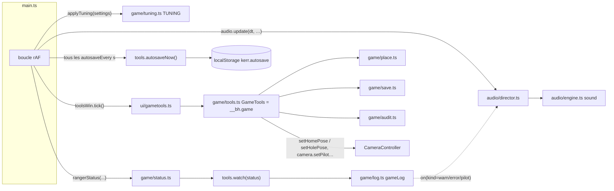
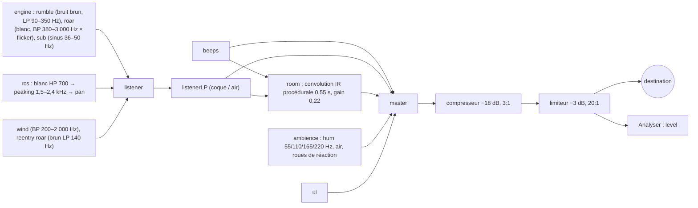
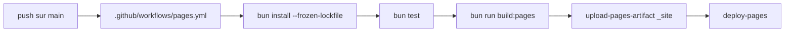

# Le jeu, le son, les outils et la chaîne de build

Ce système regroupe tout ce qui entoure la simulation sans en être le cœur physique. On y trouve :

- la **couche « jeu »** de `src/game/` : l'état du Ranger (statut, orbite, sphère d'influence), le placement du vaisseau n'importe où, les sauvegardes (autosave, emplacements, fichiers, liens), l'audit, le journal, les réglages de pilotage ;
- la **fenêtre d'outils** (F2, `src/ui/gametools.ts`) et son équivalent console, `__bh.game` ;
- le **son**, entièrement synthétisé en Web Audio (`src/audio/`) ;
- le **serveur de dev** Bun (`server.ts`) et ses points d'entrée `__snapshot` ;
- les **scripts** de mesure et de production (`scripts/`) ;
- la **suite de tests** (`tests/`), la **galerie « Atlas de Kerr »** (`gallery/`) et le **déploiement GitHub Pages**.

Le guide utilisateur des outils est dans [docs/GAME-TOOLS.md](../GAME-TOOLS.md), celui du son dans
[docs/SOUND.md](../SOUND.md). Ce document décrit leur fonctionnement interne.

---

## Fichiers

| Fichier | Lignes | Rôle |
|---|---:|---|
| `src/game/orbit.ts` | 164 | Mécanique à deux corps : éléments képlériens ↔ état, temps aux apsides, classification du statut (posé / vol / suborbital / orbite / évasion / hyperbolique) |
| `src/game/kepler.ts` | 58 | Propagation de Kepler en variables universelles (Vallado, alg. 8), utilisée par les coniques raccordées de la carte |
| `src/game/status.ts` | 140 | `rangerStatus()` : l'état du Ranger pour la télémétrie, les outils, le son et l'audit (trois cas : notre univers, gorge, côté Gargantua) |
| `src/game/place.ts` | 265 | Calcul *pur* de poses : orbite ou sol, de notre côté ou du côté Gargantua ; orbite qui survole un lieu (`orbitOver`) |
| `src/game/tools.ts` | 443 | `GameTools`, la façade (`__bh.game`) : état, placement, cible, temps, réglages, qualité, sauvegardes, perf, audit |
| `src/game/save.ts` | 115 | Format `GameSave` v1, stockage `localStorage` (autosave + emplacements), export JSON, lien `#save=` |
| `src/game/audit.ts` | 175 | `runAudit()` : onze contrôles automatiques avec verdict pass / warn / fail / skip |
| `src/game/log.ts` | 44 | `GameLog` : journal circulaire (2 000 événements) avec abonnés |
| `src/game/sites.ts` | 39 | Sites d'atterrissage (pistes, sites historiques, ceux du film) pour l'autopilote d'entrée et l'ordinateur de vol |
| `src/game/tuning.ts` | 25 | `TUNING` : maniabilité du Ranger et règles du sol, recopiées des réglages à chaque image |
| `src/ui/gametools.ts` | 591 | Fenêtre F2 : 8 onglets construits en DOM, rafraîchis à 4 Hz |
| `src/audio/engine.ts` | 627 | `SoundEngine` : graphe Web Audio, sources procédurales, signaux sonores (*cues*), alarmes |
| `src/audio/director.ts` | 151 | `SoundDirector` : lit l'état du vol à chaque image et le traduit en sons |
| `server.ts` | 44 | Serveur Bun : la page, les workers bundlés à la volée, `/__snapshot` et `/__snapshots/:name` (dev seulement) |
| `package.json` | 19 | Scripts `dev`, `start`, `build`, `test`, `typecheck`, `build:pages`, `gallery` |
| `scripts/build-pages.ts` | 18 | Construit `_site/` pour GitHub Pages : simulateur + Atlas + vidéos + page « comment jouer » |
| `.github/workflows/pages.yml` | — | CI : `bun test`, puis `build:pages`, puis déploiement Pages à chaque push sur `main` |
| `scripts/gallery.ts` | 231 | Test de régression visuelle des vignettes de scènes (Chrome headless + CDP, SSIM) |
| `scripts/scene-thumbs.ts` | 47 | Déplace les captures vers `assets/scenes/` et régénère `src/ui/scene-thumbs.ts` |
| `scripts/scene-slug.ts` | 3 | `sceneSlug()` : nom de scène → nom de fichier |
| `scripts/bench.ts` | 202 | Banc d'essai du temps d'image sur 8 scènes de référence → `docs/perf/bench-<label>.json` |
| `scripts/quality.ts` | 63 | PSNR temps réel vs image convergée (pour évaluer la reprojection temporelle) |
| `scripts/precision-probe.ts` | 77 | Données de référence float64 pour la sonde de précision GPU |
| `scripts/compose.py` | 41 | Planche comparative d'images (captures d'avancement) |
| `scripts/captions.py` | 82 | Incruste des sous-titres dans les images d'une vidéo de mission |
| `scripts/exr_heat.py` | 57 | Carte de chaleur des niveaux HDR d'un export EXR |
| `gallery/index.html` | 1869 | L'« Atlas de Kerr » : page statique en français, 32 planches, journal d'images |
| `tests/*.test.ts` | ≈ 3 460 | 37 fichiers, ≈ 185 tests `bun test` (voir plus bas) |

---

## Fonctionnement

### 1. Vue d'ensemble : qui appelle quoi

Tout est câblé dans `src/main.ts` :

Chaque image, quand le Ranger est piloté (`main.ts`, vers la ligne 1630) :

1. `applyTuning(settings)` recopie les réglages de pilotage dans `TUNING` ;
2. `toolsWin.tick()` rafraîchit la fenêtre F2 si elle est ouverte ;
3. l'autosave se déclenche si `autosaveEvery` secondes sont écoulées (ou 2 s après un changement de réglage signalé par `scheduleUrlSave`). Il ne se déclenche pas pendant un rendu hors ligne ;
4. `rangerStatus()` calcule le statut, et `tools.watch(status)` journalise les changements de sphère d'influence et de statut ;
5. `audio.update(dt, { flying, live, info, status, fired })` alimente le son.

Quand le Ranger n'est pas piloté, `audio.update` est appelé avec `flying: false`. Les propulseurs s'éteignent et les alarmes s'arrêtent.

### 2. Mécanique orbitale du jeu (`orbit.ts`, `kepler.ts`)

**Unités.** Les deux modules n'imposent aucune unité : G = 1, et l'appelant fournit `mu` (GM). De notre
côté, le jeu travaille en unités M (longueur et temps ; `M_METRES`, `M_SECONDS` dans `system/solar.ts`), et
la masse d'un corps sert directement de GM. Côté Gargantua, dans le repère d'une planète, on travaille en
longueurs propres, avec `F.m` comme GM.

**`elements(mu, r, v, axes)`** calcule, à partir d'un état relatif, les grandeurs suivantes :
- h = r × v ;
- l'énergie ε = v²/2 − mu/r ;
- le vecteur excentricité e = (v × h)/mu − r/|r| ;
- a = −mu/(2ε), ou ∞ quand |1 − e| < 1e‑12 ;
- i = acos(h_z/|h|) ;
- Ω, mesuré depuis la ligne des nœuds z × h. Pour une orbite équatoriale, on prend x à la place ;
- ω et ν, mesurés dans le sens du mouvement. Pour une orbite circulaire (e < 1e‑9), ω = 0 et ν est compté depuis le nœud ;
- rp = h²/mu/(1 + e) ;
- ra, ou ∞ si l'orbite n'est pas liée ;
- la période T = 2π √(a³/mu).

Les axes (`Axes`) sont ceux de l'équateur du corps. `place.ts: equatorAxes()` les construit à partir du
pôle de l'IAU (`poleAxes(eclipticOf(pole))`). Le Soleil et les étoiles gardent l'écliptique.

**Temps aux apsides** (`apsisTimes`) :
- orbite elliptique : anomalie excentrique E, puis anomalie moyenne M = E − e sin E, puis tPe = (2π − M)/n ;
- orbite hyperbolique : anomalie hyperbolique F, avec M = e sinh F − F, puis tPe = −M/n. tPe est négatif après le périapside.

**`stateFrom(mu, spec, axes)`** fait l'opération inverse. On part de (rp, ra) ou de (a, e). On place
l'état dans le repère périfocal, puis on applique R3(Ω)·R1(i)·R3(ω).

**`classify(el, {R, airTop, soi, landed})`** suit cet ordre de priorité :
1. `landed` ;
2. ε ≥ 0 → `hyperbolic` ;
3. ra > SOI → `escape` ;
4. rp ≥ sommet de l'air → `orbit` ;
5. sinon : `flight` si le vaisseau est dans l'air **et** que v < 0,5 × vitesse circulaire locale, `suborbital` dans le cas contraire.

Le sommet de l'air vaut 12 hauteurs d'échelle (`airTopKm`), c'est-à-dire l'endroit où le traceur arrête l'atmosphère.

**`propagate(mu, r0, v0, dt)`** (`kepler.ts`) résout le problème de Kepler en variable universelle χ, avec
les fonctions de Stumpff c₂ et c₃ (développement en série quand |ψ| < 1e‑6). La méthode est une
itération de Newton, plafonnée à 60 pas, avec une tolérance relative de 1e‑12 sur χ. On en tire les
coefficients de Lagrange f, g, ḟ, ġ. Ce module sert aux coniques raccordées de la carte
(`system/our-extend.ts`, `their-extend.ts`, `patched.ts` ; voir [06-planification-trajectoires.md](06-planification-trajectoires.md)).

### 3. Le statut du Ranger (`status.ts`)

`rangerStatus(settings, camera, info, t)` lit `camera.flightInfo()` et distingue trois cas.

1. **Notre univers** (`info.ref`, `info.X`, `info.V` présents, repère « home », Newton) :
   - état relatif au corps de référence, à partir de `solarState(ref, t)` ;
   - éléments dans les axes équatoriaux, puis classification avec la SOI de `soiOf(ref, t)` ;
   - vitesses converties en m/s par le facteur c (`C = 299 792 458`), distances en km par `M_METRES/1e3` ;
   - **prochain événement**, lu sur le chemin de chute libre déjà prédit (`info.ourFree`) : le premier indice où `refs[k]` change. Si le nouveau corps a pour parent l'ancien, l'événement est `enter`, sinon `exit`. À défaut, `fate === "impact"` donne `impact` et `fate === "wormhole"` donne `mouth`.
   - **cible** : distance, vitesse de rapprochement, plus courte approche (`info.ourCa`).
2. **Gorge du trou de ver** (`info.region === "throat"`) : statut `throat`, sans orbite.
3. **Côté Gargantua** :
   - dans le **repère local d'une planète** (`cam.local`) : la vitesse inertielle vaut w + Ω ẑ × ξ, où Ω est le taux de rotation du repère, `frameRate(F) = (A[3][4] − A[4][3])/4`, c'est-à-dire la moitié de la moyenne des coefficients de Coriolis des équations de Hill. On calcule ensuite les éléments képlériens en longueurs propres. Le sommet de l'air vaut R + 12 H. Le temps se convertit avec `4.925490947e-6 × massSolar` secondes par M ;
   - **autour de Gargantua** : pas de Kepler. Le statut est `plunge` si le chemin finit à l'horizon, `bound` si E < 1, `unbound` sinon. Le champ `kerr: { r, E, L }` est rempli.

### 4. Placer le vaisseau (`place.ts`, puis `GameTools.placeAt`)

`place.ts` est **pur**. Il renvoie une `Pose` `{ frame, X, vel, fwd, up, landed?, note }` dans le repère
qu'attendent les réglages caméra :
- `frame: "ours"` : repère home, vitesse en d/dt ;
- `frame: "hole"` : carte de Boyer–Lindquist cartésienne, vitesse donnée comme β le long des axes ZAMO (observateur à moment angulaire nul), exprimée en vecteur cartésien.

| Fonction | Ce qu'elle fait |
|---|---|
| `ourOrbitPose` | `stateFrom` dans les axes équatoriaux. L'altitude par défaut vient de `defaultAltKm`. Lève une erreur si l'apoapside sort de la SOI. Position = position du corps + r. Vitesse = vitesse du corps + v. Nez sur v, haut sur r |
| `ourGroundPose` | Point fixe dans le repère du corps (`bodyFixedOf`) à l'altitude `GEAR + groundRelief`, puis `fromBodyFixed`. La vitesse est celle du sol (`groundVelocity`). Nez vers l'est (spin × up) |
| `orbitOver` | Calcule Ω et ν pour qu'une orbite d'inclinaison i passe **maintenant** au-dessus d'un lieu, en montant. Pour une latitude φ et une longitude λ dans les axes équatoriaux : sin u = sin φ / sin i, puis Ω = λ − atan2(sin u cos i, cos u), puis ν = u − ω. Si |φ| > i, l'inclinaison est relevée à |φ|, arrondie au dixième supérieur |
| `theirOrbitPose` | Autour de Gargantua : orbite circulaire de Kerr (`circularOrbit(r, ±spin)`), vitesse ZAMO le long de e_φ. Autour d'une planète : `stateFrom` dans le repère local (x à l'opposé du primaire, z au nord), retrait de Ω ẑ × ξ, `toGlobal`, puis `zamoBeta` |
| `theirGroundPose` | Lieu défini par l'élévation et l'azimut de Gargantua dans le ciel. Les longueurs propres sont corrigées par `F.S`. Sur **Miller**, on cherche par pas de 0,25° un creux entre les vagues (`millerWaves` < 1 m, jusqu'à 1 440 essais) |
| `theirGroundAt` | Convertit une direction (lat/lon dans les axes du repère) en (élévation, azimut), puis appelle `theirGroundPose` |

`GameTools.placeAt(pose)` effectue ensuite ces opérations :
1. allume le vaisseau (`s.ship = true`) ;
2. écrit la pose dans les réglages (`setHomePose` / `setHolePose`) ;
3. force `motion = "geodesic"`, coupe la cinématique, active le pilote, règle `setOurLanded`, appelle `camera.sync()` et `ctx.refresh()` ;
4. journalise l'opération (`place`) et affiche un toast.

**Limite importante** : on ne peut atteindre notre univers que si `s.wormhole` est vrai, donc depuis une
scène du système Gargantua. Les planètes de Gargantua demandent de leur côté `s.system === "gargantua"`.

### 5. La façade `GameTools` (`tools.ts`)

`GameTools` est construit dans `main.ts` avec un `GameContext`. Ce contexte fournit `settings`, `camera`,
`renderer`, `time()` et `setTime()`, `preset()`, `changed(keys)` (qui passe par `onSettingsChange`, le
même chemin que le panneau), `refresh()`, `toast()`, `fps()`, `renderScale()` et `scene` (la scène
courante, enregistrée dans les sauvegardes). La façade est exposée comme `__bh.game`, et `help()` liste ses méthodes.

Points notables :
- **`watch(st)`** : journalise `soi` quand la sphère d'influence change, et `status` quand le statut change *dans la même* SOI.
- **`warp(x)`** : `timeSpeed = x / (4.925490947e-6 × massSolar)`, car `timeSpeed` est en M par seconde réelle.
- **`setDate(d)`** : `t = (Date.parse(d + "Z") − EPOCH_DATE)/1000/M_SECONDS`. Les corps bougent, mais le vaisseau garde sa position et sa vitesse dans le repère home. Il n'est donc plus en orbite.
- **`quality(q)`** : applique `QUALITY[q]` puis signale toutes les clés touchées, plus `pixelRatio`.
- **`perf()`** : active les timestamps GPU (`renderer.prof`) au premier appel, puis renvoie les cadences, les sections CPU (`cpuProf`) et les passes GPU. `scripts/bench.ts` s'en sert aussi.
- Les erreurs `error` et `unhandledrejection` de la page sont capturées (journal + liste lue par l'audit).

### 6. Sauvegardes (`save.ts` + `tools.ts`)

**Format `GameSave` v1** :

| Champ | Contenu |
|---|---|
| `settings` | **tous** les réglages, copie complète (`{ ...s }`) à la précision du float64 |
| `time` | temps de la scène [M] |
| `ship` | `piloting`, `sas`, `hold`, `auto`, `throttle`, `precision`, `speedMode`, `landed: { body, q }`, `spent`, `properTime` |
| `plan` | nœuds de manœuvre, note, mission (`ourMission`), ou `null` |
| `camera` | `{ gravity }` : la caméra libre en chute libre |
| `scene`, `summary`, `name`, `savedAt` | métadonnées (le résumé ressemble à « Earth · IN ORBIT 412 km · 2067‑03‑01 12:00 ») |

**Stockage** (`localStorage`, avec try/catch pour la navigation privée) :
- `kerr.autosave` : une seule sauvegarde automatique ;
- `kerr.saves` : un objet `{ nom → GameSave }`. `slots.list()` le trie par date décroissante ;
- `kerr.tools-tab` : le dernier onglet ouvert de la fenêtre F2.

**Chargement** (`GameTools.load`) :
1. `Object.assign(s, defaultSettings(), save.settings, own)`. `own` regroupe les réglages propres à *cet écran* et à *cet auditeur*, que la sauvegarde ne doit pas écraser : `pixelRatio`, `fpsCap`, `glassBlur`, `temporalReprojection` et les six `sound*`.
2. `setTime`, puis `setPilot(true)` si le vaisseau était piloté. Comme `setPilot` impose ses propres choix (temps qui tourne, chemin affiché), on réapplique les réglages ensuite.
3. Restauration des modes du pilote et du plan. L'autopilote `node` n'est restauré que si un plan existe.
4. Restauration de la caméra libre en chute, avec sa vitesse sauvegardée.
5. `camera.sync()`, la scène, puis `refresh()`.

**Démarrage de la page** (`main.ts`, après `await ephemerides`, pour qu'un vaisseau ne soit pas placé avant que les planètes aient bougé). L'ordre de priorité est :
1. `#save=…` (lien partagé) ;
2. `#scene=<nom>` ;
3. l'autosave, si le hash est vide et si `last.settings.autosave !== false`.

Le hash est ensuite effacé avec `history.replaceState`.

**Lien de partage** (`saveToHash`) : le JSON de la sauvegarde, **sans le plan**, encodé en UTF‑8 puis en base64url. Le lien fait plusieurs kilo-octets, puisqu'il contient tous les réglages.

**Autres déclencheurs de sauvegarde** :
- `pagehide` ;
- la perte du GPU (`renderer.onLost`) ;
- l'entrée dans l'atmosphère, qui crée un instantané en mémoire (`entryPoint`, non persisté). Il sert à « reprendre » après la perte de l'engin (`camera.onCraftLost` → `tools.load(entryPoint, { quiet: true })`).

### 7. L'audit (`audit.ts`)

`GameTools.audit()` construit un `AuditContext`. Il contient le statut, l'état du vaisseau dans le
repère home, `snapshot`, `fps`, `gpuMs` et deux séries mesurées sur *n* images (chaque mesure attend
deux `requestAnimationFrame`) : `probeSeries` (luminance de la sonde de lumière du vaisseau,
`renderer.readShipLight()`) et `evSeries` (`renderer.autoEV`). `runAudit` exécute chaque contrôle dans
`run()`, qui chronomètre le contrôle et transforme une exception en `fail`.

Le verdict générique est `verdict(v, warn, fail)` : `fail` si v n'est pas fini ou si v ≥ fail, `warn` si v ≥ warn, `pass` sinon.

| id | Contrôle | Seuils |
|---|---|---|
| `settings` | tous les réglages numériques sont finis | fail sinon |
| `ephemeris` | différence centrée ±60 s des positions comparée à la vitesse analytique, pour chaque corps | warn ≥ 1 m/s, fail ≥ 10 m/s |
| `ship` | v < c, pas plus de 1 km sous la surface, position finie | fail |
| `soi` | référence du contrôleur comparée à la règle (m/M)^0,4 de `referenceBody` | warn si elles divergent |
| `predictor` | `predictOurs` sur une période, puis Δa relatif à a | warn ≥ 1e‑3, fail ≥ 1e‑2 (en orbite seulement ; la Lune et le Soleil perturbent de quelques km par orbite en LEO) |
| `save` | aller-retour JSON de `snapshot()`, puis comparaison réglage par réglage | fail si une valeur change |
| `frame` | images par seconde | pass ≥ 24, warn ≥ 12 |
| `light` | plus grand saut relatif d'une image à l'autre de la lumière du vaisseau (40 images) | warn ≥ 3 %, fail ≥ 10 % |
| `exposure` | plus grand saut d'EV (40 images) | warn ≥ 0,25, fail ≥ 1 |
| `errors` | erreurs capturées depuis le chargement | warn s'il y en a |
| `planner` *(option)* | `plan({kind:"transfer"…})` dans le worker vers la cible, avec arrivée en orbite à 200 km | fail si aucun plan, warn si le calcul dépasse 20 s |

Le rapport (`AuditReport`) est journalisé avec ses données (`kind: "audit"`) et peut être téléchargé en JSON depuis l'onglet.

### 8. Le journal (`log.ts`)

`gameLog` est un singleton `GameLog(max = 2000)`. Chaque événement a la forme `{ at: Date.now(), t: temps de la scène, kind, text, data? }`. Les types possibles sont `info`, `pilot`, `soi`, `status`, `place`, `save`, `audit`, `warn` et `error`.

Au-delà de 2 000 événements, `splice` retire les plus anciens. `on(f)` renvoie une fonction de désabonnement. `text(dateOf)` produit une ligne par événement.

Les producteurs sont `GameTools` (placements, sauvegardes, audit, erreurs, SOI et statut) et `main.ts:947`, qui reçoit les messages du pilote. Ces messages sont journalisés en `warn` s'ils contiennent « crash », en `pilot` sinon.

Les consommateurs sont l'onglet *Journal* et le `SoundDirector` : `warn` contenant « crash » → son `crash`, `error` → son `error`, `pilot` commençant par « In orbit », « Arrived » ou « Manoeuvre done » → son `arrive`.

### 9. Réglages de pilotage (`tuning.ts`)

`TUNING` est un objet mutable, lu par le code de vol à la place de constantes. `applyTuning` y recopie les réglages à **chaque image**, en convertissant les degrés en radians et en bornant les valeurs :

| Clé | Valeur par défaut |
|---|---|
| `turnRate` | 43 °/s ≈ 0,75 rad/s |
| `turnAccel` | 92 °/s² ≈ 1,6 rad/s² |
| `rcs` | 0,08 de la poussée principale |
| `crashSpeed` | 12 m/s |
| `ballistic` | 900 kg/m² (m/(C_D A)) |

### 10. La fenêtre F2 (`ui/gametools.ts`)

`GameToolsWindow` construit son DOM à la main avec de petites fonctions utilitaires (`h`, `btn`, `num`, `field`, `select`). Il n'y a ni framework ni réactivité.

- `show(tab)` vide le corps de la fenêtre, appelle la vue de l'onglet, puis la fonction `live` que la vue a définie. Les onglets dynamiques sont *Ranger*, *Place*, *Target*, *Time* et *Perf*.
- `tick()`, appelé par la boucle, exécute `live` au plus toutes les 250 ms, et seulement si la fenêtre est ouverte.
- `run(f)` capture les erreurs synchrones et asynchrones. Il les affiche 6 s en haut de la fenêtre (`.gt-err`) et les journalise en `warn`.
- L'onglet **Place** contient un `GroundTrack` (globe ou planisphère). Dans ce sélecteur, un clic donne lat/lon. En mode orbite, ce lieu passe à `orbitOver` : Ω et ν, marqués `gt-auto`, sont calculés au moment du placement. Taper une valeur dans Ω ou ν annule ce mode. Le sélecteur est redessiné chaque seconde, car la planète tourne et le Soleil se déplace.
- L'onglet **Ranger** appelle aussi `g.watch(st)`. Le journal reçoit donc les changements de statut même quand le HUD est fermé.

### 11. Le son (`audio/engine.ts`, `audio/director.ts`)

Il n'y a aucun échantillon audio : tout est synthétisé. Le graphe est construit **au premier geste de
l'utilisateur** (`pointerdown`, `keydown` ou `touchstart`, en phase de capture), parce que les
navigateurs bloquent l'audio avant. Le contexte est suspendu quand la page est masquée.

**Sources** (`noise()`) : tampons stéréo en boucle, avec un fondu de 50 ms aux extrémités pour que la boucle ne s'entende pas.
- `white` (2 s) : bruit blanc ;
- `brown` (4 s) : bruit brun, b = (b + 0,02 w)/1,02 ;
- `slow` (4 s) : marche aléatoire vers un niveau tiré toutes les 40 ms. Elle sert de « scintillement » de flamme, en modulant le gain du *roar* et la fréquence du *sub*.

**`update(EngineState)`** est appelé à chaque image. Toutes les valeurs passent par `setTargetAtTime`, ce qui lisse les transitions avec des constantes de temps de 20 à 500 ms.
- **Auditeur** : à l'intérieur, la fréquence de coupure vaut 2 200 + 3 000·air. À l'extérieur, elle vaut 1 100 + 8 000·√air. C'est une licence de jeu : dans le vide, le vaisseau reste audible de l'extérieur, étouffé.
- **Moteur** : la poussée `th` pilote les gains (√th pour le grondement et le sub) et les fréquences. Quand th franchit 0,02 vers le haut, on joue `ignition` (sinus 140 → 38 Hz + bouffée de bruit). Quand il retombe de 0,05 à moins de 0,02, on joue `cutoff`.
- **RCS** : gain 0,9·r, pan ×0,7. Un claquement de valve à l'ouverture et à la fermeture (seuil 0,05).
- **Cabine** : le ronflement et l'air n'existent que si quelqu'un est à bord. Les roues de réaction suivent la vitesse de rotation et le couple.
- **Vent** : proportionnel à la pression dynamique, q = air·v²/2,5e5, borné à 1. La rentrée ajoute un grondement en plasma^1,5.

**Cues** (`play(cue, arg)`) : ce sont des combinaisons de `tone()` (oscillateur, attaque de 6 ms, décroissance exponentielle, partiel à ×2,01), de `bell()` (synthèse FM à deux opérateurs, ratio 3,5, indice qui décroît) et de `burst()` (bruit filtré en bande).
- `hold` monte d'un demi-ton par mode (index dans `HOLDS`) ;
- `warp-up` et `warp-down` montent avec le rang dans l'échelle de warp. Ils sont joués par `main.ts`, pas par le directeur.

**Alarmes** (`alarm(id, on, kind)`) : boucles de `setTimeout`. `warning` répète deux tons carrés 950 et 740 Hz toutes les 0,5 s. `caution` répète un ton triangle 880 Hz toutes les 1,6 s.

**Le directeur** (`SoundDirector.update`) :
1. **Continu** : il lit `camera.pilot.fired`, considéré comme valide pendant 300 ms. Rotation forte (`turn` > 0,6) → RCS simulé, car les roues saturent. La densité de l'air est normalisée par 1,225 kg/m³. Le plasma vaut (log10(flux thermique) − 4,6)/1,7, borné entre 0 et 1. On est `inside` si le point d'attache `shipMount` fait partie de `ON_HULL = {dorsal, belly, rear}`.
2. **Changements d'état** : le directeur compare l'image courante à `prev` (sas, hold, auto, précision, posé, poussée en cours, SOI, côté, cible, point d'attache, carburant). Le *boom* sonique se produit quand Mach traverse 1 entre deux images, avec moins de 0,2 d'écart. Le compte à rebours `node-tick` égrène 5…1 secondes **réelles** avant le nœud : (t_nœud − t)/`timeSpeed`.
3. **Alarmes** : `collision` si le chemin finit à l'horizon ou si un impact est prévu dans moins de 45 s. `terrain` (prudence) si v_vert < −12 m/s en statut `flight`.

**Remplacement à chaud** : le module garde l'instance dans `globalThis.__sound` et appelle `dispose()` sur l'ancienne. Sans cela, chaque HMR ajouterait un graphe qui continuerait de bourdonner.

### 12. Serveur de dev (`server.ts`)

`Bun.serve` avec HMR quand `NODE_ENV !== "production"`, port `PORT`, 3000 par défaut.

| Route | Rôle |
|---|---|
| `/` | `index.html`, en import HTML : Bun bundle `src/`, le CSS et les assets importés. Les assets (`.bin`, `.webp`, `.jpg`, …) sont des `import x from "../assets/…"`, donc copiés et hachés par le bundler |
| `/plan-worker.js`, `/ktx-worker.js` | Workers bundlés **à chaque requête** avec `Bun.build` (minifiés hors dev) |
| `/basis_transcoder.wasm` | `vendor/basis/` |
| `POST /__snapshot?name=` | *Dev seulement* : écrit le corps de la requête dans `snapshots/<name>`. Le nom est nettoyé (`[^\w.-]`). Les extensions png, jpg, webp, exr, json et mp4 sont acceptées, `.png` par défaut. Utilisé par `__bh.snapshot()`, `__bh.video()`, `__bh.captureScenes()` et `gallery.ts` |
| `GET /__snapshots/:name` | *Dev seulement* : relit un fichier de `snapshots/` (par exemple les données de la sonde de précision) |

`snapshots/`, `_site/` et `dist/` sont ignorés par git.

### 13. Build et déploiement GitHub Pages

`scripts/build-pages.ts` effectue les étapes suivantes :
1. `bun build ./index.html --outdir _site --minify` ;
2. les deux workers et le `.wasm` à côté de la page. Ils sont chargés par URL, d'où des builds séparés ;
3. `gallery/` → `_site/docs/` (l'Atlas) ;
4. `docs/video/*.mp4` → `_site/docs/video/` ;
5. `docs/comment-jouer.html` et ses images ;
6. `.nojekyll`.

Un test qui échoue bloque le déploiement. `concurrency: pages` annule le déploiement précédent. Selon la mémoire du projet, le travail se fait directement sur `main`, donc chaque push déploie.

### 14. La galerie « Atlas de Kerr » (`gallery/`)

Le dossier `gallery/` est une page **statique écrite à la main**. Aucun script ne la génère. Elle est en
français et ses polices viennent de Google Fonts.
- Les données sont dans un `<script>` en fin de fichier. `PLATES` contient 32 planches (`img`, `title`, `text`, `look`, `params`, drapeaux `v2` / `v3` / `colorbar`). `EFFECTS` contient 15 effets physiques, chacun avec ses planches de référence.
- Le JS remplit `#plate-list`, `#plate-list-v2` et `#plate-list-v3`, l'index des effets, une barre de couleurs *turbo* (même polynôme que le shader, avec t = 0,5 + 0,6·log2 g), un comparateur avant/après et une visionneuse.
- Les images sont dans `gallery/img/` (38 planches et affiches) et `gallery/img/journal/` (47 captures d'avancement). Les vidéos viennent de `docs/video/`, copiées au build.
- Les images de planches se produisent hors ligne (rendus, `__bh.snapshot`, `compose.py`), puis sont copiées à la main dans `gallery/img/`.

### 15. Scripts de mesure (`scripts/`)

Les trois scripts TypeScript qui pilotent un navigateur (`gallery.ts`, `bench.ts`, `quality.ts`) suivent le même modèle :
1. lancer **Chrome headless** avec `--enable-unsafe-webgpu` et un port de débogage aléatoire ;
2. ouvrir une WebSocket CDP (`Runtime.evaluate` avec `awaitPromise`) ;
3. attendre `__bh.renderer` ;
4. piloter la page via `__bh` ;
5. tuer Chrome (`pkill -f remote-debugging-port=<port>`), y compris sur SIGINT.

- **`gallery.ts`** : test de régression visuelle des vignettes de scènes (`assets/scenes/<slug>.webp`). Pour chaque scène, il applique `__bh.preset`, attend `--warm` (8 s), puis appelle `__bh.captureScenes([nom])`, qui produit une image 640 × 360 postée sur `/__snapshot`. La comparaison se fait **dans la page**, en 160 × 90 : SSIM sur des fenêtres 8 × 8 au pas de 4, part de la luminance qui a bougé de plus de 0,1 (lissée en 3 × 3), et écart de teinte maximal sur des blocs de 10 × 10. Les scènes qui bougent (vaisseau, mission, polarisation) ont des seuils plus lâches. Sorties : `snapshots/gallery-report.json`, `snapshots/gallery-diff.png`, code de sortie 1 si une scène est signalée. `--update` appelle `scene-thumbs.ts`. Le script démarre lui-même le serveur si l'URL est locale et ne répond pas.
- **`scene-thumbs.ts`** : `snapshots/scene-*.webp` → `assets/scenes/`, puis réécrit `src/ui/scene-thumbs.ts` avec un import par scène qui a une image.
- **`bench.ts`** : 8 scènes de référence. Il injecte un hook qui additionne la VRAM allouée (`createTexture` / `createBuffer` / `destroy`, octets par format, mips ×4/3). Deux mesures par scène : qualité *game* avec sous-échantillonnage et résolution automatiques (p50, p95, p99 des intervalles entre fins de frame GPU, images > 33 ms, rayons par pixel), puis réglage **fixe** (bloc 4, échelle 1) pour comparer des commits. `--compare <url>` alterne une build de référence et la build courante, scène par scène. Écrit `docs/perf/bench-<label>.json` (label = SHA court par défaut). Voir [docs/PERFORMANCE.md](../PERFORMANCE.md) et [docs/perf/audit-plan.md](../perf/audit-plan.md).
- **`quality.ts`** : rotation verrouillée sur les images (0,2° par image rendue) et arrêt sur une image temps réel. Capture, puis convergence (`targetSpp ≥ 64`), puis nouvelle capture. Calcule le **PSNR** avec python3, numpy et Pillow, pour chaque configuration (par défaut : reprojection temporelle off/on).
- **`precision-probe.ts`** : produit le JSON de référence (`> snapshots/probe.json`). Il contient d'une part des rayons équatoriaux près du paramètre d'impact critique (b = b_c + δ, intégration float64 avec une tolérance de 1e‑12, φ∞ prolongé sur l'hyperbole de champ faible), d'autre part 400 rayons génériques et des rayons juste à l'extérieur de la courbe critique, avec leurs trois premiers croisements équatoriaux en forme close (`src/analytic.ts`). Les conditions initiales sont arrondies en float32 (`Math.fround`) pour isoler l'erreur d'intégration. Le GPU est comparé avec `Renderer.precisionProbe` (voir [01-traceur-geodesique.md](01-traceur-geodesique.md)).
- **Python** :
  - `compose.py` : planche de 1 à N images légendées, avec `--crop` et `--width` ;
  - `captions.py` : incruste les sous-titres d'une mission (`snapshots/<prefix>caps.json`, [étape, titre, ligne, phase] par image) avec des fondus, plus un fondu au noir au début et à la fin. Il prépare les images pour ffmpeg ;
  - `exr_heat.py` : lit un EXR non compressé en demi-flottants (lecteur minimal écrit à la main), applique la même compression de hautes lumières que `display.wgsl` (genou à min(0,6 ; 0,5·pic), queue exponentielle) et dessine la carte de chaleur des niveaux au-dessus du blanc SDR.

### 16. La suite de tests (`tests/`)

`bun test`, 37 fichiers, environ 185 tests (dont quelques-uns générés en boucle), sans DOM ni GPU : seul le code pur est testé. Les tests s'exécutent dans la CI avant chaque déploiement.

| Domaine | Fichiers | Ce qui est vérifié |
|---|---|---|
| Kerr et rayons | `physics`, `quality`, `analytic`, `shadow`, `targeting` | horizon et ISCO, 3√3, contrainte nulle H = 0, flux de Novikov–Thorne, colorimétrie, Dormand–Prince comparé à RK4, croisements en forme close (Gralla & Lupsasca) à 1e‑6 M, guide de l'ombre, visée à travers l'espace-temps courbe, encodeurs half et EXR, entrelacement temps réel |
| Trou de ver | `wormhole`, `our-side`, `local-patch` | métrique Dneg (W = 1,42953 M), réversibilité, raccord des repères, système solaire à l'échelle, patch local, aberration et retard de la lumière |
| Géodésiques de la caméra | `geodesic`, `flight-system`, `landing`, `ground-detail`, `pilot`, `engine` | orbites circulaires, chute radiale τ = π/2·√(r0³/2M), barycentre, planètes de Gargantua, sol, maintien d'attitude, fusée relativiste, épicycles |
| Planification | `maneuver`, `kepler`, `our-plan`, `fc`, `entry` | impulsions, transferts, rendez-vous, coniques raccordées, Lambert, Hohmann, Artemis II, Mars, rentrée et désorbitation |
| Notre univers | `ephemeris`, `sgp4`, `iss`, `fleet`, `our-surface`, `earth-*`, `skychart`, `disk-share`, `aero`, `collide` | DE440 (conjonction de 2020, Mars 2020, transit de Vénus), éclipse du 12 août 2026 à Burgos, SGP4 (Vallado 00005), ISS, flotte, atmosphère standard de 1976, aérodynamique, BVH |
| Système Gargantua | `system` | comparaison avec `tests/data/gargantua-results.json` (étude `interstellar-system`), marées, horloge de Miller, stabilité d'Edmunds sur 10 000 ans |
| Jeu | `game-orbit`, `place-over` | éléments ↔ état, temps aux apsides, `classify`, placement autour de Mars, `frameRate` = n de Hill, `orbitOver` |
| Interface | `ui-scenes-loading`, `map3d-camera`, `gamepad` | chaque scène a sa carte, suivi du chargement, caméra de la carte 3D, manette (WebHID Xbox 360) |

`ephemeris.test.ts` lit `assets/ephemeris/de440.bin` et `jup365.bin`, qui sont versionnés. Le son, la fenêtre F2, les sauvegardes et l'audit **ne sont pas testés** : ils dépendent du DOM, de Web Audio ou de `localStorage`.

---

## Interfaces avec les autres systèmes

**Consomme :**
- `CameraController` (`src/controls.ts`) : `flightInfo()`, `pilot`, `plan`, `ourMission`, `setPilot`, `setOurLanded`, `setGravity`, `setCinematic`, `selectTarget`, `sync`, `local`, `ourLandedOn`, `spent`, `properTime`, `pilot.fired` ;
- `src/camera.ts` : `setHomePose`, `setHolePose` ;
- `src/system/solar.ts` (`solarState`, `solarBody`, `SOLAR_BODIES`, `M_METRES`, `M_SECONDS`, `EPOCH_DATE`), `our-side.ts` (`soiOf`, `referenceBody`), `our-surface.ts`, `our-predict.ts`, `plan-client.ts` (worker de planification), `bodies.ts`, `kerr-orbits.ts` ;
- `src/landing.ts` (`planetFrame`, `toGlobal`, `zamoBeta`, `groundR`), `src/terrain.ts` (`millerWaves`), `src/wormhole.ts` (`sphericalFrame`) ;
- `Renderer` : `prof`, `lastGpuMs`, `readShipLight()`, `autoEV`, `shipReady`, `realtimeBlockNow`, `tier`, `exportPNG`, `precisionProbe` ;
- `src/perf.ts` : `cpuProf`.

**Expose :**
- `__bh.game` (= `GameTools`), `__bh.sound` (= `SoundEngine`), `__bh.audio` (= `SoundDirector`), `__bh.snapshot`, `__bh.captureScenes`, `__bh.preset`, `__bh.touch`, `__bh.resize`, `__bh.refresh` (utilisés par les scripts) ;
- `rangerStatus` / `RangerStatus` : HUD (`ui/flighthud.ts`), écrans du cockpit (`ui/cockpitscreens.ts`), directeur du son ;
- `TUNING` : code de vol ;
- `SITES` / `sitesOf` / `siteDir` : `controls.ts` (autopilote d'entrée), `ui/fc/computer.ts`, `main.ts` ;
- `propagate` (kepler) : coniques raccordées de la carte ;
- `gameLog` : tout module peut y écrire. Le directeur et la fenêtre y sont abonnés ;
- `sound.play(cue)`, `sound.alarm()` : utilisables partout. `main.ts` joue `warp-up`, `warp-down` et `error`.

**Événements DOM :** F2 et les boutons `btn-tools` / `tools` → `toolsWin.toggle()`. `pointerdown` et `pointerover` sont capturés par le directeur pour les clics d'interface. `pagehide` déclenche l'autosave. `error` et `unhandledrejection` sont capturés par `GameTools`.

---

## Réglages

Section *Game* de `src/ui/schema.ts`, valeurs par défaut de `src/settings.ts`. Tous ces réglages ont `effect: "none"` : ils ne relancent pas de tracé.

| Clé | Défaut | Effet |
|---|---|---|
| `turnRate` | 43 °/s | `TUNING.turnRate` |
| `turnAccel` | 92 °/s² | `TUNING.turnAccel` |
| `rcsFraction` | 0,08 | `TUNING.rcs` |
| `crashSpeed` | 12 m/s | `TUNING.crashSpeed` |
| `ballistic` | 900 kg/m² | `TUNING.ballistic` |
| `autosave` | true | autosave périodique, à `pagehide` et à la perte du GPU ; reprise à la visite suivante |
| `autosaveEvery` | 10 s | période (2–120 s) |
| `sound` | true | activé ou non (gain master à 0 et alarmes coupées) |
| `soundVolume` / `soundBeeps` / `soundEngines` / `soundAmbience` / `soundUi` | 0,7 / 0,8 / 0,9 / 0,5 / 0,35 | gains des bus. `onSettingsChange` appelle `audio.applyMix()` pour toute clé `sound*`. `soundEngines` règle à la fois `engine` et `rcs` |

D'autres réglages sont lus indirectement : `shipMount` (intérieur ou extérieur pour le son), `timeSpeed`, `animate`, `massSolar`, `target`, `ship`, `wormhole`, `system`, `quality`, `dynamicResolution`.

---

## Pièges et limites

- **Précision des sauvegardes** : les réglages sont copiés en float64 et l'aller-retour JSON est exact. Le contrôle `save` de l'audit le vérifie. En revanche, `Infinity` et `NaN` deviennent `null` en JSON : un réglage infini ferait échouer ce contrôle et serait perdu au chargement. Le lien `#save=` ne contient **pas** le plan de vol.
- **Compatibilité des sauvegardes** : `parseSave` ne vérifie que `v === 1`, `time`, `settings` et `ship`. Les réglages ajoutés depuis la sauvegarde prennent leur valeur par défaut grâce à `defaultSettings()` en premier. Les réglages renommés ou supprimés restent dans l'objet sans effet.
- **`setDate` ne replace pas le vaisseau** : changer d'heure en orbite basse laisse le vaisseau là où était la planète. Il faut le replacer ensuite. L'interface le signale.
- **Statut côté Gargantua** : sans repère de planète, `altKm` vaut r·M_METRES·(massSolar/1e8)/1e3, c'est-à-dire la **distance au centre**, pas une altitude.
- **`classify`** : une orbite dont le périapside est sous le sol mais l'apoapside au-delà de la SOI est classée `escape`, pas `suborbital`, car l'évasion est testée avant.
- **Son** :
  - Le *cue* `wormhole` exige que le côté passe directement de `ours` à `gargantua` (ou l'inverse) sans être `throat` sur l'une des deux images. Comme `rangerStatus` renvoie `throat` dans la gorge, ce son ne joue que si la traversée tient entre deux images. En pratique, c'est le *cue* `soi` qui sonne (SOI `wormhole`). *À vérifier en vol.*
  - `ON_HULL` ne contient ni le cockpit ni la cabine : vu depuis ces points d'attache, le vaisseau s'entend comme de l'extérieur. La question est déjà notée dans `todo.md`.
  - Avec `sound = false`, le contexte audio reste actif (gain master à 0) et `update()` continue de programmer des rampes. Le coût est faible mais pas nul.
  - `level()` alloue un `Float32Array(2048)` à chaque appel.
  - Le compte à rebours `node-tick` utilise `timeSpeed` même en pause (`animate = false`) : il ne bouge alors simplement plus.
- **Coûts** : l'audit avec planificateur peut durer plus de 20 s (worker). Les séries `light` et `exposure` coûtent 80 images. `rangerStatus` tourne à chaque image (section `Ranger status` de `cpuProf`). `bodies()` appelle `soiOf` pour les 27 corps à chaque tick de l'onglet *Target*.
- **Serveur** : les workers sont rebundlés à chaque requête (c'est voulu en dev). `bun run start` n’est pas un mode production : sans `NODE_ENV=production`, `/__snapshot` reste ouvert. Le script `build` de `package.json` ne produit ni `ktx-worker.js` ni le `.wasm`, contrairement à `build-pages.ts` (voir plus bas).
- **Scripts** :
  - `bench.ts` et `quality.ts` ont le chemin de Chrome **macOS** codé en dur ; seul `gallery.ts` lit `CHROME`.
  - Il faut mesurer avec la machine au repos : un autre onglet qui fait du rendu partage le GPU.
  - `quality.ts` exige python3, numpy et Pillow.
  - `exr_heat.py` ne lit que les EXR non compressés en half RGB, dans l'ordre B,G,R, une ligne par bloc. C'est ce que produit `exporters.ts`, rien d'autre.
- **`captions.py`** lit `snapshots/<prefix>caps.json`, mais **aucun code du dépôt ne produit ce fichier** : il venait d'un script console lors de la mission de septembre (commit `39fd55d`).
- **Tests** : ils ne couvrent que le code pur ; tout ce qui touche au GPU passe par l'audit en jeu, par `gallery.ts` (régression visuelle) et par la sonde de précision.

### Incohérences et bugs relevés pendant l'analyse

1. **Filtre du journal réinitialisé** (`src/ui/gametools.ts`, `journal()`). Le constructeur s'abonne à `log.on(() => this.show("journal"))`. Chaque nouvel événement reconstruit donc l'onglet, et le `<select>` repart sur `(this.body.dataset.filter) || "all"`. Or `dataset.filter` n'est jamais écrit. Conséquence : pendant le vol, le filtre choisi revient à « all » à chaque nouvel événement. La sélection de texte et le défilement sont perdus aussi.
2. **Deux tables de sites différentes**. `src/ui/gametools.ts` garde sa propre table `SITES` (onglet *Place*), distincte de `src/game/sites.ts`, avec des coordonnées qui divergent. Exemples : Huygens à 167,7° E contre 192,32° E ; Jezero à 18,38 / 77,58 contre 18,44 / 77,45 ; KSC « pad » 28,573 / −80,649 contre la piste SLF 28,615 / −80,695. Les sites de Gargantua n'y figurent pas.
3. **Atlas, planches 25 à 32** (`gallery/index.html`). `roman()` ne connaît que I à XXIV, alors qu'il y a 32 planches : les planches 25 à 32 affichent « Planche undefined ».
4. **Atlas, lightbox des planches v3** (`gallery/index.html`). Le gestionnaire de clic n'est posé que sur `[list, listV2]` : les 8 planches « v3 » (`#plate-list-v3`) ne s'ouvrent pas en plein écran.
5. **Commentaire d'en-tête de `scripts/gallery.ts` périmé**. Il annonce une comparaison en 320 × 180 et `--ssim 0.9`, alors que le code mesure en 160 × 90 et que `SSIM_MIN` vaut 0,85 par défaut.
6. **Script `build` incomplet** (`package.json`). `bun run build` (vers `dist/`) omet `ktx-worker.js` et `basis_transcoder.wasm`, que la page charge par URL. Seul `build:pages` produit un site complet.
7. Les URL d'objets des téléchargements (rapport d'audit, journal) ne sont jamais révoquées, contrairement à `downloadSave`. La fuite mémoire est mineure.

---

## Pour aller plus loin

- **Ajouter un contrôle à l'audit** : écrire un `await run("id", "Nom", () => ({ verdict, detail, value }))` dans `runAudit` (`src/game/audit.ts`). Si le contrôle a besoin d'une donnée du moteur, l'ajouter à `AuditContext` et la fournir dans `GameTools.audit()`. L'onglet l'affiche sans autre changement.
- **Ajouter un son** : déclarer le nom dans le type `Cue`, ajouter un `case` dans `SoundEngine.play` en composant `tone`, `bell` et `burst`, puis le déclencher dans `SoundDirector.update` (comparaison `now` / `p`) ou depuis le journal (`gameLog.on`). Pour un son continu, ajouter un champ à `EngineState`, un nœud dans `build*()` et sa rampe dans `update()`.
- **Ajouter un champ à la sauvegarde** : l'ajouter à `GameSave` (`save.ts`), le remplir dans `GameTools.snapshot()` et le relire dans `load()` en le gardant **optionnel** pour les anciennes sauvegardes. Si c'est un réglage propre à l'écran, l'ajouter à `own` dans `load()`.
- **Ajouter un site d'atterrissage** : `SITES` dans `src/game/sites.ts` (autopilote d'entrée et ordinateur de vol). Pour qu'il apparaisse aussi dans l'onglet *Place*, l'ajouter à la table de `src/ui/gametools.ts`, ou mieux, faire lire `sitesOf()` à cette table (voir le point 2 ci-dessus).
- **Mesurer l'effet d'un changement de rendu** : `bun --hot server.ts`, puis `bun scripts/bench.ts --label avant`. Après le changement, relancer avec `--label après`, ou utiliser `--compare` avec une build de référence servie sur un autre port. Pour l'image : `bun scripts/gallery.ts` (puis `--update` une fois les différences validées).
