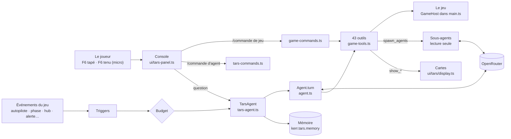

# TARS, l'agent du jeu

TARS est le copilote du Ranger. Hors ligne, il répond avec ses phrases écrites (`src/game/tars.ts`) et
comprend les ordres courants. Avec la clé OpenRouter du joueur, il devient **un agent** : un modèle de
langage qui appelle les outils du jeu, en boucle, jusqu'à avoir fini ce qu'on lui a demandé. Il pilote,
navigue, règle, montre, se souvient, se réveille de lui-même aux moments clés et lance des sous-agents.

Cette fiche décrit le code. Le guide du joueur est [docs/TARS.md](../TARS.md) ; le plan et ses mesures,
[PLAN-TARS-AGENT.md](../PLAN-TARS-AGENT.md) (A1–A9, B1–B7, C1–C6). Sa voix, la musique et le contrôle de
mission : [PLAN-TARS.md](../PLAN-TARS.md) et la fiche 9.

Rédigée le 2026-10-10.

---

## Fichiers

| Fichier | Lignes | Rôle |
|---|---:|---|
| `src/ai/openrouter.ts` | 300 | La clé du joueur (OAuth PKCE sans serveur, ou collée ; gardée dans ce navigateur seulement), `chat` et `complete` (appels d'outils au format OpenAI), le coût de chaque appel, la liste `AGENT_MODELS` |
| `src/ai/tool-schema.ts` | 97 | Le schéma d'un outil (un sous-ensemble de JSON Schema : chaîne et ses valeurs, nombre et ses bornes, booléen, objet, tableau) et `checkArgs`, qui vérifie les arguments avant d'agir |
| `src/ai/agent.ts` | 172 | `Agent.turn` : la boucle d'un tour — les appels du modèle dans l'ordre, chaque résultat rendu par l'id de son appel, les bornes (24 pas, 40 min), l'arrêt |
| `src/ai/tars-agent.ts` | 222 | `TarsAgent` : la consigne (caractère, langue, mode), l'état du vol et la mémoire avant la question, un tour à la fois, le garde-fou « rien fait », oui/non sur une proposition ; `modeTools` ; `runOrders` (hors ligne) |
| `src/ai/game-tools.ts` | 1444 | Les **43 outils** sur l'interface `GameHost` (construite dans `main.ts`) ; le filet « Before TARS » ; `resolveBody`, `resolveSite` (noms FR / EN) |
| `src/ai/settings-tools.ts` | 98 | Les réglages du schéma trouvés par les mots, une valeur vérifiée (bornes, choix, couleurs) |
| `src/ai/telemetry.ts` | 239 | `telemetry(camera, groupes)` : tout ce que le cockpit et le hub savent, en chiffres ; `AttitudeSampler`, ses canaux échantillonnés pour ses graphes |
| `src/ai/memory.ts` | 175 | `TarsMemory` : 24 échanges mot pour mot, un résumé écrit par le modèle, 40 notes ; `carry`, `clearTurns`, `compact`, `forget` |
| `src/ai/triggers.ts` | 227 | `Triggers` : ses réveils — 5 réflexes et les règles qu'on lui donne ; `match(événement)`, `due(heure)` ; `wakeText` |
| `src/ai/budget.ts` | 42 | `Budget` : ce que ses initiatives coûtent sur l'heure glissante, le plafond (réglage), 20 s entre deux réveils |
| `src/ai/subagents.ts` | 105 | `runSubagents` : jusqu'à 4 copies de lui en parallèle, outils de lecture et de calcul seulement |
| `src/ai/commands.ts` | 229 | Pur : les 26 commandes « / » de l'agent, les modes, les savoir-faire, les mentions @ ; `complete`, `parseCommand`, `unmention`, `helpLines` |
| `src/ai/game-commands.ts` | 462 | Pur : les 67 commandes de jeu (`/target`, `/cockpit`, `/teleport`…) traduites en appels d'outils ; arguments par position ou `clé=valeur` ; `completeGame` ; `/tool` |
| `src/ai/tars-commands.ts` | 241 | `runCommand` : ce que fait chaque commande de l'agent (une ligne ou une fiche dans la console) |
| `src/ai/offline-orders.ts` | 101 | Pur : les ordres compris sans modèle (FR / EN), traduits en appels des mêmes outils |
| `src/ai/listen.ts` | 128 | Le push-to-talk : la reconnaissance vocale du navigateur, F6 tenu |
| `src/ai/tars-online.ts` | 135 | TARS bavard (avant l'agent) : ses réponses et ses remarques par GLM et Jev |
| `src/ui/tars-panel.ts` | 1060 | Sa console : l'emblème, les onglets, les actions en direct, le suivi, la proposition, les tâches, l'autocomplétion, les modes, la poignée, sa présence console fermée |
| `src/ui/tars/emblem.ts` | 111 | Ses quatre monolithes animés selon son état (prêt, écoute, réfléchit, agit, parle) |
| `src/ui/tars/display.ts` | 207 | Ses cartes sur la vue (trois au plus) : graphes en direct ou calculés, fiches, séries `source()` recalculées à chaque image |
| `src/ui/tars/chart.ts` | 286 | Le tracé : des voies sur un axe commun, ou superposées avec une bande de couloir |

Le branchement est dans `src/main.ts` : `tarsTools` (le `GameHost`), `tarsTriggers`, `tarsBudget`,
`tarsSampler`, `tarsWakeQueue`, `tarsEvent`, `tarsGameCtx`, `tarsGameCommand`, `tarsCommand`,
`tarsPanelHost`, `tarsMode`, `tarsSkills`.

---

## Flux

### Un tour

1. **La question** : `TarsAgent.ask` arrête le tour en cours s'il y en a un, rend les @mentions en
   clair (`unmention`), puis compose les messages : la consigne (`agentPrompt` : caractère, honnêteté,
   humour, langue, le mode), l'état du vol (`get_state` résumé), le résumé et les notes de la mémoire, les
   derniers échanges, et la question précédée de la note des outils appelés au tour précédent.
2. **La boucle** (`Agent.turn`) : le modèle répond par des mots ou par des appels. Chaque appel est
   vérifié par `checkArgs` ; une erreur est rendue au modèle (jamais au jeu). L'outil s'exécute, son
   résultat (coupé à 4 000 caractères) revient avec l'id de l'appel. Les hooks `onCall`, `onAction` et
   `onStep` alimentent la console en direct.
3. **Les bornes** : 24 pas, 40 min d'horloge (les attentes comprises). Échap, « stop » ou une nouvelle
   question coupent le tour, même pendant un `wait`.
4. **Le garde-fou « rien fait »** (mode Agir seulement) : un ordre auquel le modèle répond sans avoir
   appelé un seul outil est renvoyé une fois (« rien n'a été fait, faites-le »).
5. **La fin** : ses mots dits par sa voix et affichés ; la mémoire garde la question, la réponse et une
   ligne par action (`did`), jamais les messages d'outil.

### Le modèle

- `AGENT_MODELS` : GLM-5.3 Flash (par défaut, le moins cher), Claude Haiku 5.5, GPT-6 Luna, DeepSeek V4.1
  Flash, Gemini 3.8 Flash, Claude Sonnet 5.5. Réglage `tarsModel`, ou `/model`.
- **GLM refuse le raisonnement coupé** (`reasoning: {enabled: false}` → 400 « Reasoning is mandatory »).
  On demande `reasoning: {effort: "low"}`, retiré si un modèle le refuse.

---

## Les outils (`game-tools.ts`)

| Famille | Outils |
|---|---|
| Lire | `get_state`, `get_telemetry`, `list_places`, `list_bodies`, `get_weather`, `find_settings`, `list_saves_and_scenes`, `get_log`, `get_flight_report`, `list_keys` |
| Piloter | `autopilot`, `hold`, `controls`, `flight_action`, `set_craft` |
| Naviguer | `set_target`, `plan_maneuver`, `plan_mission`, `manage_plan` |
| Temps, vues, interface | `time`, `set_date`, `camera`, `sky`, `interface` |
| Lieux, parties | `place_ship`, `saves`, `start_scene` |
| Tout le reste | `set_settings` (tout réglage, vérifié au schéma), `press_key` (toute touche) |
| Attendre, parler | `wait`, `say` |
| Montrer, proposer | `show_chart`, `show_card`, `show_screen`, `hide_display`, `propose_plan` |
| Agent | `schedule`, `list_schedules`, `cancel_schedule`, `spawn_agents`, `update_todos`, `save_skill`, `memory` |

- **`GameHost`** : l'interface que `main.ts` remplit (le contrôleur, `GameTools`, les panneaux, la carte,
  la tablette, le cockpit…). Les outils ne touchent jamais le jeu autrement.
- **Le filet** : avant un geste qui ne se défait pas (charger, effacer, déplacer, changer la date, une
  scène), la partie est sauvegardée sous `UNDO_SAVE` = « Before TARS » ; `saves {action: "undo"}` et
  `/undo` y reviennent.
- **Ce que le jeu dit pendant un appel** (le journal) accompagne son résultat : le modèle voit un refus
  du jeu.
- **`plan_mission` / `plan_maneuver` avec `execute: false`** ne font que calculer : rien n'est adopté,
  ni le plan ni la cible. C'est ce qui permet une proposition sans effet.
- **`wait`** tient le tour pendant que le jeu tourne : la fin d'un autopilote, un posé, une orbite autour
  d'un corps (le corps est exigé), un plan exécuté, une phase (nommée). « Non atteint » est dit au modèle.

### Les modes (`modeTools`)

| Mode | Outils gardés | Consigne |
|---|---|---|
| Agir (`act`) | tous | il fait ce qu'on demande, sans confirmation |
| Proposer (`plan`) | lecture, montrer, `propose_plan`, `schedule` | il chiffre et propose ; le joueur accepte ou refuse |
| Observer (`watch`) | lecture, montrer | il lit, analyse, montre ; il n'agit jamais |

Le mode est gardé (`kerr.tars.mode`), changé par Maj+Tab ou `/mode`.

### La télémétrie (`telemetry.ts`)

`get_telemetry` lit le contrôleur à chaque appel, par groupes : `attitude` (tangage, inclinaison, cap,
incidence, dérapage, incidences de décrochage et de meilleure finesse), `air` (hauteur, vitesse, Mach, q,
flux de chaleur, facteur de charge, températures et marges, vent), `controls` (manette, gouvernes,
volets, aérofrein, train, SAS, maintiens), `autopilot` (le directeur, la consigne de l'ordinateur de vol,
le transfert), `hub` (titre, étape, lignes, suivante, indice, verdict du graphe), `entry` (phase,
inclinaison et incidence commandées, distance au site, écart de cap, erreur prédite, couloir),
`approach` (piste, écart latéral, PAPI, pente, profil, remise de gaz), `descent`, `burn`, `dock`.

Les sources sont `camera.airInfo()`, `hubInfo()`, `entryRun`, `entryInfo()`, `runwayView()`, `landRun`,
`surfaceInfo()`, `fcPlan()`, `flightInfo().dock`. Elles sont lues « en souple » (`any`) : chaque morceau
peut manquer.

`AttitudeSampler` échantillonne deux fois par seconde en vol (1 200 points) : `bank`, `pitch`,
`heading`, `aoa`, `sideslip`, `cmdBank`, `cmdAoa`, `across`, `profile`. `show_chart` peut les tracer en
direct.

### Ce qu'il montre (`ui/tars/display.ts`)

- `show_chart` : les canaux de l'enregistreur du vol (`game/recorder.ts`) ou les siens, en direct ; ou
  des séries qu'il calcule (un budget de Δv, un profil).
- `show_card` : une fiche de lignes, chacune bonne, à surveiller ou mauvaise.
- `show_screen` : la carte (3D, globe, planisphère), une page de la tablette, une page d'un écran du
  cockpit, le rapport de vol ; `hub_graph` et `entry_corridor` sont des graphes **superposés** en direct
  (le couloir en bande, l'optimum, le volé, la position), dont la série est une `source()` recalculée.
- Trois cartes au plus, la plus récente en haut ; à côté de la tablette quand la carte est ouverte.

---

## La mémoire (`memory.ts`)

- **Où** : `kerr.tars.memory`, dans ce navigateur seulement. Jamais dans une sauvegarde, les réglages,
  un export, un lien.
- **Quoi** : les 24 derniers échanges mot pour mot ; au-delà, la moitié la plus ancienne est résumée
  par le modèle (`summaryPrompt`, 2 400 caractères au plus ; hors ligne, elle est abandonnée) ; 40 notes
  de 200 caractères (son nom, ses préférences), écrites par l'outil `memory`.
- **Les actions d'un tour** sont notées avant la question suivante, sous la forme « (Tools you called in
  your last answer: …) ». Une forme « [actions: …] » dans l'historique était recopiée par les modèles au
  lieu d'appeler les outils.
- `clearTurns` (`/clear`) garde les notes ; « oublie tout » efface tout, réveils compris.

---

## Les réveils (`triggers.ts`, `budget.ts`)

- **Événements** : `autopilot`, `phase`, `hub_step`, `entry_phase`, `alert`, `soi`, `landed`, `docked`,
  `report`, `deviation`. Les règles horaires : `every` (toutes les N min), `at` (une heure du jeu),
  `in` (dans N s).
- **5 réflexes**, désactivables mais jamais supprimés : fin d'un autopilote, phase de la rentrée, alerte
  grave, écart (graphe du hub hors couloir, rentrée hors couloir, PAPI tout rouge ou tout blanc en
  finale), rapport de vol.
- **`main.ts`** : `tarsEvent(e)` cherche les règles qui correspondent (`match`) et met **un réveil par
  événement** dans `tarsWakeQueue`, avec toutes ses règles. Un réveil en attente depuis plus de 90 s est
  abandonné. Le texte du réveil (`wakeText`) dit l'événement et les consignes ; il peut répondre « — »
  pour se taire.
- **Le budget** : le coût de chaque tour est compté sur l'heure glissante. Au plafond (`tarsBudget`,
  0,05 $/h par défaut), ou moins de 20 s après le précédent, ses réveils attendent. Ce que le joueur
  demande n'est jamais refusé, mais compté.
- Les règles sont gardées dans `kerr.tars.triggers`.

## Les sous-agents (`subagents.ts`)

`spawn_agents` lance jusqu'à 4 copies de lui, chacune avec sa question et au plus 8 pas. Elles n'ont que
les outils de `READ_TOOLS` (lecture, et les deux planificateurs). Les planificateurs y sont **forcés à
`execute: false`** et **exécutés un à la fois** : ils partagent le planificateur du jeu. Seul TARS agit
(décision du propriétaire). L'onglet Agents de la console montre chaque copie au travail.

---

## Les commandes

- **`/` de l'agent** (`commands.ts` → `tars-commands.ts`) : `/help`, `/clear`, `/compact`, `/model`,
  `/mode`, `/plan`, `/cost`, `/budget`, `/status`, `/telemetry`, `/show`, `/stop`, `/undo`, `/retry`,
  `/export`, `/memory`, `/forget`, `/agents`, `/wakes`, `/reflexes`, `/voice`, `/skill`, `/dock`,
  `/login`, `/key`, `/logout`.
- **`/` de jeu** (`game-commands.ts`) : 67 commandes exécutées par ses outils **sans le modèle** (donc
  sans coût, et hors ligne aussi). Leurs arguments se donnent par position (`/teleport orbit Lune 100`)
  ou par nom (`altKm=100`). `/tool <outil> clé=valeur` appelle n'importe lequel des 43 outils.
- **La complétion** : `complete(texte, ctx)` propose, en tapant, les commandes par leur début, puis les
  valeurs de l'argument en cours (modèles, écrans, corps, sites, vues, scènes, sauvegardes, réglages et
  leurs valeurs, touches, constellations) ; `@` complète un corps, un site, un écran, un réglage. Le
  contexte (`CompleteCtx`, `GameCtx`) est construit dans `main.ts` à chaque frappe.
- **Les savoir-faire** : `/skill save nom` garde la dernière demande (`kerr.tars.skills`), `/nom` la
  rejoue ; `save_skill` lui permet d'en créer.
- **L'historique** : les 60 dernières questions (`kerr.tars.asked`), rappelées par ↑ ↓.

## La console (`ui/tars-panel.ts`)

- **En tête** : l'emblème et son état, le modèle, le coût de l'heure, les boutons (replier, agrandir,
  fermer) et la **poignée ⠿** en haut à droite. La place est gardée (`kerr.tars.console`) ; un double
  clic sur la poignée (ou `/dock`) la remet.
- **Onglets** : Échange (l'historique, ses actions ◌ ✓ ✗, la ligne vivante d'une attente, le suivi du
  hub, la proposition ACCEPTER / REFUSER, sa liste de tâches), Agents, Réveils (chaque règle activable,
  la jauge du budget), Mémoire (les notes, chacune effaçable, le résumé).
- **Le champ** : la puce du mode, l'autocomplétion au-dessus (↑ ↓, Tab, Entrée, Échap), le micro.
  Le panneau est en `overflow: visible` pour que la fenêtre de complétion ne soit pas coupée ; c'est
  `.tp-body` qui défile.
- **Fermée**, sa présence (une pastille sous la barre de mission) montre ce qu'il fait ; un clic rouvre
  la console.
- **Le suivi** : un autopilote ou un plan qu'il a lancé est suivi après la fin du tour, puis l'issue est
  dite (« En orbite autour de la Lune : 100 par 101 km. »).

---

## Réglages

| Clé | Défaut | Rôle |
|---|---|---|
| `tarsOnline` | oui | TARS par OpenRouter quand une clé est là |
| `tarsModel` | GLM-5.3 Flash | le modèle de l'agent |
| `tarsWake` | oui | ses réflexes et ses règles le réveillent |
| `tarsBudget` | 0,05 $/h | le plafond de ses initiatives |
| `tarsRemarks`, `tarsHonesty`, `tarsHumour` | oui, 90, 75 | ses remarques, son caractère |

## Pièges et limites

- **Le modèle n'a que ce qu'il lit.** Une description d'outil ambiguë se paie en vol : l'amarrage était
  pris pour l'autopilote « approche » jusqu'à ce que la description d'`autopilot` le dise.
- **Un outil ajouté** doit l'être aussi dans `READ_TOOLS` (s'il ne fait que lire) et dans `SHOWING`
  (`tars-agent.ts`) s'il doit rester en modes Proposer et Observer.
- **Le texte d'une commande de jeu** ne passe pas par le modèle : une erreur d'argument est dite
  directement dans la console.
- **Les longs vols du banc réel** (`TARS_LONG=1` : décollage vers 300 km, rentrée et posé à Edwards)
  n'ont pas encore été passés.

## Recettes

- **Ajouter un outil** : son `ToolSpec` (nom, description qui dit quand s'en servir, arguments typés et
  bornés) et son `run` dans `game-tools.ts`, sur le `GameHost` ; un test dans `tests/tars-tools.test.ts`.
- **Ajouter une commande de jeu** : une entrée de `GAME_COMMANDS` (`game-commands.ts`) : son nom, ses
  arguments (`param`, leurs valeurs pour la complétion), l'outil et les arguments qu'elle produit.
- **Ajouter un réflexe** : une entrée de `REFLEXES` (`triggers.ts`) et l'événement émis par `tarsEvent`
  dans `main.ts`.
- **Tester sans réseau** : `tests/e2e/tars-agent.e2e.test.ts` remplace le modèle dans la page
  (`__bh.tars`) ; le vrai service : `TARS_LIVE=1` (`tars-agent-live`, `tars-eval`).
