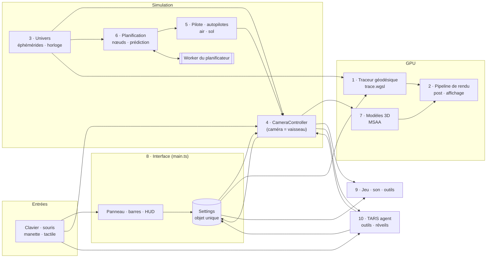

# Comment fonctionne le code — les systèmes

Ce dossier explique, système par système, comment fonctionne le simulateur : un traceur de rayons
relativiste WebGPU (trou noir de Kerr, trou de ver d'*Interstellar*) devenu un jeu spatial — le Ranger, le
Lander et l'Endurance, le Système solaire à l'échelle, la Terre, l'ISS, et de l'autre côté du trou de ver
Gargantua et ses mondes. Chaque fiche décrit les fichiers, le flux de données, les algorithmes, les
réglages, les pièges connus, et donne des recettes pour modifier le système.

Les fiches 1 à 9 ont été rédigées le 2026-10-02 à partir d'une lecture complète du code (≈ 125 fichiers,
53 000 lignes de TypeScript et de WGSL). Le jeu a beaucoup grandi depuis : la fiche 10 décrit TARS, la
fiche 11 recense chaque fichier ajouté depuis (mise à jour le 2026-10-10). Le code évolue vite : en cas de
doute, le code fait foi.

## Les fiches

| # | Fiche | Ce qu'elle couvre | Fichiers principaux |
|---|---|---|---|
| 1 | [Le traceur géodésique](01-traceur-geodesique.md) | Métrique de Kerr, intégration des géodésiques à rebours (RK4 + Kahan, Dormand–Prince), disque mince et volumétrique, jet, corps, trou de ver, patch local, LUT du champ lointain, spécialisation `HAS_*` | `src/shaders/trace.wgsl`, `geodesic.ts`, `physics.ts`, `wormhole.ts` |
| 2 | [Le pipeline de rendu](02-pipeline-rendu.md) | Passes GPU, uniformes, accumulation progressive, reprojection, résolution dynamique et paliers matériels, exposition, bloom, tone mapping, rendu hors ligne, exports, vidéo, profilage | `src/renderer.ts`, `post.wgsl`, `display.wgsl`, `tier.ts` |
| 3 | [L'univers](03-univers-ephemerides.md) | Les deux univers, échelles de temps et horloge, éphémérides DE440/JUP365, rotation IAU, corps envoyés au GPU, cartes et relief (KTX2), Terre, ISS par SGP4, carte du ciel | `src/system/*`, `terrain.ts`, `clock.ts`, `skychart.ts` |
| 4 | [Commandes, caméra et vaisseaux](04-vol-commandes-camera.md) | Entrées (clavier par code physique, souris, manette, tactile), modes de caméra et points d'attache, état du vaisseau = pose de la caméra, intégrateurs de vol, flotte, contacts, limites du warp | `src/controls.ts`, `camera.ts`, `mounts.ts`, `fleet.ts` |
| 5 | [Pilote, autopilotes et atmosphère](05-pilote-autopilotes-atmosphere.md) | SAS et maintiens, autopilotes (position, circularisation, approche, atterrissage, décollage, amarrage), moteurs et propergol, contact au sol, aérodynamique, rentrée guidée, ordinateur de bord | `src/pilot.ts`, `landing.ts`, `aero.ts`, `entry.ts`, `src/fc/*` |
| 6 | [Planification et trajectoires](06-planification-trajectoires.md) | Prédicteur de chute libre (géodésique / n corps), nœuds de manœuvre et leur exécution (auto warp), planificateurs par objectif, worker, coniques raccordées, mission automatique | `src/maneuver.ts`, `targeting.ts`, `src/system/our-plan.ts`, `mission.ts` |
| 7 | [Modèles 3D](07-modeles-3d-vaisseaux.md) | Formats binaires, construction hors ligne, niveaux de détail, rastérisation MSAA dans le repère de repos local, éclairage par le traceur, cockpit et ses écrans, Endurance, ISS | `src/ship.ts`, `ship.wgsl`, `station.ts`, `ui/cockpitscreens.ts` |
| 8 | [L'interface](08-interface.md) | Démarrage, boucle principale, modèle de réglages (scènes, `KEEP_ON_PRESET`, annulation), panneau généré par schéma, barres, HUD de vol, `window.__bh`, mobile | `src/main.ts`, `settings.ts`, `ui/panel.ts`, `ui/flighthud.ts` |
| 9 | [Jeu, son, outils et build](09-jeu-audio-outils-build.md) | Statut, placement, sauvegardes, audit, journal, fenêtre F2, synthèse sonore, serveur de dev, scripts, tests, Atlas, GitHub Pages | `src/game/*`, `src/audio/*`, `server.ts`, `scripts/*` |
| 10 | [TARS, l'agent du jeu](10-tars-agent.md) | La boucle d'un tour, les 49 outils, la télémétrie, la mémoire, les réveils et le budget, les sous-agents, les modes, les commandes « / » et leur complétion, la console | `src/ai/*`, `ui/tars-panel.ts`, `ui/tars/*` |
| 11 | [Ce qui s'est ajouté depuis](11-ajouts-depuis-octobre.md) | Chaque fichier apparu après le 2 octobre, par système : le contrôleur découpé, la physique de l'audit, le HUD et le hub, la météo et les aéroports, le cockpit, les manettes, le son et les voix, l'interface, la PWA, le Kerr Bench, le déploiement | `src/controller/*`, `ui/hud/*`, `cockpit/*`, `input/*`, `sw.ts`… |

Guides voisins (côté utilisateur ou mesures) : [la carte](../MAP.md), [le son](../SOUND.md) et
[l'audio spatial](../AUDIO.md), [les outils de jeu](../GAME-TOOLS.md), [les performances](../PERFORMANCE.md),
[le HUD](../HUD.md), [le cockpit](../COCKPIT.md), [les manettes](../HOTAS.md), [TARS](../TARS.md),
[le déploiement](../DEPLOY.md), [comment jouer](../comment-jouer.html), et le [README](../../README.md) pour le résumé de la physique.

## Vue d'ensemble

### Une image, de bout en bout

1. **Boucle** (`src/main.ts`, fiche 8) : à chaque `requestAnimationFrame`, `dt` est borné à 0,1 s, puis
   `sim.step(dt)` avance la simulation, sauf si elle est gelée ou qu'un rendu hors ligne tourne.
2. **Simulation** (`src/sim.ts`) : l'horloge de la scène avance au rythme du warp (fiche 3). Le
   `CameraController` lit les entrées (fiche 4). Si l'on pilote, le pilote et les autopilotes produisent une
   rotation et une accélération propre (fiche 5), et les nœuds de manœuvre s'exécutent (fiche 6). Le
   vaisseau est intégré en float64 dans son repère : géodésique de Kerr près de Gargantua, repère local
   d'une planète, ou repère « home » newtonien de notre Système solaire. **L'état du vaisseau piloté est la
   pose de la caméra dans `Settings`.**
3. **Univers** (fiche 3) : positions et orientations des corps à l'heure de la scène, calculées en
   float64 sur le CPU ; le GPU ne reçoit que des positions relatives à la caméra, petites, en float32.
4. **Rendu** (fiches 1, 2 et 7) : `renderer.frame()` écrit les uniformes et lance le traceur, qui intègre
   chaque rayon à rebours et ramasse la lumière du disque, des corps et du ciel. L'image est accumulée,
   reprojetée et débruitée. Les maillages (vaisseaux, cockpit, ISS) sont rastérisés avec la même
   projection, puis composités avant le bloom. Viennent ensuite l'exposition automatique, le tone mapping
   et la surimpression de la carte du ciel.
5. **Autour** (fiches 8 à 11) : HUD de vol et hub, tablette, ordinateur de bord, son et voix, sauvegarde
   automatique, fenêtre d'outils, TARS. Le panneau de réglages est rafraîchi toutes les 0,15 s.

### Principes transverses

- **Un seul objet `Settings`** (`src/settings.ts`) porte tout l'état réglable, y compris la pose de la
  caméra. Les scènes sont des préréglages ; les clés de `KEEP_ON_PRESET` survivent à un changement de
  scène.
- **Deux univers** : le côté de Gargantua (unités géométriques G = c = M = 1, M = 10⁸ M☉) et le nôtre
  (le Système solaire derrière la bouche du trou de ver). Plusieurs modules écrivent en dur l'échelle de
  10⁸ M☉ (voir les fiches 3 et 4).
- **Précision** : tout ce qui est grand est en float64 sur le CPU. Près d'une surface, les positions sont
  passées au GPU relativement à un point d'ancrage proche (patch local), pour rester précises en float32.
- **Le travail lourd hors du thread principal** : le planificateur de notre côté et les coniques tournent
  dans `plan-worker.js` ; le décodage des textures KTX2 dans `ktx-worker.js`.
- **Une API de débogage** : `window.__bh` (rendu hors ligne, scènes, horloge, `__bh.game` pour le jeu).

## Points relevés pendant l'analyse

Les fiches signalent dans leur section « Pièges et limites » les bugs probables, le code mort et les
commentaires périmés trouvés à la lecture. Ils sont repris dans [`todo.md`](../../todo.md) à la racine
du dépôt. Aucun n'a été vérifié en jeu.
